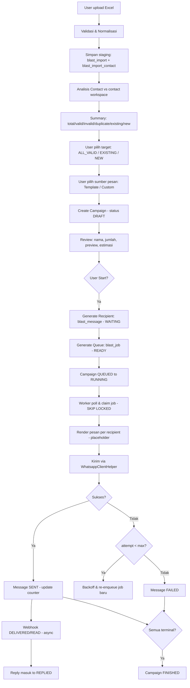
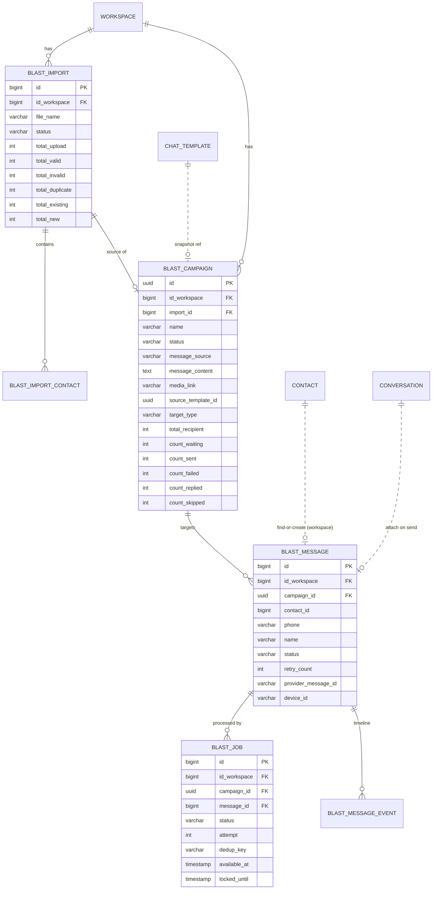
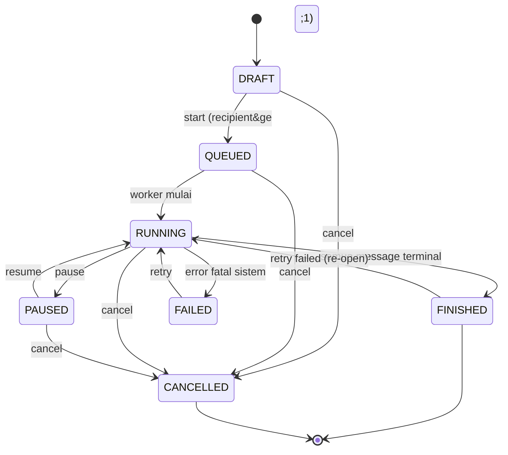
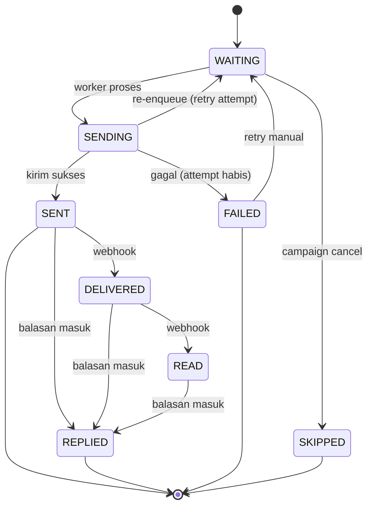
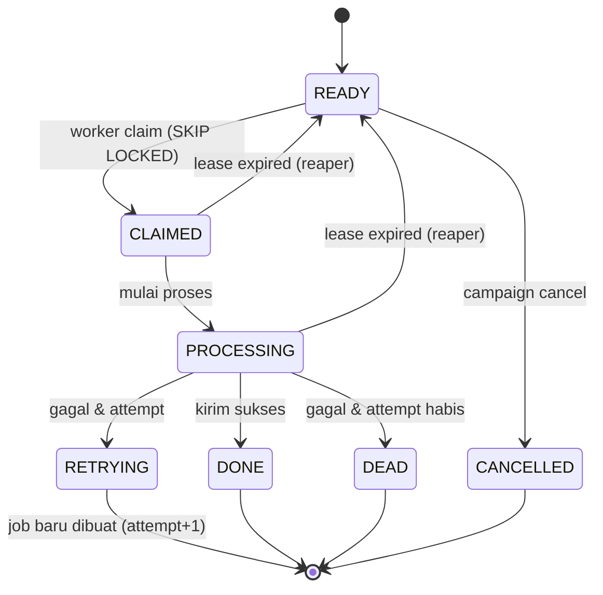
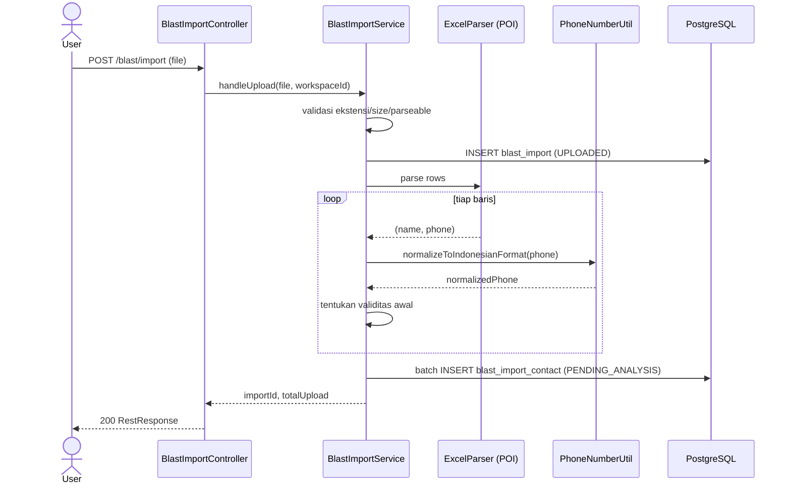
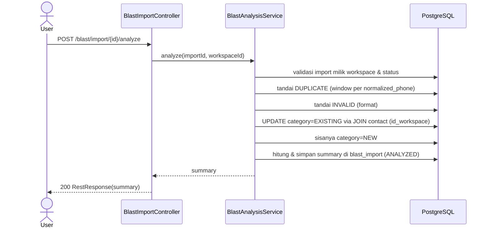
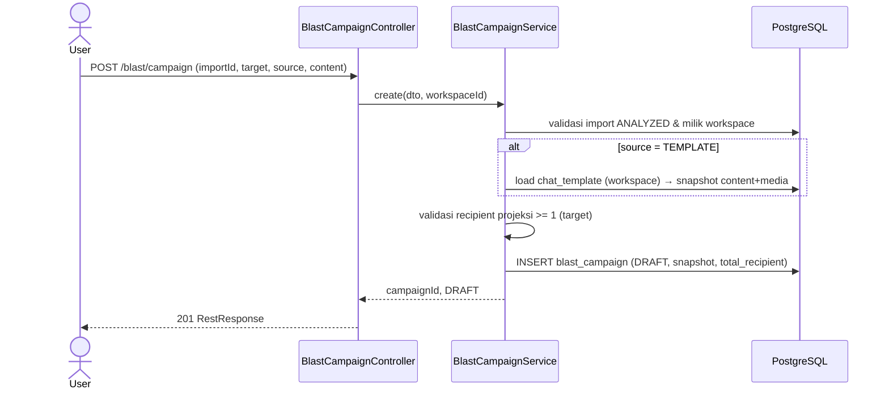
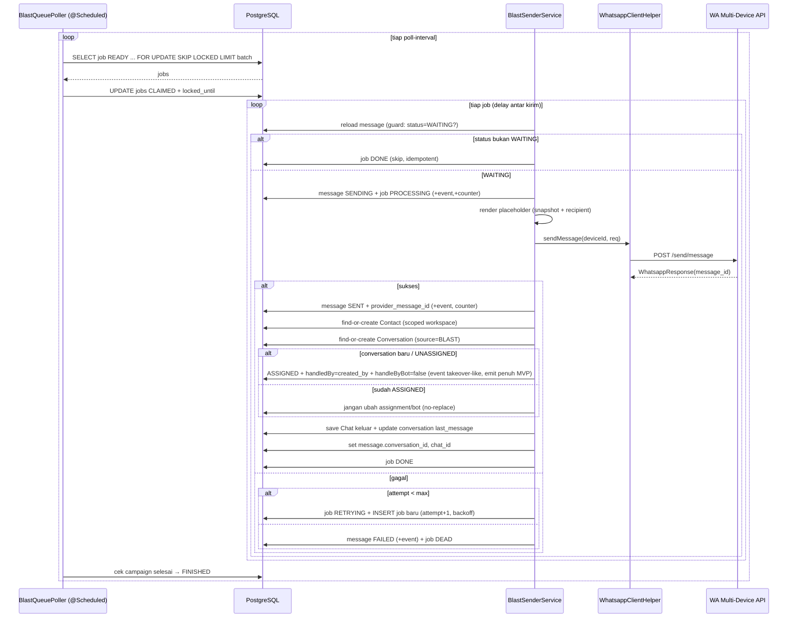
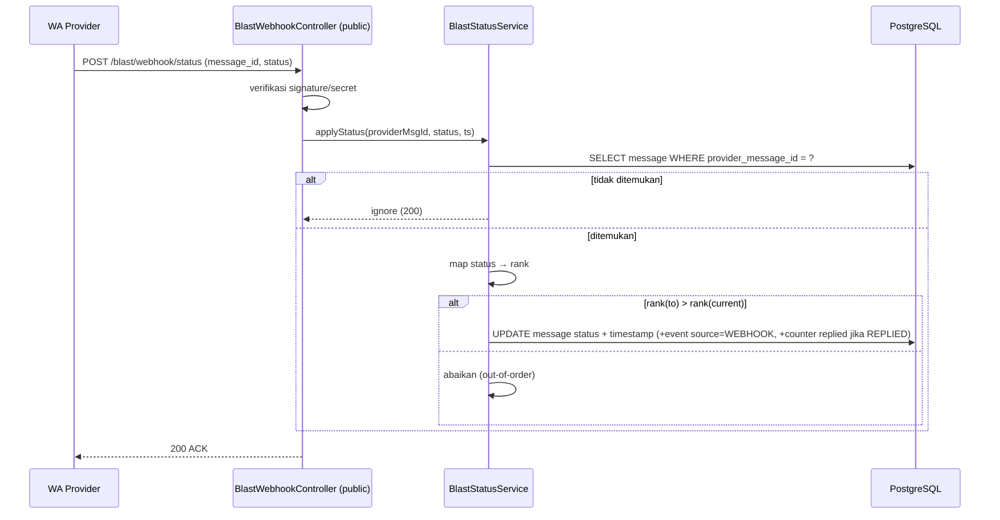

# PRD — Blast Chat (Backend)

| Field | Value |
|---|---|
| Feature name | Blast Chat |
| Component | New: modul `blast` (entity + repository + service + worker + controller) terintegrasi dengan Contact, ChatTemplate, WhatsApp Integration |
| Status | Ready for TDD |
| Scope | Per-workspace (seluruh proses Blast terisolasi berdasarkan `id_workspace`) |
| Author | Product / Backend Architecture |
| Last updated | 2026-07-01 |
| Target pembaca | Backend Developer (dasar penyusunan TDD), QA, Product |

> Dokumen ini adalah Product Requirement Document (PRD) lengkap untuk fitur **Blast Chat** pada platform Saktiform. Dokumen ini **tidak** berisi implementasi kode. Fokusnya adalah kebutuhan bisnis, business process, desain data, REST API, background worker, queue, state machine, sequence diagram, error handling, security, performance, dan scalability — cukup detail agar developer dapat langsung menyusun Technical Design Document (TDD) dan mulai implementasi tanpa klarifikasi bisnis lebih lanjut.
>
> Hal-hal yang sebelumnya ambigu **tidak** diasumsikan sepihak; seluruhnya tercatat di **Bagian 22 — Open Question** dan kini telah **RESOLVED** dengan keputusan konkret (OQ-7 & OQ-13 berupa keputusan desain + fallback, menyisakan hanya verifikasi kapabilitas provider saat implementasi).

---

## Daftar Isi

1. [Executive Summary](#1-executive-summary)
2. [Latar Belakang](#2-latar-belakang)
3. [Tujuan](#3-tujuan)
4. [Scope](#4-scope)
5. [Functional Requirement](#5-functional-requirement)
6. [Non Functional Requirement](#6-non-functional-requirement)
7. [Business Process](#7-business-process)
8. [Business Rule](#8-business-rule)
9. [Data Model](#9-data-model)
10. [Database Design](#10-database-design)
11. [REST API Design](#11-rest-api-design)
12. [Background Worker Architecture](#12-background-worker-architecture)
13. [Queue Processing](#13-queue-processing)
14. [State Machine](#14-state-machine)
15. [Sequence Diagram](#15-sequence-diagram)
16. [Error Handling](#16-error-handling)
17. [Security](#17-security)
18. [Performance](#18-performance)
19. [Scalability](#19-scalability)
20. [Future Enhancement](#20-future-enhancement)
21. [Risk](#21-risk)
22. [Open Question](#22-open-question)
23. [Appendix](#23-appendix)

---

## 1. Executive Summary

Blast Chat adalah fitur yang memungkinkan pengguna Saktiform mengirim pesan WhatsApp ke banyak penerima sekaligus melalui mekanisme **Campaign**. Pesan **tidak** dikirim secara langsung (synchronous) pada saat tombol *Start* ditekan, melainkan diproses secara **asynchronous** oleh **background worker** yang membaca antrian (queue) pekerjaan.

Alur tingkat tinggi:

```
Upload Excel → Staging & Normalisasi → Analisis Contact → Pemilihan Target
→ Pilih Sumber Pesan (Template / Custom) → Review (Draft)
→ Start → Generate Recipient → Generate Queue (Job)
→ Background Worker (batch, delay, retry, idempotent) → Kirim via WhatsApp API
→ Update status per-recipient (webhook + reply detection) → Monitoring & History
```

**Keputusan arsitektur utama** (lihat detail di bagian terkait):

| Keputusan | Pilihan | Alasan singkat |
|---|---|---|
| Mekanisme queue | **Database Queue (PostgreSQL)** dengan `SELECT … FOR UPDATE SKIP LOCKED` | Stack Saktiform saat ini **tidak** memiliki RabbitMQ/Kafka/Redis (lihat `pom.xml`). DB queue memberi transactional safety, idempotency, retry, dan observability tanpa menambah infrastruktur baru. Desain di-abstraksi agar dapat bermigrasi ke broker di masa depan tanpa refactor besar. |
| Eksekusi worker | Spring `@Scheduled` poller + `@Async` executor (sudah aktif di codebase) | Reuse infrastruktur async yang sudah ada (`@EnableAsync`). |
| Isolasi tenant | `id_workspace` di seluruh tabel `blast_*` | Konsisten dengan pola multi-tenant existing (Contact, Produk, Order). |
| Kirim pesan | Reuse `WhatsappClientHelper.sendMessage(deviceId, …)` | Tidak membuat jalur pengiriman baru. |
| Normalisasi nomor | Reuse `PhoneNumberUtil.normalizeToIndonesianFormat()` | Konsistensi format nomor seluruh platform. |
| Engine placeholder | Token `{{key}}` dengan resolver berbasis registry (extensible) | Mudah menambah `{{order_no}}`, `{{tracking_number}}`, dll tanpa mengubah core. |

Fitur ini dirancang **forward-compatible** terhadap kebutuhan masa depan (Scheduled Blast, Segmentasi, Pause/Resume/Cancel, Rate Limiter, Priority Queue, Multi WhatsApp Session, Webhook Delivery, Auto Follow Up) — lihat [Bagian 20](#20-future-enhancement).

---

## 2. Latar Belakang

### 2.1 Konteks Platform

Saktiform adalah platform **conversational commerce** multi-tenant: chatbot WhatsApp berbasis AI digabung dengan manajemen order e-commerce. Setiap resource terikat pada sebuah `Workspace` (tenant). Modul yang sudah ada dan relevan dengan Blast Chat:

| Modul | Entity / Komponen Existing | Relevansi terhadap Blast |
|---|---|---|
| Workspace | `Workspace` (table `workspace`, PK `Long id`) | Unit isolasi tenant untuk semua data Blast. |
| User Management | `Account` (role: `OWNER`, `CUSTOMER_SERVICE`, `ADMIN`) + join `account_workspace` | Otorisasi & audit pembuat campaign. |
| Contact Management | `Contact` (table `contact`: `phone_number`, `nama_kontak`, `id_workspace`) | Sumber pencocokan Existing vs New Contact; pembuatan kontak baru. |
| Template Message | `ChatTemplate` (table `chat_template`, PK `UUID id`: `nama_template`, `content`, `media_link`, `category`, `status`, `id_workspace`, `id_waba`) | Sumber pesan template + media; placeholder via `MessageConstructorHelper.fillTemplate()`. |
| WhatsApp Integration | `WhatsappBusinessApi` (per-workspace, `waba_id` UUID), `WhatsappClientHelper.sendMessage(deviceId, GoWaSendMessageRequest)` | Jalur pengiriman pesan keluar (device/session). |
| Chat Room | `Conversation` / `Chat`, `WhatsappMessageHandler`, `ChatEventPublisher` (WebSocket `/topic`) | Deteksi balasan (REPLIED) dari pesan masuk; update real-time progress. |

### 2.2 Konvensi Teknis Existing (acuan implementasi)

- **ID strategy:** tabel high-volume domain memakai `BIGSERIAL`/`GenerationType.IDENTITY` (`Long`); entity domain-chat (`Chat`, `Conversation`, `ChatTemplate`) memakai `GenerationType.UUID`.
- **Audit fields:** `created_at`, `updated_at` bertipe `Instant`; sebagian entity punya `is_deleted` (Boolean) untuk soft delete.
- **Kolom:** `snake_case` via `@Column(name=…)`.
- **Foreign key:** kolom eksplisit (`id_workspace`) + opsional relasi `@ManyToOne(... insertable=false, updatable=false)`.
- **Response:** seluruh endpoint mengembalikan `RestResponse` (`success`, `message`, `data`); error memakai `ErrorResponse` (`code`, `message`).
- **Controller:** `workspaceId` dikirim sebagai **query param** (`@RequestParam Long workspaceId`); pagination `page` (1-indexed, default 1) & `limit` (default 10); return `ResponseEntity<RestResponse>`.
- **Async:** `@EnableAsync` aktif global; event domain memakai `@TransactionalEventListener(phase = AFTER_COMMIT)` + `@Async`; real-time UI via `SimpMessagingTemplate` ke `/topic/...`.
- **Upload:** multipart diterima via `@RequestParam("file") MultipartFile`, disimpan ke MinIO via `StorageService`; Apache POI (`poi-ooxml`) sudah tersedia di `pom.xml`.
- **Messaging infra:** **tidak ada** RabbitMQ/Kafka/Redis di `pom.xml`. Database = PostgreSQL tunggal (HikariCP max 20).

### 2.3 Masalah yang Diselesaikan

Saat ini pengiriman pesan WhatsApp dilakukan satu per satu melalui Chat Room atau dipicu event order. Tidak ada cara untuk:

1. Mengirim pesan promosi/notifikasi massal ke ratusan/ribuan kontak sekaligus.
2. Mengontrol laju pengiriman agar tidak memicu ban dari WhatsApp.
3. Memantau hasil pengiriman massal (sukses/gagal/dibalas) secara terstruktur.
4. Melakukan retry terhadap pengiriman yang gagal tanpa mengulang seluruh batch.

---

## 3. Tujuan

### 3.1 Tujuan Bisnis

- Memungkinkan workspace mengirim pesan WhatsApp massal yang **terkontrol, terukur, dan dapat diaudit**.
- Meningkatkan engagement & konversi melalui broadcast promosi/notifikasi yang dipersonalisasi (placeholder).
- Menyediakan visibilitas penuh atas hasil broadcast (deliverability, reply rate).

### 3.2 Tujuan Teknis

| ID | Tujuan |
|---|---|
| G-1 | Pengiriman massal berjalan **asynchronous** via background worker, tidak memblok request HTTP user. |
| G-2 | Seluruh data & proses Blast **terisolasi per workspace**. |
| G-3 | Worker mendukung **batch, configurable delay, retry, idempotency, multi-worker, horizontal scaling, graceful restart**. |
| G-4 | Setiap recipient memiliki **status & timeline** sendiri (audit per pesan). |
| G-5 | Desain **extensible** untuk seluruh Future Requirement tanpa refactor besar (perubahan additive). |
| G-6 | Reuse komponen existing (`PhoneNumberUtil`, `WhatsappClientHelper`, `ChatTemplate`, `Contact`, event system). |

### 3.3 Success Metrics (acuan)

- Throughput pengiriman dapat dikonfigurasi dan stabil pada laju yang ditentukan (mis. 1 pesan / N detik / session).
- 0 pesan terkirim ganda untuk satu recipient dalam satu campaign (idempotency terjamin).
- Worker dapat di-restart kapan saja tanpa kehilangan/duplikasi job (graceful restart).
- Progress campaign akurat (jumlah status = jumlah recipient pada saat apa pun).

---

## 4. Scope

### 4.1 Included (MVP)

- Upload Excel (`.xlsx`/`.xls`) berisi minimal **Nama** & **Nomor HP** → validasi, normalisasi, deteksi duplicate & invalid → simpan ke **staging**.
- Analisis Contact terhadap `contact` workspace → kategorisasi (Existing / New / Invalid / Duplicate) + summary.
- Pemilihan target (All Valid / Existing only / New only).
- Sumber pesan: **Template** (`ChatTemplate`) atau **Custom Message**; placeholder `{{name}}`, `{{phone}}` (engine extensible).
- Review campaign (Draft): nama, jumlah recipient, preview pesan, estimasi durasi.
- Start campaign → generate recipient (`blast_message`) → generate queue (`blast_job`).
- Background worker: batch processing, configurable batch size & delay, retry, progress update, idempotent, multi-worker safe.
- Monitoring progress (status campaign + breakdown per status + persentase).
- Pause / Resume / Cancel campaign (OQ-3 resolved → masuk MVP).
- Status per recipient + timeline (timestamp tiap perubahan status).
- Retry failed (membuat job baru, histori lama dipertahankan).
- History campaign: list, search, filter status, detail (progress, summary, daftar recipient, status kirim & reply).
- Webhook delivery update (SENT/DELIVERED/READ) — **endpoint generik + adapter disiapkan** (OQ-7); jika provider tidak mengirim delivery webhook, status berhenti di `SENT` (tetap valid). Aktivasi DELIVERED/READ menyusul saat kemampuan provider dikonfirmasi.
- Reply detection (REPLIED) via integrasi pesan masuk existing.

### 4.2 Not Included (di MVP, namun desain disiapkan)

- Scheduled Blast (penjadwalan waktu kirim).
- Segmentasi target by Tag / Segment / Product / Order.
- Export Excel hasil campaign.
- Dashboard analytics agregat lintas campaign.
- Rate limiter adaptif & priority queue.
- Multi WhatsApp session per campaign (lebih dari satu device aktif berbarengan).
- Auto follow-up berantai (multi-step sequence).
- **Pause/Resume Campaign** — masuk MVP (OQ-3 resolved); state `PAUSED` & endpoint aktif.

> Catatan: item di 4.2 adalah **Future Enhancement**. Skema DB & state machine sudah menyediakan ruang (kolom/status) sehingga penambahannya bersifat *additive*.

### 4.3 Out of Scope (permanen untuk fitur ini)

- Perubahan pada engine bot AI / RAG.
- Implementasi frontend (PRD ini backend-only).
- Pengelolaan device/session WhatsApp (sudah ditangani modul WhatsApp Integration).

---

## 5. Functional Requirement

### 5.1 Upload Excel

| ID | Requirement |
|---|---|
| FR-1.1 | User dapat mengunggah file Excel (`.xlsx`, `.xls`) berisi minimal kolom **Nama** dan **Nomor HP**. |
| FR-1.2 | Backend memvalidasi **format file** (ekstensi + MIME + magic-byte/POI parseability), **ukuran maksimum**, dan **jumlah baris maksimum**. |
| FR-1.3 | Backend memvalidasi **header kolom wajib** ada (pemetaan kolom case-insensitive; lihat Appendix A). |
| FR-1.4 | Setiap nomor dinormalisasi via `PhoneNumberUtil.normalizeToIndonesianFormat()` (hapus `+`, non-digit, `620→62`, `6262→62`, `08→628`). |
| FR-1.5 | Backend mendeteksi **duplicate di dalam file** (nomor sama lebih dari sekali). |
| FR-1.6 | Backend mendeteksi **nomor tidak valid** (lihat aturan validitas BR-3). |
| FR-1.7 | Hasil upload (semua baris + status klasifikasi per baris) disimpan ke tabel **staging** (`blast_import_contact`), dikaitkan ke satu `blast_import` (batch upload). |
| FR-1.8 | Proses upload **tidak** langsung membuat campaign maupun mengirim pesan. |

**Validasi & alasan bisnisnya:**

| Validasi | Aturan | Alasan bisnis |
|---|---|---|
| Ekstensi & MIME | Hanya `.xlsx`/`.xls` (`application/vnd.openxmlformats-...`, `application/vnd.ms-excel`) | Menolak file non-Excel lebih awal; mengurangi attack surface. |
| Parseability | File harus bisa dibuka POI tanpa error | File korup/terenkripsi tidak dapat diproses. |
| Ukuran file | ≤ **2 MB** (OQ-5) | Mencegah DoS via file besar & beban memori. |
| Jumlah baris | ≤ **20.000**/upload (OQ-5); berlebih → file ditolak | Membatasi beban & sesuai realita kapasitas pengiriman WA. |
| Header wajib | `Nama`, `Nomor HP` harus ada | Tanpa nomor tidak ada tujuan kirim; nama dipakai placeholder `{{name}}`. |
| Nomor kosong | Baris dengan nomor kosong → `INVALID` | Tidak bisa dikirim. |
| Format nomor | Setelah normalisasi harus prefix `62` & panjang **10–15 digit** (E.164-like) | Standar nomor Indonesia/WhatsApp; mencegah pengiriman ke nomor salah. |
| Duplicate in-file | Nomor identik (setelah normalisasi) → baris ke-2+ ditandai `DUPLICATE` | Mencegah satu orang menerima pesan berkali-kali dalam satu blast. |
| Excel formula injection | Cell diawali `= + - @` di-sanitasi (lihat [Security](#17-security)) | Mencegah CSV/Excel injection saat data di-export ulang. |

### 5.2 Analisis Contact

| ID | Requirement |
|---|---|
| FR-2.1 | Setelah upload selesai, backend menganalisis seluruh baris staging terhadap `contact` (scoped `id_workspace`). |
| FR-2.2 | Setiap baris diklasifikasikan menjadi salah satu: `EXISTING`, `NEW`, `INVALID`, `DUPLICATE`. |
| FR-2.3 | Pencocokan Existing/New dilakukan berdasarkan **nomor ternormalisasi** vs `contact.phone_number` (yang juga dinormalisasi) dalam workspace yang sama. |
| FR-2.4 | Backend menghasilkan **summary**: Total Upload, Total Valid, Total Invalid, Total Duplicate, Existing Contact, New Contact. |
| FR-2.5 | Hasil klasifikasi & summary dipersist (di `blast_import` + per-baris di `blast_import_contact`) agar idempotent dan dapat ditampilkan ulang tanpa hitung ulang. |

**Definisi kategori:**

| Kategori | Definisi |
|---|---|
| `INVALID` | Nomor gagal validasi format (FR-1.6 / BR-3). Tidak dihitung sebagai valid. |
| `DUPLICATE` | Nomor valid namun kemunculan ke-2+ dalam file yang sama. Hanya kemunculan pertama yang lolos sebagai valid. |
| `EXISTING` | Nomor valid & unik di file, dan sudah ada di `contact` workspace. |
| `NEW` | Nomor valid & unik di file, belum ada di `contact` workspace. |

**Formula summary:**

```
Total Upload     = jumlah seluruh baris terbaca di file
Total Invalid    = COUNT(category = INVALID)
Total Duplicate  = COUNT(category = DUPLICATE)
Total Valid      = COUNT(category IN (EXISTING, NEW))   // = Existing + New
Existing Contact = COUNT(category = EXISTING)
New Contact      = COUNT(category = NEW)

Invariant: Total Upload = Invalid + Duplicate + Existing + New
```

### 5.3 Pemilihan Target

| ID | Requirement |
|---|---|
| FR-3.1 | User memilih salah satu target: `ALL_VALID`, `EXISTING_ONLY`, `NEW_ONLY`. |
| FR-3.2 | Backend menghasilkan **recipient final** dari baris staging sesuai pilihan. |
| FR-3.3 | `INVALID` & `DUPLICATE` **tidak pernah** masuk recipient final. |

**Business rule pemilihan target:**

| Pilihan | Recipient final |
|---|---|
| `ALL_VALID` | `category IN (EXISTING, NEW)` |
| `EXISTING_ONLY` | `category = EXISTING` |
| `NEW_ONLY` | `category = NEW` |

- Untuk recipient `NEW`, saat campaign di-Start, backend **opsional** membuat `Contact` baru di workspace (lihat BR-9 & OQ-2).
- Recipient final = sumber pembentukan baris `blast_message` (lihat [Bagian 7.6](#76-start-campaign--generate-recipient--generate-queue)).

### 5.4 Sumber Pesan & Placeholder Engine

| ID | Requirement |
|---|---|
| FR-4.1 | User memilih sumber pesan: **Template** (`ChatTemplate`) atau **Custom Message** (teks bebas). |
| FR-4.2 | Jika Template: backend membaca `content` + `media_link` dari `chat_template` (scoped workspace). |
| FR-4.3 | Jika Custom: user mengetik teks; opsional `media_link`. |
| FR-4.4 | Placeholder minimal: `{{name}}`, `{{phone}}`. |
| FR-4.5 | Engine placeholder harus **extensible** untuk `{{order_no}}`, `{{tracking_number}}`, `{{product_name}}`, dll **tanpa mengubah core**. |
| FR-4.6 | Snapshot teks & media disimpan di campaign (lihat BR-4: template dihapus tidak merusak campaign berjalan). |
| FR-4.7 | **Mode kirim by media:** jika `media_link` terisi → worker mengirim **image+caption** via `WhatsappClientHelper.sendImage(deviceId, phone, renderedText, mediaUrl)`; jika kosong → `sendMessage` (teks). (OQ-17) |

**Mekanisme Placeholder Engine (scalable):**

1. **Sintaks token**: `{{key}}` (double brace) — **keputusan final (OQ-6)**. Dipilih agar tidak bentrok dengan placeholder kurung tunggal `{...}` yang sudah dipakai `ChatTemplate`/`MessageConstructorHelper`; adapter disediakan saat memakai template existing ber-sintaks `{key}`.
2. **Resolver registry**: tiap placeholder didefinisikan sebagai `PlaceholderResolver { String key(); String resolve(BlastMessageContext ctx); }`. Engine men-scan token dan memanggil resolver berdasarkan `key`. Menambah placeholder baru = menambah 1 resolver (Open/Closed Principle) — **tidak** mengubah core engine.
3. **Context object** (`BlastMessageContext`) menyediakan data sumber: `recipientName`, `recipientPhone`, dan (future) `order`, `product`, `tracking`, dll. Resolver yang butuh data eksternal (mis. `{{order_no}}`) akan lazily mengambil data dari service terkait saat data tersedia di context.
4. **Unknown placeholder policy**: token tak dikenal **dibiarkan apa adanya + dicatat di log** (keputusan final OQ-6) agar tidak diam-diam mengubah pesan.
5. **Rendering time**: pesan dirender **per-recipient pada saat worker memproses job** (bukan saat Start), agar data dinamis (mis. tracking number) selalu fresh dan menghindari penyimpanan jutaan teks ter-render. Teks ter-render final disimpan di `blast_message.rendered_message` setelah kirim untuk audit.

### 5.5 Review Campaign

| ID | Requirement |
|---|---|
| FR-5.1 | Sebelum dijalankan, backend menampilkan: Nama Campaign, Jumlah Recipient, Preview Pesan (sample render), Estimasi Total Pengiriman (durasi). |
| FR-5.2 | Pada tahap ini campaign berstatus **`DRAFT`**. |
| FR-5.3 | Estimasi durasi dihitung: `estimasi ≈ jumlah_recipient × delay_per_message` (+ overhead batch). |
| FR-5.4 | Preview pesan dirender memakai data sample (recipient pertama / data dummy) tanpa mengubah data. |

### 5.6 Menjalankan Campaign

| ID | Requirement |
|---|---|
| FR-6.1 | Saat user menekan **Start**, backend **TIDAK** langsung mengirim pesan. |
| FR-6.2 | Backend mengubah status campaign `DRAFT → QUEUED`, lalu menjalankan: **Generate Recipient** (`blast_message`) → **Generate Queue** (`blast_job`). |
| FR-6.3 | Setelah queue terbentuk, status campaign `QUEUED → RUNNING` (saat worker mulai memproses). |
| FR-6.4 | Generate recipient & queue dilakukan dalam transaksi yang aman & idempotent (BR-13). |

**Alasan arsitektur (Campaign → Recipient → Queue → Worker):**

- **Pemisahan intent vs eksekusi**: Campaign menyimpan *apa* yang ingin dikirim; queue/worker menentukan *bagaimana & kapan* dieksekusi. Ini membuat Start menjadi operasi cepat & non-blocking (hanya menulis baris DB), bukan menahan request HTTP selama ribuan pengiriman.
- **Durabilitas**: bila aplikasi restart di tengah jalan, pekerjaan tetap tersimpan di DB (queue) dan worker melanjutkan (graceful restart, BR-11).
- **Kontrol laju & ban-avoidance**: worker menambahkan delay antar pesan; mustahil dilakukan jika mengirim langsung dalam satu request.
- **Retry granular**: setiap recipient adalah unit kerja independen → retry per-recipient tanpa mengulang seluruh batch.
- **Observability**: status tiap unit kerja terekam → progress akurat & real-time.
- **Scalability**: banyak worker dapat mengklaim job paralel (SKIP LOCKED) tanpa duplikasi.

### 5.7 Background Worker

| ID | Requirement |
|---|---|
| FR-7.1 | **Batch Processing**: worker mengklaim & memproses N job sekaligus per siklus. |
| FR-7.2 | **Configurable Batch Size**: N dapat dikonfigurasi (global default + override per campaign). |
| FR-7.3 | **Configurable Delay**: jeda antar pengiriman dapat dikonfigurasi (anti-ban). |
| FR-7.4 | **Retry**: job gagal di-retry hingga batas `max_attempts` dengan backoff. |
| FR-7.5 | **Progress Update**: counter campaign diperbarui setiap perubahan status pesan. |
| FR-7.6 | **Multi Worker**: beberapa instance/thread dapat berjalan tanpa memproses job yang sama. |
| FR-7.7 | **Horizontal Scaling**: menambah instance aplikasi menambah kapasitas worker tanpa konflik. |
| FR-7.8 | **Graceful Restart**: job yang sedang diproses saat shutdown tidak hilang/tidak terkirim ganda. |
| FR-7.9 | **Idempotency**: memproses ulang job yang sama tidak mengirim pesan dua kali. |
| FR-7.10 | **Duplicate Prevention**: satu recipient hanya menerima satu pesan per campaign (kecuali retry eksplisit). |

Detail mekanisme: lihat [Bagian 12](#12-background-worker-architecture) & [13](#13-queue-processing).

### 5.8 Monitoring Progress

| ID | Requirement |
|---|---|
| FR-8.1 | Backend menyediakan status campaign: `DRAFT`, `QUEUED`, `RUNNING`, `PAUSED`, `FINISHED`, `CANCELLED`, `FAILED`. |
| FR-8.2 | Backend menyediakan breakdown progress: Total, Waiting, Sending, Success, Failed, Replied, Skipped, Percentage. |
| FR-8.3 | Progress dapat di-poll via REST dan (opsional) di-push via WebSocket `/topic`. |

**Cara progress dihitung:**

```
Total      = jumlah blast_message pada campaign
Waiting    = COUNT(status = WAITING)
Sending    = COUNT(status = SENDING)
Success    = COUNT(status IN (SENT, DELIVERED, READ, REPLIED))   // sudah terkirim
Failed     = COUNT(status = FAILED)
Replied    = COUNT(status = REPLIED)
Skipped    = COUNT(status = SKIPPED)

Percentage = (Total - Waiting - Sending) / Total × 100
           = (Success + Failed + Skipped) / Total × 100   // terminal-state ratio
```

- "Success" bersifat **kumulatif** (READ/REPLIED juga sudah pasti SENT). "Replied" ditampilkan terpisah sebagai metrik engagement.
- Sumber angka: direkomendasikan **counter denormalized** di `blast_campaign` (`total_recipient`, `count_sent`, dll) yang di-update atomik oleh worker, agar tidak `COUNT(*)` mahal tiap polling pada jutaan baris (lihat [Bagian 9.4](#94-strategi-counter--progress)).

### 5.9 Status Message (per recipient)

| ID | Requirement |
|---|---|
| FR-9.1 | Setiap recipient (`blast_message`) memiliki status: `WAITING`, `SENDING`, `SENT`, `DELIVERED`, `READ`, `REPLIED`, `FAILED`, `SKIPPED`. |
| FR-9.2 | Setiap perubahan status menyimpan **timestamp** (kolom dedicated + baris di `blast_message_event` untuk timeline lengkap). |
| FR-9.3 | Transisi status harus mengikuti state machine ([Bagian 14.2](#142-message)). |

### 5.10 Retry Failed

| ID | Requirement |
|---|---|
| FR-10.1 | User dapat me-Retry pesan berstatus `FAILED` (per-pesan atau seluruh failed dalam campaign). |
| FR-10.2 | Retry **tidak mengubah histori** percobaan sebelumnya (`blast_message_event` & job lama tetap ada). |
| FR-10.3 | Worker membuat **Job baru** (`blast_job` baru, `attempt` bertambah) untuk pesan yang di-retry. |
| FR-10.4 | Retry mereset status pesan `FAILED → WAITING` (re-enqueue) dan menambah `retry_count`. |

**Alasan desain (job baru, histori dipertahankan):**

- **Auditability**: riwayat kegagalan (error sebelumnya, kapan, kenapa) bernilai untuk diagnosa & laporan. Menimpa job lama menghapus jejak.
- **Idempotency & dedup**: job baru punya `dedup_key` baru (memuat `attempt`) sehingga pencegahan duplikat tetap berlaku tanpa konflik dengan job lama.
- **Konsistensi statistik**: jumlah percobaan vs jumlah recipient tetap dapat direkonsiliasi.
- **Immutability of events**: `blast_message_event` bersifat append-only → sumber kebenaran timeline.

### 5.11 History Campaign

| ID | Requirement |
|---|---|
| FR-11.1 | List campaign (paginated, scoped workspace, urut terbaru). |
| FR-11.2 | Search by nama campaign. |
| FR-11.3 | Filter by status campaign. |
| FR-11.4 | Detail campaign menampilkan: Progress, Summary, Daftar Recipient (paginated), Status Pengiriman, Status Reply. |
| FR-11.5 | Daftar recipient dapat difilter per status pesan (mis. lihat semua FAILED). |

### 5.12 Penempelan ke Conversation (Chat Room Integration)

> **Keputusan produk (dikonfirmasi):** setiap pesan blast yang **berhasil terkirim** WAJIB menempel pada `Conversation` Chat Room. Jika kontak belum punya conversation (mis. New Contact), buat conversation baru. Seluruh proses memperhatikan isolasi **workspace**.

| ID | Requirement |
|---|---|
| FR-12.1 | Setelah pengiriman sukses, worker melakukan **find-or-create Contact** (scoped `id_workspace`) lalu **find-or-create Conversation** untuk kontak tersebut, kemudian menyimpan pesan blast sebagai `Chat` keluar pada conversation itu. |
| FR-12.2 | Pencarian kontak WAJIB menggunakan `conversationService.findContactByPhoneNumberAndIdWorkspace(phone, workspaceId)` — sesuai pola pesan masuk — agar tidak pernah mengambil/menempel kontak dari workspace lain. |
| FR-12.3 | Conversation dicari via `findByIdContact(contactId)` (relasi 1:1 Contact↔Conversation). Jika belum ada → buat baru dengan default konsisten alur masuk: `status=UNASSIGNED`, `chatStatus=OPEN`, `botQuota` dari `AppConfig`, `handleByBot` (auto-assign menghentikan bot → `false`, FR-12.9/BR-20), `source="BLAST"`, `createdAt=now`. |
| FR-12.4 | `Chat` keluar disimpan dengan `idConversation`, `messageId = provider_message_id` (dari WA), `type` (TEXT/IMAGE/…), `pengirim` = **`BLAST-<kode pembuat>`** (mis. `BLAST-USER001`; gabungan penanda blast + identitas `created_by` campaign, OQ-19) agar dibedakan dari agent/CS & CUSTOMER, `pesan`/`media` (snapshot path). Conversation di-update `lastMessage/lastMessageType/lastMessageAt`. |
| FR-12.5 | **Workspace isolation:** karena `Conversation` tidak punya kolom `id_workspace`, isolasi mengalir melalui `Contact.idWorkspace`. deviceId/WABA pengirim diambil dari WABA milik **workspace campaign** (`workspace.getWaba().getId()`), bukan dari sumber lain. |
| FR-12.6 | Outbound blast **tidak** menaikkan `unread_message_count` (pesan keluar, bukan masuk). Saat balasan masuk diproses `WhatsappMessageHandler`, conversation yang sama dipakai → mempermudah deteksi `REPLIED` (lihat 7.10). |
| FR-12.7 | Find-or-create bersifat **idempotent**: bila kontak/conversation sudah ada (mis. EXISTING contact, atau race antar worker), gunakan yang ada — jangan membuat duplikat. |
| FR-12.8 | `blast_message` menyimpan referensi `conversation_id` & `chat_id` hasil penempelan untuk traceability (nullable; terisi setelah sukses). |
| FR-12.9 | **Auto-assign saat belum di-handle:** jika conversation **baru dibuat** atau **berstatus `UNASSIGNED`** (belum dipegang admin/CS), maka conversation otomatis di-assign ke **akun yang memulai blast** (`blast_campaign.created_by`): `status=ASSIGNED`, `handledBy=created_by`, dan **bot dihentikan** (`handleByBot=false`). |
| FR-12.10 | **Jangan replace yang sudah di-handle:** jika conversation sudah `ASSIGNED` (oleh siapa pun), penempelan blast **TIDAK** mengubah `status`, `handledBy`, maupun `handleByBot` — hanya menambah `Chat` keluar & memperbarui `lastMessage`. |
| FR-12.11 | Saat terjadi auto-assign (FR-12.9), conversation berpindah dari daftar *unassigned* ke daftar *assigned* milik assignee — pancarkan event yang setara `takeoverConversation` (`UNASSIGNED_CONVERSATION_REMOVED` + `ASSIGNED_CONVERSATION_CREATED`), **emit penuh di MVP** (throttle/aggregate = backlog FE-Throttle, OQ-18). |

**Kapan dijalankan:** find-or-create Contact + Conversation + record Chat dilakukan **pada saat kirim sukses di worker** (record-on-send), **bukan** saat Start. Alasan: hanya recipient yang benar-benar terkirim yang menghasilkan Contact/Conversation/Chat → tidak ada conversation/kontak "yatim" untuk recipient yang `SKIPPED`/`FAILED-sebelum-kirim`. Ini juga mencerminkan persis perilaku alur pesan masuk (`WhatsappMessageHandler` membuat Contact/Conversation hanya ketika pesan benar-benar terjadi).

**Reuse / refactor:** logika "record outbound Chat + update conversation + publish event" pada `ChatService.messageHandler` (baris 95–144) di-ekstrak menjadi method reusable (mis. `ChatMessageService.recordOutboundChat(...)` atau `BlastSenderService` memanggil `conversationService` find-or-create + `chatMessageService.saveChat`). `BlastSenderService` memanggilnya **setelah** kirim sukses. Publikasi event WebSocket di MVP **penuh** seperti chat biasa (OQ-18 RESOLVED); optimasi throttle/batch saat mode blast besar = backlog (FE-Throttle, Bagian 20).

---

## 6. Non Functional Requirement

| ID | Kategori | Requirement |
|---|---|---|
| NFR-1 | Performance | Endpoint Start hanya menulis ke DB (generate recipient + queue) dan mengembalikan respons cepat untuk ≤ 20.000 recipient; pengiriman aktual offload ke worker. Generate recipient/queue memakai **batch insert** (`INSERT … SELECT` / batched JDBC). |
| NFR-2 | Performance | Polling progress tidak melakukan `COUNT(*)` mahal — memakai counter denormalized; respons < 300 ms. |
| NFR-3 | Reliability | Tidak ada pesan terkirim ganda akibat retry/crash/multi-worker (idempotency, NFR diuji). |
| NFR-4 | Reliability | Graceful restart: job *in-flight* otomatis dipulihkan (visibility timeout / lease expiry) tanpa kehilangan. |
| NFR-5 | Scalability | Menambah instance aplikasi menambah kapasitas worker secara linear hingga batas DB/WA-API. |
| NFR-6 | Isolation | Semua query Blast difilter `id_workspace`; tidak ada kebocoran data antar tenant. |
| NFR-7 | Observability | Setiap job/pesan punya korelasi id (campaign_id, message_id, wa message_id) untuk tracing. Progress & error dapat diinspeksi via API. |
| NFR-8 | Maintainability | Abstraksi `QueuePort` memisahkan logika dari implementasi DB-queue agar migrasi ke broker tidak menyentuh business logic. |
| NFR-9 | Security | Validasi upload ketat; otorisasi & isolasi tenant; audit log aksi campaign. |
| NFR-10 | Configurability | Batch size, delay, max_attempts, rate dikonfigurasi via `AppConfig`/properties (global) dan override per-campaign. |
| NFR-11 | Compatibility | Skema & status di-desain additive; penambahan future feature tidak butuh migrasi destruktif. |
| NFR-12 | Data retention | **MVP menyimpan data permanen** (staging `blast_import_contact` & `blast_message_event` tidak di-purge otomatis). Kebijakan archive/purge dijadikan Future Enhancement (Bagian 20). |

---

## 7. Business Process

### 7.1 End-to-End Flow (ringkas)



### 7.2 Upload Excel (proses)

1. User unggah file → controller terima `MultipartFile`.
2. Validasi format/ukuran/baris (FR-1.2, FR-1.3).
3. Buat baris `blast_import` (status `UPLOADED`, simpan nama file & path MinIO opsional).
4. Parse tiap baris POI → normalisasi nomor → tulis batch ke `blast_import_contact` (status `PENDING_ANALYSIS`).
5. Set `blast_import.status = UPLOADED`, kembalikan `importId` + ringkasan baris terbaca.

### 7.3 Analisis Contact (proses)

1. Trigger analisis berjalan **otomatis & async setelah upload selesai** (OQ-1); endpoint `analyze` tetap tersedia untuk re-run manual.
2. Tandai `DUPLICATE` (nomor sama, kemunculan ke-2+) & `INVALID` (format gagal).
3. Untuk baris valid unik, join ke `contact` (`id_workspace`) → set `EXISTING`/`NEW`.
4. Hitung & simpan summary di `blast_import`. Set `blast_import.status = ANALYZED`.

### 7.4 Create Campaign (proses)

1. User kirim: `importId`, `targetType`, `messageSource` (template/custom), `content`/`templateId`, `mediaLink`, `name`, config (batch/delay/max_attempts opsional).
2. Validasi: import milik workspace & berstatus `ANALYZED` (belum `CONSUMED`, BR-22 — else 409); template milik workspace (jika dipakai); minimal 1 recipient sesuai target.
3. **Snapshot** sumber pesan (content + media + targetType) ke `blast_campaign` (BR-4). `device_id` default = WABA aktif workspace (OQ-4).
4. Simpan campaign status `DRAFT` + hitung `total_recipient` (proyeksi), lalu set `blast_import.status = CONSUMED` (1 import = 1 campaign, BR-22).

### 7.5 Review (proses)

- Hitung estimasi durasi & render sample message. Tidak mengubah state (tetap `DRAFT`).

### 7.6 Start Campaign → Generate Recipient → Generate Queue

1. Validasi transisi `DRAFT → QUEUED` (BR-13: cegah double-start via optimistic lock/`@Version`).
2. **Generate Recipient**: `INSERT INTO blast_message … SELECT FROM blast_import_contact WHERE import_id=? AND category ∈ target` (batch). Setiap baris status `WAITING`, `dedup_key` unik `(campaign_id, phone)`.
3. (Opsional) buat `Contact` baru untuk recipient `NEW` (BR-9, OQ-2).
4. **Generate Queue**: `INSERT INTO blast_job … SELECT FROM blast_message WHERE campaign_id=? AND status=WAITING` (batch), status `READY`, `attempt=1`, `dedup_key=campaign:msg:attempt`.
5. Set counter awal (`total_recipient`, `count_waiting=total`).
6. Campaign `QUEUED`; worker akan memindahkan ke `RUNNING` saat job pertama diproses.

### 7.7 Worker Processing — lihat [Bagian 12](#12-background-worker-architecture).

### 7.8 Retry Failed (proses)

1. User panggil retry (per message / semua failed).
2. Validasi pesan `FAILED` & campaign tidak `CANCELLED`.
3. Untuk tiap pesan: `retry_count++`, status `FAILED → WAITING`, buat `blast_job` baru (`attempt = retry_count+1`, `dedup_key` baru).
4. Update counter (`count_failed--`, `count_waiting++`). Jika campaign `FINISHED`, kembalikan ke `RUNNING`.

### 7.9 Webhook Status Update (proses)

1. Provider WA mengirim callback delivery (message_id, status DELIVERED/READ) ke endpoint webhook.
2. Backend memetakan `provider_message_id → blast_message` dan menerapkan transisi (SENT→DELIVERED→READ) idempoten.

### 7.10 Reply Detection (proses)

1. Pesan masuk diproses `WhatsappMessageHandler` (existing). Karena pesan blast sudah menempel ke `Conversation` kontak yang sama (FR-12), balasan otomatis masuk ke conversation tersebut — tidak perlu membuat conversation baru.
2. Hook tambahan: jika nomor pengirim (scoped workspace) cocok dengan recipient `blast_message` pada campaign yang `sent_at`-nya dalam window (OQ-10) & belum `REPLIED`, set `→ REPLIED` + `replied_at` (BR-16). Pencocokan dapat memanfaatkan `conversation_id` yang sudah tersimpan di `blast_message`.

---

## 8. Business Rule

| ID | Rule | Detail |
|---|---|---|
| BR-1 | **Workspace Isolation** | Setiap query/akses Blast WAJIB difilter `id_workspace`. Campaign hanya bisa diakses oleh akun yang ter-assign ke workspace tersebut. Cross-workspace access ditolak (404/403). |
| BR-2 | **Duplicate Nomor (in-file)** | Dalam satu file upload, nomor (ternormalisasi) yang muncul >1× → kemunculan pertama valid; sisanya `DUPLICATE`. |
| BR-3 | **Invalid Number** | Nomor `INVALID` jika: kosong, atau setelah normalisasi tidak berprefix `62`, atau panjang di luar 10–15 digit, atau mengandung karakter non-digit yang tidak bisa dibersihkan. `INVALID` tidak pernah jadi recipient. |
| BR-4 | **Template Dihapus** | Saat Create Campaign, `content` & `media_link` dari template di-**snapshot** ke `blast_campaign`. Penghapusan/perubahan `chat_template` setelahnya TIDAK memengaruhi campaign yang sudah dibuat. (Campaign menyimpan `source_template_id` hanya sebagai referensi audit, nullable, `ON DELETE SET NULL`.) |
| BR-5 | **Contact Dihapus** | Recipient `blast_message` menyimpan `phone` & `name` secara **snapshot** (bukan FK keras ke `contact`). Jika `contact` dihapus setelah campaign dibuat, pengiriman tetap jalan; `contact_id` (nullable) hanya referensi. |
| BR-6 | **Duplicate Contact (cross-campaign)** | Nomor yang sama boleh ada di beberapa campaign berbeda. Dedup hanya berlaku **dalam satu campaign** (`UNIQUE(campaign_id, phone)`). |
| BR-7 | **Retry Limit** | Job punya `max_attempts` (default 3, konfigurabel). Setelah attempt habis → pesan `FAILED` permanen sampai user retry manual (yang memulai siklus attempt baru). |
| BR-8 | **Campaign Cancel** | `CANCELLED` menghentikan pemrosesan: job `READY`/`RETRYING` di-skip (`SKIPPED`), pesan `WAITING` → `SKIPPED`. Pesan yang sudah `SENT`/terminal tidak diubah. Cancel bersifat **terminal** (tidak bisa di-resume). |
| BR-9 | **New Contact Creation** | `Contact` di-find-or-create **saat kirim sukses di worker** (record-on-send), bukan saat Start. Recipient `NEW` menghasilkan `Contact` baru (`phone_number` ternormalisasi, `nama_kontak`, `id_workspace`). Idempotent via `findContactByPhoneNumberAndIdWorkspace` (FR-12.2): jika sudah ada (EXISTING/race), pakai yang ada. Race antar worker ditutup unique index `(id_workspace, phone_number)` + `ON CONFLICT`/retry-read (BR-18, OQ-20). |
| BR-18 | **Conversation Attachment** | Setiap pesan blast sukses ditempel ke `Conversation` (1:1 dengan Contact). Jika belum ada → buat baru (`source="BLAST"`, default seperti alur masuk). Outbound tidak menaikkan `unread_message_count`. Idempotent: pakai conversation yang ada bila sudah ada (FR-12.3, FR-12.7). |
| BR-19 | **Conversation Workspace Isolation** | `Conversation` tidak punya `id_workspace`; isolasi mengalir via `Contact.idWorkspace`. Find/create kontak & conversation WAJIB scoped ke workspace campaign; deviceId/WABA pengirim = WABA workspace campaign (FR-12.5). Dilarang menempel ke contact/conversation lintas workspace. |
| BR-20 | **Auto-Assign on Blast** | Conversation yang **baru dibuat** atau **`UNASSIGNED`** saat terkena blast → otomatis `ASSIGNED` ke `blast_campaign.created_by`, `handleByBot=false` (bot berhenti). Konsisten dengan semantik `ChatService.takeoverConversation` (FR-12.9). |
| BR-21 | **No-Replace on Assigned** | Conversation yang sudah `ASSIGNED` (oleh akun mana pun) **tidak** diubah assignment/bot-nya oleh blast. Hanya pesan keluar ditambahkan (FR-12.10). Mencegah blast "merebut" percakapan yang sedang ditangani agent lain. |
| BR-10 | **Concurrent Worker** | Klaim job memakai `SELECT … FOR UPDATE SKIP LOCKED` + status guard, sehingga dua worker tidak pernah mengklaim job yang sama. |
| BR-11 | **Graceful Restart / Lease** | Job yang diklaim diberi `locked_until` (lease). Jika worker mati, lease kedaluwarsa & job dikembalikan ke `READY` untuk diklaim ulang. |
| BR-12 | **Idempotency** | Sebelum mengirim, worker mengecek status pesan masih `WAITING/SENDING`. Setelah kirim sukses, `provider_message_id` disimpan; pengiriman ulang job yang sama (lease expiry) tidak mengirim lagi karena status sudah `SENT` (guard). `dedup_key` unik mencegah job ganda. |
| BR-13 | **Single Start / No Double Enqueue** | Transisi `DRAFT→QUEUED` memakai optimistic lock (`@Version`) + status guard. Generate queue idempotent via `UNIQUE(message_id, attempt)` pada `blast_job`. |
| BR-14 | **Status Monotonic** | Status pesan hanya maju sesuai state machine (mis. tidak bisa `READ → SENT`). Webhook out-of-order di-handle dengan rank status (lihat 14.2). |
| BR-15 | **Rate / Anti-ban** | Delay antar pesan ≥ konfigurasi minimum. (Future) rate limiter per session. |
| BR-16 | **Reply Window** | Pesan masuk dihitung sebagai REPLIED hanya jika berasal dari recipient campaign dan dalam window waktu setelah pengiriman (OQ-10). |
| BR-17 | **Empty Recipient Guard** | Campaign tanpa recipient valid tidak boleh di-Start (validasi saat Start & Create). |
| BR-22 | **Single Campaign per Import** | Satu `blast_import` hanya boleh menghasilkan **satu** campaign. Saat Create Campaign sukses, `blast_import.status → CONSUMED`. Percobaan membuat campaign ke-2 dari import yang sudah `CONSUMED` ditolak (HTTP 409). Validasi memakai status guard + (opsional) optimistic lock pada `blast_import` untuk mencegah race dua create paralel. (OQ-16) |

---

## 9. Data Model

### 9.1 Entitas Baru

| Entity / Tabel | Fungsi |
|---|---|
| `blast_import` | Header satu sesi upload Excel (metadata file + summary analisis). |
| `blast_import_contact` | **Staging** baris hasil parsing Excel + klasifikasi (EXISTING/NEW/INVALID/DUPLICATE). |
| `blast_campaign` | Definisi campaign (snapshot pesan, target, config, counter progress, status). |
| `blast_message` | Recipient final + status kirim per orang (unit hasil). |
| `blast_job` | Unit kerja queue yang diproses worker (1 attempt = 1 job). |
| `blast_message_event` | **Append-only** timeline perubahan status pesan (audit). |
| `blast_audit_log` *(opsional)* | Audit aksi user pada campaign (create/start/pause/cancel/retry). |

### 9.2 Relasi (ERD)



### 9.3 Snapshot vs Referensi

- **Snapshot** (disimpan, immutable terhadap perubahan sumber): `blast_message.phone`, `blast_message.name`, `blast_campaign.message_content`, `blast_campaign.media_link`, `blast_campaign.target_type`.
- **Referensi nullable** (audit only, `ON DELETE SET NULL`): `blast_message.contact_id`, `blast_campaign.source_template_id`.
- Alasan: campaign harus tahan terhadap penghapusan template/contact (BR-4, BR-5) sekaligus tetap bisa menelusuri asal data.

### 9.4 Strategi Counter / Progress

- `blast_campaign` menyimpan counter denormalized (`total_recipient`, `count_waiting`, `count_sent`, `count_failed`, `count_replied`, `count_skipped`).
- Update counter dilakukan **atomik** oleh worker dalam transaksi yang sama dengan perubahan status pesan: `UPDATE blast_campaign SET count_sent = count_sent + 1, count_waiting = count_waiting - 1 WHERE id = ?`.
- Untuk akurasi tinggi pada multi-worker, gunakan increment/decrement relatif (bukan set absolut) agar tidak terjadi lost update. Sebagai pengaman drift, `BlastCounterReconciler` (`@Scheduled`, tiap 5 menit, campaign `RUNNING`) menghitung ulang counter dari `blast_message` (OQ-9).
- Polling progress membaca counter (O(1)), bukan `COUNT(*)` (O(n)).

---

## 10. Database Design

> Tipe data PostgreSQL. ID high-volume = `BIGSERIAL`/`BIGINT` (kompak untuk jutaan baris). `blast_campaign.id` = `UUID` (public-facing id, tidak mudah ditebak/di-enumerate, selaras dengan entity chat). Timestamp = `TIMESTAMP`/`TIMESTAMPTZ` (`Instant`).

### 10.1 `blast_import`

**Fungsi:** header satu sesi upload Excel + ringkasan hasil analisis.

| Kolom | Tipe | Null | Keterangan |
|---|---|---|---|
| `id` | `BIGSERIAL` | NO | **PK**. |
| `id_workspace` | `BIGINT` | NO | **FK** → `workspace(id)`. Isolasi tenant. |
| `created_by` | `BIGINT` | YES | FK → `account(id)`. Pembuat upload (audit). |
| `file_name` | `VARCHAR(255)` | YES | Nama file asli. |
| `file_path` | `VARCHAR(512)` | YES | Path MinIO (opsional, jika file disimpan). |
| `status` | `VARCHAR(32)` | NO | `UPLOADED` → `ANALYZING` → `ANALYZED` → `CONSUMED`. `CONSUMED` di-set saat Create Campaign; import bersifat **1:1** terhadap campaign (BR-22). |
| `total_upload` | `INT` | NO | Jumlah baris terbaca. Default 0. |
| `total_valid` | `INT` | NO | Existing + New. |
| `total_invalid` | `INT` | NO | |
| `total_duplicate` | `INT` | NO | |
| `total_existing` | `INT` | NO | |
| `total_new` | `INT` | NO | |
| `created_at` | `TIMESTAMP` | NO | |
| `updated_at` | `TIMESTAMP` | YES | |

- **Index:** `idx_blast_import_ws (id_workspace, created_at DESC)`.
- **Alasan desain:** summary disimpan di header agar tidak dihitung ulang; satu import bisa menghasilkan satu campaign.

### 10.2 `blast_import_contact` (staging)

**Fungsi:** menyimpan setiap baris hasil parsing Excel + klasifikasi.

| Kolom | Tipe | Null | Keterangan |
|---|---|---|---|
| `id` | `BIGSERIAL` | NO | **PK**. |
| `import_id` | `BIGINT` | NO | **FK** → `blast_import(id)` `ON DELETE CASCADE`. |
| `id_workspace` | `BIGINT` | NO | Denormalized untuk filter cepat & isolasi. |
| `row_number` | `INT` | YES | Nomor baris asli di Excel (untuk pesan error). |
| `raw_name` | `VARCHAR(255)` | YES | Nama mentah dari file. |
| `raw_phone` | `VARCHAR(64)` | YES | Nomor mentah dari file. |
| `normalized_phone` | `VARCHAR(20)` | YES | Hasil `PhoneNumberUtil`. Null jika tak bisa dinormalisasi. |
| `category` | `VARCHAR(16)` | NO | `EXISTING` \| `NEW` \| `INVALID` \| `DUPLICATE`. |
| `invalid_reason` | `VARCHAR(128)` | YES | Alasan jika INVALID/DUPLICATE. |
| `contact_id` | `BIGINT` | YES | FK → `contact(id)` jika EXISTING (audit). |
| `created_at` | `TIMESTAMP` | NO | |

- **Index:**
  - `idx_bic_import (import_id)`
  - `idx_bic_import_category (import_id, category)` — query generate recipient per target.
  - `idx_bic_ws_phone (id_workspace, normalized_phone)` — pencocokan/duplicate.
- **Unique:** tidak ada unique pada nomor (file boleh memuat duplikat; deteksi dilakukan logikal, ditandai `DUPLICATE`).
- **Alasan desain:** staging terpisah dari recipient final agar analisis bisa di-review berulang sebelum commit ke campaign; `category` mempercepat generate recipient.

### 10.3 `blast_campaign`

**Fungsi:** definisi campaign + snapshot pesan + counter progress + status.

| Kolom | Tipe | Null | Keterangan |
|---|---|---|---|
| `id` | `UUID` | NO | **PK** (`GenerationType.UUID`). |
| `id_workspace` | `BIGINT` | NO | **FK** → `workspace(id)`. |
| `import_id` | `BIGINT` | YES | **FK** → `blast_import(id)` (sumber recipient). **1:1** untuk campaign berbasis import (BR-22): satu import → satu campaign, lalu import `CONSUMED`. Nullable untuk future (segment/tag tanpa import). |
| `created_by` | `BIGINT` | YES | FK → `account(id)`. |
| `name` | `VARCHAR(150)` | NO | Nama campaign. |
| `status` | `VARCHAR(16)` | NO | State machine campaign (14.1). Default `DRAFT`. |
| `message_source` | `VARCHAR(16)` | NO | `TEMPLATE` \| `CUSTOM`. |
| `source_template_id` | `UUID` | YES | FK → `chat_template(id)` `ON DELETE SET NULL` (referensi audit). |
| `message_content` | `TEXT` | NO | **Snapshot** body (dengan placeholder mentah). |
| `media_link` | `VARCHAR(512)` | YES | **Snapshot** path media (konvensi storage-path). |
| `target_type` | `VARCHAR(16)` | NO | `ALL_VALID` \| `EXISTING_ONLY` \| `NEW_ONLY`. |
| `device_id` | `VARCHAR(64)` | YES | Session/device WA yang dipakai. Default = WABA aktif workspace saat Create (OQ-4); pemilihan device oleh user = future (multi-session). |
| `batch_size` | `INT` | YES | Override config (null = pakai default global). |
| `delay_ms` | `INT` | YES | Jeda antar pesan (override). |
| `max_attempts` | `INT` | YES | Override retry limit. |
| `scheduled_at` | `TIMESTAMP` | YES | **Future** Scheduled Blast (null = kirim segera). |
| `total_recipient` | `INT` | NO | Default 0. |
| `count_waiting` | `INT` | NO | Default 0. |
| `count_sending` | `INT` | NO | Default 0. |
| `count_sent` | `INT` | NO | Default 0 (kumulatif terkirim, termasuk delivered/read/replied). |
| `count_failed` | `INT` | NO | Default 0. |
| `count_replied` | `INT` | NO | Default 0. |
| `count_skipped` | `INT` | NO | Default 0. |
| `version` | `BIGINT` | NO | `@Version` optimistic lock (cegah double-start, BR-13). |
| `started_at` | `TIMESTAMP` | YES | |
| `finished_at` | `TIMESTAMP` | YES | |
| `created_at` | `TIMESTAMP` | NO | |
| `updated_at` | `TIMESTAMP` | YES | |

- **Index:**
  - `idx_campaign_ws_status (id_workspace, status, created_at DESC)` — list & filter.
  - `idx_campaign_ws_name (id_workspace, name)` — search MVP via `ILIKE` (OQ-11; trigram/GIN = future bila volume besar).
  - `idx_campaign_scheduled (status, scheduled_at)` — future scheduler.
- **Alasan desain:** snapshot menjamin BR-4; counter mendukung NFR-2; `version` mendukung BR-13; kolom `scheduled_at`/`device_id`/override config disiapkan untuk future tanpa migrasi destruktif.

### 10.4 `blast_message`

**Fungsi:** recipient final + status pengiriman per orang.

| Kolom | Tipe | Null | Keterangan |
|---|---|---|---|
| `id` | `BIGSERIAL` | NO | **PK**. |
| `id_workspace` | `BIGINT` | NO | Isolasi tenant (denormalized). |
| `campaign_id` | `UUID` | NO | **FK** → `blast_campaign(id)` `ON DELETE CASCADE`. |
| `contact_id` | `BIGINT` | YES | FK → `contact(id)` `ON DELETE SET NULL`. Terisi saat find-or-create di worker (FR-12.1). |
| `conversation_id` | `UUID` | YES | FK → `conversation(id)` `ON DELETE SET NULL`. Conversation tempat pesan ditempel (FR-12.8). |
| `chat_id` | `UUID` | YES | FK → `chat(id)` `ON DELETE SET NULL`. Baris `Chat` keluar hasil penempelan (traceability). |
| `phone` | `VARCHAR(20)` | NO | **Snapshot** nomor ternormalisasi (tujuan kirim). |
| `name` | `VARCHAR(255)` | YES | **Snapshot** nama (placeholder `{{name}}`). |
| `status` | `VARCHAR(16)` | NO | State machine message (14.2). Default `WAITING`. |
| `retry_count` | `INT` | NO | Default 0. Jumlah retry manual. |
| `rendered_message` | `TEXT` | YES | Teks final ter-render (diisi setelah kirim, audit). |
| `provider_message_id` | `VARCHAR(128)` | YES | `message_id` dari WA API (mapping webhook). |
| `device_id` | `VARCHAR(64)` | YES | Device pengirim aktual. |
| `last_error` | `VARCHAR(512)` | YES | Pesan error terakhir. |
| `waiting_at` | `TIMESTAMP` | YES | Timestamp masuk WAITING. |
| `sending_at` | `TIMESTAMP` | YES | |
| `sent_at` | `TIMESTAMP` | YES | |
| `delivered_at` | `TIMESTAMP` | YES | |
| `read_at` | `TIMESTAMP` | YES | |
| `replied_at` | `TIMESTAMP` | YES | |
| `failed_at` | `TIMESTAMP` | YES | |
| `skipped_at` | `TIMESTAMP` | YES | |
| `created_at` | `TIMESTAMP` | NO | |
| `updated_at` | `TIMESTAMP` | YES | |

- **Unique:** `uq_message_campaign_phone (campaign_id, phone)` — **duplicate prevention** (BR-6/BR-10): satu nomor satu pesan per campaign.
- **Index:**
  - `idx_message_campaign_status (campaign_id, status)` — daftar recipient per status, rekonsiliasi counter.
  - `idx_message_provider_msgid (provider_message_id)` — mapping webhook (partial: `WHERE provider_message_id IS NOT NULL`).
  - `idx_message_ws_phone (id_workspace, phone)` — reply detection.
- **Alasan desain:** timestamp dedicated untuk akses cepat status terbaru; timeline lengkap di `blast_message_event`. Unique constraint = inti pencegahan duplikat.

### 10.5 `blast_job`

**Fungsi:** unit kerja queue. 1 attempt pengiriman = 1 job. Worker mengklaim & memproses.

| Kolom | Tipe | Null | Keterangan |
|---|---|---|---|
| `id` | `BIGSERIAL` | NO | **PK**. |
| `id_workspace` | `BIGINT` | NO | Isolasi & (future) fairness antar tenant. |
| `campaign_id` | `UUID` | NO | **FK** → `blast_campaign(id)` `ON DELETE CASCADE`. |
| `message_id` | `BIGINT` | NO | **FK** → `blast_message(id)` `ON DELETE CASCADE`. |
| `status` | `VARCHAR(16)` | NO | State machine job (14.3): `READY`, `CLAIMED`, `PROCESSING`, `DONE`, `FAILED`, `RETRYING`, `DEAD`, `CANCELLED`. |
| `attempt` | `INT` | NO | Nomor percobaan (1-based). |
| `max_attempts` | `INT` | NO | Batas attempt (dari campaign/global). |
| `priority` | `SMALLINT` | NO | Default 0. **Future** priority queue (semakin besar semakin prioritas). |
| `dedup_key` | `VARCHAR(128)` | NO | `campaign_id:message_id:attempt`. |
| `available_at` | `TIMESTAMP` | NO | Job baru bisa diklaim ≥ waktu ini (backoff/schedule). |
| `locked_until` | `TIMESTAMP` | YES | Lease/visibility timeout (graceful restart). |
| `locked_by` | `VARCHAR(64)` | YES | Worker id (node:thread) pemegang lease. |
| `last_error` | `VARCHAR(512)` | YES | |
| `created_at` | `TIMESTAMP` | NO | |
| `updated_at` | `TIMESTAMP` | YES | |

- **Unique:** `uq_job_message_attempt (message_id, attempt)` — idempotency generate queue & retry (BR-13).
- **Index (kritis untuk performa polling):**
  - `idx_job_claim (status, available_at, priority DESC, id)` — query klaim: `WHERE status='READY' AND available_at <= now ORDER BY priority DESC, id`. Pertimbangkan **partial index** `WHERE status = 'READY'`.
  - `idx_job_campaign (campaign_id, status)`.
  - `idx_job_lease (status, locked_until)` — reaper job kedaluwarsa.
- **Alasan desain:** memisahkan "pekerjaan" (job) dari "hasil" (message) memungkinkan retry membuat job baru tanpa menyentuh histori (FR-10); `available_at`/`locked_until` mengimplementasikan backoff & lease; `dedup_key`+unique = idempotency.

### 10.6 `blast_message_event`

**Fungsi:** **append-only** timeline setiap perubahan status pesan (audit & debugging).

| Kolom | Tipe | Null | Keterangan |
|---|---|---|---|
| `id` | `BIGSERIAL` | NO | **PK**. |
| `message_id` | `BIGINT` | NO | **FK** → `blast_message(id)` `ON DELETE CASCADE`. |
| `id_workspace` | `BIGINT` | NO | |
| `from_status` | `VARCHAR(16)` | YES | |
| `to_status` | `VARCHAR(16)` | NO | |
| `source` | `VARCHAR(32)` | NO | `WORKER` \| `WEBHOOK` \| `REPLY` \| `USER` \| `SYSTEM`. |
| `attempt` | `INT` | YES | Attempt terkait (jika dari worker). |
| `detail` | `VARCHAR(512)` | YES | Error/keterangan. |
| `created_at` | `TIMESTAMP` | NO | Timestamp event. |

- **Index:** `idx_event_message (message_id, created_at)`.
- **Alasan desain:** memenuhi FR-9.2 (timestamp tiap perubahan) & FR-10.2 (histori dipertahankan). Append-only → sumber kebenaran timeline; tidak pernah di-update.

### 10.7 `blast_audit_log` *(opsional, direkomendasikan)*

**Fungsi:** audit aksi user terhadap campaign (create/start/pause/resume/cancel/retry).

| Kolom | Tipe | Null | Keterangan |
|---|---|---|---|
| `id` | `BIGSERIAL` | NO | PK. |
| `id_workspace` | `BIGINT` | NO | |
| `campaign_id` | `UUID` | YES | |
| `account_id` | `BIGINT` | YES | Pelaku. |
| `action` | `VARCHAR(32)` | NO | `CREATE`/`START`/`PAUSE`/`RESUME`/`CANCEL`/`RETRY`/`UPLOAD`. |
| `detail` | `VARCHAR(512)` | YES | |
| `created_at` | `TIMESTAMP` | NO | |

- **Index:** `idx_audit_ws_campaign (id_workspace, campaign_id, created_at)`.

### 10.8 Catatan DDL

- Skema dikelola Hibernate `ddl-auto=update` (konsisten codebase). Untuk index khusus (partial/trigram) yang tidak dihasilkan Hibernate, sediakan skrip SQL terpisah di `docs/`/`resources` (lihat Appendix C).
- Pertimbangkan **partitioning** `blast_message` & `blast_message_event` by `created_at` (range) saat volume sangat besar (lihat [Scalability](#19-scalability)).
- **Unique constraint pada `contact` (OQ-20):** tambah unique index `uq_contact_ws_phone (id_workspace, phone_number)` agar find-or-create kontak idempotent (`ON CONFLICT`/retry-read) dan menutup race antar worker/campaign (race yang juga ada di alur pesan masuk existing). **Prasyarat migrasi:** lakukan dedup data `contact` existing per workspace **sebelum** mengaktifkan index, karena `ddl-auto=update` gagal membuat unique index bila masih ada duplikat. Sediakan skrip dedup + DDL terpisah (Appendix C).

---

## 11. REST API Design

**Konvensi umum:**

- Base path: `/blast`. Auth: JWT (Bearer) — endpoint terproteksi (kecuali webhook, lihat 11.13).
- `workspaceId` dikirim sebagai **query param** (konsisten codebase). Service WAJIB memvalidasi resource milik `workspaceId` (BR-1).
- Response envelope: `RestResponse { success, message, data }`. Error: HTTP status + `RestResponse(success=false, message)` atau `ErrorResponse{code,message}` untuk validasi.
- Pagination: `page` (1-indexed, default 1), `limit` (default 10).

**Standar error response:**

| HTTP | Kondisi | Body (message) |
|---|---|---|
| 400 | Validasi gagal | daftar `ErrorDto`/`ErrorResponse` |
| 401 | Token tidak valid/absen | "Unauthorized" |
| 403 | Workspace mismatch / tidak ter-assign | "Forbidden" |
| 404 | Resource tidak ditemukan dalam workspace | "Not found" |
| 409 | Konflik state (mis. start campaign non-DRAFT, double-start) | "Invalid state transition" |
| 413 | File terlalu besar | "File too large" |
| 415 | Tipe file tidak didukung | "Unsupported media type" |
| 422 | File terparse tapi konten tidak valid (header hilang) | detail validasi |
| 429 | Rate limit (future) | "Too many requests" |
| 500 | Error internal | "Internal error" |

### 11.1 Upload Excel

- **Method/URL:** `POST /blast/import?workspaceId={id}`
- **Consumes:** `multipart/form-data`
- **Request:** `file` (MultipartFile, wajib). Opsional `analyzeNow=true`.
- **Validasi:** ekstensi/MIME (FR-1.2), ukuran ≤ max (413), parseability (422), header wajib (422).
- **Response 200:**
```json
{ "success": true, "message": "success",
  "data": { "importId": 123, "fileName": "kontak.xlsx", "totalUpload": 1500, "status": "UPLOADED" } }
```
- **Error:** 413/415/422 sesuai tabel.

### 11.2 Analisis Upload

- **Method/URL:** `POST /blast/import/{importId}/analyze?workspaceId={id}`
- **Request:** path `importId`.
- **Validasi:** import milik workspace (403/404); status `UPLOADED`/`ANALYZED` (idempotent re-run).
- **Response 200:**
```json
{ "success": true, "message": "success",
  "data": { "importId":123, "status":"ANALYZED", "summary": {
    "totalUpload":1500, "totalValid":1400, "totalInvalid":50, "totalDuplicate":50,
    "existingContact":900, "newContact":500 } } }
```

### 11.3 Get Analisis / Summary

- **Method/URL:** `GET /blast/import/{importId}?workspaceId={id}`
- **Response:** summary + (opsional) sample baris per kategori (`?category=INVALID&page=1&limit=20`).

### 11.4 Create Campaign

- **Method/URL:** `POST /blast/campaign?workspaceId={id}`
- **Request (JSON):**
```json
{ "importId": 123, "name": "Promo Juli",
  "targetType": "ALL_VALID",
  "messageSource": "CUSTOM",
  "templateId": null,
  "content": "Halo {{name}}, promo spesial untuk {{phone}}...",
  "mediaLink": null,
  "deviceId": "wa-device-1",
  "config": { "batchSize": 100, "delayMs": 1500, "maxAttempts": 3 } }
```
- **Validasi:** import `ANALYZED` & milik workspace & **belum `CONSUMED`** (BR-22); `targetType` valid & menghasilkan ≥1 recipient (BR-17); jika `messageSource=TEMPLATE` maka `templateId` wajib & template milik workspace; `content` wajib jika CUSTOM; ukuran content ≤ batas.
- **Efek samping:** pada sukses, `blast_import.status → CONSUMED` (1 import = 1 campaign).
- **Response 201:**
```json
{ "success": true, "message": "success",
  "data": { "campaignId":"uuid", "status":"DRAFT", "projectedRecipient":1400 } }
```
- **Error:** 404 import/template; 409 import sudah `CONSUMED` (BR-22); 422 target kosong/konten kosong.

### 11.5 Review Campaign

- **Method/URL:** `GET /blast/campaign/{campaignId}/review?workspaceId={id}`
- **Response:**
```json
{ "success": true, "data": {
  "name":"Promo Juli", "recipientCount":1400,
  "previewMessage":"Halo Budi, promo spesial untuk 628123...",
  "estimatedDurationSeconds":2100, "status":"DRAFT" } }
```

### 11.6 Start Campaign

- **Method/URL:** `POST /blast/campaign/{campaignId}/start?workspaceId={id}`
- **Validasi:** status `DRAFT` (else 409); recipient ≥1 (BR-17); optimistic lock (BR-13).
- **Proses:** generate recipient + queue berjalan **async** (OQ-12) — endpoint mengembalikan `QUEUED` segera, generation set-based di background.
- **Response 200:**
```json
{ "success": true, "message": "Campaign queued",
  "data": { "campaignId":"uuid", "status":"QUEUED", "totalRecipient":1400 } }
```
- **Error:** 409 jika sudah di-start/bukan DRAFT.

### 11.7 List Campaign

- **Method/URL:** `GET /blast/campaign?workspaceId={id}&page=1&limit=10&search=promo&status=RUNNING`
- **Validasi:** `status` ∈ enum (jika ada).
- **Response:** list ringkas (id, name, status, totalRecipient, count_sent, count_failed, count_replied, created_at) + metadata pagination.

### 11.8 Detail Campaign

- **Method/URL:** `GET /blast/campaign/{campaignId}?workspaceId={id}`
- **Response:** definisi campaign + progress + summary. Daftar recipient via endpoint terpisah (11.10) agar ringan.

### 11.9 Progress Campaign

- **Method/URL:** `GET /blast/campaign/{campaignId}/progress?workspaceId={id}`
- **Response:**
```json
{ "success": true, "data": {
  "status":"RUNNING", "total":1400,
  "waiting":300, "sending":5, "success":1090, "failed":10,
  "replied":120, "skipped":0, "percentage":78.57 } }
```
- **Catatan:** dibaca dari counter (NFR-2). Opsional push via WebSocket `/topic/blast/{workspaceId}/{campaignId}`.

### 11.10 List Recipient (per campaign)

- **Method/URL:** `GET /blast/campaign/{campaignId}/messages?workspaceId={id}&status=FAILED&page=1&limit=20`
- **Response:** daftar `blast_message` (phone, name, status, retry_count, last_error, sent_at, replied_at) + pagination.

### 11.11 Retry Failed

- **Method/URL:** `POST /blast/campaign/{campaignId}/retry?workspaceId={id}`
- **Request (JSON, opsional):** `{ "messageIds": [12,13] }` — jika kosong → retry **semua** FAILED.
- **Validasi:** campaign tidak `CANCELLED` (409); pesan target berstatus `FAILED`.
- **Response 200:** `{ "success":true, "data": { "retried": 10 } }`.

### 11.12 Pause / Resume / Cancel

| Aksi | Method/URL | Validasi state | Hasil |
|---|---|---|---|
| Pause | `POST /blast/campaign/{id}/pause?workspaceId=` | `RUNNING`→`PAUSED` (else 409) | Worker berhenti mengklaim job campaign ini. |
| Resume | `POST /blast/campaign/{id}/resume?workspaceId=` | `PAUSED`→`RUNNING` (else 409) | Worker melanjutkan. |
| Cancel | `POST /blast/campaign/{id}/cancel?workspaceId=` | `DRAFT/QUEUED/RUNNING/PAUSED`→`CANCELLED` | Job pending→`CANCELLED`, message WAITING→`SKIPPED`. Terminal. |

- **Response:** status baru. **Error:** 409 jika transisi tidak valid (lihat 14.1).

### 11.13 Webhook Status Update (provider WA)

- **Method/URL:** `POST /blast/webhook/status` *(endpoint generik + adapter; dapat juga di-route via webhook WA existing — OQ-7)*
- **Auth:** **public** (tanpa JWT) namun **diverifikasi** via shared-secret/signature header (lihat Security). Tambahkan ke `permitAll` mengikuti pola `/whatsapp/*/webhook`.
- **Request (JSON, bentuk tergantung provider):**
```json
{ "message_id":"wa-msg-abc", "status":"read", "timestamp": 1719820800 }
```
- **Proses:** map `message_id → blast_message.provider_message_id` → terapkan transisi idempoten (rank status, 14.2). Abaikan jika message_id tidak dikenal.
- **Response:** 200 selalu (acknowledge) agar provider tidak retry berlebihan; error internal di-log.

### 11.14 (Opsional) Download Template Excel

- **Method/URL:** `GET /blast/import/template-file`
- **Response:** file `.xlsx` contoh berisi header `Nama`, `Nomor HP`.

---

## 12. Background Worker Architecture

### 12.1 Komponen

| Komponen | Peran |
|---|---|
| `BlastQueuePoller` | `@Scheduled(fixedDelay = …)` — tiap node menjalankan poller; mengklaim batch job `READY` (SKIP LOCKED) yang `available_at <= now` & campaign `RUNNING`. |
| `BlastWorkerExecutor` | `@Async` thread pool (reuse infra async) — memproses job yang diklaim secara paralel terbatas. |
| `BlastSenderService` | Render pesan (placeholder engine) + panggil `WhatsappClientHelper.sendMessage/ sendImage`. |
| `BlastJobReaper` | `@Scheduled` — mengembalikan job dengan `locked_until < now` (lease expired) ke `READY` (graceful restart, BR-11). |
| `QueuePort` (abstraksi) | Interface enqueue/claim/ack/nack → implementasi `DbQueueAdapter` (MVP). Memudahkan migrasi ke broker (NFR-8). |

### 12.2 Siklus Pemrosesan (per node)

```
LOOP setiap fixedDelay:
  1. CLAIM: dalam 1 transaksi singkat:
       SELECT id FROM blast_job
         WHERE status='READY' AND available_at <= now()
           AND campaign_id IN (SELECT id FROM blast_campaign WHERE status='RUNNING')
         ORDER BY priority DESC, id ASC
         LIMIT :batchSize
         FOR UPDATE SKIP LOCKED;
       UPDATE blast_job SET status='CLAIMED', locked_by=:workerId,
              locked_until = now() + :leaseDuration
         WHERE id IN (...);
       COMMIT;   // lock dilepas; status+lease menahan kepemilikan
  2. Untuk setiap job (paralel di executor, dengan delay antar kirim):
       a. Guard idempotency: re-load blast_message; jika status NOT IN (WAITING) → ack DONE tanpa kirim.
       b. status job → PROCESSING; message → SENDING (+event, +counter).
       c. Render pesan (placeholder) memakai snapshot campaign + data recipient.
       d. Kirim via WhatsappClientHelper: jika `media_link` ada → `sendImage` (image+caption), else `sendMessage` (text) (OQ-17/FR-4.7).
       e. SUKSES:
            - simpan provider_message_id; message → SENT (+event, counter sent++/waiting--); job → DONE.
            - find-or-create Contact (scoped workspace) → find-or-create Conversation (source=BLAST) → simpan Chat keluar (pengirim=`BLAST-<kode pembuat>` mis. `BLAST-USER001`, messageId=provider_message_id) → update conversation last_message → set message.conversation_id & chat_id.
            - ASSIGNMENT: jika conversation baru / UNASSIGNED → set ASSIGNED, handledBy=campaign.created_by, handleByBot=false (FR-12.9, BR-20) + event takeover-like (emit penuh MVP). Jika sudah ASSIGNED → biarkan (FR-12.10, BR-21).
            - (FR-12; publish event WebSocket penuh seperti chat biasa di MVP — throttle saat blast besar = backlog FE-Throttle, OQ-18.)
       f. GAGAL (exception/non-OK): 
            jika attempt < max_attempts: job → RETRYING; buat job baru (attempt+1, available_at = now + backoff); 
            else: message → FAILED (+event, counter failed++); job → DEAD.
       g. Sleep delay_ms (anti-ban) sebelum job berikutnya pada thread yang sama.
  3. Cek penyelesaian campaign: jika count_waiting+count_sending == 0 → campaign FINISHED (+finished_at).
```

### 12.3 Pemenuhan Requirement Worker

| Requirement | Mekanisme |
|---|---|
| Batch Processing | Klaim `LIMIT batchSize` job per siklus. |
| Configurable Batch Size | `batch_size` campaign override → default global (`AppConfig`/properties). |
| Configurable Delay | `delay_ms` campaign override; di-sleep antar kirim. |
| Retry | Job gagal membuat job baru `attempt+1`, `available_at = now + backoff(attempt)` (exponential, mis. 30s·2^n). |
| Progress Update | Counter atomik per perubahan status (9.4); event row append. |
| Multi Worker | `FOR UPDATE SKIP LOCKED` + status guard → tiap job hanya diklaim satu worker (BR-10). |
| Horizontal Scaling | Setiap node menjalankan poller; SKIP LOCKED membuat klaim disjoint → linear scaling hingga batas DB/WA. |
| Graceful Restart | Lease `locked_until`; reaper mengembalikan job yatim; guard idempotency mencegah kirim ganda. |
| Idempotency | Status guard (kirim hanya jika WAITING) + `provider_message_id` + `dedup_key` unik. |
| Duplicate Prevention | `UNIQUE(campaign_id, phone)` di message + `UNIQUE(message_id, attempt)` di job. |

### 12.4 Idempotency — Skenario Crash

- **Crash setelah kirim, sebelum commit status SENT:** lease habis → job di-claim ulang → guard membaca message masih `WAITING/SENDING`. Risiko kirim ganda diminimalkan dengan menulis `SENDING` + `provider_message_id` sesegera mungkin. MVP **tidak bergantung** pada client-side idempotency key provider (OQ-13); tanpa key tersebut jendela duplikasi sangat kecil namun tidak nol — didokumentasikan sebagai Risk R-3. Jika provider kelak menyediakannya, dipakai untuk eliminasi total (additive).
- **Crash sebelum kirim:** message tetap `WAITING`, job di-claim ulang, kirim normal. Aman.
- **Crash setelah SENT commit:** job di-claim ulang → guard melihat `SENT` → ack tanpa kirim. Aman.

### 12.5 Konfigurasi (default)

| Param | Default | Sumber |
|---|---|---|
| `blast.worker.poll-interval-ms` | 1000 | properties |
| `blast.worker.batch-size` | 100 | properties (override per campaign) |
| `blast.worker.delay-ms` | 1500 | properties (override per campaign) |
| `blast.worker.max-attempts` | 3 | properties (override) |
| `blast.worker.lease-duration-ms` | 60000 | properties |
| `blast.worker.executor-pool-size` | `max(4, cores*2)` | konsisten `BotDelayManager` |
| `blast.worker.backoff-base-ms` | 30000 | exponential |

---

## 13. Queue Processing

### 13.1 Perbandingan Opsi

| Kriteria | Database Queue (PostgreSQL) | RabbitMQ | Kafka |
|---|---|---|---|
| Infra tambahan | **Tidak ada** (sudah ada Postgres) | Broker baru (ops, HA, monitoring) | Cluster + Zookeeper/KRaft (berat) |
| Transactional dengan data bisnis | **Ya** (1 DB, 1 transaksi) | Tidak (perlu outbox/2PC) | Tidak (perlu outbox) |
| Idempotency & dedup | Mudah (unique constraint) | Manual (consumer dedup) | Manual (key + compaction) |
| Retry & delay terjadwal | Mudah (`available_at`) | Perlu plugin delayed-exchange/DLX | Manual (re-publish) |
| Observability / inspeksi antrian | **Tinggi** (query SQL biasa) | Sedang (mgmt UI) | Rendah-sedang |
| Throughput maksimum | Cukup s/d puluhan ribu/menit | Sangat tinggi | Ekstrem (jutaan) |
| Cocok skala saat ini (≤100k/campaign, laju dibatasi WA) | **Sangat cocok** | Over-engineered | Over-engineered |
| Kompleksitas operasional | Rendah | Sedang | Tinggi |
| Fairness multi-tenant | Bisa (ORDER BY/priority) | Per-queue | Per-partition |

### 13.2 Rekomendasi

**Pilih Database Queue (PostgreSQL `FOR UPDATE SKIP LOCKED`).**

Alasan teknis untuk kondisi Saktiform:

1. **Tidak ada broker di stack** (`pom.xml` hanya Postgres; tidak ada amqp/kafka/redis). Menambah broker = beban operasional & risiko baru tanpa kebutuhan throughput yang menuntutnya.
2. **Bottleneck sebenarnya adalah WhatsApp API + anti-ban delay**, bukan queue. Mengirim 100k pesan dengan delay 1.5 dtk/pesan/session = jam-an; throughput broker yang ekstrem tidak relevan.
3. **Transactional safety**: perubahan status message + counter + job berada di satu DB → konsisten tanpa pola outbox.
4. **Idempotency & retry** trivial via constraint unik + `available_at` (delayed) — fitur yang di broker butuh plugin/kompleksitas.
5. **Observability**: tim dapat menginspeksi/koreksi antrian dengan SQL biasa; sangat membantu operasional broadcast.
6. **Migrasi terjaga**: business logic memakai `QueuePort` (NFR-8). Jika kelak butuh broker (mis. multi-region, throughput non-WA), cukup ganti adapter — tanpa refactor besar.

**Kapan re-evaluasi ke broker:** jika muncul kebutuhan throughput non-rate-limited yang sangat tinggi, fan-out lintas service, atau Postgres menjadi titik kontensi terbukti (lihat Scalability).

### 13.3 Pola `SKIP LOCKED` (inti)

- Klaim disjoint antar worker tanpa blocking (worker B melewati baris yang sedang dikunci worker A).
- Status guard (`READY`→`CLAIMED`) + lease (`locked_until`) mempertahankan kepemilikan setelah transaksi klaim commit (lock fisik dilepas, kepemilikan logikal via kolom).
- Reaper memulihkan job yatim (lease expired) → at-least-once delivery + idempotency guard = efektif exactly-once pada level pesan (kecuali jendela kecil di 12.4).

---

## 14. State Machine

### 14.1 Campaign



**Transisi VALID:**

| Dari | Ke | Pemicu |
|---|---|---|
| DRAFT | QUEUED | Start (recipient ≥1) |
| DRAFT | CANCELLED | Cancel |
| QUEUED | RUNNING | Worker memproses job pertama |
| QUEUED | CANCELLED | Cancel |
| RUNNING | PAUSED | Pause |
| RUNNING | FINISHED | Semua message terminal |
| RUNNING | CANCELLED | Cancel |
| RUNNING | FAILED | Error fatal sistem (mis. device tidak valid) |
| PAUSED | RUNNING | Resume |
| PAUSED | CANCELLED | Cancel |
| FINISHED | RUNNING | Retry failed (membuka kembali) |
| FAILED | RUNNING | Retry |

**Transisi TIDAK diperbolehkan (contoh):** `DRAFT→RUNNING` (harus lewat QUEUED), `CANCELLED→*` (terminal, kecuali tidak ada), `FINISHED→PAUSED`, `QUEUED→PAUSED` (pause hanya dari RUNNING), `DRAFT→FINISHED`, transisi mundur sembarang. Cancel **terminal**: `CANCELLED` tidak bisa di-resume.

### 14.2 Message



**Status rank (untuk webhook out-of-order, BR-14):** `WAITING(0) < SENDING(1) < SENT(2) < DELIVERED(3) < READ(4) < REPLIED(5)`. Transisi delivery hanya diterapkan jika `rank(to) > rank(current)`; webhook yang "mundur" (mis. DELIVERED datang setelah READ) **diabaikan**.

**Transisi VALID:**

| Dari | Ke | Pemicu |
|---|---|---|
| WAITING | SENDING | Worker memproses job |
| WAITING | SKIPPED | Campaign cancelled |
| SENDING | SENT | Kirim sukses (provider OK) |
| SENDING | WAITING | Re-enqueue retry (attempt < max) |
| SENDING | FAILED | Gagal & attempt habis |
| SENT/DELIVERED/READ | (naik) | Webhook delivery (rank lebih tinggi) |
| SENT/DELIVERED/READ | REPLIED | Balasan masuk |
| FAILED | WAITING | Retry manual user |

**TIDAK diperbolehkan:** `READ→SENT`/`DELIVERED→SENT` (mundur), `REPLIED→*` (terminal), `SKIPPED→*` (terminal), `WAITING→SENT` (harus via SENDING), `FAILED→SENT` langsung (harus via WAITING→SENDING).

### 14.3 Job



**Transisi VALID:**

| Dari | Ke | Pemicu |
|---|---|---|
| READY | CLAIMED | Worker mengklaim |
| READY | CANCELLED | Campaign cancelled |
| CLAIMED | PROCESSING | Worker mulai memproses |
| CLAIMED | READY | Lease expired (reaper) |
| PROCESSING | DONE | Kirim sukses |
| PROCESSING | RETRYING | Gagal, attempt < max (membuat job baru) |
| PROCESSING | DEAD | Gagal, attempt habis |
| PROCESSING | READY | Lease expired (reaper) |

**TIDAK diperbolehkan:** `DONE→*`, `DEAD→*` (kecuali via message retry yang membuat job baru), `CANCELLED→*`, klaim job yang bukan `READY`, dua worker `READY→CLAIMED` job yang sama (dicegah SKIP LOCKED).

---

## 15. Sequence Diagram

### 15.1 Upload Excel



### 15.2 Analisis Contact



### 15.3 Create Campaign



### 15.4 Start Campaign

```mermaid
sequenceDiagram
    actor U as User
    participant C as BlastCampaignController
    participant S as BlastCampaignService
    participant DB as PostgreSQL
    U->>C: POST /blast/campaign/{id}/start
    C->>S: start(campaignId, workspaceId)
    S->>DB: SELECT campaign FOR UPDATE (version) ; cek status=DRAFT
    alt bukan DRAFT
        S-->>C: 409 invalid state
    else DRAFT
        S->>DB: UPDATE status=QUEUED (optimistic lock)
        S->>DB: INSERT blast_message SELECT FROM blast_import_contact (target) [batch]
        opt recipient NEW
            S->>DB: INSERT contact (idempotent) untuk NEW
        end
        S->>DB: INSERT blast_job SELECT FROM blast_message (READY, attempt=1) [batch]
        S->>DB: set counters (total, waiting)
        S-->>C: QUEUED, totalRecipient
    end
    C-->>U: 200 RestResponse
```

### 15.5 Worker Processing



### 15.6 Retry Failed

```mermaid
sequenceDiagram
    actor U as User
    participant C as BlastCampaignController
    participant S as BlastRetryService
    participant DB as PostgreSQL
    U->>C: POST /blast/campaign/{id}/retry (messageIds?)
    C->>S: retry(campaignId, messageIds, workspaceId)
    S->>DB: validasi campaign != CANCELLED
    S->>DB: SELECT messages FAILED (filter ids?)
    loop tiap message
        S->>DB: retry_count++ ; status FAILED→WAITING (+event source=USER)
        S->>DB: INSERT blast_job baru (attempt=retry_count+1, dedup_key baru, READY)
    end
    S->>DB: update counter (failed--, waiting++) ; if FINISHED→RUNNING
    S-->>C: retried count
    C-->>U: 200 RestResponse
```

### 15.7 Webhook Status Update



---

## 16. Error Handling

### 16.1 Upload & Analisis

| Kasus | Penanganan |
|---|---|
| File bukan Excel / korup | 415/422; tidak menyimpan apa pun (atau `blast_import` status `FAILED`). |
| Header wajib hilang | 422 dengan daftar kolom yang kurang. |
| Baris parsial rusak (sel kosong) | Baris ditandai `INVALID` dengan `invalid_reason`, proses tetap lanjut (partial success). |
| File melebihi batas baris | 422 "Melebihi batas N baris" — tolak seluruh file (atau truncate + warning, OQ-5). |

### 16.2 Pengiriman (worker)

| Kasus | Penanganan |
|---|---|
| WA API timeout / 5xx | Anggap retriable → `RETRYING` + backoff. |
| WA API 4xx (nomor invalid) | Non-retriable → `FAILED` langsung dengan `last_error`. |
| WA device off/disconnected | **Retriable** → `RETRYING` + backoff sampai device up / lease, disertai alert; eskalasi ke campaign `FAILED` hanya jika down melebihi threshold (OQ-14). |
| Exception render placeholder | `FAILED` message itu, log; tidak menggagalkan job lain. |
| DB error saat update status | Transaksi rollback; lease akan expired → job di-claim ulang (at-least-once). |
| Provider mengembalikan body tak terduga | Treat sebagai gagal retriable + log raw response. |

### 16.3 Concurrency & Konsistensi

| Kasus | Penanganan |
|---|---|
| Double-start campaign | Optimistic lock `@Version` → start kedua dapat 409 (BR-13). |
| Dua worker klaim job sama | Dicegah `FOR UPDATE SKIP LOCKED` (BR-10). |
| Generate queue dijalankan dua kali | `UNIQUE(message_id, attempt)` → insert kedua diabaikan (`ON CONFLICT DO NOTHING`). |
| Webhook out-of-order/duplikat | Rank guard idempoten (BR-14). |
| Counter drift | `BlastCounterReconciler` (`@Scheduled` 5 menit, campaign `RUNNING`) menghitung ulang dari `blast_message` (OQ-9). |

### 16.4 Format Error Response

Mengikuti konvensi: validasi → `ErrorResponse{code,message}` (HTTP 400/422); error bisnis/state → `RestResponse(success=false, message)` dengan HTTP status sesuai tabel 11. Semua error worker **tidak** dikembalikan ke user real-time (async) tetapi terekam di `blast_message.last_error` + `blast_message_event` dan terlihat di Detail Campaign.

---

## 17. Security

| Area | Kontrol |
|---|---|
| **Authentication** | Semua endpoint `/blast/**` (kecuali webhook) memerlukan JWT valid (via `JwtAuthenticationFilter` existing). |
| **Authorization** | Service memvalidasi akun ter-assign ke `workspaceId` (join `account_workspace`). Akses lintas workspace → 403/404. (Codebase saat ini coarse-grained; minimal pastikan workspace membership — lihat OQ-15 untuk role granular.) |
| **Workspace Isolation** | Setiap query Blast difilter `id_workspace` (BR-1). Resource id (campaign UUID) tidak bisa di-enumerate; tetap validasi kepemilikan workspace. |
| **Upload Validation** | Ekstensi + MIME + magic byte + POI parseability; tolak makro/encrypted. |
| **Maksimum Ukuran File** | Batas via `spring.servlet.multipart.max-file-size` = **2 MB** + batas **20.000 baris** (OQ-5). Mencegah DoS memori. |
| **SQL Injection** | Seluruh akses via JPA/parameterized query. Untuk native query (generate recipient/queue, claim) gunakan **bind parameter**, jangan string-concat. `status`/`category`/`targetType` divalidasi terhadap enum sebelum dipakai. |
| **Excel Formula Injection** | Saat membaca **dan** saat (future) export: nilai sel yang diawali `= + - @ tab CR` di-prefix `'` (apostrophe) atau di-escape. Mencegah eksekusi formula di klien yang membuka file export. Nama/nomor disimpan sebagai teks murni. |
| **Webhook Security** | Endpoint webhook public namun memverifikasi **shared secret / HMAC signature** dari provider; tolak jika tidak cocok. Idempoten & hanya menerima mapping message_id milik workspace yang sesuai. |
| **Audit Log** | `blast_audit_log` mencatat siapa melakukan create/start/pause/cancel/retry/upload + waktu (akuntabilitas). |
| **Rate Limiting** | (Future) per-workspace rate limit pada endpoint upload/create/start untuk mencegah abuse; worker delay sudah membatasi laju kirim. |
| **PII** | Nomor & nama adalah PII → akses dibatasi workspace; jangan log nomor lengkap di level INFO. MVP menyimpan data permanen; kebijakan retensi/purging dijadwalkan sebagai Future Enhancement (Bagian 20). |
| **Content safety** | Validasi panjang `content`; (future) moderation/opt-out compliance (lihat Risk). |

---

## 18. Performance

### 18.1 Estimasi per Skala

Asumsi: delay anti-ban `1.5 dtk/pesan` per **satu** session, batch insert efisien. (Throughput pengiriman **dibatasi WA/anti-ban**, bukan DB/queue.)

| Volume | Generate recipient+queue (DB) | Durasi pengiriman (1 session @1.5s) | Catatan |
|---|---|---|---|
| **1.000** | < 1 dtk (batch insert) | ~25 menit | Single session memadai. |
| **10.000** | ~1–3 dtk | ~4,2 jam | Pertimbangkan delay lebih kecil / multi-session (future). |
| **100.000** | ~10–30 dtk (lakukan async/chunk) | ~41 jam @1 session | **Wajib** multi-session/multi-device atau delay lebih kecil agar realistis; pertimbangkan partitioning tabel. |

> Catatan penting: durasi didominasi **rate limit pengiriman**, bukan kapasitas queue. Menambah worker thread **tidak** mempercepat jika hanya ada satu session WA (delay anti-ban mengikat per session). Percepatan nyata datang dari **multi WhatsApp session** (Future) yang membagi beban antar device.

### 18.2 Bottleneck & Strategi Optimasi

| Bottleneck | Strategi |
|---|---|
| **Rate limit WA / anti-ban** (dominan) | Multi-session (future) → throughput = jumlah_session / delay. Delay konfigurabel per campaign. |
| Generate recipient/queue untuk 100k | `INSERT … SELECT` set-based (bukan loop per baris) + chunking; dijalankan **async**, Start mengembalikan `QUEUED` segera (OQ-12). |
| Polling `COUNT(*)` progress | Counter denormalized (NFR-2). |
| Klaim job pada tabel besar | Partial index `WHERE status='READY'`; jaga tabel job ramping (arsip DONE/DEAD). |
| Tabel `blast_message`/`event` membesar | Partitioning by `created_at`. (Arsip/purge campaign lama = Future Enhancement; MVP simpan permanen.) |
| Kontensi HikariCP (max 20) | Worker memakai transaksi singkat (klaim cepat, lepas koneksi saat sleep delay); jangan menahan koneksi selama `sleep`. |
| Lock contention counter | Increment relatif + (jika perlu) batch counter update per N pesan. |
| Webhook burst | Endpoint ringan + idempoten; index `provider_message_id`. |

### 18.3 Prinsip Implementasi Performa

- **Jangan menahan DB connection selama `sleep` delay** — lepaskan koneksi, sleep di thread, baru buka transaksi singkat untuk update status.
- **Batch semua operasi DDL-data besar** (insert recipient/queue, update counter) — hindari N+1.
- **Index sesuai pola query klaim** adalah faktor terpenting performa worker.

---

## 19. Scalability

| Dimensi | Pendekatan |
|---|---|
| **Horizontal (multi-node)** | Setiap node menjalankan poller; `SKIP LOCKED` membuat klaim disjoint tanpa koordinator. Menambah node menambah throughput hingga batas DB/WA. |
| **Vertikal (per-node)** | Pool executor `max(4, cores*2)`; batch size dinaikkan bila DB & WA sanggup. |
| **Fairness multi-tenant** | Klaim `ORDER BY priority DESC, id` global bisa membuat satu campaign besar mendominasi. Mitigasi: round-robin per `id_workspace`/per campaign saat klaim, atau quota per workspace (future, didukung kolom `id_workspace`+`priority`). |
| **Data growth** | Partitioning `blast_message`/`blast_message_event` by waktu. (Arsip campaign selesai ke cold storage & purge staging = Future Enhancement; MVP simpan permanen, OQ-8.) |
| **Migrasi queue** | `QueuePort` memungkinkan ganti ke RabbitMQ/Kafka tanpa menyentuh business logic bila throughput non-WA dibutuhkan. |
| **Multi WhatsApp Session** | `device_id` di campaign & message + (future) load-balancer session → throughput linear terhadap jumlah session. |
| **Read scaling** | Progress dari counter; list/detail diindeks; bisa dilayani read-replica jika perlu. |

---

## 20. Future Enhancement

Tabel berikut menunjukkan **bagaimana desain saat ini sudah menyiapkan** tiap fitur (additive, tanpa refactor besar):

| Fitur Future | Dukungan desain saat ini | Tambahan yang diperlukan |
|---|---|---|
| **Scheduled Blast** | `blast_campaign.scheduled_at` + index `(status, scheduled_at)`; status `QUEUED` | Scheduler men-trigger Start saat `scheduled_at` tiba. |
| **Blast by Segment/Tag/Product/Order** | `import_id` nullable di campaign; recipient bersumber dari `blast_message` (apa pun asalnya) | Recipient generator alternatif (query segment) yang mengisi `blast_message`; placeholder resolver `{{order_no}}` dsb sudah extensible. |
| **Pause/Resume** | Status `PAUSED` di state machine; worker memfilter campaign `RUNNING` saat klaim | Endpoint sudah didesain (11.12); cukup aktifkan. |
| **Cancel** | Status `CANCELLED`; job→CANCELLED, message WAITING→SKIPPED | Sudah tercakup MVP. |
| **Export Excel** | Data lengkap di `blast_message` + sanitasi formula injection | Endpoint export streaming POI. |
| **Dashboard Analytics** | Counter per campaign + event timeline | Agregasi lintas campaign (materialized view/job). |
| **Rate Limiter** | `delay_ms` per campaign; `priority`/`available_at` | Token-bucket per session/workspace di klaim. |
| **Priority Queue** | `blast_job.priority` + index | Set priority saat enqueue; klaim `ORDER BY priority`. |
| **Multi WhatsApp Session** | `device_id` di campaign & message | Session selector/load-balancer; klaim per-session. |
| **Webhook Delivery Update** | `provider_message_id` + endpoint webhook + rank guard | Aktivasi sesuai provider (OQ-7). |
| **Auto Follow Up** | Event `REPLIED`/timeout + campaign sebagai entitas reusable | Sequence engine (multi-step) memicu campaign lanjutan; reuse `OrderEventListener` pattern. |
| **Data Retention / Purge** *(dari OQ-8)* | MVP simpan permanen; struktur `blast_import_contact`/`blast_message_event` punya `created_at` untuk pemilahan usia data | Job terjadwal purge staging setelah konsumsi/N hari & arsip event campaign selesai ke cold storage; konfigurabel per workspace. Tidak butuh perubahan skema destruktif. |
| **FE-Throttle — Event Throttling saat Blast** *(backlog)* | Penempelan conversation + auto-assign memancarkan event WebSocket per pesan (`NEW_MESSAGE`, `UNASSIGNED/ASSIGNED_CONVERSATION_*`). MVP emit penuh (OQ-18/OQ-21). | Aggregate/batch atau suppress event per-pesan saat mode blast (mis. kirim ringkasan berkala) untuk menjaga UI Chat Room responsif pada blast besar. Tidak butuh perubahan skema — murni di layer publikasi event. |

---

## 21. Risk

| ID | Risiko | Dampak | Mitigasi |
|---|---|---|---|
| R-1 | **WhatsApp ban** akibat blast massal | Session diblokir, layanan terganggu | Delay anti-ban konfigurabel; batas volume; (future) rate limiter & warmup; edukasi user. |
| R-2 | **Throughput tidak realistis** 100k @1 session (~41 jam) | Ekspektasi user meleset | Tampilkan estimasi durasi di Review (FR-5); dorong multi-session (future). |
| R-3 | **Duplikasi pesan** pada jendela crash setelah kirim sebelum commit | User terima 2 pesan | Tulis SENDING+provider_id segera; MVP tak bergantung idempotency key provider (OQ-13), pakai bila kelak tersedia; jendela kecil & terdokumentasi. |
| R-4 | **Counter drift** pada beban tinggi/concurrency | Progress tidak akurat | Increment relatif + job rekonsiliasi periodik (OQ-9). |
| R-5 | **DB sebagai single point** untuk queue & data | Kontensi saat skala besar | Index tepat, transaksi singkat, arsip/partisi; `QueuePort` untuk migrasi broker bila perlu. |
| R-6 | **Webhook provider tidak tersedia/format berbeda** | DELIVERED/READ tidak terupdate | Status berhenti di SENT (tetap valid); aktivasi webhook opsional (OQ-7). |
| R-7 | **Fairness multi-tenant** — campaign besar memonopoli worker | Tenant lain tertunda | Klaim round-robin/quota per workspace (future, kolom sudah ada). |
| R-8 | **Compliance/opt-out** (spam, regulasi) | Risiko hukum/reputasi | (Future) daftar opt-out/blocklist per workspace; di luar scope MVP namun dicatat. |
| R-9 | **File besar memori POI** | OOM | Batas ukuran/baris; streaming reader POI (SXSSF/event API) untuk file besar. |
| R-10 | **Media link tidak valid saat kirim** | Pengiriman gagal massal | Validasi media saat Create/Review; fallback kirim teks. |

---

## 22. Open Question

> Sesuai instruksi: hal ambigu **tidak** diasumsikan sepihak. Berikut daftar + rekomendasi solusi (default yang disarankan ditandai **★**).

| ID | Pertanyaan | Opsi & Rekomendasi |
|---|---|---|
| OQ-1 | ~~Analisis contact otomatis vs endpoint terpisah?~~ **RESOLVED** | **Keputusan:** analisis berjalan **otomatis & async setelah upload selesai**; hasil di-poll via `GET /blast/import/{id}`. Endpoint `analyze` tetap tersedia untuk re-run manual. |
| OQ-2 | ~~Recipient `NEW` otomatis dibuat sebagai `Contact` saat Start?~~ **RESOLVED** | **Keputusan:** Contact (dan Conversation) di-**find-or-create saat kirim sukses di worker** (record-on-send), scoped workspace, idempotent (BR-9, BR-18, FR-12). Pesan blast WAJIB menempel ke Conversation. |
| OQ-3 | ~~Pause/Resume masuk MVP atau Future?~~ **RESOLVED** | **Keputusan:** Pause/Resume **masuk MVP**. Worker memfilter campaign `RUNNING` saat klaim; endpoint pause/resume (11.12) aktif. |
| OQ-4 | ~~Sumber `device_id`/session WA untuk campaign — diambil dari mana?~~ **RESOLVED** | **Keputusan:** `device_id` campaign default diambil dari **WABA aktif workspace** (`WhatsappBusinessApi`, `workspace.getWaba().getId()`) saat Create. Pemilihan device oleh user → future (multi-session). |
| OQ-5 | ~~Batas ukuran file & jumlah baris?~~ **RESOLVED** | **Keputusan:** **2 MB** & **20.000 baris** per upload; baris berlebih → **file ditolak** (bukan truncate). |
| OQ-6 | ~~Sintaks placeholder & kebijakan unknown token?~~ **RESOLVED** | **Keputusan:** Sintaks **`{{key}}`** (double brace) agar tidak bentrok dengan `{...}` existing; adapter ke `MessageConstructorHelper` (`{key}`) saat memakai template existing. Unknown token → **dibiarkan apa adanya + dicatat di log** (tidak diam-diam mengubah pesan). |
| OQ-7 | ~~Apakah provider WA mengirim webhook delivery (delivered/read)? Formatnya?~~ **RESOLVED (desain)** | **Keputusan:** sediakan **endpoint webhook generik + adapter** (11.13). Jika provider **tidak** mengirim delivery webhook → status pesan berhenti di **`SENT`** (tetap valid); aktivasi DELIVERED/READ menyusul saat kemampuan provider dikonfirmasi. Bentuk payload provider dipetakan via adapter, tanpa mengubah core. |
| OQ-8 | ~~Kebijakan retensi/purge staging & event (PII)?~~ **RESOLVED** | **Keputusan:** MVP **menyimpan data permanen** — tidak ada auto purge/archive `blast_import_contact` maupun `blast_message_event`. Kebijakan retensi/purge dijadikan **Future Enhancement** (Bagian 20). |
| OQ-9 | ~~Perlu job rekonsiliasi counter periodik?~~ **RESOLVED** | **Keputusan:** **Ya** — `BlastCounterReconciler` (`@Scheduled`, tiap **5 menit**, hanya campaign `RUNNING`) menghitung ulang counter dari `blast_message` untuk koreksi drift (mitigasi R-4). |
| OQ-10 | ~~Reply window untuk menandai REPLIED?~~ **RESOLVED** | **Keputusan:** **7 hari** sejak `sent_at`; balasan dari recipient dalam window & belum `REPLIED` → tandai REPLIED (BR-16). |
| OQ-11 | ~~Search campaign by name: `LIKE` biasa atau full-text/trigram?~~ **RESOLVED** | **Keputusan:** MVP memakai **`ILIKE` + index sederhana** (`idx_campaign_ws_name`). `pg_trgm`/GIN dijadikan future bila volume search membesar. |
| OQ-12 | ~~Generate recipient/queue untuk volume besar (100k) — sync atau async?~~ **RESOLVED** | **Keputusan:** **Async** — endpoint Start mengembalikan `QUEUED` segera; generate recipient + queue berjalan di background (set-based `INSERT … SELECT` + chunking). |
| OQ-13 | ~~Apakah WA API mendukung idempotency key dari client?~~ **RESOLVED (desain)** | **Keputusan:** MVP **tidak bergantung** pada idempotency key provider. Jendela duplikasi (crash setelah kirim sebelum commit) diminimalkan dengan menulis `SENDING`+`provider_message_id` sedini mungkin & status guard; sisa risiko kecil didokumentasikan sebagai **R-3**. Jika kelak provider menyediakannya, dipakai untuk eliminasi total (additive). |
| OQ-14 | ~~Jika device WA off/disconnected saat campaign jalan?~~ **RESOLVED** | **Keputusan:** job bersifat **retriable** (`RETRYING` + backoff) sampai device up / lease, disertai **alert**. Eskalasi ke **`FAILED` (campaign)** hanya jika device down melebihi threshold yang dikonfigurasi. |
| OQ-15 | ~~Role granular untuk aksi Blast?~~ **RESOLVED** | **Keputusan:** MVP cukup **cek membership workspace** (konsisten otorisasi coarse-grained existing, tanpa `@PreAuthorize` baru). Role granular menyusul bila dibutuhkan. |
| OQ-16 | ~~Apakah satu `blast_import` boleh menghasilkan lebih dari satu campaign?~~ **RESOLVED** | **Keputusan:** **Tidak — 1 import = 1 campaign** (strict). Setelah Create Campaign, `blast_import.status = CONSUMED`; percobaan membuat campaign ke-2 dari import yang sama ditolak **409** (BR-22). |
| OQ-17 | ~~Format pesan dengan media: image+caption atau teks saja?~~ **RESOLVED** | **Keputusan:** jika `media_link` terisi → kirim **image+caption** via `WhatsappClientHelper.sendImage(deviceId, phone, renderedText, mediaUrl)`; jika kosong → `sendMessage` (teks). |
| OQ-18 | ~~Throttle event WebSocket saat blast?~~ **RESOLVED → BACKLOG** | **Keputusan:** MVP memancarkan event WebSocket **penuh** seperti chat biasa (`NEW_MESSAGE`, `UNASSIGNED_CONVERSATION_*`/`ASSIGNED_CONVERSATION_*`). Optimasi throttle/aggregate event saat blast besar dijadikan **backlog** (lihat Future Enhancement FE-Throttle). |
| OQ-19 | ~~Label `pengirim` pada Chat keluar blast?~~ **RESOLVED** | **Keputusan:** `pengirim` = **`BLAST-<kode pembuat>`** (mis. `BLAST-USER001`) — gabungan penanda blast + identitas `created_by` campaign, agar pesan blast dapat dibedakan dari agent/CS maupun CUSTOMER di Chat Room. *(Catatan: `handleByBot` sudah RESOLVED — auto-assign menghentikan bot, FR-12.9/BR-20.)* |
| OQ-21 | ~~Strategi event assignment massal & fallback `created_by` null?~~ **RESOLVED** | **Keputusan:** (1) Assignee = `blast_campaign.created_by`, berlaku juga untuk **Scheduled Blast** (saat eksekusi terjadwal, assignee tetap pembuat campaign). `created_by` **wajib non-null** untuk campaign yang mengirim. (2) Event assignment massal: emit penuh di MVP; optimasi → backlog (FE-Throttle, sama dengan OQ-18). |
| OQ-20 | ~~Perlukah unique constraint `(id_workspace, phone_number)` pada `contact`?~~ **RESOLVED** | **Keputusan:** **Ya** — tambah unique index `(id_workspace, phone_number)` pada `contact`; find-or-create menangani `ON CONFLICT`/retry-read (menutup race existing pada alur pesan masuk). **Prasyarat migrasi:** dedup data `contact` existing sebelum index diaktifkan. |

---

## 23. Appendix

### Appendix A — Pemetaan Kolom Excel

| Header diterima (case-insensitive, trimmed) | Field |
|---|---|
| `Nama`, `Name`, `Nama Kontak`, `Nama Customer` | `raw_name` |
| `Nomor HP`, `No HP`, `Phone`, `Telepon`, `Nomor`, `WA`, `Whatsapp` | `raw_phone` |

- Header dicari pada baris pertama. Kolom tambahan diabaikan (atau disimpan untuk placeholder future — lihat OQ).
- Jika header wajib tidak ditemukan → 422.

### Appendix B — Enum

```
CampaignStatus : DRAFT, QUEUED, RUNNING, PAUSED, FINISHED, CANCELLED, FAILED
MessageStatus  : WAITING, SENDING, SENT, DELIVERED, READ, REPLIED, FAILED, SKIPPED
JobStatus      : READY, CLAIMED, PROCESSING, DONE, RETRYING, DEAD, CANCELLED
ImportStatus   : UPLOADED, ANALYZING, ANALYZED, CONSUMED, FAILED
ContactCategory: EXISTING, NEW, INVALID, DUPLICATE
TargetType     : ALL_VALID, EXISTING_ONLY, NEW_ONLY
MessageSource  : TEMPLATE, CUSTOM
```

### Appendix C — Contoh Native Query Inti (referensi, bukan implementasi final)

**Klaim job (SKIP LOCKED):**
```sql
SELECT id FROM blast_job
 WHERE status = 'READY'
   AND available_at <= now()
   AND campaign_id IN (SELECT id FROM blast_campaign WHERE status = 'RUNNING')
 ORDER BY priority DESC, id ASC
 LIMIT :batchSize
 FOR UPDATE SKIP LOCKED;
```

**Generate recipient (set-based, dengan dedup):**
```sql
INSERT INTO blast_message (id_workspace, campaign_id, contact_id, phone, name, status, waiting_at, created_at)
SELECT :ws, :campaignId, bic.contact_id, bic.normalized_phone, bic.raw_name, 'WAITING', now(), now()
FROM blast_import_contact bic
WHERE bic.import_id = :importId
  AND bic.category IN (:targetCategories)
ON CONFLICT (campaign_id, phone) DO NOTHING;
```

**Generate queue (idempotent):**
```sql
INSERT INTO blast_job (id_workspace, campaign_id, message_id, status, attempt, max_attempts, dedup_key, available_at, created_at)
SELECT :ws, :campaignId, m.id, 'READY', 1, :maxAttempts,
       :campaignId || ':' || m.id || ':1', now(), now()
FROM blast_message m
WHERE m.campaign_id = :campaignId AND m.status = 'WAITING'
ON CONFLICT (message_id, attempt) DO NOTHING;
```

**Reaper lease expired:**
```sql
UPDATE blast_job
   SET status = 'READY', locked_by = NULL, locked_until = NULL, updated_at = now()
 WHERE status IN ('CLAIMED','PROCESSING') AND locked_until < now();
```

### Appendix D — Komponen Backend (konseptual)

| Layer | Elemen baru |
|---|---|
| Entity | `BlastImport`, `BlastImportContact`, `BlastCampaign`, `BlastMessage`, `BlastJob`, `BlastMessageEvent`, (`BlastAuditLog`) |
| Repository | `BlastImportRepository`, `BlastImportContactRepository`, `BlastCampaignRepository`, `BlastMessageRepository`, `BlastJobRepository`, `BlastMessageEventRepository` |
| Service | `BlastImportService`, `BlastAnalysisService`, `BlastCampaignService`, `BlastRetryService`, `BlastStatusService`, `BlastSenderService`, `PlaceholderEngine` (+ resolvers), `QueuePort`/`DbQueueAdapter` |
| Worker | `BlastQueuePoller` (@Scheduled), `BlastWorkerExecutor` (@Async), `BlastJobReaper` (@Scheduled), `BlastCounterReconciler` (@Scheduled, koreksi drift counter — OQ-9) |
| Controller | `BlastImportController`, `BlastCampaignController`, `BlastWebhookController` |
| Reuse | `PhoneNumberUtil`, `WhatsappClientHelper`, `ChatTemplate`/`MessageTemplateService`, `Contact`, `StorageService`, `ChatEventPublisher`, `RestResponse`/`ErrorResponse`, **`ConversationService`** (`findContactByPhoneNumberAndIdWorkspace`, `saveContact`, `findByIdContact`, `saveConversation`), **`ChatMessageService.saveChat`** |
| Refactor | Ekstrak logika "record outbound Chat + update conversation + publish event" dari `ChatService.messageHandler` (baris 95–144) menjadi method reusable (mis. `ChatMessageService.recordOutboundChat(...)`) yang dipanggil `BlastSenderService` setelah kirim sukses (FR-12), dengan publish event dapat di-suppress/throttle untuk mode blast. |

### Appendix E — Referensi Existing yang Dipakai

- `com.saktiform.api.util.PhoneNumberUtil#normalizeToIndonesianFormat`
- `com.saktiform.api.service.chat.WhatsappClientHelper#sendMessage / #sendImage`
- `com.saktiform.api.entity.Contact` (table `contact`)
- `com.saktiform.api.entity.Conversation` (table `conversation`, 1:1 Contact, isolasi via `Contact.idWorkspace`) / `com.saktiform.api.entity.Chat` (table `chat`)
- `ConversationService#findContactByPhoneNumberAndIdWorkspace / #saveContact / #findByIdContact / #saveConversation` — pola find-or-create (acuan: `WhatsappMessageHandler#handleMessagePayload` baris 69–100)
- `com.saktiform.api.service.chat.ChatService#messageHandler` (acuan record outbound Chat, baris 95–144 — untuk di-ekstrak; jangan dipanggil utuh dari worker)
- `com.saktiform.api.entity.ChatTemplate` (table `chat_template`)
- `com.saktiform.api.model.RestResponse`, `com.saktiform.api.model.ErrorResponse`
- Pola event: `@TransactionalEventListener(AFTER_COMMIT)` + `@Async` (`OrderEventListener`)
- Real-time: `ChatEventPublisher` / `SimpMessagingTemplate` → `/topic/...`

---

*Dokumen ini siap menjadi dasar Technical Design Document (TDD). Seluruh Open Question (Bagian 22) telah **RESOLVED**; dua di antaranya (OQ-7 webhook & OQ-13 idempotency key) bersifat **keputusan desain** dengan fallback yang sudah ditetapkan, dan hanya memerlukan **verifikasi kapabilitas provider** saat implementasi — tanpa mengubah arsitektur.*
