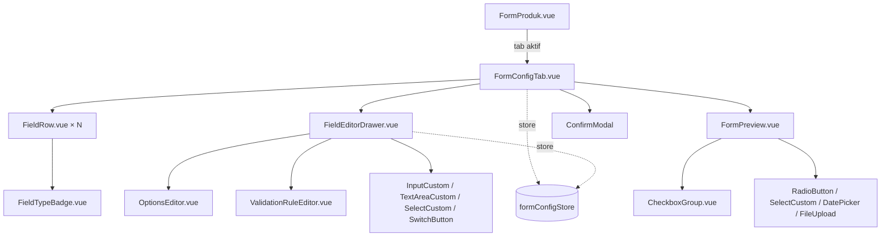

# TDD — Konfigurasi Form Produk (Frontend)

| Field | Value |
|---|---|
| Feature | **Konfigurasi Form Produk** — UI konfigurasi di Saktiform Dashboard + *renderer* dinamis di halaman Checkout |
| Dokumen induk | [PRD — Konfigurasi Form Produk](../prd/produk-form-config.md), [TDD Backend](./produk-form-config.md) |
| Stack (Dashboard) | Vue 3 `<script setup>` + TypeScript, Vite 5, Pinia (Options API `defineStore`), Axios, SCSS utility classes |
| Referensi FE | [architecture.md](../frontend/architecture.md), [component-inventory.md](../frontend/component-inventory.md), [business-modules.md](../frontend/business-modules.md), [ui-flow.md](../frontend/ui-flow.md) |
| Status | Draft for Implementation |
| Last updated | 2026-07-28 |
| Target pembaca | Frontend Developer (acuan implementasi langsung), Reviewer, QA, Backend |

> TDD ini menerjemahkan PRD menjadi desain teknis frontend **selaras konvensi dashboard existing**: ekstensi modul `src/modules/produk/`, store Pinia Options-API, helper `apiConfig/method.ts`, komponen `components/common/`. Snippet TypeScript/Vue bersifat **acuan (skeleton)**, bukan kode final.

---

## 0. Ruang Lingkup — Dua Aplikasi Berbeda

Bagian ini wajib dibaca lebih dahulu karena menentukan bagaimana seluruh dokumen ini dipakai.

Fitur ini menyentuh **dua aplikasi frontend yang terpisah**:

| # | Aplikasi | Peran dalam fitur ini | Ketersediaan dalam repositori ini |
|---|---|---|---|
| **A** | **Saktiform Dashboard** (Vue 3 + Vite) | Layar konfigurasi form pada halaman Produk; kartu "Informasi Tambahan" pada Detail Pesanan | **Terdokumentasi** — `docs/frontend/*` memuat arsitektur, inventaris 32 komponen, dan pemetaan API |
| **B** | **Halaman Checkout pelanggan** (`SAKTIFORM_CHECKOUT_URL`, default `http://103.49.239.5:3500`) | *Renderer* form dinamis yang dilihat pelanggan; pengiriman `POST /order/create` | **Tidak tersedia** — `docs/frontend/ui-flow.md` §4 menyatakan eksplisit: *"There is no standalone customer-facing checkout page in this dashboard; agents create orders on behalf of customers."* |

Konsekuensinya:

- **Bagian I (§1–§14)** membahas Dashboard secara konkret: nama berkas, nama komponen, props, dan konvensi yang dapat diverifikasi terhadap dokumentasi frontend yang ada.
- **Bagian II (§15–§19)** membahas *renderer* checkout sebagai **spesifikasi berbasis kontrak**: perilaku, algoritma *render*, pemetaan payload, dan penanganan galat yang wajib dipenuhi — tanpa mengasumsikan struktur berkas maupun *framework* aplikasi checkout, karena keduanya tidak dapat diverifikasi dari repositori ini.

Perlu dicatat bahwa dashboard memiliki `src/assets/styles/customs/layouts/client.scss` yang dideskripsikan sebagai *"client-facing layout (checkout pages)"*. Keberadaannya menunjukkan pernah ada rencana menempatkan halaman checkout di dalam dashboard. Bila tim memutuskan halaman checkout **dipindahkan** ke dashboard, Bagian II perlu ditulis ulang menjadi spesifikasi konkret dengan struktur berkas — itu keputusan arsitektur tersendiri yang berada di luar cakupan dokumen ini (lihat OQ-F1, §20).

---

## Daftar Isi

**Bagian I — Dashboard**
1. [Konvensi yang Diwarisi](#1-konvensi-yang-diwarisi)
2. [Baseline: Apa yang Sudah Ada](#2-baseline-apa-yang-sudah-ada)
3. [Struktur File](#3-struktur-file)
4. [TypeScript Types](#4-typescript-types)
5. [`formConfigStore.ts` (baru)](#5-formconfigstorets-baru)
6. [Perubahan `produkStore.ts`](#6-perubahan-produkstorets)
7. [Pemetaan API](#7-pemetaan-api)
8. [Celah Komponen: Checkbox Group & Drag-and-Drop](#8-celah-komponen-checkbox-group--drag-and-drop)
9. [Desain Komponen](#9-desain-komponen)
10. [Integrasi ke `FormProduk.vue`](#10-integrasi-ke-formprodukvue)
11. [Validasi Client](#11-validasi-client)
12. [Error, Loading, Empty State](#12-error-loading-empty-state)
13. [Lifecycle & Edge Case](#13-lifecycle--edge-case)
14. [Kartu "Informasi Tambahan" pada Detail Pesanan](#14-kartu-informasi-tambahan-pada-detail-pesanan)

**Bagian II — Checkout Renderer (kontrak)**

15. [Kontrak Renderer](#15-kontrak-renderer)
16. [Registry Tipe Field](#16-registry-tipe-field)
17. [Cascading Lokasi & Ongkir](#17-cascading-lokasi--ongkir)
18. [Penyusunan Payload Submit](#18-penyusunan-payload-submit)
19. [Penanganan Galat di Checkout](#19-penanganan-galat-di-checkout)

**Penutup**

20. [Open Questions](#20-open-questions)
21. [Rencana Implementasi & Checklist QA](#21-rencana-implementasi--checklist-qa)
22. [Appendix — Skeleton](#22-appendix--skeleton)

---

# BAGIAN I — DASHBOARD

## 1. Konvensi yang Diwarisi

| Aspek | Konvensi (dipakai apa adanya) |
|---|---|
| Store | `defineStore('namaStore', { state, getters, actions })` — **Options API**, bukan setup store. Auto-import (tanpa `import`) |
| API helper | `getData(type, url, params)`, `postData(type, url, data)`, `putData(type, url, data)`, `destroyData(type, url)`, `uploadData(...)` — argumen pertama selalu `'api_url'`. `errorHelper(err)` |
| Pola action | `try { const res = await getData('api_url', url, params); return res.data } catch (err) { alertStore.setAlert(msg, 'danger'); return errorHelper(err) }` |
| Toast | `useAlertStore().setAlert(message, 'success' \| 'danger')` — auto-hide 3 detik |
| Auth/scope | `useAuthStore().user.activeWorkspace.id` → query `workspaceId` |
| Envelope | `{ success, message, data }` |
| Validasi | `validateForm(validation, item, error)` dan `validateArrayForm(validation, items, error)` dari `functions/formHelper.ts` |
| State galat field | `fieldInfo = { type: 'info', message: '' }` dari `functions/defaultObject.ts` |
| Modal | `Modal` (container murni — parent merender header & tombol tutup sendiri). `ConfirmModal` (`title`, `action`, `actionVerb`, `visible`, `loading`; emit `closeModal`, `onAction`) |
| Input | `InputCustom`, `TextAreaCustom`, `SelectCustom`, `RadioButton`, `SwitchButton`, `DatePicker`, `FileUpload` |
| Tabs | `TabsWrapper` (`tabs: {title, value}[]`, emit `tabChange`) — **presentasional murni**, parent merender panel |
| Styling | Kelas utilitas SCSS (`.d-flex`, `.m-2-b`, `.fw-bold`, `.fz-px-14`) — tidak ada framework CSS |
| Ikon | `vue-material-design-icons` |
| Format | `functions/moment.ts`, `functions/delimiter.ts`, `functions/formater.ts` |

Dua *gotcha* konvensi yang relevan langsung dengan fitur ini:

- **`SwitchButton` memakai emit `input`, bukan `update:modelValue`** — tidak dapat dipakai dengan `v-model`. Parent wajib mendengarkan `@input`. Komponen ini sudah dipakai pada FormProduk untuk *toggle* visibilitas field, sehingga polanya sudah ada di kode.
- **`Modal` adalah container murni** — tidak menyediakan header, tombol tutup, maupun tombol aksi. Seluruh *drawer* dan modal pada fitur ini merender elemen tersebut sendiri di dalam slot.

---

## 2. Baseline: Apa yang Sudah Ada

`FormProduk.vue` **sudah memiliki** seksi konfigurasi form. Menurut `business-modules.md`, komponen ini adalah *"Multi-section product form: basic info, images, feature points, product variants, payment methods, warehouse, **checkout form config**, extra fields, CTA text, testimonials, pixel/GTM IDs, embedded scripts"*, dan model produk memuat `formConfig — custom checkout form fields`.

`SwitchButton` pun tercatat *"Used in: Product form configuration fields (form field visibility toggles)"*.

Artinya fitur ini **bukan penambahan seksi baru dari nol**, melainkan **penggantian seksi yang sudah ada** dengan versi yang jauh lebih kaya. Implikasi praktis:

| Aspek | Kondisi sekarang (dugaan kuat dari dokumentasi) | Setelah fitur ini |
|---|---|---|
| Sumber data | `formConfig` dibawa inline di dalam payload `POST /produk` | Endpoint tersendiri `GET`/`PUT /produk/{id}/form-config` |
| Isi | Daftar field datar: `tipeField`, `label`, `placeholder`, `order`, `isMandatory` | Dua kategori (SYSTEM/CUSTOM) + `fieldKey`, `options`, `defaultValue`, `helpText`, `isActive`, `validation` |
| Penyimpanan | Ikut tombol "Simpan Produk" | Tombol "Simpan Konfigurasi" tersendiri |
| Identitas field | Tidak ada | `fieldKey` stabil |

**Langkah pertama implementasi wajib berupa pembacaan `FormProduk.vue` yang sesungguhnya** untuk memetakan seksi form config existing — struktur `initProduk.formConfig`, komponen yang dipakai, dan cara `SwitchButton` di-*bind*. Dokumen ini menuliskan desain target; ia tidak dapat menuliskan *diff* persis karena isi berkas tersebut tidak tersedia dalam repositori ini.

Konsekuensi arsitektural terpenting: setelah fitur ini, **tombol "Simpan Produk" tidak boleh lagi mengirim `formConfig`**. Backend memperlakukan `formConfig` bernilai `null` maupun `[]` sebagai "tidak ada perubahan" (TDD Backend §13.1), sehingga menghapus atribut tersebut dari payload produk adalah aman dan justru menghilangkan risiko konfigurasi tertimpa.

---

## 3. Struktur File

```
src/modules/produk/
├── components/
│   ├── FormProduk.vue                    # (ubah) seksi form config → <FormConfigTab>
│   ├── ListProduk.vue                    # (tidak berubah)
│   └── form-config/                      # (baru)
│       ├── FormConfigTab.vue             # kontainer: 2 seksi + preview + simpan
│       ├── FieldRow.vue                  # satu baris field (drag handle, badge, aksi)
│       ├── FieldEditorDrawer.vue         # panel editor atribut field
│       ├── OptionsEditor.vue             # editor daftar pilihan (SELECT/RADIO/CHECKBOX)
│       ├── ValidationRuleEditor.vue      # editor aturan validasi per tipe
│       ├── FormPreview.vue               # pratinjau form hasil konfigurasi
│       └── FieldTypeBadge.vue            # badge tipe + ikon gembok
├── stores/
│   ├── produkStore.ts                    # (ubah) hentikan pengiriman formConfig
│   └── formConfigStore.ts                # (baru)
├── types/
│   └── formConfig.ts                     # (baru) seluruh tipe fitur ini
└── utils/
    ├── fieldTypeMeta.ts                  # (baru) metadata per tipe field
    └── formConfigValidation.ts           # (baru) aturan validasi client

src/components/common/
└── CheckboxGroup.vue                     # (baru) — lihat §8.1

src/modules/pesanan/components/
└── ModalDetailPesanan.vue                # (ubah) kartu "Informasi Tambahan"
```

Tidak ada berkas baru di `src/pages/` dan tidak ada blok `<route>` baru — seluruh UI hidup di dalam halaman Produk yang sudah ada (`/produk/tambah-produk` dan `/produk/:id`).

---

## 4. TypeScript Types

Berkas baru `src/modules/produk/types/formConfig.ts`:

```ts
export type FieldCategory = 'SYSTEM' | 'CUSTOM'

export type FormFieldType =
  // tersedia untuk Custom Field
  | 'TEXT' | 'TEXTAREA' | 'NUMBER' | 'EMAIL'
  | 'SELECT' | 'RADIO' | 'CHECKBOX'
  | 'DATE' | 'FILE'
  // khusus System Field — tidak muncul di pemilih tipe
  | 'PHONE' | 'PROVINCE' | 'CITY' | 'DISTRICT'

export interface FieldOption {
  label: string
  value: string
}

export interface ValidationRule {
  minLength?: number
  maxLength?: number
  min?: number
  max?: number
  pattern?: string
  minDate?: string          // yyyy-MM-dd
  maxDate?: string
  accept?: string[]         // MIME types (FILE)
  maxFileSizeKb?: number
  minSelected?: number      // CHECKBOX
  maxSelected?: number
}

/** Item pada GET /produk/{id}/form-config */
export interface FormFieldConfig {
  fieldKey: string
  fieldCategory: FieldCategory
  fieldType: FormFieldType
  label: string
  placeholder: string | null
  helpText: string | null
  isRequired: boolean
  isActive: boolean
  defaultValue: string | null
  options: FieldOption[] | null
  sortOrder: number
  validation: ValidationRule | null
  dataSource: string | null
  usageCount: number | null           // null bila backend gagal menghitung (NFR-5)
  editableAttributes: string[]        // KONTRAK IZIN — jangan disimpulkan sendiri
  deletable: boolean
}

export interface FormConfigResponse {
  idProduk: string
  namaProduk: string
  totalField: number
  totalCustomFieldActive: number
  customFieldLimit: number
  fields: FormFieldConfig[]
}

/** Item pada PUT /produk/{id}/form-config */
export interface FormFieldRequest {
  fieldKey?: string                   // kosong = field baru; server membangkitkan
  fieldCategory: FieldCategory
  fieldType?: FormFieldType           // wajib untuk CUSTOM
  label: string
  placeholder?: string | null
  helpText?: string | null
  isRequired?: boolean
  isActive?: boolean
  defaultValue?: string | null
  options?: FieldOption[] | null
  validation?: ValidationRule | null
  sortOrder?: number
}

export interface FormConfigSaveResponse {
  idProduk: string
  totalField: number
  created: string[]
  updated: string[]
  deleted: string[]
  deactivated: string[]
  fields: FormFieldConfig[]
}

/** Bentuk galat dari backend (ErrorDto + code + meta) */
export interface ApiFieldError {
  field: string
  message: string
  code?: string
  meta?: Record<string, any>
}

/** State lokal editor — FormFieldConfig + penanda UI */
export interface EditableField extends FormFieldConfig {
  _localId: string          // identitas stabil untuk v-for & drag; field baru belum punya fieldKey
  _isNew: boolean
  _dirty: boolean
}
```

Tiga catatan tipe yang penting:

**`_localId`.** Field baru belum memiliki `fieldKey` (dibangkitkan server). Memakai indeks larik sebagai `:key` pada `v-for` akan merusak *state* komponen anak saat urutan berubah — persis yang terjadi pada *drag & drop*. `_localId` diisi `crypto.randomUUID()` saat field dibuat atau dimuat, dan tidak pernah dikirim ke server.

**`editableAttributes` adalah kontrak, bukan saran.** Frontend **dilarang** menulis `field.fieldCategory === 'SYSTEM' ? disabled : enabled`. Aturan mana yang terkunci adalah milik backend dan dapat berkembang (PRD R-10). Pemeriksaan yang benar: `!field.editableAttributes.includes('isRequired')`.

**`usageCount` dapat `null`.** Backend menurunkan kualitas secara anggun bila agregasi gagal (NFR-5). UI menampilkan `—` alih-alih `0`; `0` bermakna "belum pernah dipakai" dan mengizinkan penghapusan — menyamakan `null` dengan `0` akan menampilkan afordans hapus yang keliru.

---

## 5. `formConfigStore.ts` (baru)

Store terpisah dari `produkStore`, karena daur hidupnya berbeda: konfigurasi dimuat dan disimpan sendiri, tidak mengikuti tombol "Simpan Produk".

```ts
import type {
  FormFieldConfig, FormConfigResponse, FormConfigSaveResponse,
  FormFieldRequest, EditableField, ApiFieldError,
} from '../types/formConfig'

export const useFormConfigStore = defineStore('formConfigStore', {
  state: () => ({
    loading: false,
    saving: false,
    idProduk: '' as string,
    namaProduk: '' as string,
    customFieldLimit: 50,
    fields: [] as EditableField[],
    /** salinan bersih hasil fetch terakhir — untuk deteksi perubahan & batal */
    pristine: '' as string,
    /** galat per fieldKey (atau _localId untuk field baru) dari respons 400 */
    fieldErrors: {} as Record<string, ApiFieldError[]>,
    /** galat tingkat form */
    formError: '' as string,
  }),

  getters: {
    systemFields: (s) => s.fields.filter(f => f.fieldCategory === 'SYSTEM'),
    customFields: (s) => s.fields.filter(f => f.fieldCategory === 'CUSTOM'),
    activeCustomCount: (s) =>
      s.fields.filter(f => f.fieldCategory === 'CUSTOM' && f.isActive).length,
    canAddCustomField(): boolean {
      return this.activeCustomCount < this.customFieldLimit
    },
    isDirty: (s) => s.pristine !== JSON.stringify(toPayload(s.fields)),
  },

  actions: {
    async onGetFormConfig(idProduk: string) {
      const alertStore = useAlertStore()
      const authStore = useAuthStore()
      this.loading = true
      try {
        const res = await getData('api_url', `/produk/${idProduk}/form-config`, {
          workspaceId: authStore.user.activeWorkspace.id,
        })
        const data = res.data.data as FormConfigResponse
        this.idProduk = data.idProduk
        this.namaProduk = data.namaProduk
        this.customFieldLimit = data.customFieldLimit ?? 50
        this.fields = data.fields.map(toEditable)
        this.pristine = JSON.stringify(toPayload(this.fields))
        this.fieldErrors = {}
        this.formError = ''
        return data
      } catch (err: any) {
        alertStore.setAlert(errMsg(err), 'danger')
        return errorHelper(err)
      } finally {
        this.loading = false
      }
    },

    async onSaveFormConfig() {
      const alertStore = useAlertStore()
      const authStore = useAuthStore()
      this.saving = true
      this.fieldErrors = {}
      this.formError = ''
      try {
        const res = await putData(
          'api_url',
          `/produk/${this.idProduk}/form-config?workspaceId=${authStore.user.activeWorkspace.id}`,
          { fields: toPayload(this.fields) },
        )
        const data = res.data.data as FormConfigSaveResponse
        // Sinkronkan dari respons — fieldKey field baru datang dari server
        this.fields = data.fields.map(toEditable)
        this.pristine = JSON.stringify(toPayload(this.fields))
        alertStore.setAlert('Konfigurasi form berhasil disimpan', 'success')
        return data
      } catch (err: any) {
        this.applyServerErrors(err)
        alertStore.setAlert(errMsg(err), 'danger')
        return errorHelper(err)
      } finally {
        this.saving = false
      }
    },

    /** Memetakan daftar ErrorDto dari respons 400 ke fieldErrors + formError. */
    applyServerErrors(err: any) {
      const payload = err?.response?.data
      const list: ApiFieldError[] = Array.isArray(payload?.data) ? payload.data : []
      if (!list.length) { this.formError = errMsg(err); return }

      const byField: Record<string, ApiFieldError[]> = {}
      for (const e of list) {
        const key = this.resolveErrorTarget(e.field)
        if (!key) { this.formError = e.message; continue }
        ;(byField[key] ||= []).push(e)
      }
      this.fieldErrors = byField
    },

    /**
     * `field` dari backend bisa berupa fieldKey (`ukuran_baju`) atau path payload
     * (`fields[3].isRequired`). Keduanya dipetakan ke _localId agar UI dapat menandai
     * baris yang benar meskipun urutan sudah berubah di layar.
     */
    resolveErrorTarget(field: string): string | null {
      const m = field?.match(/^fields\[(\d+)\]/)
      if (m) return this.fields[Number(m[1])]?._localId ?? null
      const byKey = this.fields.find(f => f.fieldKey === field)
      return byKey?._localId ?? null
    },

    addCustomField(fieldType: FormFieldType) {
      this.fields.push({
        _localId: crypto.randomUUID(),
        _isNew: true,
        _dirty: true,
        fieldKey: '',
        fieldCategory: 'CUSTOM',
        fieldType,
        label: '',
        placeholder: null,
        helpText: null,
        isRequired: false,
        isActive: true,
        defaultValue: null,
        options: needsOptions(fieldType) ? [] : null,
        sortOrder: this.fields.length + 1,
        validation: null,
        dataSource: null,
        usageCount: 0,
        editableAttributes: CUSTOM_EDITABLE,
        deletable: true,
      })
    },

    removeField(localId: string) {
      const i = this.fields.findIndex(f => f._localId === localId)
      if (i >= 0) this.fields.splice(i, 1)
    },

    /** Dipanggil setelah drag & drop / tombol naik-turun. */
    reorder(from: number, to: number) {
      const [moved] = this.fields.splice(from, 1)
      this.fields.splice(to, 0, moved)
      this.fields.forEach((f, i) => { f.sortOrder = i + 1 })
    },

    reset() { this.$reset() },
  },
})
```

Tiga keputusan desain store:

**Satu larik `fields`, bukan dua.** Meskipun UI menampilkan dua seksi, *state* menyimpan satu larik terurut. Alasannya: `sortOrder` berlaku dalam satu ruang bersama (BR-5), dan *drag & drop* dapat memindahkan Custom Field ke antara System Field. Dua larik akan memaksa rekonsiliasi urutan pada setiap perubahan. `systemFields` dan `customFields` disediakan sebagai *getter* untuk keperluan tampilan.

**Sinkronisasi dari respons `PUT`.** Server mengembalikan `fields` lengkap termasuk `fieldKey` yang baru dibangkitkan dan `sortOrder` yang sudah dinormalkan 1..N. Menyalinnya kembali ke *state* menghindari `GET` ulang sekaligus menjamin `fieldKey` field baru tersedia untuk operasi berikutnya.

**`isDirty` berbasis perbandingan payload, bukan flag manual.** `_dirty` per field disimpan untuk keperluan tampilan (mis. penanda "belum disimpan"), namun penentuan apakah ada perubahan memakai perbandingan JSON terhadap `pristine`. Flag manual mudah lupa di-*set* pada satu-dua jalur mutasi.

Helper `toPayload` membuang atribut lokal dan atribut yang hanya untuk baca:

```ts
function toPayload(fields: EditableField[]): FormFieldRequest[] {
  return fields.map((f, i) => ({
    ...(f.fieldKey ? { fieldKey: f.fieldKey } : {}),
    fieldCategory: f.fieldCategory,
    ...(f.fieldCategory === 'CUSTOM' ? { fieldType: f.fieldType } : {}),
    label: f.label,
    placeholder: f.placeholder,
    helpText: f.helpText,
    isRequired: f.isRequired,
    isActive: f.isActive,
    defaultValue: f.defaultValue,
    options: f.options,
    validation: f.validation,
    sortOrder: i + 1,
  }))
}
```

`sortOrder` diisi dari indeks larik, bukan dari `f.sortOrder`. Backend menormalkan ulang berdasarkan urutan entri (TDD Backend §11.3), sehingga urutan larik adalah kebenaran — mengirim `f.sortOrder` yang mungkin basi hanya menambah peluang inkonsistensi.

Untuk kategori `SYSTEM`, `fieldType` **tidak dikirim**. Backend memakai pola "abaikan bila sama, tolak bila berbeda", sehingga tidak mengirimnya adalah jalur teraman dan menghilangkan seluruh kelas galat `SYSTEM_FIELD_IMMUTABLE_ATTRIBUTE` yang timbul dari *round-trip* biasa.

---

## 6. Perubahan `produkStore.ts`

| # | Perubahan | Alasan |
|---|---|---|
| 1 | Hentikan pengiriman `formConfig` pada `onStore`/`onUpdate` (payload `POST /produk`) | Konfigurasi kini dikelola endpoint tersendiri. Backend memperlakukan `null`/`[]` sebagai "tidak ada perubahan" |
| 2 | Hapus `formConfig` dari `initProduk` (atau pertahankan sebagai `[]` yang tidak pernah diisi) | Menghindari dua sumber kebenaran |
| 3 | Pada `onShow` (detail produk), abaikan `formConfig` yang datang dari `GET /produk/{id}` | `FormConfigTab` memuat sendiri via `GET /produk/{id}/form-config` |
| 4 | Setelah produk **baru** berhasil dibuat, panggil `formConfigStore.onGetFormConfig(newId)` | Backend melakukan seeding enam System Field; UI perlu memuatnya agar tab konfigurasi dapat langsung dipakai |

Butir 4 adalah konsekuensi UX yang penting: pada halaman **Tambah Produk**, tab Konfigurasi Form **tidak dapat dipakai sebelum produk tersimpan**, karena endpoint konfigurasi memerlukan `idProduk`. Perlakuan yang ditetapkan:

```
Mode Tambah Produk  → tab Konfigurasi Form ditampilkan dalam keadaan nonaktif,
                      dengan pesan: "Simpan produk terlebih dahulu untuk mengatur form checkout."
Setelah simpan      → aplikasi berpindah ke mode Edit (route /produk/{id}),
                      tab menjadi aktif dan konfigurasi dimuat otomatis.
```

Alternatif berupa penyimpanan konfigurasi di *state* lokal lalu mengirimnya setelah produk tersimpan telah dipertimbangkan dan ditolak: ia menduplikasi seluruh logika validasi dan penanganan `fieldKey` untuk keuntungan yang kecil, sementara alur "simpan produk dulu" sudah menjadi pola yang dipahami pengguna pada form multi-seksi.

---

## 7. Pemetaan API

| Aksi | Method | URL | Params / Body | Store action |
|---|---|---|---|---|
| Muat konfigurasi | `GET` | `/produk/{id}/form-config` | `?workspaceId=` | `formConfigStore.onGetFormConfig` |
| Simpan konfigurasi | `PUT` | `/produk/{id}/form-config` | `?workspaceId=`, body `{ fields: [...] }` | `formConfigStore.onSaveFormConfig` |
| Unggah berkas (Fase 7) | `POST` | `/produk/form-config/upload` | multipart | *(halaman checkout, bukan dashboard)* |

Bentuk respons galat mengikuti keputusan TDD Backend §14.2: daftar `ErrorDto` berada pada atribut **`data`**, bukan `errors`.

```jsonc
// 400
{
  "success": false,
  "message": "Validation failed",
  "data": [
    { "field": "instagram", "code": "FIELD_IN_USE",
      "message": "Field 'Akun Instagram' sudah dipakai oleh 312 pesanan…",
      "meta": { "usageCount": 312, "suggestedAction": "DEACTIVATE" } }
  ]
}
```

Karena `RestResponse.data` juga dipakai untuk muatan sukses, `applyServerErrors` wajib memeriksa `Array.isArray(payload?.data)` sebelum memperlakukannya sebagai daftar galat — respons sukses membawa objek, bukan larik.

`errMsg(err)` mengikuti konvensi dashboard: `err.response?.data?.message || 'Jaringan Bermasalah'`.

---

## 8. Celah Komponen: Checkbox Group & Drag-and-Drop

Dua kebutuhan fitur ini tidak terpenuhi oleh inventaris komponen maupun *tech stack* yang ada. Keduanya memerlukan keputusan sebelum implementasi dimulai.

### 8.1 Tidak ada komponen Checkbox

Inventaris 32 komponen `components/common/` memuat `RadioButton`, `SwitchButton`, `SelectCustom`, dan `MultipleSelectCustom` — **tidak ada komponen checkbox**. Padahal `CHECKBOX` adalah salah satu dari sembilan tipe Custom Field yang wajib didukung (BR-27), dan sifatnya multi-nilai sehingga `MultipleSelectCustom` (dropdown multi-pilih) bukan padanan visual yang tepat untuk *checkbox group* yang dirender inline.

| Opsi | Konsekuensi |
|---|---|
| **A — buat `CheckboxGroup.vue` baru** di `components/common/` (dipilih) | Satu komponen kecil, konsisten dengan pola `RadioButton` yang sudah ada. Dapat dipakai ulang di luar fitur ini |
| B — pakai `MultipleSelectCustom` | Bentuk visual dropdown, bukan daftar checkbox. Menyimpang dari desain UI PRD dan dari harapan pengguna terhadap tipe field "Checkbox" |
| C — checkbox HTML mentah | Tidak konsisten dengan sistem desain; tidak ada penanganan galat/label yang seragam |

`CheckboxGroup.vue` mengikuti pola API `RadioButton` agar terasa satu keluarga:

```ts
// props
{
  modelValue: string[]                    // v-model
  options: { label: string, value: string }[]
  label?: string
  error?: boolean
  errorMsg?: string                       // default 'Tidak boleh kosong'
  disabled?: boolean
  readonly?: boolean
  withError?: boolean                     // default true
  minSelected?: number
  maxSelected?: number
}
// emits: 'update:modelValue'
```

Berbeda dari `RadioButton` yang merender **satu** tombol dan di-*loop* oleh parent, `CheckboxGroup` merender **seluruh grup** — karena aturan `minSelected`/`maxSelected` bersifat kolektif dan tidak dapat ditegakkan oleh komponen per-item.

Komponen ini dibutuhkan **dua kali**: pada `FormPreview` di dashboard, dan pada *renderer* checkout (aplikasi berbeda — perlu diimplementasikan di sana juga, §16).

### 8.2 Tidak ada pustaka drag-and-drop

*Tech stack* tidak memuat pustaka *drag & drop*. Menyusun ulang urutan field adalah kebutuhan Must (US-4).

| Opsi | Bundel | Konsekuensi |
|---|---|---|
| **A — tombol naik/turun (▲▼)** (dipilih untuk Fase 1) | 0 KB | Tanpa dependensi baru; dapat diakses lewat keyboard secara alami; lebih lambat untuk menyusun ulang banyak field |
| B — `vuedraggable` (SortableJS) | ± 45 KB | Pengalaman terbaik; menambah dependensi; perlu penanganan aksesibilitas keyboard tersendiri |
| C — HTML5 Drag and Drop API murni | 0 KB | Perilaku lintas peramban tidak seragam; sulit pada peranti sentuh |

Keputusan: **mulai dengan opsi A**, dan naikkan ke opsi B bila umpan balik pengguna menunjukkan penyusunan ulang terasa memberatkan. Alasannya, jumlah field per produk umumnya kecil (enam System Field + segelintir Custom Field), sehingga jarak tempuh penyusunan ulang pendek. Menambah 45 KB pada bundel dashboard untuk interaksi yang jarang dipakai sulit dibenarkan di awal.

Antarmuka `reorder(from, to)` pada store sengaja dibuat netral terhadap mekanisme, sehingga peralihan A → B kelak tidak menyentuh store maupun komponen lain — hanya `FieldRow`/`FormConfigTab`.

Bila opsi B dipilih kelak, `:key` pada `v-for` **wajib** memakai `_localId` (§4), bukan indeks.

---

## 9. Desain Komponen

### 9.1 Peta Komponen



### 9.2 `FormConfigTab.vue`

Kontainer utama. Satu-satunya komponen yang berbicara langsung dengan store.

```ts
// props
{ idProduk: string; disabled?: boolean }   // disabled = mode Tambah Produk (§6)
// emits: none — seluruh perubahan lewat store
```

Tanggung jawab:

| # | Tanggung jawab |
|---|---|
| 1 | Memanggil `onGetFormConfig(idProduk)` pada `onMounted` dan saat `idProduk` berubah |
| 2 | Merender dua seksi (Bawaan Sistem / Tambahan) dari *getter* `systemFields` dan `customFields` |
| 3 | Menampilkan pencacah `{{ activeCustomCount }} / {{ customFieldLimit }}` |
| 4 | Menonaktifkan tombol "+ Tambah Field" ketika `!canAddCustomField` |
| 5 | Membuka `FieldEditorDrawer` dengan `_localId` field terpilih |
| 6 | Menangani aksi hapus → `ConfirmModal`; bila `!deletable`, tawarkan "Nonaktifkan" alih-alih hapus |
| 7 | Menampilkan/menyembunyikan `FormPreview` |
| 8 | Tombol "Simpan Konfigurasi" → `onSaveFormConfig()` |
| 9 | Memasang `onBeforeRouteLeave` guard bila `isDirty` |

Nomor urut yang ditampilkan pada setiap baris **berasal dari posisi di larik gabungan**, bukan dari posisi dalam seksinya. Implementasinya:

```ts
const orderOf = (localId: string) =>
  store.fields.findIndex(f => f._localId === localId) + 1
```

Ini yang menghasilkan tampilan pada mockup PRD §14.1 — System Field bernomor 1, 3–7 sementara Custom Field bernomor 2 dan 8. Menampilkan nomor per-seksi akan menyesatkan karena tidak mencerminkan urutan render sesungguhnya.

### 9.3 `FieldRow.vue`

```ts
// props
{
  field: EditableField
  index: number              // posisi pada larik gabungan (0-based)
  total: number              // untuk menonaktifkan ▲ di posisi 0 dan ▼ di posisi terakhir
  errors?: ApiFieldError[]
}
// emits: 'edit' | 'delete' | 'deactivate' | 'move-up' | 'move-down'
```

Aturan render:

| Elemen | Aturan |
|---|---|
| Ikon 🔒 | Ditampilkan bila `field.fieldCategory === 'SYSTEM'` — murni indikator visual |
| Badge tipe | `FieldTypeBadge` menampilkan label ramah (`Teks`, `Pilihan`, …), bukan nama enum mentah |
| Badge wajib | "Wajib" / "Opsional" dari `isRequired` |
| Badge status | "Nonaktif" ditampilkan hanya bila `!isActive` (tidak perlu badge "Aktif" — itu keadaan normal) |
| Tombol Ubah | Selalu tampil |
| Tombol Hapus (🗑) | Tampil bila `field.deletable === true` |
| Tombol Nonaktifkan (🚫) | Tampil bila `!field.deletable && field.fieldCategory === 'CUSTOM'` |
| Keterangan pemakaian | `usageCount > 0` → "N pesanan memakai field ini — tidak dapat dihapus permanen"; `usageCount === 0` → "belum dipakai — dapat dihapus permanen"; `usageCount === null` → tidak ditampilkan |
| Penanda galat | Border merah + daftar pesan bila `errors?.length` |

Baris terakhir tabel di atas adalah alasan `usageCount === null` tidak boleh disamakan dengan `0` (§4).

### 9.4 `FieldEditorDrawer.vue`

Panel geser berbasis `Modal` (`size="medium"`, `position` kanan). Karena `Modal` adalah container murni, komponen ini merender sendiri header, tombol tutup, dan tombol aksi.

```ts
// props
{ visible: boolean; localId: string | null }
// emits: 'close' | 'apply'
```

Perubahan diterapkan pada **salinan lokal**, bukan langsung ke store — sehingga tombol "Batal" benar-benar membatalkan:

```ts
const draft = ref<EditableField | null>(null)

watch(() => props.localId, (id) => {
  const src = store.fields.find(f => f._localId === id)
  draft.value = src ? JSON.parse(JSON.stringify(src)) : null
}, { immediate: true })

function apply() {
  if (!validateDraft()) return
  const i = store.fields.findIndex(f => f._localId === draft.value!._localId)
  if (i >= 0) store.fields[i] = { ...draft.value!, _dirty: true }
  emit('close')
}
```

**Penentuan kontrol yang dinonaktifkan** — inti dari kontrak izin:

```ts
const can = (attr: string) => draft.value?.editableAttributes?.includes(attr) ?? false
```

```vue
<InputCustom v-model="draft.label"       :disabled="!can('label')"       label="Label" required />
<InputCustom v-model="draft.placeholder" :disabled="!can('placeholder')" label="Placeholder" />
<TextAreaCustom v-model="draft.helpText" :disabled="!can('helpText')"    label="Help Text" />

<SelectCustom
  v-if="draft.fieldCategory === 'CUSTOM'"
  :list="selectableFieldTypes"
  v-model="draft.fieldType"
  :disabled="!can('fieldType')"
  label="Tipe Field"
  required
/>

<SwitchButton :value="draft.isRequired" label="Wajib Diisi"
              :disabled="!can('isRequired')" @input="draft.isRequired = $event" />
<SwitchButton :value="draft.isActive"   label="Aktif"
              :disabled="!can('isActive')"   @input="draft.isActive = $event" />
```

Perhatikan `SwitchButton` memakai `:value` + `@input`, **bukan** `v-model` — komponen ini mengemisikan `input`, bukan `update:modelValue` (§1).

Untuk System Field, panel menampilkan `fieldKey`, tipe, wajib, dan status sebagai **teks baca-saja** disertai ikon 🔒, bukan sebagai kontrol yang dinonaktifkan. Kontrol *disabled* mengesankan "bisa diaktifkan"; teks baca-saja menyampaikan "ini memang bukan sesuatu yang Anda ubah" — lebih jujur dan lebih sedikit menimbulkan percobaan yang gagal.

`selectableFieldTypes` **hanya** memuat sembilan tipe Custom Field. Empat tipe khusus System (`PHONE`, `PROVINCE`, `CITY`, `DISTRICT`) tidak pernah muncul di pemilih, sehingga galat `FIELD_TYPE_RESERVED_FOR_SYSTEM` tidak akan pernah terpicu melalui UI — ia tetap ditangani sebagai pertahanan berlapis.

Ketika `fieldType` berubah ke tipe yang tidak memerlukan `options`, `draft.options` di-*reset* ke `null`; sebaliknya ke `[]`. Tanpa itu, payload akan membawa `options` untuk tipe `TEXT` dan ditolak `OPTIONS_NOT_ALLOWED_FOR_TYPE`.

### 9.5 `OptionsEditor.vue`

```ts
// props
{ modelValue: FieldOption[]; disabled?: boolean; maxOptions: number }
// emits: 'update:modelValue'
```

| Perilaku | Ketentuan |
|---|---|
| Baris | `label` dan `value` sebagai dua `InputCustom` berdampingan |
| Auto-fill `value` | Saat `label` diketik dan `value` masih kosong, `value` diisi otomatis dari `label`. Setelah pengguna menyunting `value` secara manual, auto-fill berhenti untuk baris itu |
| Tambah | Tombol "+ Tambah Pilihan", nonaktif pada `maxOptions` |
| Hapus | Ikon 🗑 per baris; minimal satu baris wajib tersisa |
| Urutan | Tombol ▲▼ per baris (urutan `options` menentukan urutan render dan urutan nilai `CHECKBOX` tersimpan) |
| Validasi inline | `value` duplikat (case-insensitive) ditandai merah seketika |
| `:key` | Indeks **tidak boleh** dipakai — pakai id lokal per baris, alasan sama seperti §4 |

Auto-fill `value` dari `label` layak dijelaskan: pengguna non-teknis tidak memahami perbedaan keduanya, dan memaksa mereka mengisi dua kolom untuk setiap pilihan adalah gesekan yang tidak perlu. Namun `value` tetap dapat disunting karena ia yang tersimpan di `order_custom_field.field_value` dan muncul pada laporan.

`maxOptions` diturunkan dari tipe: `SELECT` 100, `RADIO` 20, `CHECKBOX` 50 (PRD §18.2.4) — disimpan di `utils/fieldTypeMeta.ts` agar tidak tersebar.

### 9.6 `ValidationRuleEditor.vue`

Kontrol yang ditampilkan bergantung pada `fieldType`:

| `fieldType` | Kontrol |
|---|---|
| `TEXT` | `minLength`, `maxLength` (maks 500) |
| `TEXTAREA` | `minLength`, `maxLength` (maks 2000) |
| `NUMBER` | `min`, `max` |
| `EMAIL` | — (pola ditetapkan sistem) |
| `SELECT`, `RADIO` | — |
| `CHECKBOX` | `minSelected`, `maxSelected` |
| `DATE` | `minDate`, `maxDate` (`DatePicker`) |
| `FILE` | `accept` (multi-select MIME), `maxFileSizeKb` (maks 5120) |

Atribut `pattern` **tidak diekspos di UI pada rilis pertama**. Alasannya: pengguna dashboard adalah pemilik toko, bukan pengembang; sebuah kolom regex akan lebih sering menghasilkan form yang menolak input sah daripada menyelesaikan masalah nyata. Backend tetap menerima dan memvalidasinya (termasuk pemeriksaan ReDoS) untuk keperluan integrasi mendatang.

### 9.7 `FormPreview.vue`

Merender form dari `store.fields` yang `isActive`, terurut, memakai komponen yang sama dengan checkout — sebagai *dry run* visual sebelum konfigurasi dipublikasikan (US-12).

| Ketentuan | Alasan |
|---|---|
| Hanya field `isActive` | Mencerminkan apa yang benar-benar dilihat pelanggan (BR-8) |
| Field lokasi dirender sebagai `SelectCustom` **kosong dan nonaktif** dengan placeholder | Pratinjau tidak boleh memanggil `/location/*`; ia menampilkan bentuk, bukan data |
| `FILE` dirender sebagai `FileUpload` nonaktif | Idem — pratinjau tidak mengunggah apa pun |
| Seluruh input `readonly`/`disabled` | Pratinjau bukan form yang dapat diisi |
| Tanda `*` pada field wajib | Konsisten dengan checkout |
| `helpText` di bawah input | Konsisten dengan checkout |

Pratinjau **tidak** menjamin paritas piksel dengan halaman checkout — keduanya aplikasi berbeda dengan sistem styling berbeda. Ini wajib disampaikan pada UI melalui satu baris keterangan, agar pengguna tidak melaporkan perbedaan tampilan sebagai bug.

---

## 10. Integrasi ke `FormProduk.vue`

### 10.1 Penempatan

Konfigurasi form menjadi **tab** melalui `TabsWrapper`, sejajar tab existing. Karena `TabsWrapper` presentasional murni, parent merender panel:

```vue
<TabsWrapper :tabs="produkTabs" @tab-change="activeTab = $event.value" />

<section v-show="activeTab === 'informasi'">…existing…</section>
<section v-show="activeTab === 'varian'">…existing…</section>
<section v-show="activeTab === 'form-config'">
  <FormConfigTab :id-produk="produkId" :disabled="isCreateMode" />
</section>
```

`v-show`, bukan `v-if` — agar *state* editor tidak hilang ketika pengguna berpindah tab dan kembali. Pengecualiannya `FormConfigTab` pada mode Tambah: di sana ia memang belum boleh memuat data.

Bila `FormProduk.vue` existing ternyata **tidak** memakai `TabsWrapper` melainkan seksi yang di-*scroll* menerus, `FormConfigTab` ditempatkan sebagai satu seksi pada posisi yang sama dengan seksi form config existing. Struktur sesungguhnya wajib diperiksa lebih dahulu (§2).

### 10.2 Dua Tombol Simpan

Ini titik yang paling mudah salah dipahami pengguna dan wajib jelas secara visual:

| Tombol | Cakupan | Endpoint |
|---|---|---|
| **Simpan Produk** (header halaman) | Seluruh data produk **kecuali** konfigurasi form | `POST /produk` |
| **Simpan Konfigurasi** (di dalam tab) | Hanya konfigurasi form | `PUT /produk/{id}/form-config` |

Untuk mencegah kebingungan:

- Tombol "Simpan Konfigurasi" nonaktif ketika `!isDirty`.
- Ketika `isDirty`, tab "Konfigurasi Form" menampilkan titik penanda (•) pada judulnya.
- Menekan "Simpan Produk" ketika konfigurasi masih `isDirty` memunculkan `ConfirmModal`: *"Perubahan konfigurasi form belum disimpan dan tidak ikut tersimpan oleh tombol ini. Simpan konfigurasi sekarang?"* dengan tiga pilihan: Simpan keduanya / Simpan produk saja / Batal.

### 10.3 Guard Navigasi

```ts
onBeforeRouteLeave((to, from, next) => {
  if (!store.isDirty) return next()
  confirmLeave.value = true
  pendingNav.value = next
})
```

Diperlukan karena konfigurasi tidak ikut tersimpan oleh tombol "Simpan Produk" — tanpa guard, pengguna akan kehilangan pekerjaan tanpa peringatan.

---

## 11. Validasi Client

### 11.1 Prinsip

Validasi client adalah **umpan balik UX, bukan otoritas**. Backend memvalidasi ulang seluruhnya (TDD Backend §10). Tujuan validasi client hanya satu: menghindari perjalanan bolak-balik ke server untuk kesalahan yang jelas.

Konsekuensi praktis: **jangan menduplikasi seluruh aturan backend**. Duplikasi yang tidak lengkap lebih berbahaya daripada tidak ada duplikasi sama sekali, karena menciptakan ilusi bahwa payload sudah pasti valid.

### 11.2 Aturan yang Divalidasi di Client

Memakai `validateForm` dari `functions/formHelper.ts` dengan bentuk `fieldInfo` dari `functions/defaultObject.ts`.

| Aturan | Kapan | Pesan |
|---|---|---|
| `label` wajib, 1–150 karakter | Saat "Terapkan" pada drawer | "Label field wajib diisi." |
| `placeholder` maks 200 | Idem | "Placeholder maksimum 200 karakter." |
| `helpText` maks 300 | Idem | "Help text maksimum 300 karakter." |
| `fieldType` wajib (CUSTOM) | Idem | "Tipe field wajib dipilih." |
| `options` minimal 1 untuk tipe berbasis pilihan | Idem | "Minimal satu pilihan wajib diisi." |
| `option.label` & `option.value` wajib | Inline per baris | "Label dan nilai pilihan wajib diisi." |
| `option.value` unik (case-insensitive) | Inline per baris | "Nilai pilihan tidak boleh sama." |
| Jumlah `options` ≤ batas tipe | Saat menambah | Tombol tambah dinonaktifkan |
| `min ≤ max`, `minLength ≤ maxLength`, `minDate ≤ maxDate` | Idem | "Nilai minimum tidak boleh lebih besar dari maksimum." |
| `defaultValue` termasuk `options` | Idem | "Nilai bawaan harus salah satu pilihan yang tersedia." |
| Jumlah Custom Field aktif ≤ `customFieldLimit` | Saat menambah | Tombol "+ Tambah Field" dinonaktifkan + tooltip |

### 11.3 Yang Sengaja TIDAK Divalidasi di Client

| Aturan | Alasan |
|---|---|
| Keunikan `fieldKey` | `fieldKey` dibangkitkan server; client tidak dapat memprediksi hasil *slugify* maupun penyelesaian tabrakan |
| Kata terlarang (`RESERVED_FIELD_KEY`) | Idem |
| `usageCount` untuk penghapusan | Nilai dapat berubah sejak konfigurasi dimuat; keputusan wajib berasal dari server saat penyimpanan |
| Kompleksitas `pattern` | `pattern` tidak diekspos di UI (§9.6) |
| Atribut terkunci System Field | Kontrol sudah dinonaktifkan berdasarkan `editableAttributes`; validasi tambahan hanya duplikasi |

Baris ketiga penting: UI menampilkan afordans hapus/nonaktif berdasarkan `deletable` yang dimuat saat `GET`. Bila sebuah pesanan masuk di antara `GET` dan `PUT`, server menolak dengan `FIELD_IN_USE` — dan itu perilaku yang benar. UI menanganinya sebagai galat yang dapat dipulihkan (§12.3), bukan sebagai kegagalan.

---

## 12. Error, Loading, Empty State

### 12.1 Loading

| Keadaan | Tampilan |
|---|---|
| `loading` (muat konfigurasi) | Skeleton delapan baris memakai `.skeleton` SCSS yang sudah ada |
| `saving` | Tombol "Simpan Konfigurasi" dalam keadaan `loading`; seluruh baris field nonaktif |
| Mode Tambah Produk | Panel kosong + pesan "Simpan produk terlebih dahulu…" |

### 12.2 Pemetaan Kode Galat ke Perilaku UI

Frontend **wajib** bercabang atas `code`, bukan atas teks `message` — `code` bersifat stabil, `message` dapat berubah redaksinya kapan saja (TDD Backend §17.2).

| `code` | Perilaku UI |
|---|---|
| `SYSTEM_FIELD_NOT_DELETABLE` | Muat ulang konfigurasi (`onGetFormConfig`) + dialog penjelasan. Indikasi *state* client menyimpang |
| `SYSTEM_FIELD_IMMUTABLE_ATTRIBUTE` | Muat ulang konfigurasi. Seharusnya tidak terjadi karena kontrol dinonaktifkan — bila muncul, ada bug client |
| `UNKNOWN_SYSTEM_FIELD` | Muat ulang konfigurasi (client kedaluwarsa) |
| `FIELD_IN_USE` | Dialog dengan tombol **"Nonaktifkan"** yang langsung menerapkan `isActive = false` lalu menyimpan ulang. Tampilkan `meta.usageCount` |
| `CUSTOM_FIELD_LIMIT_EXCEEDED` | Galat tingkat form + nonaktifkan tombol tambah |
| `DUPLICATE_FIELD_KEY` | Tandai kedua baris yang bertabrakan |
| `OPTIONS_REQUIRED_FOR_TYPE` | Buka drawer field tersebut, fokuskan `OptionsEditor` |
| `OPTIONS_NOT_ALLOWED_FOR_TYPE` | Buka drawer, kosongkan `options` |
| `INVALID_DEFAULT_VALUE` | Buka drawer, tandai input nilai bawaan |
| `LABEL_REQUIRED`, `LABEL_TOO_LONG` | Buka drawer, tandai input label |
| `PAYLOAD_TOO_LARGE` (413) | Galat tingkat form: "Konfigurasi terlalu besar. Kurangi jumlah field atau pilihan." |
| 404 | Alert + arahkan kembali ke `/produk` |
| 403 | Alert "Anda tidak berhak mengubah konfigurasi form." + jadikan seluruh tab baca-saja |
| Kode tidak dikenal | Tampilkan `message` apa adanya sebagai galat tingkat form |

Baris terakhir adalah aturan penutup yang wajib ada: katalog kode akan bertambah seiring waktu, dan client versi lama harus tetap menampilkan sesuatu yang bermakna.

### 12.3 Alur `FIELD_IN_USE`

Ini satu-satunya galat yang memiliki jalur pemulihan otomatis, dan layak diimplementasikan dengan baik karena akan sering ditemui:

```
Pengguna menghapus field → Simpan → 400 FIELD_IN_USE (usageCount: 312)
  ↓
ConfirmModal: "Field 'Akun Instagram' sudah dipakai oleh 312 pesanan sehingga tidak
               dapat dihapus. Nonaktifkan field agar tidak lagi tampil pada checkout
               baru? Data pesanan lama tetap tersimpan."
  ↓ [Nonaktifkan]
Kembalikan field ke larik pada posisi semula, set isActive = false → simpan ulang
  ↓ [Batal]
Kembalikan field ke larik pada posisi semula, isActive tidak berubah
```

Agar pemulihan ini mungkin, `onSaveFormConfig` yang gagal **tidak boleh** memodifikasi `store.fields`. Store hanya menyalin dari respons pada jalur sukses (§5) — properti yang wajib dipertahankan saat *refactor*.

### 12.4 Empty State

| Kondisi | Tampilan |
|---|---|
| Belum ada Custom Field | Ilustrasi ringan + "Belum ada field tambahan. Tambahkan field untuk mengumpulkan data khusus produk ini, misalnya ukuran, warna, atau catatan." + tombol "+ Tambah Field" |
| Seluruh Custom Field nonaktif | Daftar tetap ditampilkan dengan badge "Nonaktif" — bukan empty state |
| System Field tidak lengkap | Tidak akan terjadi: backend melakukan *self-healing* (FR-4). Bila tetap terjadi, tampilkan galat tingkat form dan sarankan muat ulang |

---

## 13. Lifecycle & Edge Case

| ID | Skenario | Perilaku |
|---|---|---|
| EF-1 | Pengguna berpindah tab lalu kembali | `v-show` mempertahankan *state*; tidak ada *fetch* ulang |
| EF-2 | Pengguna berpindah workspace saat tab terbuka | `formConfigStore.reset()` + arahkan ke `/produk`; konfigurasi terikat pada produk milik satu workspace |
| EF-3 | Pengguna menutup drawer tanpa "Terapkan" | Perubahan hilang (bekerja pada salinan, §9.4) |
| EF-4 | Pengguna menghapus field baru yang belum disimpan | Dihapus dari larik; tidak ada panggilan API |
| EF-5 | Menambah field lalu langsung menyusun urutannya sebelum menyimpan | Berfungsi — `_localId` menjaga identitas baris |
| EF-6 | Dua tab peramban menyunting produk sama | *Last-write-wins* (PRD EC-3). Tidak ada penanganan khusus pada rilis pertama |
| EF-7 | Menyimpan tanpa perubahan apa pun | Tombol nonaktif (`!isDirty`); bila tetap terkirim, server mengembalikan 200 |
| EF-8 | Menonaktifkan lalu mengaktifkan kembali field dalam satu sesi sunting | `isDirty` kembali `false` bila hasil akhirnya identik dengan `pristine` |
| EF-9 | `usageCount` bernilai `null` | Keterangan pemakaian disembunyikan; afordans hapus mengikuti `deletable` dari server |
| EF-10 | Produk baru: tab dibuka sebelum produk tersimpan | Tab nonaktif + pesan (§6) |
| EF-11 | Mengubah `fieldType` field yang sudah punya `options` | `options` di-*reset* sesuai tipe baru; tampilkan konfirmasi bila `options` tidak kosong |
| EF-12 | Mengubah `fieldType` field yang `usageCount > 0` | Kontrol tipe dinonaktifkan (`editableAttributes` tidak memuat `fieldType` — TDD Backend §9.3) |
| EF-13 | Label diisi hanya emoji | Diterima client; server membangkitkan `fieldKey = field` (PRD EC-10) |
| EF-14 | Respons `PUT` memuat `fieldKey` berbeda dari dugaan client | *State* disinkronkan dari respons — dugaan client tidak pernah dipakai |
| EF-15 | Koneksi terputus saat menyimpan | Alert "Jaringan Bermasalah"; `store.fields` tidak berubah; pengguna dapat mencoba lagi |

---

## 14. Kartu "Informasi Tambahan" pada Detail Pesanan

Perubahan pada `src/modules/pesanan/components/ModalDetailPesanan.vue`.

`GET /order/{id}` kini menyertakan `customFields`; cukup ditipekan dan dirender — tidak ada panggilan API tambahan.

```ts
export interface OrderCustomFieldItem {
  fieldKey: string
  fieldLabel: string
  fieldType: FormFieldType
  value: string | string[]
  displayValue: string
  meta?: { url?: string; fileName?: string; sizeKb?: number; contentType?: string }
  sortOrder: number
}
```

Ketentuan render:

| Ketentuan | Alasan |
|---|---|
| Kartu **tidak dirender** bila `customFields` kosong | Detail pesanan produk tanpa Custom Field tetap identik dengan sebelumnya |
| Urutan mengikuti `sortOrder` | Mencerminkan urutan form saat pemesanan |
| `fieldLabel` ditampilkan apa adanya | Ini *snapshot*; jangan pernah menggantinya dengan label konfigurasi terkini |
| `CHECKBOX` | Dirender sebagai deretan `ChipCustom` dari `value` (larik), atau `displayValue` bila ruang sempit |
| `DATE` | Diformat memakai `formatDate` dari `functions/moment.ts` (locale Indonesia) |
| `FILE` | Tautan unduh memakai `meta.fileName` + ukuran; `target="_blank" rel="noopener"` |
| `TEXTAREA` | `white-space: pre-wrap` agar baris baru terjaga |
| Seluruh nilai | Di-*escape* saat render — **jangan** memakai `v-html` |
| Catatan kaki | "Label ditampilkan sebagaimana saat pesanan dibuat." |

Catatan kaki tersebut memenuhi US-18 dan mencegah agen melaporkan perbedaan label sebagai bug ketika konfigurasi produk telah berubah.

Larangan `v-html` bersifat mutlak: nilai berasal dari input pelanggan pada endpoint publik. Backend menyanitasinya, namun data yang tersimpan sebelum sanitasi diberlakukan tetap ada — *escaping* saat render adalah lapisan kedua yang wajib (PRD §23.3).

---

# BAGIAN II — CHECKOUT RENDERER (KONTRAK)

> Bagian ini adalah **spesifikasi perilaku**, bukan desain berkas. Aplikasi checkout tidak tersedia dalam repositori ini (§0), sehingga dokumen ini menetapkan *apa* yang wajib dipenuhi dan *mengapa*, tanpa mengasumsikan *framework*, struktur folder, maupun sistem styling-nya. Tim yang memelihara aplikasi checkout menerjemahkannya ke dalam konvensi mereka.

## 15. Kontrak Renderer

### 15.1 Perubahan Mendasar

Halaman checkout saat ini merender form dengan markup tetap. Setelah fitur ini, form **wajib** dibangun sepenuhnya dari `formConfig`. Ini penulisan ulang komponen, bukan penambahan — dan merupakan risiko regresi tertinggi pada seluruh fitur (PRD R-3), karena berdampak langsung pada pendapatan.

### 15.2 Sumber Data

```
GET /produk/checkout?urlCheckout={slug}      (publik, tanpa token)
  → data.formConfig: FormFieldCheckout[]
```

Backend menjamin tiga hal, sehingga client **tidak perlu** melakukannya sendiri:

| Jaminan | Konsekuensi bagi client |
|---|---|
| Hanya field `isActive` yang dikirim | Tidak perlu menyaring |
| Sudah terurut menurut `sortOrder` naik | Tidak perlu menyortir — render sesuai urutan larik |
| `sortOrder` sudah ternormalkan 1..N | Tidak perlu menangani celah atau nilai ganda |

Menyortir ulang di client tetap tidak berbahaya, namun menyaring berdasarkan `isActive` **tidak mungkin** karena atribut tersebut memang tidak dikirim ke checkout (FR-21).

### 15.3 Bentuk Item

```ts
interface FormFieldCheckout {
  fieldKey: string
  fieldCategory: 'SYSTEM' | 'CUSTOM'
  fieldType: FormFieldType
  label: string
  placeholder: string | null
  helpText: string | null
  isRequired: boolean
  defaultValue: string | null
  options: { label: string; value: string }[] | null
  sortOrder: number
  validation: ValidationRule | null
  dataSource: string | null

  // alias kompatibilitas — akan dihapus pada Fase 8 backend
  tipeField: string
  order: number
  isMandatory: boolean
}
```

**Klien baru wajib memakai `fieldType`, `sortOrder`, dan `isRequired`** — bukan trio alias. Alias hanya ada agar klien lama tidak rusak selama masa transisi, dan akan dihapus.

### 15.4 Algoritma Render

```
1. Muat konfigurasi                → GET /produk/checkout
2. Inisialisasi state form         → state[fieldKey] = defaultValue ?? nilai kosong per tipe
3. Untuk setiap field (urutan larik):
     a. pilih komponen dari registry berdasarkan fieldType   (§16)
     b. render label + tanda * bila isRequired
     c. render placeholder dan helpText apa adanya dari konfigurasi
     d. pasang aturan validasi client dari objek validation
4. Pada submit:
     a. validasi client (UX)
     b. susun payload: SYSTEM → atribut tetap, CUSTOM → customFields   (§18)
     c. POST /order/create
5. 400 → tandai field bergalat   (§19)
   200 → arahkan ke wa.me memakai data.phoneNumber & data.message
```

Nilai kosong per tipe pada langkah 2:

| `fieldType` | Nilai awal |
|---|---|
| `CHECKBOX` | `[]` |
| `NUMBER` | `null` (**bukan** `0` — `0` adalah nilai sah, lihat §18.3) |
| lainnya | `''` |

### 15.5 Larangan

| Larangan | Alasan |
|---|---|
| Jangan bercabang atas `fieldKey` untuk memilih komponen | Kontrak berbasis **tipe**. `fieldType` khusus (`PHONE`, `PROVINCE`, `CITY`, `DISTRICT`) ada justru agar client tidak perlu mengenali kunci |
| Jangan menganggap enam System Field selalu berurutan di awal | Custom Field dapat disisipkan di antaranya (BR-5). Render mengikuti urutan larik, titik |
| Jangan menyimpan konfigurasi di `localStorage` lalu memakainya tanpa penyegaran | Admin dapat mengubah konfigurasi kapan saja; konfigurasi basi menyebabkan `VALUE_NOT_IN_OPTIONS` |
| Jangan memakai `innerHTML` untuk `label`/`helpText` | Nilai berasal dari input Admin; *escape* saat render |
| Jangan mempercayai validasi client sebagai penjaga | Server memvalidasi ulang seluruhnya |

Larangan pertama adalah yang paling mudah dilanggar. Godaannya besar karena `customer_name` "jelas" adalah input teks — namun begitu client mengenali kunci, penambahan tipe field baru di backend akan menuntut rilis frontend.

---

## 16. Registry Tipe Field

Pemetaan `fieldType` → komponen. Bentuknya satu tabel/objek, bukan rantai `if-else` yang tersebar.

| `fieldType` | Kontrol | Catatan implementasi |
|---|---|---|
| `TEXT` | `<input type="text">` | `maxLength` dari `validation.maxLength` |
| `TEXTAREA` | `<textarea>` | `rows` 3–4 |
| `NUMBER` | `<input type="number">` | `min`/`max` dari `validation`; jangan memaksa nilai awal `0` |
| `EMAIL` | `<input type="email">` | Validasi pola oleh peramban + server |
| `PHONE` | `<input type="tel">` | Normalisasi saat `blur`; **jangan** mengubah nilai saat mengetik (mengganggu penyuntingan) |
| `SELECT` | `<select>` | Opsi dari `options` |
| `RADIO` | grup radio | Opsi dari `options`; render inline bila ≤ 4 opsi |
| `CHECKBOX` | grup checkbox | **Nilai berupa larik**; hormati `minSelected`/`maxSelected` |
| `DATE` | `<input type="date">` | `min`/`max` dari `validation.minDate`/`maxDate`; kirim `yyyy-MM-dd` |
| `FILE` | pemilih berkas + unggah | Unggah lebih dahulu, simpan URL hasilnya (§16.2) |
| `PROVINCE` | `<select>` | Dimuat dari `dataSource`; memicu pemuatan `CITY` |
| `CITY` | `<select>` | Nonaktif hingga `PROVINCE` terpilih |
| `DISTRICT` | `<select>` | Nonaktif hingga `CITY` terpilih; memicu perhitungan ongkir |

Tipe yang tidak dikenal — misalnya backend menambah tipe baru sebelum checkout diperbarui — wajib ditangani dengan ***fallback* ke `TEXT`**, bukan dengan melewatkan field tersebut. Melewatkan field wajib menghasilkan `REQUIRED_FIELD_MISSING` yang tidak dapat diperbaiki pelanggan; *fallback* teks setidaknya memungkinkan pesanan diselesaikan.

### 16.1 `PHONE` — normalisasi saat blur

Normalisasi (`08…` → `628…`) dilakukan server melalui `PhoneNumberUtil`. Client boleh menampilkan bentuk ternormalkan sebagai umpan balik, namun:

- Normalisasi dijalankan pada `blur`, **bukan** pada setiap ketukan — mengubah nilai saat pengguna mengetik akan memindahkan kursor dan merusak penyuntingan.
- Nilai yang dikirim tetap apa adanya dari input; server yang menormalkan. Client tidak boleh menjadi otoritas format.

### 16.2 `FILE` — alur dua langkah

```
Pengguna memilih berkas
  → POST /produk/form-config/upload  (multipart: idProduk, fieldKey, file)
  → { url, fileName, sizeKb, contentType, expiresAt }
  → simpan url + metadata ke state field
  → pada submit, kirim { fieldKey, value: url, meta: { fileName, sizeKb, contentType } }
```

Empat ketentuan:

| Ketentuan | Alasan |
|---|---|
| Validasi tipe & ukuran di client sebelum mengunggah | Menghindari unggahan yang pasti ditolak |
| Tampilkan indikator kemajuan | Berkas hingga 5 MB pada koneksi seluler terasa lama |
| Objek kedaluwarsa 60 menit (`expiresAt`) | Bila pelanggan menganggur lebih lama lalu submit, server mengembalikan `FILE_NOT_FOUND` → minta unggah ulang |
| Sediakan tombol hapus/ganti berkas | Tanpa itu, salah pilih berkas berarti memuat ulang halaman |

Ketentuan ketiga adalah kasus nyata: form checkout dengan unggahan sering ditinggalkan lalu dilanjutkan. Tangani `FILE_NOT_FOUND` sebagai galat yang dapat dipulihkan pada field tersebut, bukan sebagai kegagalan submit menyeluruh.

---

## 17. Cascading Lokasi & Ongkir

### 17.1 Rantai

```
PROVINCE dipilih → muat CITY dari dataSource     → kosongkan CITY & DISTRICT
CITY dipilih     → muat DISTRICT dari dataSource → kosongkan DISTRICT
DISTRICT dipilih → hitung & tampilkan ongkir
```

`dataSource` datang dari backend dalam bentuk bertemplat, mis. `/location/city?idProvince={province}`. Placeholder `{province}` dan `{city}` diisi dari nilai field dengan `fieldKey` tersebut.

Ketergantungan pada `fieldKey` di sini adalah **pengecualian yang disengaja** dari larangan §15.5, dan terbatas pada penyelesaian *placeholder* `dataSource` — bukan pada pemilihan komponen. Nama placeholder wajib diperlakukan sebagai data, bukan ditanamkan:

```ts
function resolveDataSource(tpl: string, state: Record<string, any>) {
  return tpl.replace(/\{(\w+)\}/g, (_, key) => state[key] ?? '')
}
```

Dengan cara ini, penambahan tingkat lokasi baru (misalnya kelurahan) tidak menuntut perubahan kode client.

**Verifikasi nama parameter aktual** (`idProvince`, `idCity`) terhadap `LocationController` sebelum implementasi — TDD Backend §21.3 menandai nilai tersebut sebagai mengikuti pola lazim, bukan hasil pembacaan langsung.

### 17.2 Pengosongan berantai

Ketika `PROVINCE` berubah, `CITY` **dan** `DISTRICT` wajib dikosongkan — bukan hanya `CITY`. Melewatkan pengosongan `DISTRICT` menghasilkan kombinasi lokasi yang tidak konsisten, yang kini ditolak server dengan `LOCATION_HIERARCHY_MISMATCH` (TDD Backend §18.3 memperkuat validasi ini).

Ongkir juga dikosongkan pada setiap perubahan di rantai atas, agar total yang ditampilkan tidak pernah mengacu pada kecamatan yang sudah tidak terpilih.

### 17.3 `SHIPPING_RATE_NOT_FOUND`

Kecamatan tanpa data ongkir kini menghasilkan galat yang informatif (sebelumnya `NullPointerException`). UI menampilkannya pada field kecamatan disertai jalan keluar: *"Ongkos kirim untuk kecamatan yang dipilih belum tersedia. Silakan hubungi penjual."* beserta tautan WhatsApp penjual bila tersedia — pelanggan yang menemui jalan buntu tanpa alternatif hanya akan meninggalkan halaman.

---

## 18. Penyusunan Payload Submit

### 18.1 Tabel Pemetaan System Field

Payload `POST /order/create` **tetap memakai nama atribut existing** (PRD D-12). Client memelihara satu tabel pemetaan statis:

```ts
const SYSTEM_FIELD_PAYLOAD_MAP: Record<string, string> = {
  customer_name: 'namaLengkap',
  phone_number:  'nomorWhatsapp',
  address:       'alamat',
  province:      'idProvinsi',
  city:          'idKota',
  district:      'idKecamatan',
}
```

Tabel ini aman ditanamkan di client karena `field_key` System Field dijamin tidak pernah berubah (BR-12). Ia adalah **satu-satunya** tempat client boleh mengenali `field_key` System Field.

### 18.2 Penyusunan

```ts
function buildPayload(fields: FormFieldCheckout[], state: Record<string, any>) {
  const payload: any = {
    idProduk, idAtributProduk, metodePembayaran, source: 'CHECKOUT',
  }
  const customFields: { fieldKey: string; value: any; meta?: any }[] = []

  for (const f of fields) {
    const v = state[f.fieldKey]
    if (f.fieldCategory === 'SYSTEM') {
      const attr = SYSTEM_FIELD_PAYLOAD_MAP[f.fieldKey]
      if (attr) payload[attr] = isLocationField(f.fieldType) ? toNumber(v) : v
    } else {
      if (isBlank(v)) continue                  // opsional & kosong → jangan kirim
      customFields.push({ fieldKey: f.fieldKey, value: v, ...(fileMeta(f, state)) })
    }
  }
  payload.customFields = customFields
  return payload
}
```

Tiga ketentuan:

**Field lokasi dikirim sebagai angka.** `idProvinsi`, `idKota`, `idKecamatan` bertipe `Integer` di backend. Mengirim string akan gagal deserialisasi Jackson dengan pesan yang tidak membantu pelanggan.

**`customFields` selalu dikirim, meski kosong.** Larik kosong diterima backend (PRD EC-11) dan lebih konsisten daripada mengirim `undefined` pada satu kasus dan larik pada kasus lain.

**Jangan pernah menyertakan `field_key` System Field ke dalam `customFields`.** Server menolaknya keras dengan `SYSTEM_FIELD_IN_CUSTOM_PAYLOAD` (BR-19). Percabangan `fieldCategory` di atas mencegahnya secara struktural.

### 18.3 Perlakuan nilai kosong

```ts
function isBlank(v: any): boolean {
  if (v === null || v === undefined) return true
  if (typeof v === 'string') return v.trim() === ''
  if (Array.isArray(v)) return v.length === 0
  return false      // angka 0 dan boolean false TIDAK kosong
}
```

Baris terakhir adalah kesalahan klasik pada implementasi form dinamis. `if (!value)` akan membuang `0` — sehingga field "Jumlah Diskon" bernilai 0 tidak pernah terkirim, dan bila field itu wajib, pelanggan menerima "wajib diisi" padahal sudah mengisinya. Aturan ini sejajar dengan `isEmpty()` di backend (TDD Backend §10.2).

---

## 19. Penanganan Galat di Checkout

### 19.1 Pemetaan galat ke input

Backend mengembalikan seluruh galat sekaligus (US-15). `ErrorDto.field` berisi:

- **`field_key`** untuk galat Custom Field (`ukuran_baju`)
- **`field_key` System Field** untuk galat System Field (`district`, `phone_number`)

Kedua bentuk dipetakan ke input melalui `fieldKey` — untuk System Field, client memetakannya lewat `SYSTEM_FIELD_PAYLOAD_MAP` bila penanda input-nya memakai nama atribut payload.

```ts
function applyErrors(errors: ApiFieldError[]) {
  for (const e of errors) {
    if (fieldRefs[e.field]) { fieldErrors[e.field] = e.message; continue }
    formError.value = e.message      // galat tingkat form
  }
  scrollToFirstError()
}
```

`scrollToFirstError()` wajib ada: form checkout dengan sepuluh field lebih tinggi dari satu layar, dan galat yang tidak terlihat akan dibaca pelanggan sebagai "tombol tidak berfungsi".

### 19.2 Perilaku per kode

| `code` | Perilaku |
|---|---|
| `REQUIRED_FIELD_MISSING` | Tandai field; geser tampilan ke yang pertama |
| `VALUE_NOT_IN_OPTIONS` | **Muat ulang konfigurasi** lalu tandai field. Menandakan konfigurasi client basi |
| `INVALID_VALUE_TYPE`, `VALUE_RULE_VIOLATION` | Tandai field |
| `INVALID_PHONE_NUMBER` | Tandai field nomor WhatsApp |
| `LOCATION_HIERARCHY_MISMATCH` | Setel ulang seluruh rantai lokasi |
| `SHIPPING_RATE_NOT_FOUND` | Tandai kecamatan + tawarkan kontak penjual (§17.3) |
| `FILE_NOT_FOUND`, `FILE_URL_NOT_ALLOWED` | Kosongkan field berkas + minta unggah ulang |
| `SYSTEM_FIELD_IN_CUSTOM_PAYLOAD` | Bug client — catat ke konsol/telemetri; tampilkan pesan generik ke pelanggan |
| Tidak dikenal | Tampilkan `message` sebagai galat tingkat form |

`VALUE_NOT_IN_OPTIONS` layak diperhatikan: ia hampir selalu berarti Admin mengubah `options` setelah halaman termuat. Memuat ulang konfigurasi dan meminta pelanggan memilih ulang jauh lebih baik daripada menampilkan galat pada opsi yang memang sudah tidak ada.

### 19.3 Ketahanan

| Kondisi | Perilaku |
|---|---|
| `formConfig` kosong / gagal dimuat | Jangan merender form kosong tanpa penjelasan. Tampilkan galat + tombol "Muat ulang" |
| Submit gagal jaringan | Pertahankan seluruh isian; tombol dapat ditekan ulang. **Jangan** mengosongkan form |
| Submit ganda (klik cepat) | Nonaktifkan tombol selama permintaan berlangsung |
| Halaman terbuka lama lalu submit | Tangani `VALUE_NOT_IN_OPTIONS` dan `FILE_NOT_FOUND` sebagai jalur pemulihan, bukan kegagalan |

---

# PENUTUP

## 20. Open Questions

| ID | Pertanyaan | Dampak | Usulan default | Penanggung jawab |
|---|---|---|---|---|
| OQ-F1 | Apakah halaman checkout akan dipindahkan ke dalam dashboard, atau tetap sebagai aplikasi terpisah? | Menentukan apakah Bagian II ditulis ulang menjadi spesifikasi konkret. Keberadaan `layouts/client.scss` mengesankan pernah ada rencana pemindahan | Tetap terpisah; Bagian II sebagai kontrak | Tech Lead |
| OQ-F2 | *Drag & drop* atau tombol naik/turun pada rilis pertama? | Menentukan penambahan dependensi ± 45 KB | Tombol naik/turun (§8.2) | Product Owner, Tech Lead |
| OQ-F3 | Apakah `CheckboxGroup.vue` ditempatkan di `components/common/` (dapat dipakai ulang) atau di dalam modul produk? | Menentukan lokasi berkas | `components/common/` (§8.1) | Frontend Lead |
| OQ-F4 | Apakah `pattern` perlu diekspos di UI? | Menentukan cakupan `ValidationRuleEditor` | Tidak pada rilis pertama (§9.6) | Product Owner |
| OQ-F5 | Apakah pratinjau form perlu meniru styling checkout secara akurat? | Bila ya, perlu berbagi *design token* antar dua aplikasi | Tidak; sertakan keterangan bahwa pratinjau bersifat indikatif (§9.7) | Product Owner |
| OQ-F6 | Bagaimana perilaku tombol "Simpan Produk" ketika konfigurasi masih `isDirty`? | Menentukan alur konfirmasi | Dialog tiga pilihan (§10.2) | Product Owner |
| OQ-F7 | Apakah struktur `FormProduk.vue` existing memakai `TabsWrapper` atau seksi menerus? | Menentukan cara integrasi (§10.1) | Perlu pembacaan kode; tidak dapat dijawab dari repositori ini | Frontend Developer |

## 21. Rencana Implementasi & Checklist QA

### 21.1 Fase

Selaras dengan fase backend (TDD Backend §20). Frontend dashboard dapat mulai setelah backend Fase 3 tersedia di *staging*.

| Fase FE | Isi | Prasyarat backend | Status |
|---|---|---|---|
| **F1** | Types, `formConfigStore`, pemetaan API, `CheckboxGroup.vue` | BE Fase 3 (`GET form-config`) | ☐ |
| **F2** | `FormConfigTab` + `FieldRow` + `FieldTypeBadge` — **baca-saja**, System Field saja | BE Fase 3 | ☐ |
| **F3** | `FieldEditorDrawer` + simpan (System Field: label, placeholder, help text, urutan) | BE Fase 4 (`PUT form-config`) | ☐ |
| **F4** | Custom Field: tambah/ubah/hapus/nonaktifkan, `OptionsEditor`, `ValidationRuleEditor`, alur `FIELD_IN_USE` | BE Fase 4 | ☐ |
| **F5** | `FormPreview` + guard navigasi + integrasi dua tombol simpan | BE Fase 4 | ☐ |
| **F6** | Kartu "Informasi Tambahan" pada Detail Pesanan | BE Fase 6 (`customFields` pada detail order) | ☐ |
| **F7** | *Renderer* checkout dinamis (aplikasi terpisah), di balik *feature flag* per workspace | BE Fase 5 | ☐ |
| **F8** | Tipe `FILE` di checkout | BE Fase 7 | ☐ |
| **F9** | Lepas alias kompatibilitas (`tipeField`, `order`, `isMandatory`) | BE Fase 8 | ☐ |

F7 dipisahkan dan diberi *feature flag* karena merupakan risiko tertinggi (PRD R-3). `AppConfig` per workspace dapat dipakai sebagai mekanisme flag (PRD OQ-8).

### 21.2 Checklist QA — Dashboard

| # | Kasus | Rujukan |
|---|---|---|
| 1 | Membuka tab pada produk baru → tab nonaktif + pesan | §6 |
| 2 | Membuka tab pada produk existing → enam System Field tampil | AC-2 |
| 3 | Nomor urut berjalan lintas seksi (1, 3–7 untuk SYSTEM; 2, 8 untuk CUSTOM) | §9.2 |
| 4 | System Field: kontrol fieldKey/tipe/wajib/status baca-saja | AC-4, §9.4 |
| 5 | Mengubah label System Field → tersimpan, `fieldKey` tetap | AC-3 |
| 6 | Tombol hapus tidak muncul pada System Field | AC-5 |
| 7 | Menambah Custom Field `SELECT` beserta options → tersimpan | AC-6 |
| 8 | Menyimpan `SELECT` tanpa options → galat inline sebelum request terkirim | §11.2 |
| 9 | `option.value` duplikat → ditandai inline | §9.5 |
| 10 | Auto-fill `value` dari `label`; berhenti setelah `value` disunting manual | §9.5 |
| 11 | Menyusun ulang urutan → tersimpan; checkout mengikuti | AC-10 |
| 12 | Menghapus Custom Field belum dipakai → terhapus | AC-19 |
| 13 | Menghapus Custom Field sudah dipakai → dialog + tombol "Nonaktifkan" berfungsi | AC-20, §12.3 |
| 14 | Setelah `FIELD_IN_USE`, `store.fields` tidak rusak; pengguna dapat melanjutkan | §12.3 |
| 15 | Mencapai batas 50 field aktif → tombol tambah nonaktif | AC-21 |
| 16 | `usageCount === null` → keterangan pemakaian disembunyikan, bukan "0 pesanan" | §4, EF-9 |
| 17 | Berpindah tab lalu kembali → *state* editor utuh | EF-1 |
| 18 | Meninggalkan halaman dengan perubahan belum disimpan → guard muncul | §10.3 |
| 19 | "Simpan Produk" saat konfigurasi `isDirty` → dialog tiga pilihan | §10.2 |
| 20 | Menutup drawer tanpa "Terapkan" → perubahan hilang | EF-3 |
| 21 | Mengubah tipe field yang punya options → konfirmasi + reset options | EF-11 |
| 22 | Peran CUSTOMER_SERVICE → tab baca-saja (403 ditangani) | §12.2 |
| 23 | Produk workspace lain (URL dimanipulasi) → 404 + arahkan ke `/produk` | AC-23 |
| 24 | Detail Pesanan produk tanpa Custom Field → kartu tidak muncul | §14 |
| 25 | Detail Pesanan: label sesuai *snapshot*, bukan konfigurasi terkini | AC-15, US-18 |
| 26 | Nilai `CHECKBOX` tampil sebagai chip; `DATE` terformat Indonesia; `FILE` sebagai tautan | §14 |

### 21.3 Checklist QA — Checkout

| # | Kasus | Rujukan |
|---|---|---|
| 27 | Produk tanpa Custom Field → tampilan & perilaku identik dengan sebelum rilis | RT-15 |
| 28 | Custom Field tampil pada posisi `sortOrder`-nya, di antara System Field | AC-10 |
| 29 | Seluruh sembilan tipe Custom Field ter-*render* dengan benar | §16 |
| 30 | Tipe tidak dikenal → *fallback* `TEXT`, bukan dilewati | §16 |
| 31 | Cascading lokasi: ubah provinsi → kota **dan** kecamatan kosong | §17.2 |
| 32 | Ongkir terhitung setelah kecamatan dipilih | RT-1 |
| 33 | Kecamatan tanpa ongkir → `SHIPPING_RATE_NOT_FOUND` beserta jalan keluar | §17.3 |
| 34 | Field wajib kosong → galat per field + geser ke yang pertama | AC-16 |
| 35 | Seluruh galat tampil sekaligus, bukan satu per satu | US-15 |
| 36 | Angka `0` pada field `NUMBER` wajib → **diterima**, bukan "wajib diisi" | §18.3 |
| 37 | `CHECKBOX` mengirim larik; nilai tunggal tetap diterima server | §16 |
| 38 | Nomor WhatsApp `08…` → normalisasi saat blur, kursor tidak melompat | §16.1 |
| 39 | Admin mengubah options saat halaman terbuka → `VALUE_NOT_IN_OPTIONS` → muat ulang otomatis | §19.2 |
| 40 | Unggah berkas: progres, ganti berkas, kedaluwarsa 60 menit | §16.2 |
| 41 | Submit gagal jaringan → isian tidak hilang | §19.3 |
| 42 | Klik ganda tombol pesan → hanya satu request | §19.3 |
| 43 | `label`/`helpText` berisi tag HTML → ter-*escape*, tidak tereksekusi | §15.5 |
| 44 | Submit sukses → arahkan ke `wa.me` dengan pesan konfirmasi | AC-24 |

### 21.4 Aksesibilitas

| Butir | Ketentuan |
|---|---|
| Label terhubung input | `<label for>` / `aria-label` pada setiap field yang dirender |
| Field wajib | `aria-required="true"`, bukan hanya tanda `*` visual |
| Galat | `aria-invalid` + `aria-describedby` menunjuk elemen pesan |
| `helpText` | Terhubung via `aria-describedby` |
| Grup radio/checkbox | Dibungkus `<fieldset>` + `<legend>` berisi label field |
| Penyusunan urutan | Tombol ▲▼ dapat diakses keyboard (keunggulan opsi A pada §8.2) |
| Drawer | Fokus terperangkap di dalamnya; `Esc` menutup; fokus kembali ke pemicu |
| Kontras | Badge dan chip memenuhi rasio kontras 4.5:1 |

---

## 22. Appendix — Skeleton

### 22.1 `utils/fieldTypeMeta.ts`

```ts
import type { FormFieldType } from '../types/formConfig'

interface FieldTypeMeta {
  label: string            // label ramah untuk pemilih & badge
  icon: string             // nama komponen vue-material-design-icons
  needsOptions: boolean
  maxOptions: number
  systemOnly: boolean
  multiValue: boolean
}

export const FIELD_TYPE_META: Record<FormFieldType, FieldTypeMeta> = {
  TEXT:     { label: 'Teks Singkat',  icon: 'FormTextbox',      needsOptions: false, maxOptions: 0,   systemOnly: false, multiValue: false },
  TEXTAREA: { label: 'Teks Panjang',  icon: 'FormTextarea',     needsOptions: false, maxOptions: 0,   systemOnly: false, multiValue: false },
  NUMBER:   { label: 'Angka',         icon: 'Numeric',          needsOptions: false, maxOptions: 0,   systemOnly: false, multiValue: false },
  EMAIL:    { label: 'Email',         icon: 'Email',            needsOptions: false, maxOptions: 0,   systemOnly: false, multiValue: false },
  SELECT:   { label: 'Pilihan',       icon: 'FormDropdown',     needsOptions: true,  maxOptions: 100, systemOnly: false, multiValue: false },
  RADIO:    { label: 'Pilihan Ganda', icon: 'RadioboxMarked',   needsOptions: true,  maxOptions: 20,  systemOnly: false, multiValue: false },
  CHECKBOX: { label: 'Kotak Centang', icon: 'CheckboxMarked',   needsOptions: true,  maxOptions: 50,  systemOnly: false, multiValue: true  },
  DATE:     { label: 'Tanggal',       icon: 'Calendar',         needsOptions: false, maxOptions: 0,   systemOnly: false, multiValue: false },
  FILE:     { label: 'Unggah Berkas', icon: 'Paperclip',        needsOptions: false, maxOptions: 0,   systemOnly: false, multiValue: false },

  PHONE:    { label: 'Nomor WhatsApp', icon: 'Whatsapp',        needsOptions: false, maxOptions: 0,   systemOnly: true,  multiValue: false },
  PROVINCE: { label: 'Provinsi',       icon: 'MapMarker',       needsOptions: false, maxOptions: 0,   systemOnly: true,  multiValue: false },
  CITY:     { label: 'Kota',           icon: 'MapMarker',       needsOptions: false, maxOptions: 0,   systemOnly: true,  multiValue: false },
  DISTRICT: { label: 'Kecamatan',      icon: 'MapMarker',       needsOptions: false, maxOptions: 0,   systemOnly: true,  multiValue: false },
}

/** Daftar untuk SelectCustom pada editor — hanya tipe Custom Field. */
export const selectableFieldTypes = Object.entries(FIELD_TYPE_META)
  .filter(([, m]) => !m.systemOnly)
  .map(([value, m]) => ({ name: m.label, value }))

export const needsOptions = (t: FormFieldType) => FIELD_TYPE_META[t]?.needsOptions ?? false
export const maxOptionsOf = (t: FormFieldType) => FIELD_TYPE_META[t]?.maxOptions ?? 0
```

Satu berkas ini adalah sumber kebenaran metadata tipe di frontend — sejajar dengan peran `FormFieldType` di backend. Menyebar `label`, `needsOptions`, atau `maxOptions` ke dalam komponen akan menghasilkan inkonsistensi yang sulit dilacak.

### 22.2 Helper `toEditable`

```ts
import type { FormFieldConfig, EditableField } from '../types/formConfig'

export function toEditable(f: FormFieldConfig): EditableField {
  return {
    ...f,
    _localId: crypto.randomUUID(),
    _isNew: false,
    _dirty: false,
  }
}
```

### 22.3 Konstanta izin untuk field baru

```ts
export const CUSTOM_EDITABLE = [
  'label', 'placeholder', 'helpText', 'sortOrder',
  'isRequired', 'isActive', 'defaultValue', 'options', 'validation', 'fieldType',
]
```

Dipakai **hanya** untuk field yang baru dibuat di client (belum ada di server, sehingga belum punya `editableAttributes`). Untuk field yang datang dari server, nilai dari server selalu menang.

### 22.4 Perbedaan TDD Frontend terhadap PRD

| # | PRD | TDD Frontend | Alasan |
|---|---|---|---|
| 1 | Respons galat memakai atribut `errors` | Membaca dari `data` | Mengikuti keputusan TDD Backend §14.2 |
| 2 | *Drag & drop* pada mockup §14.1 | Tombol ▲▼ pada rilis pertama | Menghindari dependensi 45 KB untuk interaksi jarang (§8.2) |
| 3 | Editor field menampilkan `pattern` | Tidak diekspos | Pengguna dashboard bukan pengembang (§9.6) |
| 4 | — | Tab konfigurasi nonaktif pada mode Tambah Produk | Endpoint konfigurasi memerlukan `idProduk` (§6) |
| 5 | — | `CheckboxGroup.vue` perlu dibuat | Tidak ada komponen checkbox di inventaris (§8.1) |

### 22.5 Riwayat Dokumen

| Versi | Tanggal | Perubahan | Penulis |
|---|---|---|---|
| 0.1 | 2026-07-28 | Draf awal. Memisahkan cakupan Dashboard (konkret) dan Checkout (kontrak); mengidentifikasi dua celah komponen; 44 butir checklist QA | Frontend & System Analysis |
