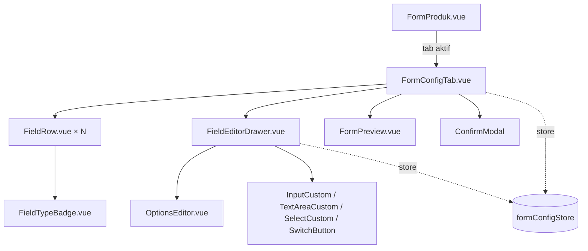

# TDD — Konfigurasi Form Produk (Frontend)

| Field | Value |
|---|---|
| Feature | **Konfigurasi Form Produk** — UI konfigurasi di Saktiform Dashboard + *renderer* dinamis di halaman Checkout |
| Dokumen induk | [PRD — Konfigurasi Form Produk](../prd/produk-form-config.md), [TDD Backend](./produk-form-config.md) |
| Stack (Dashboard) | Vue 3 `<script setup>` + TypeScript, Vite 5, Pinia (Options API `defineStore`), Axios, SCSS utility classes |
| Referensi FE | [architecture.md](../frontend/architecture.md), [component-inventory.md](../frontend/component-inventory.md), [business-modules.md](../frontend/business-modules.md), [ui-flow.md](../frontend/ui-flow.md) |
| Status | Draft for Implementation — **selaras dengan backend yang sudah terimplementasi** |
| Last updated | 2026-07-29 |
| Target pembaca | Frontend Developer (acuan implementasi langsung), Reviewer, QA, Backend |

> Revisi ini menyesuaikan dua keputusan yang berubah setelah backend diimplementasikan:
> **(1)** tipe Custom Field dipersempit menjadi **TEXT, TEXTAREA, SELECT** saja;
> **(2)** konfigurasi form kini dapat dikirim **bersamaan dengan `POST /produk`**, sehingga
> tidak lagi memerlukan produk tersimpan lebih dahulu.
>
> Snippet TypeScript/Vue bersifat **acuan (skeleton)**, bukan kode final.

---

## 0. Ruang Lingkup — Dua Aplikasi Berbeda

Bagian ini wajib dibaca lebih dahulu karena menentukan bagaimana dokumen ini dipakai.

Fitur ini menyentuh **dua aplikasi frontend yang terpisah**:

| # | Aplikasi | Peran | Ketersediaan dalam repositori ini |
|---|---|---|---|
| **A** | **Saktiform Dashboard** (Vue 3 + Vite) | Layar konfigurasi form pada halaman Produk; kartu "Informasi Tambahan" pada Detail Pesanan | **Terdokumentasi** — `docs/frontend/*` memuat arsitektur, inventaris 32 komponen, dan pemetaan API |
| **B** | **Halaman Checkout pelanggan** (`SAKTIFORM_CHECKOUT_URL`) | *Renderer* form dinamis yang dilihat pelanggan; pengiriman `POST /order/create` | **Tidak tersedia** — `docs/frontend/ui-flow.md` §4 menyatakan eksplisit: *"There is no standalone customer-facing checkout page in this dashboard."* |

Konsekuensinya:

- **Bagian I (§1–§14)** membahas Dashboard secara konkret: nama berkas, komponen, props, konvensi — semuanya dapat diverifikasi terhadap dokumentasi frontend yang ada.
- **Bagian II (§15–§18)** membahas *renderer* checkout sebagai **spesifikasi berbasis kontrak**: perilaku, algoritma *render*, pemetaan payload, penanganan galat — tanpa mengasumsikan struktur berkas maupun *framework* aplikasi checkout.

---

## Daftar Isi

**Bagian I — Dashboard**
1. [Konvensi yang Diwarisi](#1-konvensi-yang-diwarisi)
2. [Baseline & Kontrak Backend](#2-baseline--kontrak-backend)
3. [Struktur File](#3-struktur-file)
4. [TypeScript Types](#4-typescript-types)
5. [`formConfigStore.ts`](#5-formconfigstorets)
6. [Dua Mode: Tambah vs Edit Produk](#6-dua-mode-tambah-vs-edit-produk)
7. [Pemetaan API](#7-pemetaan-api)
8. [Celah Komponen: Drag-and-Drop](#8-celah-komponen-drag-and-drop)
9. [Desain Komponen](#9-desain-komponen)
10. [Integrasi ke `FormProduk.vue`](#10-integrasi-ke-formprodukvue)
11. [Validasi Client](#11-validasi-client)
12. [Error, Loading, Empty State](#12-error-loading-empty-state)
13. [Lifecycle & Edge Case](#13-lifecycle--edge-case)
14. [Kartu "Informasi Tambahan" pada Detail Pesanan](#14-kartu-informasi-tambahan-pada-detail-pesanan)

**Bagian II — Checkout Renderer (kontrak)**

15. [Kontrak Renderer](#15-kontrak-renderer)
16. [Registry Tipe Field](#16-registry-tipe-field)
17. [Cascading Lokasi & Ongkir](#17-cascading-lokasi--ongkir)
18. [Payload Submit & Penanganan Galat](#18-payload-submit--penanganan-galat)

**Penutup**

19. [Open Questions](#19-open-questions)
20. [Rencana Implementasi & Checklist QA](#20-rencana-implementasi--checklist-qa)
21. [Appendix — Skeleton](#21-appendix--skeleton)

---

# BAGIAN I — DASHBOARD

## 1. Konvensi yang Diwarisi

| Aspek | Konvensi (dipakai apa adanya) |
|---|---|
| Store | `defineStore('namaStore', { state, getters, actions })` — **Options API**, bukan setup store. Auto-import |
| API helper | `getData(type, url, params)`, `postData(type, url, data)`, `putData(type, url, data)` — argumen pertama selalu `'api_url'`. `errorHelper(err)` |
| Pola action | `try { const res = await getData(...) } catch (err) { alertStore.setAlert(msg, 'danger'); return errorHelper(err) }` |
| Toast | `useAlertStore().setAlert(message, 'success' \| 'danger')` — auto-hide 3 detik |
| Auth/scope | `useAuthStore().user.activeWorkspace.id` → query `workspaceId` |
| Envelope | `{ success, message, data }` |
| Validasi | `validateForm(validation, item, error)` dari `functions/formHelper.ts` |
| State galat field | `fieldInfo = { type: 'info', message: '' }` dari `functions/defaultObject.ts` |
| Modal | `Modal` (container murni — parent merender header & tombol tutup sendiri). `ConfirmModal` (`title`, `action`, `actionVerb`, `visible`, `loading`; emit `closeModal`, `onAction`) |
| Input | `InputCustom`, `TextAreaCustom`, `SelectCustom`, `SwitchButton` |
| Tabs | `TabsWrapper` (`tabs: {title, value}[]`, emit `tabChange`) — presentasional murni |
| Styling | Kelas utilitas SCSS (`.d-flex`, `.m-2-b`, `.fw-bold`, `.fz-px-14`) |
| Ikon | `vue-material-design-icons` |

Dua *gotcha* konvensi yang relevan langsung:

- **`SwitchButton` memakai emit `input`, bukan `update:modelValue`** — tidak dapat dipakai dengan `v-model`. Parent wajib mendengarkan `@input`. Pola ini sudah ada di FormProduk untuk *toggle* visibilitas field.
- **`Modal` adalah container murni** — tidak menyediakan header, tombol tutup, maupun tombol aksi. Semua *drawer* pada fitur ini merendernya sendiri di dalam slot.

---

## 2. Baseline & Kontrak Backend

### 2.1 Yang sudah ada di dashboard

`FormProduk.vue` **sudah memiliki** seksi konfigurasi form: model produk memuat `formConfig — custom checkout form fields`, dan `SwitchButton` tercatat *"Used in: Product form configuration fields (form field visibility toggles)"*.

Jadi ini **penggantian seksi yang sudah ada**, bukan penambahan dari nol. **Langkah pertama implementasi wajib membaca `FormProduk.vue` yang sesungguhnya** untuk memetakan struktur existing — dokumen ini menuliskan desain target, bukan *diff* persis, karena isi berkas tersebut tidak tersedia dalam repositori ini.

### 2.2 Kontrak backend yang sudah terimplementasi & terverifikasi

Bagian ini adalah fakta hasil pengujian terhadap backend yang berjalan, bukan rencana.

| Kontrak | Keadaan |
|---|---|
| Tipe Custom Field | **Hanya `TEXT`, `TEXTAREA`, `SELECT`** |
| Tipe khusus System Field | `PHONE`, `PROVINCE`, `CITY`, `DISTRICT` — tidak boleh dipakai Custom Field, tidak muncul di pemilih tipe |
| System Field | Enam field selalu ada, di-*seed* otomatis oleh server saat produk dibuat |
| `GET /produk/{id}/form-config` | Mengembalikan seluruh field + `usageCount`, `editableAttributes`, `deletable`, `customFieldLimit` |
| `PUT /produk/{id}/form-config` | Semantik **replace**; mendukung penghapusan; wajib memuat keenam System Field |
| `POST /produk` dengan `formConfig` | Semantik **merge** — menambah & memperbarui, **tidak pernah menghapus** |
| `GET /produk/checkout` | Hanya field `isActive`, sudah terurut `sortOrder`, memuat alias `tipeField`/`order`/`isMandatory` |
| `GET /produk/{id}` dan `GET .../form-config` | **Juga memuat alias yang sama.** Sebelum fitur ini, `GET /produk/{id}` mengembalikan `tipeField`/`order`/`isMandatory`; tanpa alias, seksi konfigurasi form pada dashboard lama membaca `undefined` dan tampak seolah konfigurasinya hilang |
| Aturan validasi | Hanya `minLength`, `maxLength`, `pattern` |
| Validasi System Field | Selalu dari definisi server; nilai pada payload diabaikan bila sama, ditolak bila berbeda |
| Daftar galat | Berada pada atribut **`data`**, bukan `errors` |
| Field nonaktif | Tidak muncul pada `GET /produk/checkout` (terverifikasi) |

### 2.3 Toleransi payload lama

Backend menerima bentuk payload lama tanpa perubahan di sisi klien:

| Atribut lama | Dipetakan ke |
|---|---|
| `tipeField` | `fieldType` |
| `order` | `sortOrder` |
| `isMandatory` | `isRequired` |
| nilai tipe huruf kecil (`"text"`, `"dropdown"`) | dinormalkan otomatis |
| `fieldCategory` tidak dikirim | disimpulkan dari kecocokan label |

Artinya migrasi frontend dapat bertahap: kode lama tetap berfungsi selama masa transisi. Klien baru **wajib** memakai penamaan baru.

---

## 3. Struktur File

```
src/modules/produk/
├── components/
│   ├── FormProduk.vue                    # (ubah) seksi form config → <FormConfigTab>
│   ├── ListProduk.vue                    # (tidak berubah)
│   └── form-config/                      # (baru)
│       ├── FormConfigTab.vue             # kontainer: 2 seksi + preview + simpan
│       ├── FieldRow.vue                  # satu baris field (urutan, badge, aksi)
│       ├── FieldEditorDrawer.vue         # panel editor atribut field
│       ├── OptionsEditor.vue             # editor daftar pilihan (SELECT)
│       ├── FormPreview.vue               # pratinjau form hasil konfigurasi
│       └── FieldTypeBadge.vue            # badge tipe + ikon gembok
├── stores/
│   ├── produkStore.ts                    # (ubah) kirim formConfig saat mode Tambah
│   └── formConfigStore.ts                # (baru)
├── types/
│   └── formConfig.ts                     # (baru)
└── utils/
    ├── fieldTypeMeta.ts                  # (baru) metadata per tipe field
    └── systemFieldDefaults.ts            # (baru) definisi 6 System Field untuk mode Tambah

src/modules/pesanan/components/
└── ModalDetailPesanan.vue                # (ubah) kartu "Informasi Tambahan"
```

Tidak ada berkas baru di `src/pages/` dan tidak ada blok `<route>` baru — seluruh UI hidup di dalam halaman Produk yang sudah ada.

Perlu dicatat dua berkas yang **tidak lagi diperlukan** dibanding revisi sebelumnya: `CheckboxGroup.vue` (tipe `CHECKBOX` dihapus dari cakupan) dan `ValidationRuleEditor.vue` (aturan validasi menyusut menjadi dua input panjang teks, cukup diletakkan langsung di dalam drawer).

---

## 4. TypeScript Types

Berkas baru `src/modules/produk/types/formConfig.ts`:

```ts
export type FieldCategory = 'SYSTEM' | 'CUSTOM'

/** Tipe yang boleh dipilih untuk Custom Field. */
export type CustomFieldType = 'TEXT' | 'TEXTAREA' | 'SELECT'

/** Tipe khusus System Field — hanya untuk render, tidak pernah dipilih pengguna. */
export type SystemFieldType = 'PHONE' | 'PROVINCE' | 'CITY' | 'DISTRICT'

export type FormFieldType = CustomFieldType | SystemFieldType

export interface FieldOption {
  label: string
  value: string
}

/** Hanya tiga aturan yang relevan untuk TEXT / TEXTAREA / SELECT. */
export interface ValidationRule {
  minLength?: number
  maxLength?: number
  /** Tidak diekspos di UI — lihat §9.4. */
  pattern?: string
}

/** Item pada GET /produk/{id}/form-config */
export interface FormFieldConfig {
  fieldKey: string
  fieldCategory: FieldCategory
  fieldType: FormFieldType
  label: string
  placeholder: string | null
  helpText: string | null
  isRequired: boolean
  isActive: boolean
  defaultValue: string | null
  options: FieldOption[] | null
  sortOrder: number
  validation: ValidationRule | null
  dataSource: string | null
  usageCount: number | null           // null bila backend gagal menghitung
  editableAttributes: string[]        // KONTRAK IZIN — jangan disimpulkan sendiri
  deletable: boolean

  // Alias kompatibilitas — ada pada respons, tetapi klien BARU jangan memakainya.
  // Disediakan agar dashboard versi lama tetap dapat membaca respons.
  tipeField?: string
  order?: number
  isMandatory?: boolean
}

export interface FormConfigResponse {
  idProduk: string
  namaProduk: string
  totalField: number
  totalCustomFieldActive: number
  customFieldLimit: number
  fields: FormFieldConfig[]
}

/** Item payload — dipakai pada POST /produk maupun PUT .../form-config */
export interface FormFieldRequest {
  fieldKey?: string                   // kosong = field baru; server membangkitkan
  fieldCategory?: FieldCategory       // opsional pada POST /produk
  fieldType?: FormFieldType           // wajib untuk CUSTOM
  label: string
  placeholder?: string | null
  helpText?: string | null
  isRequired?: boolean
  isActive?: boolean
  defaultValue?: string | null
  options?: FieldOption[] | null
  validation?: ValidationRule | null
  sortOrder?: number
}

export interface FormConfigSaveResponse {
  idProduk: string
  totalField: number
  created: string[]
  updated: string[]
  deleted: string[]
  fields: FormFieldConfig[]
}

/** Bentuk galat dari backend */
export interface ApiFieldError {
  field: string
  message: string
  code?: string
  meta?: Record<string, any>
}

/** State lokal editor — FormFieldConfig + penanda UI */
export interface EditableField extends FormFieldConfig {
  _localId: string      // identitas stabil untuk v-for; field baru belum punya fieldKey
  _isNew: boolean
  _dirty: boolean
}
```

Tiga catatan tipe yang penting:

**`_localId`.** Field baru belum memiliki `fieldKey` (dibangkitkan server). Memakai indeks larik sebagai `:key` pada `v-for` akan merusak *state* komponen anak saat urutan berubah — persis yang terjadi saat menyusun ulang. Diisi `crypto.randomUUID()` dan tidak pernah dikirim ke server.

**`editableAttributes` adalah kontrak, bukan saran.** Frontend **dilarang** menulis `field.fieldCategory === 'SYSTEM' ? disabled : enabled`. Aturan mana yang terkunci adalah milik backend dan dapat berkembang. Pemeriksaan yang benar: `!field.editableAttributes.includes('isRequired')`.

Perlu dicatat satu perilaku backend yang nyata: untuk Custom Field dengan `usageCount > 0`, `fieldType` **dikeluarkan** dari `editableAttributes`. Mengubah tipe field yang sudah punya data historis akan membuat nilai lama tidak dapat dirender dengan benar. Frontend cukup mematuhi daftar; tidak perlu menduplikasi aturannya.

**`usageCount` dapat `null`.** Backend menurunkan kualitas secara anggun bila agregasi gagal. UI menampilkan `—`, bukan `0` — `0` bermakna "belum pernah dipakai" dan mengizinkan penghapusan.

---

## 5. `formConfigStore.ts`

Store terpisah dari `produkStore`, karena daur hidupnya berbeda antara mode Tambah dan Edit (§6).

```ts
import type {
  FormFieldConfig, FormConfigResponse, FormConfigSaveResponse,
  FormFieldRequest, EditableField, ApiFieldError, CustomFieldType,
} from '../types/formConfig'
import { SYSTEM_FIELD_DEFAULTS } from '../utils/systemFieldDefaults'
import { needsOptions, CUSTOM_EDITABLE } from '../utils/fieldTypeMeta'

export const useFormConfigStore = defineStore('formConfigStore', {
  state: () => ({
    loading: false,
    saving: false,
    /** '' saat mode Tambah (produk belum punya id) */
    idProduk: '' as string,
    customFieldLimit: 50,
    fields: [] as EditableField[],
    /** salinan bersih hasil fetch terakhir — untuk deteksi perubahan */
    pristine: '' as string,
    /** galat per _localId, hasil pemetaan respons 400 */
    fieldErrors: {} as Record<string, ApiFieldError[]>,
    formError: '' as string,
  }),

  getters: {
    systemFields: (s) => s.fields.filter(f => f.fieldCategory === 'SYSTEM'),
    customFields: (s) => s.fields.filter(f => f.fieldCategory === 'CUSTOM'),
    activeCustomCount: (s) =>
      s.fields.filter(f => f.fieldCategory === 'CUSTOM' && f.isActive).length,
    canAddCustomField(): boolean {
      return this.activeCustomCount < this.customFieldLimit
    },
    isDirty(): boolean {
      return this.pristine !== JSON.stringify(this.toPayloadFull())
    },
  },

  actions: {
    /** Mode Tambah: susun state awal secara lokal, tanpa memanggil API. */
    initForCreate() {
      this.idProduk = ''
      this.fields = SYSTEM_FIELD_DEFAULTS.map(toEditableSystemDefault)
      this.pristine = JSON.stringify(this.toPayloadFull())
      this.fieldErrors = {}
      this.formError = ''
    },

    /** Mode Edit: muat dari server. */
    async onGetFormConfig(idProduk: string) {
      const alertStore = useAlertStore()
      const authStore = useAuthStore()
      this.loading = true
      try {
        const res = await getData('api_url', `/produk/${idProduk}/form-config`, {
          workspaceId: authStore.user.activeWorkspace.id,
        })
        const data = res.data.data as FormConfigResponse
        this.idProduk = data.idProduk
        this.customFieldLimit = data.customFieldLimit ?? 50
        this.fields = data.fields.map(toEditable)
        this.pristine = JSON.stringify(this.toPayloadFull())
        this.fieldErrors = {}
        this.formError = ''
        return data
      } catch (err: any) {
        alertStore.setAlert(errMsg(err), 'danger')
        return errorHelper(err)
      } finally {
        this.loading = false
      }
    },

    /** Mode Edit: simpan penuh (mendukung penghapusan). */
    async onSaveFormConfig() {
      const alertStore = useAlertStore()
      const authStore = useAuthStore()
      this.saving = true
      this.fieldErrors = {}
      this.formError = ''
      try {
        const res = await putData(
          'api_url',
          `/produk/${this.idProduk}/form-config?workspaceId=${authStore.user.activeWorkspace.id}`,
          { fields: this.toPayloadFull() },
        )
        const data = res.data.data as FormConfigSaveResponse
        // fieldKey field baru datang dari server — sinkronkan, jangan menebak
        this.fields = data.fields.map(toEditable)
        this.pristine = JSON.stringify(this.toPayloadFull())
        alertStore.setAlert('Konfigurasi form berhasil disimpan', 'success')
        return data
      } catch (err: any) {
        this.applyServerErrors(err)
        alertStore.setAlert(errMsg(err), 'danger')
        return errorHelper(err)
      } finally {
        this.saving = false
      }
    },

    // ── Penyusunan payload ───────────────────────────────────────────────

    /** Daftar lengkap — dipakai PUT (replace) dan deteksi perubahan. */
    toPayloadFull(): FormFieldRequest[] {
      return this.fields.map((f, i) => buildRequest(f, i + 1))
    },

    /**
     * Payload ringkas untuk POST /produk (merge).
     * Hanya mengirim Custom Field dan System Field yang benar-benar diubah —
     * sisanya dibiarkan memakai nilai bawaan hasil seeding server.
     */
    toPayloadMerge(): FormFieldRequest[] {
      const out: FormFieldRequest[] = []
      this.fields.forEach((f, i) => {
        if (f.fieldCategory === 'CUSTOM' || isSystemFieldModified(f)) {
          out.push(buildRequest(f, i + 1))
        }
      })
      return out
    },

    // ── Mutasi ───────────────────────────────────────────────────────────

    addCustomField(fieldType: CustomFieldType) {
      this.fields.push({
        _localId: crypto.randomUUID(),
        _isNew: true,
        _dirty: true,
        fieldKey: '',
        fieldCategory: 'CUSTOM',
        fieldType,
        label: '',
        placeholder: null,
        helpText: null,
        isRequired: false,
        isActive: true,
        defaultValue: null,
        options: needsOptions(fieldType) ? [] : null,
        sortOrder: this.fields.length + 1,
        validation: null,
        dataSource: null,
        usageCount: 0,
        editableAttributes: CUSTOM_EDITABLE,
        deletable: true,
      })
    },

    removeField(localId: string) {
      const i = this.fields.findIndex(f => f._localId === localId)
      if (i >= 0) this.fields.splice(i, 1)
    },

    reorder(from: number, to: number) {
      const [moved] = this.fields.splice(from, 1)
      this.fields.splice(to, 0, moved)
      this.fields.forEach((f, i) => { f.sortOrder = i + 1 })
    },

    // ── Galat ────────────────────────────────────────────────────────────

    applyServerErrors(err: any) {
      const payload = err?.response?.data
      // RestResponse.data dipakai untuk muatan sukses maupun daftar galat —
      // periksa bentuknya sebelum memperlakukannya sebagai galat.
      const list: ApiFieldError[] = Array.isArray(payload?.data) ? payload.data : []
      if (!list.length) { this.formError = errMsg(err); return }

      const byField: Record<string, ApiFieldError[]> = {}
      for (const e of list) {
        const key = this.resolveErrorTarget(e.field)
        if (!key) { this.formError = e.message; continue }
        ;(byField[key] ||= []).push(e)
      }
      this.fieldErrors = byField
    },

    /** `field` bisa berupa fieldKey (`ukuran_baju`) atau path (`fields[3].isRequired`). */
    resolveErrorTarget(field: string): string | null {
      const m = field?.match(/^fields\[(\d+)\]/)
      if (m) return this.fields[Number(m[1])]?._localId ?? null
      return this.fields.find(f => f.fieldKey === field)?._localId ?? null
    },

    reset() { this.$reset() },
  },
})

function buildRequest(f: EditableField, sortOrder: number): FormFieldRequest {
  const base: FormFieldRequest = {
    fieldCategory: f.fieldCategory,
    label: f.label,
    placeholder: f.placeholder,
    helpText: f.helpText,
    sortOrder,
  }
  if (f.fieldKey) base.fieldKey = f.fieldKey
  if (f.fieldCategory === 'CUSTOM') {
    base.fieldType = f.fieldType
    base.isRequired = f.isRequired
    base.isActive = f.isActive
    base.defaultValue = f.defaultValue
    base.options = f.options
    base.validation = f.validation
  }
  return base
}
```

Empat keputusan desain store:

**Satu larik `fields`, bukan dua.** Meskipun UI menampilkan dua seksi, *state* menyimpan satu larik terurut — `sortOrder` berlaku dalam satu ruang bersama dan Custom Field dapat ditempatkan di antara System Field. `systemFields`/`customFields` disediakan sebagai *getter* tampilan.

**Atribut terkunci System Field tidak pernah dikirim.** `buildRequest` hanya menyertakan `fieldType`, `isRequired`, `isActive`, `options`, `defaultValue`, dan `validation` untuk kategori CUSTOM. Backend memakai pola "abaikan bila sama, tolak bila berbeda" — tidak mengirimnya adalah jalur teraman dan menghilangkan seluruh kelas galat `SYSTEM_FIELD_IMMUTABLE_ATTRIBUTE` yang timbul dari *round-trip* biasa.

**`sortOrder` diisi dari indeks larik, bukan dari `f.sortOrder`.** Urutan larik adalah kebenaran; mengirim nilai yang mungkin basi hanya menambah peluang inkonsistensi. Backend menormalkan ulang menjadi 1..N.

**Sinkronisasi dari respons `PUT`.** Server mengembalikan `fields` lengkap termasuk `fieldKey` yang baru dibangkitkan. Menyalinnya kembali menghindari `GET` ulang sekaligus menjamin kunci field baru tersedia untuk operasi berikutnya.

---

## 6. Dua Mode: Tambah vs Edit Produk

Ini perubahan terbesar dibanding revisi sebelumnya. Karena `POST /produk` kini menerima `formConfig`, **pengguna dapat menyusun form sebelum produk tersimpan** — batasan "simpan produk dulu" sudah tidak berlaku.

| Aspek | Mode **Tambah Produk** | Mode **Edit Produk** |
|---|---|---|
| Sumber state awal | `initForCreate()` — konstanta lokal, tanpa API | `onGetFormConfig(id)` |
| Cara menyimpan | Ikut payload `POST /produk` (`toPayloadMerge()`) | `PUT .../form-config` (`toPayloadFull()`) |
| Semantik | **Merge** — menambah & memperbarui | **Replace** — mendukung penghapusan |
| Dapat menghapus field? | Tidak perlu (belum ada field tersimpan) | Ya, dengan guard server |
| `usageCount` / `deletable` | Sintetis: `0` / `true` untuk Custom Field | Dari server |
| Tombol simpan | Satu — "Simpan Produk" | Dua — lihat §10.2 |

### 6.1 Mengapa payload merge hanya mengirim yang berubah

`toPayloadMerge()` sengaja **tidak** mengirim keenam System Field bila pengguna tidak menyentuhnya. Server akan melakukan seeding dengan label bawaan, dan semantik merge menjamin field yang tidak disebut tetap utuh.

Manfaatnya: frontend tidak perlu menjadi otoritas atas label bawaan System Field. Konstanta `SYSTEM_FIELD_DEFAULTS` hanya dipakai untuk **menampilkan** field tersebut di editor sebelum produk tersimpan — bukan untuk menentukan nilainya di basis data.

```ts
/** System Field dianggap "diubah" bila pengguna menyentuh atribut yang boleh diubah. */
function isSystemFieldModified(f: EditableField): boolean {
  const d = SYSTEM_FIELD_DEFAULTS.find(s => s.fieldKey === f.fieldKey)
  if (!d) return true
  return f.label !== d.label
      || (f.placeholder ?? '') !== (d.placeholder ?? '')
      || (f.helpText ?? '') !== ''
}
```

Perlu dicatat: pengurutan tetap terkirim benar meskipun sebagian System Field tidak disertakan, karena `buildRequest` mengisi `sortOrder` dari posisi pada larik penuh — bukan dari posisi pada payload ringkas. Backend menghormati `sortOrder` eksplisit dan menempatkan field yang tidak disebut menurut urutannya saat ini.

### 6.2 Transisi setelah produk tersimpan

```
Tambah Produk → isi form + susun konfigurasi → [Simpan Produk]
  → POST /produk { ..., formConfig: toPayloadMerge() }
  → sukses → router.replace(`/produk/${idBaru}`)
  → mode Edit → onGetFormConfig(idBaru)   // state disegarkan dari server
```

Penyegaran dari server setelah transisi bersifat wajib: `fieldKey` Custom Field baru dibangkitkan server melalui *slugify*, dan client tidak boleh menebaknya.

### 6.3 Perubahan `produkStore.ts`

| # | Perubahan |
|---|---|
| 1 | Pada **mode Tambah**, sertakan `formConfig: formConfigStore.toPayloadMerge()` di payload `POST /produk` |
| 2 | Pada **mode Edit**, **jangan** sertakan `formConfig` sama sekali — konfigurasi dikelola `PUT`. Backend memperlakukan `null`/`[]` sebagai "tidak ada perubahan" |
| 3 | Tipe `formConfig` pada model produk berubah menjadi `FormFieldRequest[]` |
| 4 | Pada `onShow` (detail produk), abaikan `formConfig` dari `GET /produk/{id}` — `FormConfigTab` memuat sendiri |
| 5 | Setelah produk baru tersimpan, panggil `formConfigStore.onGetFormConfig(idBaru)` |

Butir 2 penting: mengirim `formConfig` pada mode Edit akan menerapkan semantik merge yang **tidak dapat menghapus**, sehingga field yang baru saja dihapus pengguna akan hidup kembali. Gunakan `PUT` untuk mode Edit, titik.

---

## 7. Pemetaan API

| Aksi | Method | URL | Body | Store action |
|---|---|---|---|---|
| Buat produk + konfigurasi | `POST` | `/produk` | `{ ..., formConfig: FormFieldRequest[] }` | `produkStore.onStore` |
| Muat konfigurasi | `GET` | `/produk/{id}/form-config?workspaceId=` | — | `formConfigStore.onGetFormConfig` |
| Simpan konfigurasi | `PUT` | `/produk/{id}/form-config?workspaceId=` | `{ fields: FormFieldRequest[] }` | `formConfigStore.onSaveFormConfig` |

Bentuk respons galat — daftar `ErrorDto` berada pada atribut **`data`**:

```jsonc
// 400
{
  "success": false,
  "message": "Validation failed",
  "data": [
    { "field": "instagram", "code": "FIELD_IN_USE",
      "message": "Field 'Akun Instagram' sudah dipakai oleh 312 pesanan…",
      "meta": { "usageCount": 312, "suggestedAction": "DEACTIVATE" } }
  ]
}
```

`errMsg(err)` mengikuti konvensi dashboard: `err.response?.data?.message || 'Jaringan Bermasalah'`.

---

## 8. Celah Komponen: Drag-and-Drop

*Tech stack* tidak memuat pustaka *drag & drop*, sementara menyusun ulang urutan field adalah kebutuhan Must (US-4).

| Opsi | Bundel | Konsekuensi |
|---|---|---|
| **A — tombol naik/turun (▲▼)** (dipilih) | 0 KB | Tanpa dependensi baru; dapat diakses keyboard secara alami; lebih lambat untuk menyusun banyak field |
| B — `vuedraggable` (SortableJS) | ± 45 KB | Pengalaman terbaik; menambah dependensi; perlu penanganan aksesibilitas keyboard tersendiri |

Keputusan: **mulai dengan opsi A**, naikkan ke B bila umpan balik menunjukkan penyusunan ulang terasa memberatkan. Jumlah field per produk umumnya kecil — enam System Field ditambah segelintir Custom Field — sehingga jarak tempuh penyusunan ulang pendek. Menambah 45 KB untuk interaksi yang jarang dipakai sulit dibenarkan di awal.

Antarmuka `reorder(from, to)` pada store sengaja netral terhadap mekanisme, sehingga peralihan A → B kelak tidak menyentuh store — hanya `FieldRow`/`FormConfigTab`. Bila opsi B dipilih, `:key` pada `v-for` **wajib** memakai `_localId`, bukan indeks.

> Revisi sebelumnya juga mencatat ketiadaan komponen checkbox sebagai celah. Dengan tipe `CHECKBOX` dihapus dari cakupan, celah itu **tidak lagi ada** — inventaris komponen existing sudah memadai untuk ketiga tipe yang didukung.

---

## 9. Desain Komponen

### 9.1 Peta Komponen



### 9.2 `FormConfigTab.vue`

Kontainer utama; satu-satunya komponen yang berbicara langsung dengan store.

```ts
// props
{ idProduk: string | null }    // null = mode Tambah
```

| # | Tanggung jawab |
|---|---|
| 1 | `onMounted`: `idProduk` ada → `onGetFormConfig(idProduk)`; kosong → `initForCreate()` |
| 2 | Merender dua seksi (Bawaan Sistem / Tambahan) dari *getter* |
| 3 | Menampilkan pencacah `{{ activeCustomCount }} / {{ customFieldLimit }}` |
| 4 | Menonaktifkan "+ Tambah Field" ketika `!canAddCustomField` |
| 5 | Membuka `FieldEditorDrawer` dengan `_localId` terpilih |
| 6 | Aksi hapus → `ConfirmModal`; bila `!deletable`, tawarkan "Nonaktifkan" |
| 7 | Menampilkan/menyembunyikan `FormPreview` |
| 8 | Mode Edit: tombol "Simpan Konfigurasi" → `onSaveFormConfig()`. Mode Tambah: tombol disembunyikan (ikut "Simpan Produk") |
| 9 | Guard `onBeforeRouteLeave` bila `isDirty` |

Nomor urut pada tiap baris **berasal dari posisi di larik gabungan**, bukan dari posisi dalam seksinya:

```ts
const orderOf = (localId: string) =>
  store.fields.findIndex(f => f._localId === localId) + 1
```

Inilah yang menghasilkan tampilan pada mockup PRD §14.1 — System Field bernomor 1, 4–8 sementara Custom Field bernomor 2 dan 3. Nomor per-seksi akan menyesatkan karena tidak mencerminkan urutan render sesungguhnya.

### 9.3 `FieldRow.vue`

```ts
// props
{ field: EditableField; index: number; total: number; errors?: ApiFieldError[] }
// emits: 'edit' | 'delete' | 'deactivate' | 'move-up' | 'move-down'
```

| Elemen | Aturan |
|---|---|
| Ikon 🔒 | Bila `fieldCategory === 'SYSTEM'` — indikator visual |
| Badge tipe | `FieldTypeBadge` menampilkan label ramah (`Teks Singkat`, `Teks Panjang`, `Pilihan`), bukan nama enum |
| Badge wajib | "Wajib" / "Opsional" dari `isRequired` |
| Badge status | "Nonaktif" hanya bila `!isActive` — tidak perlu badge "Aktif" |
| Tombol Ubah | Selalu tampil |
| Tombol Hapus (🗑) | Bila `deletable === true` |
| Tombol Nonaktifkan (🚫) | Bila `!deletable && fieldCategory === 'CUSTOM'` |
| Keterangan pemakaian | `usageCount > 0` → "N pesanan memakai field ini — tidak dapat dihapus permanen"; `=== 0` → "belum dipakai"; `=== null` → tidak ditampilkan |
| Penanda galat | Border merah + daftar pesan bila `errors?.length` |
| ▲▼ | Nonaktif pada posisi pertama/terakhir |

### 9.4 `FieldEditorDrawer.vue`

Panel geser berbasis `Modal` (`size="medium"`). Karena `Modal` container murni, komponen ini merender sendiri header, tombol tutup, dan tombol aksi.

Perubahan diterapkan pada **salinan lokal**, sehingga "Batal" benar-benar membatalkan:

```ts
const draft = ref<EditableField | null>(null)

watch(() => props.localId, (id) => {
  const src = store.fields.find(f => f._localId === id)
  draft.value = src ? JSON.parse(JSON.stringify(src)) : null
}, { immediate: true })

function apply() {
  if (!validateDraft()) return
  const i = store.fields.findIndex(f => f._localId === draft.value!._localId)
  if (i >= 0) store.fields[i] = { ...draft.value!, _dirty: true }
  emit('close')
}
```

**Penentuan kontrol yang dinonaktifkan** — inti dari kontrak izin:

```ts
const can = (attr: string) => draft.value?.editableAttributes?.includes(attr) ?? false
```

```vue
<InputCustom    v-model="draft.label"       :disabled="!can('label')"       label="Label" required />
<InputCustom    v-model="draft.placeholder" :disabled="!can('placeholder')" label="Placeholder" />
<TextAreaCustom v-model="draft.helpText"    :disabled="!can('helpText')"    label="Help Text" />

<SelectCustom
  v-if="draft.fieldCategory === 'CUSTOM'"
  :list="selectableFieldTypes"
  v-model="draft.fieldType"
  :disabled="!can('fieldType')"
  label="Tipe Field" required
/>

<SwitchButton :value="draft.isRequired" label="Wajib Diisi"
              :disabled="!can('isRequired')" @input="draft.isRequired = $event" />
<SwitchButton :value="draft.isActive"   label="Aktif"
              :disabled="!can('isActive')"   @input="draft.isActive = $event" />

<!-- hanya untuk SELECT -->
<OptionsEditor v-if="needsOptions(draft.fieldType)"
               v-model="draft.options" :max-options="100" :disabled="!can('options')" />

<!-- hanya untuk TEXT / TEXTAREA -->
<template v-if="draft.fieldType === 'TEXT' || draft.fieldType === 'TEXTAREA'">
  <InputCustom type="number" v-model="draft.validation.minLength" label="Panjang Minimum" />
  <InputCustom type="number" v-model="draft.validation.maxLength" label="Panjang Maksimum" />
</template>
```

`SwitchButton` memakai `:value` + `@input`, **bukan** `v-model` — komponen ini mengemisikan `input` (§1).

Untuk System Field, panel menampilkan `fieldKey`, tipe, wajib, dan status sebagai **teks baca-saja** disertai ikon 🔒, bukan kontrol *disabled*. Kontrol *disabled* mengesankan "bisa diaktifkan"; teks baca-saja menyampaikan "ini memang bukan sesuatu yang Anda ubah".

`selectableFieldTypes` **hanya** memuat tiga tipe: `TEXT`, `TEXTAREA`, `SELECT`. Empat tipe khusus System (`PHONE`, `PROVINCE`, `CITY`, `DISTRICT`) tidak pernah muncul di pemilih.

Ketika `fieldType` berubah dari/ke `SELECT`, `draft.options` di-*reset* (`[]` ↔ `null`). Tanpa itu, payload membawa `options` untuk tipe `TEXT` dan ditolak `OPTIONS_NOT_ALLOWED_FOR_TYPE`. Bila `options` sudah terisi, tampilkan konfirmasi sebelum mengosongkan.

**`pattern` tidak diekspos di UI.** Pengguna dashboard adalah pemilik toko, bukan pengembang; kolom regex akan lebih sering menghasilkan form yang menolak input sah daripada menyelesaikan masalah nyata. Backend tetap menerima dan memvalidasinya (termasuk pemeriksaan ReDoS) untuk keperluan integrasi mendatang.

### 9.5 `OptionsEditor.vue`

```ts
// props
{ modelValue: FieldOption[]; disabled?: boolean; maxOptions: number }
// emits: 'update:modelValue'
```

| Perilaku | Ketentuan |
|---|---|
| Baris | `label` dan `value` sebagai dua `InputCustom` berdampingan |
| Auto-fill `value` | Saat `label` diketik dan `value` masih kosong, `value` diisi otomatis. Berhenti setelah pengguna menyunting `value` manual |
| Tambah | Tombol "+ Tambah Pilihan", nonaktif pada `maxOptions` (100 untuk `SELECT`) |
| Hapus | Ikon 🗑 per baris; minimal satu baris wajib tersisa |
| Urutan | Tombol ▲▼ — urutan `options` menentukan urutan render pada checkout |
| Validasi inline | `value` duplikat (case-insensitive) ditandai merah seketika |
| `:key` | Id lokal per baris, **bukan** indeks |

Auto-fill `value` dari `label` layak dijelaskan: pengguna non-teknis tidak memahami perbedaan keduanya, dan memaksa mengisi dua kolom untuk setiap pilihan adalah gesekan yang tidak perlu. `value` tetap dapat disunting karena nilainya yang tersimpan pada `order_custom_field.field_value` dan muncul pada laporan.

### 9.6 `FormPreview.vue`

Merender form dari `store.fields` yang `isActive`, terurut, sebagai *dry run* visual (US-12).

| Ketentuan | Alasan |
|---|---|
| Hanya field `isActive` | Mencerminkan apa yang benar-benar dilihat pelanggan |
| Field lokasi dirender `SelectCustom` **kosong & nonaktif** dengan placeholder | Pratinjau tidak boleh memanggil `/location/*`; ia menampilkan bentuk, bukan data |
| Seluruh input `disabled` | Pratinjau bukan form yang dapat diisi |
| Tanda `*` pada field wajib, `helpText` di bawah input | Konsisten dengan checkout |

Pratinjau **tidak** menjamin paritas piksel dengan halaman checkout — keduanya aplikasi berbeda dengan sistem styling berbeda. Wajib disampaikan lewat satu baris keterangan agar perbedaan tampilan tidak dilaporkan sebagai bug.

---

## 10. Integrasi ke `FormProduk.vue`

### 10.1 Penempatan

Konfigurasi form menjadi **tab** melalui `TabsWrapper`, sejajar tab existing:

```vue
<TabsWrapper :tabs="produkTabs" @tab-change="activeTab = $event.value" />

<section v-show="activeTab === 'informasi'">…existing…</section>
<section v-show="activeTab === 'form-config'">
  <FormConfigTab :id-produk="produkId || null" />
</section>
```

`v-show`, bukan `v-if` — agar *state* editor tidak hilang saat berpindah tab. Ini penting terutama pada mode Tambah, di mana konfigurasi belum tersimpan di mana pun.

Bila `FormProduk.vue` existing ternyata memakai seksi menerus alih-alih `TabsWrapper`, `FormConfigTab` ditempatkan sebagai satu seksi pada posisi seksi form config existing. Struktur sesungguhnya wajib diperiksa lebih dahulu (§2.1).

### 10.2 Tombol Simpan

| Mode | Tombol | Cakupan |
|---|---|---|
| **Tambah** | **Simpan Produk** (satu tombol) | Data produk **beserta** konfigurasi form, dalam satu permintaan |
| **Edit** | **Simpan Produk** | Data produk saja — `formConfig` tidak dikirim |
| **Edit** | **Simpan Konfigurasi** (di dalam tab) | Konfigurasi form saja, via `PUT` |

Mode Tambah menjadi jauh lebih sederhana dibanding revisi sebelumnya: satu tombol, satu permintaan, tanpa dialog konfirmasi apa pun.

Untuk mode Edit, agar pemisahan dua tombol tidak membingungkan:

- Tombol "Simpan Konfigurasi" nonaktif ketika `!isDirty`.
- Ketika `isDirty`, judul tab "Konfigurasi Form" menampilkan titik penanda (•).
- Menekan "Simpan Produk" saat konfigurasi masih `isDirty` memunculkan `ConfirmModal`: *"Perubahan konfigurasi form belum disimpan dan tidak ikut tersimpan oleh tombol ini. Simpan konfigurasi sekarang?"* — dengan pilihan Simpan keduanya / Simpan produk saja / Batal.

### 10.3 Guard Navigasi

```ts
onBeforeRouteLeave((to, from, next) => {
  if (!store.isDirty) return next()
  confirmLeave.value = true
  pendingNav.value = next
})
```

Berlaku pada kedua mode. Pada mode Tambah, meninggalkan halaman berarti kehilangan seluruh konfigurasi yang baru disusun — belum ada apa pun di server.

---

## 11. Validasi Client

### 11.1 Prinsip

Validasi client adalah **umpan balik UX, bukan otoritas**. Backend memvalidasi ulang seluruhnya. Tujuannya hanya satu: menghindari perjalanan bolak-balik ke server untuk kesalahan yang jelas.

Konsekuensi praktis: **jangan menduplikasi seluruh aturan backend**. Duplikasi yang tidak lengkap lebih berbahaya daripada tidak ada duplikasi, karena menciptakan ilusi bahwa payload sudah pasti valid.

### 11.2 Aturan yang Divalidasi di Client

Memakai `validateForm` dari `functions/formHelper.ts` dengan bentuk `fieldInfo` dari `functions/defaultObject.ts`.

| Aturan | Kapan | Pesan |
|---|---|---|
| `label` wajib, 1–150 karakter | Saat "Terapkan" pada drawer | "Label field wajib diisi." |
| `placeholder` maks 200 | Idem | "Placeholder maksimum 200 karakter." |
| `helpText` maks 300 | Idem | "Help text maksimum 300 karakter." |
| `fieldType` wajib (CUSTOM) | Idem | "Tipe field wajib dipilih." |
| `options` minimal 1 untuk `SELECT` | Idem | "Minimal satu pilihan wajib diisi." |
| `option.label` & `option.value` wajib | Inline per baris | "Label dan nilai pilihan wajib diisi." |
| `option.value` unik (case-insensitive) | Inline per baris | "Nilai pilihan tidak boleh sama." |
| `options` ≤ 100 | Saat menambah | Tombol tambah dinonaktifkan |
| `minLength ≤ maxLength` | Saat "Terapkan" | "Panjang minimum tidak boleh lebih besar dari maksimum." |
| `maxLength` ≤ 500 (TEXT) / 2000 (TEXTAREA) | Idem | "Panjang maksimum untuk tipe ini adalah N." |
| `defaultValue` termasuk `options` | Idem | "Nilai bawaan harus salah satu pilihan yang tersedia." |
| Jumlah Custom Field aktif ≤ `customFieldLimit` | Saat menambah | Tombol "+ Tambah Field" dinonaktifkan + tooltip |

### 11.3 Yang Sengaja TIDAK Divalidasi di Client

| Aturan | Alasan |
|---|---|
| Keunikan `fieldKey` | Dibangkitkan server; client tidak dapat memprediksi hasil *slugify* maupun penyelesaian tabrakan |
| Kata terlarang (`RESERVED_FIELD_KEY`) | Idem |
| `usageCount` untuk penghapusan | Nilai dapat berubah sejak konfigurasi dimuat; keputusan wajib dari server saat penyimpanan |
| Atribut terkunci System Field | Kontrol sudah dinonaktifkan berdasarkan `editableAttributes`, dan atributnya tidak pernah dikirim (§5) |

Baris ketiga penting: UI menampilkan afordans hapus berdasarkan `deletable` yang dimuat saat `GET`. Bila sebuah pesanan masuk di antara `GET` dan `PUT`, server menolak dengan `FIELD_IN_USE` — dan itu perilaku yang benar. UI menanganinya sebagai galat yang dapat dipulihkan (§12.3), bukan sebagai kegagalan.

---

## 12. Error, Loading, Empty State

### 12.1 Loading

| Keadaan | Tampilan |
|---|---|
| `loading` (mode Edit) | Skeleton delapan baris memakai `.skeleton` SCSS existing |
| `saving` | Tombol dalam keadaan `loading`; seluruh baris field nonaktif |
| Mode Tambah | Tidak ada loading — state disusun lokal secara instan |

### 12.2 Pemetaan Kode Galat ke Perilaku UI

Frontend **wajib** bercabang atas `code`, bukan atas teks `message` — `code` stabil, `message` dapat berubah redaksinya.

| `code` | Perilaku UI |
|---|---|
| `SYSTEM_FIELD_NOT_DELETABLE` | Muat ulang konfigurasi + dialog penjelasan. Indikasi *state* client menyimpang |
| `SYSTEM_FIELD_IMMUTABLE_ATTRIBUTE` | Muat ulang konfigurasi. Seharusnya tidak terjadi karena atribut terkunci tidak dikirim — bila muncul, ada bug client |
| `UNKNOWN_SYSTEM_FIELD` | Muat ulang konfigurasi (client kedaluwarsa) |
| `FIELD_IN_USE` | Dialog dengan tombol **"Nonaktifkan"** yang menerapkan `isActive = false` lalu menyimpan ulang. Tampilkan `meta.usageCount` |
| `CUSTOM_FIELD_LIMIT_EXCEEDED` | Galat tingkat form + nonaktifkan tombol tambah |
| `DUPLICATE_FIELD_KEY` | Tandai kedua baris yang bertabrakan |
| `OPTIONS_REQUIRED_FOR_TYPE` | Buka drawer field tersebut, fokuskan `OptionsEditor` |
| `OPTIONS_NOT_ALLOWED_FOR_TYPE` | Buka drawer, kosongkan `options` |
| `TOO_MANY_OPTIONS`, `OPTION_INCOMPLETE`, `OPTION_TOO_LONG`, `DUPLICATE_OPTION_VALUE` | Buka drawer, tandai baris option terkait |
| `INVALID_DEFAULT_VALUE` | Buka drawer, tandai input nilai bawaan |
| `INVALID_VALIDATION_RULE`, `INVALID_RANGE` | Buka drawer, tandai input panjang |
| `LABEL_REQUIRED`, `LABEL_TOO_LONG` | Buka drawer, tandai input label |
| `FIELD_TYPE_RESERVED_FOR_SYSTEM` | Bug client — tipe khusus System tidak boleh ada di pemilih |
| 404 | Alert + arahkan kembali ke `/produk` |
| 403 | Alert "Anda tidak berhak mengubah konfigurasi form." + jadikan tab baca-saja |
| Kode tidak dikenal | Tampilkan `message` apa adanya sebagai galat tingkat form |

Baris terakhir adalah aturan penutup yang wajib ada: katalog kode akan bertambah, dan client versi lama harus tetap menampilkan sesuatu yang bermakna.

### 12.3 Alur `FIELD_IN_USE`

Satu-satunya galat dengan jalur pemulihan otomatis, dan akan sering ditemui:

```
Pengguna menghapus field → Simpan → 400 FIELD_IN_USE (usageCount: 312)
  ↓
ConfirmModal: "Field 'Akun Instagram' sudah dipakai oleh 312 pesanan sehingga tidak
               dapat dihapus. Nonaktifkan field agar tidak lagi tampil pada checkout
               baru? Data pesanan lama tetap tersimpan."
  ↓ [Nonaktifkan]  kembalikan field ke posisi semula, isActive = false → simpan ulang
  ↓ [Batal]        kembalikan field ke posisi semula, isActive tidak berubah
```

Agar pemulihan ini mungkin, `onSaveFormConfig` yang gagal **tidak boleh** memodifikasi `store.fields`. Store hanya menyalin dari respons pada jalur sukses (§5) — properti yang wajib dipertahankan saat *refactor*.

### 12.4 Empty State

| Kondisi | Tampilan |
|---|---|
| Belum ada Custom Field | Ilustrasi ringan + "Belum ada field tambahan. Tambahkan field untuk mengumpulkan data khusus produk ini, misalnya ukuran, warna, atau catatan." + tombol "+ Tambah Field" |
| Seluruh Custom Field nonaktif | Daftar tetap ditampilkan dengan badge "Nonaktif" — bukan empty state |
| System Field tidak lengkap | Tidak akan terjadi: backend melakukan *self-healing*. Bila tetap terjadi, tampilkan galat tingkat form dan sarankan muat ulang |

---

## 13. Lifecycle & Edge Case

| ID | Skenario | Perilaku |
|---|---|---|
| EF-1 | Berpindah tab lalu kembali | `v-show` mempertahankan *state*; tidak ada *fetch* ulang |
| EF-2 | Berpindah workspace saat tab terbuka | `formConfigStore.reset()` + arahkan ke `/produk` |
| EF-3 | Menutup drawer tanpa "Terapkan" | Perubahan hilang (bekerja pada salinan, §9.4) |
| EF-4 | Menghapus field baru yang belum disimpan | Dihapus dari larik; tanpa panggilan API |
| EF-5 | Menambah field lalu menyusun urutannya sebelum menyimpan | Berfungsi — `_localId` menjaga identitas baris |
| EF-6 | Dua tab peramban menyunting produk sama | *Last-write-wins*. Tidak ada penanganan khusus pada rilis pertama |
| EF-7 | Menyimpan tanpa perubahan | Tombol nonaktif (`!isDirty`); bila tetap terkirim, server mengembalikan 200 |
| EF-8 | Menonaktifkan lalu mengaktifkan kembali dalam satu sesi | `isDirty` kembali `false` bila hasil akhirnya identik dengan `pristine` |
| EF-9 | `usageCount` bernilai `null` | Keterangan pemakaian disembunyikan; afordans hapus mengikuti `deletable` |
| EF-10 | **Mode Tambah**: menyusun konfigurasi lalu menyimpan produk | Konfigurasi ikut terkirim; setelah sukses berpindah ke mode Edit dan state disegarkan dari server |
| EF-11 | **Mode Tambah**: menyimpan produk gagal validasi (mis. nama produk duplikat) | Konfigurasi **tetap utuh** di state lokal — jangan reset `formConfigStore` pada kegagalan `POST /produk` |
| EF-12 | Mengubah `fieldType` dari `SELECT` ke `TEXT` saat `options` terisi | Konfirmasi lebih dahulu, lalu `options` di-*reset* ke `null` |
| EF-13 | Mengubah `fieldType` field dengan `usageCount > 0` | Kontrol tipe dinonaktifkan (`editableAttributes` tidak memuat `fieldType`) |
| EF-14 | Label diisi hanya emoji | Diterima client; server membangkitkan `fieldKey` cadangan |
| EF-15 | Respons `PUT` memuat `fieldKey` berbeda dari dugaan client | *State* disinkronkan dari respons — dugaan client tidak pernah dipakai |
| EF-16 | Koneksi terputus saat menyimpan | Alert "Jaringan Bermasalah"; `store.fields` tidak berubah; dapat dicoba lagi |

EF-11 layak diperhatikan: pada mode Tambah, konfigurasi hanya ada di memori. Reset store pada kegagalan penyimpanan produk akan menghapus pekerjaan pengguna karena alasan yang tidak berhubungan.

---

## 14. Kartu "Informasi Tambahan" pada Detail Pesanan

Perubahan pada `src/modules/pesanan/components/ModalDetailPesanan.vue`.

`GET /order/{id}` kini menyertakan `customFields`; cukup ditipekan dan dirender — tanpa panggilan API tambahan.

```ts
export interface OrderCustomFieldItem {
  fieldKey: string
  fieldLabel: string          // SNAPSHOT saat order dibuat
  fieldType: FormFieldType
  value: string
  sortOrder: number
}
```

Ketentuan render:

| Ketentuan | Alasan |
|---|---|
| Kartu **tidak dirender** bila `customFields` kosong | Detail pesanan produk tanpa Custom Field tetap identik dengan sebelumnya |
| Urutan mengikuti `sortOrder` | Mencerminkan urutan form saat pemesanan |
| `fieldLabel` ditampilkan apa adanya | Ini *snapshot*; jangan pernah menggantinya dengan label konfigurasi terkini |
| `TEXTAREA` | `white-space: pre-wrap` agar baris baru terjaga |
| Seluruh nilai | Di-*escape* saat render — **jangan** memakai `v-html` |
| Catatan kaki | "Label ditampilkan sebagaimana saat pesanan dibuat." |

Karena ketiga tipe yang didukung semuanya bernilai teks tunggal, tidak diperlukan penanganan khusus per tipe — cukup satu baris label–nilai, dengan `pre-wrap` untuk `TEXTAREA`.

Catatan kaki tersebut memenuhi US-18 dan mencegah agen melaporkan perbedaan label sebagai bug ketika konfigurasi produk telah berubah.

Larangan `v-html` bersifat mutlak: nilai berasal dari input pelanggan pada endpoint publik. Backend menyanitasinya, namun data yang tersimpan sebelum sanitasi diberlakukan tetap ada — *escaping* saat render adalah lapisan kedua yang wajib.

---

# BAGIAN II — CHECKOUT RENDERER (KONTRAK)

> Spesifikasi perilaku, bukan desain berkas. Aplikasi checkout tidak tersedia dalam
> repositori ini (§0). Tim yang memeliharanya menerjemahkan ini ke konvensi mereka.

## 15. Kontrak Renderer

### 15.1 Perubahan Mendasar

Halaman checkout saat ini merender form dengan markup tetap. Setelah fitur ini, form **wajib** dibangun sepenuhnya dari `formConfig`. Ini penulisan ulang komponen, bukan penambahan — dan merupakan risiko regresi tertinggi pada seluruh fitur, karena berdampak langsung pada pendapatan.

### 15.2 Sumber Data

```
GET /produk/checkout?urlCheckout={slug}      (publik, tanpa token)
  → data.formConfig: FormFieldCheckout[]
```

Backend menjamin tiga hal, sehingga client **tidak perlu** melakukannya sendiri (seluruhnya terverifikasi terhadap backend yang berjalan):

| Jaminan | Konsekuensi bagi client |
|---|---|
| Hanya field `isActive` yang dikirim | Tidak perlu menyaring — dan memang tidak bisa, `isActive` tidak dikirim ke checkout |
| Sudah terurut menurut `sortOrder` naik | Render sesuai urutan larik |
| `sortOrder` sudah ternormalkan 1..N | Tidak perlu menangani celah atau nilai ganda |

### 15.3 Bentuk Item

```ts
interface FormFieldCheckout {
  fieldKey: string
  fieldCategory: 'SYSTEM' | 'CUSTOM'
  fieldType: 'TEXT' | 'TEXTAREA' | 'SELECT' | 'PHONE' | 'PROVINCE' | 'CITY' | 'DISTRICT'
  label: string
  placeholder: string | null
  helpText: string | null
  isRequired: boolean
  defaultValue: string | null
  options: { label: string; value: string }[] | null
  sortOrder: number
  validation: { minLength?: number; maxLength?: number; pattern?: string } | null
  dataSource: string | null

  // alias kompatibilitas — akan dihapus
  tipeField: string
  order: number
  isMandatory: boolean
}
```

**Klien baru wajib memakai `fieldType`, `sortOrder`, dan `isRequired`** — bukan trio alias. Alias hanya ada agar klien lama tidak rusak selama masa transisi.

### 15.4 Algoritma Render

```
1. Muat konfigurasi                → GET /produk/checkout
2. Inisialisasi state form         → state[fieldKey] = defaultValue ?? ''
3. Untuk setiap field (urutan larik):
     a. pilih komponen dari registry berdasarkan fieldType   (§16)
     b. render label + tanda * bila isRequired
     c. render placeholder dan helpText apa adanya
     d. pasang aturan validasi client dari objek validation
4. Pada submit:
     a. validasi client (UX)
     b. susun payload: SYSTEM → atribut tetap, CUSTOM → customFields   (§18)
     c. POST /order/create
5. 400 → tandai field bergalat; 200 → arahkan ke wa.me memakai data.phoneNumber & data.message
```

Karena ketiga tipe Custom Field bernilai teks tunggal, nilai awal seluruh field adalah `''` — tidak ada kasus larik maupun `null` yang perlu dibedakan.

### 15.5 Larangan

| Larangan | Alasan |
|---|---|
| Jangan bercabang atas `fieldKey` untuk memilih komponen | Kontrak berbasis **tipe**. `PHONE`/`PROVINCE`/`CITY`/`DISTRICT` ada justru agar client tidak perlu mengenali kunci |
| Jangan menganggap enam System Field selalu berurutan di awal | Custom Field dapat disisipkan di antaranya — terverifikasi pada produk contoh |
| Jangan menyimpan konfigurasi di `localStorage` lalu memakainya tanpa penyegaran | Admin dapat mengubah konfigurasi kapan saja; konfigurasi basi menyebabkan `VALUE_NOT_IN_OPTIONS` |
| Jangan memakai `innerHTML` untuk `label`/`helpText` | Nilai berasal dari input Admin; *escape* saat render |
| Jangan mempercayai validasi client sebagai penjaga | Server memvalidasi ulang seluruhnya |

Larangan pertama paling mudah dilanggar. Godaannya besar karena `customer_name` "jelas" adalah input teks — namun begitu client mengenali kunci, penambahan tipe field baru di backend menuntut rilis frontend.

---

## 16. Registry Tipe Field

Pemetaan `fieldType` → komponen. Satu tabel/objek, bukan rantai `if-else` yang tersebar.

| `fieldType` | Kontrol | Catatan |
|---|---|---|
| `TEXT` | `<input type="text">` | `maxLength` dari `validation.maxLength` |
| `TEXTAREA` | `<textarea>` | `rows` 3–4 |
| `SELECT` | `<select>` | Opsi dari `options`; hormati `defaultValue` |
| `PHONE` | `<input type="tel">` | Normalisasi saat `blur`, **bukan** saat mengetik |
| `PROVINCE` | `<select>` | Dimuat dari `dataSource`; memicu pemuatan `CITY` |
| `CITY` | `<select>` | Nonaktif hingga `PROVINCE` terpilih |
| `DISTRICT` | `<select>` | Nonaktif hingga `CITY` terpilih; memicu perhitungan ongkir |

Tipe yang tidak dikenal — misalnya backend menambah tipe baru sebelum checkout diperbarui — wajib ditangani dengan ***fallback* ke `TEXT`**, bukan dengan melewatkan field. Melewatkan field wajib menghasilkan `REQUIRED_FIELD_MISSING` yang tidak dapat diperbaiki pelanggan; *fallback* teks setidaknya memungkinkan pesanan diselesaikan.

### 16.1 `PHONE` — normalisasi saat blur

Normalisasi (`08…` → `628…`) dilakukan server. Client boleh menampilkan bentuk ternormalkan sebagai umpan balik, namun:

- Dijalankan pada `blur`, **bukan** pada setiap ketukan — mengubah nilai saat mengetik memindahkan kursor dan merusak penyuntingan.
- Nilai yang dikirim tetap apa adanya dari input; server yang menormalkan.

---

## 17. Cascading Lokasi & Ongkir

### 17.1 Rantai

```
PROVINCE dipilih → muat CITY dari dataSource     → kosongkan CITY & DISTRICT
CITY dipilih     → muat DISTRICT dari dataSource → kosongkan DISTRICT
DISTRICT dipilih → hitung & tampilkan ongkir
```

`dataSource` datang dari backend dalam bentuk bertemplat, mis. `/location/city?idProvince={province}`. Placeholder diisi dari nilai field dengan `fieldKey` tersebut.

Ketergantungan pada `fieldKey` di sini adalah **pengecualian yang disengaja** dari larangan §15.5, terbatas pada penyelesaian *placeholder* — bukan pada pemilihan komponen. Nama placeholder diperlakukan sebagai data:

```ts
function resolveDataSource(tpl: string, state: Record<string, any>) {
  return tpl.replace(/\{(\w+)\}/g, (_, key) => state[key] ?? '')
}
```

Dengan cara ini, penambahan tingkat lokasi baru tidak menuntut perubahan kode client.

**Verifikasi nama parameter aktual** (`idProvince`, `idCity`) terhadap `LocationController` sebelum implementasi — nilai tersebut mengikuti pola lazim, bukan hasil pembacaan langsung.

### 17.2 Pengosongan berantai

Ketika `PROVINCE` berubah, `CITY` **dan** `DISTRICT` wajib dikosongkan — bukan hanya `CITY`. Melewatkan pengosongan `DISTRICT` menghasilkan kombinasi lokasi yang tidak konsisten.

Ongkir juga dikosongkan pada setiap perubahan di rantai atas, agar total yang ditampilkan tidak pernah mengacu pada kecamatan yang sudah tidak terpilih.

### 17.3 `SHIPPING_RATE_NOT_FOUND`

Kecamatan tanpa data ongkir kini menghasilkan galat informatif (sebelumnya `NullPointerException` yang sampai ke pelanggan sebagai pesan kosong). UI menampilkannya pada field kecamatan disertai jalan keluar: *"Ongkos kirim untuk kecamatan yang dipilih belum tersedia. Silakan hubungi penjual."* beserta tautan WhatsApp penjual bila tersedia — pelanggan yang menemui jalan buntu tanpa alternatif hanya akan meninggalkan halaman.

---

## 18. Payload Submit & Penanganan Galat

### 18.1 Tabel Pemetaan System Field

Payload `POST /order/create` **tetap memakai nama atribut existing**. Client memelihara satu tabel pemetaan statis:

```ts
const SYSTEM_FIELD_PAYLOAD_MAP: Record<string, string> = {
  customer_name: 'namaLengkap',
  phone_number:  'nomorWhatsapp',
  address:       'alamat',
  province:      'idProvinsi',
  city:          'idKota',
  district:      'idKecamatan',
}
```

Aman ditanamkan di client karena `field_key` System Field dijamin tidak pernah berubah. Ini **satu-satunya** tempat client boleh mengenali `field_key` System Field.

### 18.2 Penyusunan

```ts
function buildPayload(fields: FormFieldCheckout[], state: Record<string, any>) {
  const payload: any = { idProduk, idAtributProduk, metodePembayaran, source: 'CHECKOUT' }
  const customFields: { fieldKey: string; value: any }[] = []

  for (const f of fields) {
    const v = state[f.fieldKey]
    if (f.fieldCategory === 'SYSTEM') {
      const attr = SYSTEM_FIELD_PAYLOAD_MAP[f.fieldKey]
      if (attr) payload[attr] = isLocationField(f.fieldType) ? toNumber(v) : v
    } else {
      if (isBlank(v)) continue                  // opsional & kosong → jangan kirim
      customFields.push({ fieldKey: f.fieldKey, value: v })
    }
  }
  payload.customFields = customFields
  return payload
}
```

Tiga ketentuan:

**Field lokasi dikirim sebagai angka.** `idProvinsi`, `idKota`, `idKecamatan` bertipe `Integer` di backend. Mengirim string gagal deserialisasi dengan pesan yang tidak membantu pelanggan.

**`customFields` selalu dikirim, meski kosong.** Larik kosong diterima backend dan lebih konsisten daripada `undefined` pada satu kasus dan larik pada kasus lain.

**Jangan pernah menyertakan `field_key` System Field ke dalam `customFields`.** Server menolaknya keras dengan `SYSTEM_FIELD_IN_CUSTOM_PAYLOAD`. Percabangan `fieldCategory` di atas mencegahnya secara struktural.

### 18.3 Perlakuan nilai kosong

```ts
function isBlank(v: any): boolean {
  if (v === null || v === undefined) return true
  if (typeof v === 'string') return v.trim() === ''
  return false      // angka 0 dan boolean false TIDAK kosong
}
```

Baris terakhir adalah kesalahan klasik pada implementasi form dinamis. `if (!value)` akan membuang `0`. Aturan ini sejajar dengan `isEmpty()` di backend.

### 18.4 Pemetaan galat ke input

Backend mengembalikan seluruh galat sekaligus. `ErrorDto.field` berisi `field_key` — baik untuk Custom Field (`ukuran_baju`) maupun System Field (`district`, `phone_number`).

```ts
function applyErrors(errors: ApiFieldError[]) {
  for (const e of errors) {
    if (fieldRefs[e.field]) { fieldErrors[e.field] = e.message; continue }
    formError.value = e.message      // galat tingkat form
  }
  scrollToFirstError()
}
```

`scrollToFirstError()` wajib ada: form checkout dengan sepuluh field lebih tinggi dari satu layar, dan galat yang tidak terlihat akan dibaca pelanggan sebagai "tombol tidak berfungsi".

### 18.5 Perilaku per kode

| `code` | Perilaku |
|---|---|
| `REQUIRED_FIELD_MISSING` | Tandai field; geser tampilan ke yang pertama |
| `VALUE_NOT_IN_OPTIONS` | **Muat ulang konfigurasi** lalu tandai field — konfigurasi client basi |
| `INVALID_VALUE_TYPE`, `VALUE_RULE_VIOLATION` | Tandai field |
| `INVALID_PHONE_NUMBER` | Tandai field nomor WhatsApp |
| `LOCATION_HIERARCHY_MISMATCH` | Setel ulang seluruh rantai lokasi |
| `SHIPPING_RATE_NOT_FOUND` | Tandai kecamatan + tawarkan kontak penjual (§17.3) |
| `SYSTEM_FIELD_IN_CUSTOM_PAYLOAD` | Bug client — catat ke telemetri; tampilkan pesan generik ke pelanggan |
| Tidak dikenal | Tampilkan `message` sebagai galat tingkat form |

`VALUE_NOT_IN_OPTIONS` hampir selalu berarti Admin mengubah `options` setelah halaman termuat. Memuat ulang konfigurasi dan meminta pelanggan memilih ulang jauh lebih baik daripada menampilkan galat pada opsi yang sudah tidak ada.

### 18.6 Ketahanan

| Kondisi | Perilaku |
|---|---|
| `formConfig` kosong / gagal dimuat | Jangan merender form kosong tanpa penjelasan. Tampilkan galat + tombol "Muat ulang" |
| Submit gagal jaringan | Pertahankan seluruh isian; tombol dapat ditekan ulang. **Jangan** mengosongkan form |
| Submit ganda (klik cepat) | Nonaktifkan tombol selama permintaan berlangsung |
| Halaman terbuka lama lalu submit | Tangani `VALUE_NOT_IN_OPTIONS` sebagai jalur pemulihan, bukan kegagalan |

---

# PENUTUP

## 19. Open Questions

| ID | Pertanyaan | Dampak | Usulan default | Penanggung jawab |
|---|---|---|---|---|
| OQ-F1 | Apakah halaman checkout akan dipindahkan ke dalam dashboard, atau tetap terpisah? | Menentukan apakah Bagian II ditulis ulang menjadi spesifikasi konkret. Keberadaan `layouts/client.scss` mengesankan pernah ada rencana pemindahan | Tetap terpisah; Bagian II sebagai kontrak | Tech Lead |
| OQ-F2 | *Drag & drop* atau tombol naik/turun pada rilis pertama? | Dependensi ± 45 KB | Tombol naik/turun (§8) | Product Owner, Tech Lead |
| OQ-F3 | Apakah `pattern` perlu diekspos di UI? | Cakupan editor validasi | Tidak pada rilis pertama (§9.4) | Product Owner |
| OQ-F4 | Apakah pratinjau perlu meniru styling checkout secara akurat? | Bila ya, perlu berbagi *design token* antar dua aplikasi | Tidak; sertakan keterangan bahwa pratinjau bersifat indikatif (§9.6) | Product Owner |
| OQ-F5 | Apakah struktur `FormProduk.vue` existing memakai `TabsWrapper` atau seksi menerus? | Cara integrasi (§10.1) | Perlu pembacaan kode; tidak dapat dijawab dari repositori ini | Frontend Developer |
| OQ-F6 | Apakah tab Konfigurasi Form disembunyikan untuk peran CUSTOMER_SERVICE? | Backend **belum** membatasi peran pada `PUT` (lihat catatan di bawah) | Sembunyikan/baca-saja di UI, dan minta backend menambahkan guard | Product Owner, Backend |

**Catatan penting untuk OQ-F6.** Pada backend yang berjalan saat ini, `PUT /produk/{id}/form-config` **belum memiliki pembatasan peran**, dan `workspaceId` **belum diverifikasi terhadap token**. Menyembunyikan tab di UI adalah mitigasi tampilan, bukan pengamanan — permintaan langsung ke API tetap lolos. Perbaikan wajib dilakukan di backend; frontend sebaiknya tidak dianggap sebagai lapisan pengaman.

## 20. Rencana Implementasi & Checklist QA

### 20.1 Fase

| Fase FE | Isi | Prasyarat backend | Status |
|---|---|---|---|
| **F1** | Types, `formConfigStore`, `fieldTypeMeta`, `systemFieldDefaults`, pemetaan API | sudah tersedia | ☐ |
| **F2** | `FormConfigTab` + `FieldRow` + `FieldTypeBadge` — **baca-saja** (mode Edit) | sudah tersedia | ☐ |
| **F3** | `FieldEditorDrawer` + `OptionsEditor` + simpan via `PUT` (mode Edit) | sudah tersedia | ☐ |
| **F4** | Mode Tambah: `initForCreate` + `toPayloadMerge` + integrasi `POST /produk` | sudah tersedia | ☐ |
| **F5** | `FormPreview` + guard navigasi + alur `FIELD_IN_USE` | sudah tersedia | ☐ |
| **F6** | Kartu "Informasi Tambahan" pada Detail Pesanan | sudah tersedia | ☐ |
| **F7** | *Renderer* checkout dinamis (aplikasi terpisah), di balik *feature flag* per workspace | sudah tersedia | ☐ |
| **F8** | Lepas alias kompatibilitas (`tipeField`, `order`, `isMandatory`) — ada pada `FormFieldCheckoutDto` **dan** `FormFieldConfigDto`, keduanya dilepas berbarengan | menunggu backend | ☐ |

Seluruh prasyarat backend untuk F1–F7 **sudah terpenuhi** — endpoint, validasi, seeding, dan penyimpanan snapshot sudah terimplementasi dan terverifikasi. F7 diberi *feature flag* karena merupakan risiko tertinggi; `AppConfig` per workspace dapat dipakai sebagai mekanisme flag.

### 20.2 Checklist QA — Dashboard

| # | Kasus | Rujukan |
|---|---|---|
| 1 | **Mode Tambah**: menyusun 2 Custom Field lalu "Simpan Produk" → produk + konfigurasi tersimpan dalam satu permintaan | §6, EF-10 |
| 2 | **Mode Tambah**: `POST /produk` gagal (nama duplikat) → konfigurasi tetap utuh di layar | EF-11 |
| 3 | **Mode Tambah**: tidak menyentuh System Field → server memakai label bawaan, tanpa duplikat | §6.1 |
| 4 | Setelah produk baru tersimpan → berpindah ke mode Edit, `fieldKey` terisi dari server | §6.2 |
| 5 | **Mode Edit**: "Simpan Produk" tidak mengirim `formConfig` → konfigurasi tidak berubah | §6.3 |
| 6 | Membuka tab pada produk existing → enam System Field tampil | — |
| 7 | Nomor urut berjalan lintas seksi | §9.2 |
| 8 | System Field: kontrol fieldKey/tipe/wajib/status baca-saja | §9.4 |
| 9 | Mengubah label System Field → tersimpan, `fieldKey` tetap | — |
| 10 | Tombol hapus tidak muncul pada System Field | — |
| 11 | Menambah Custom Field `SELECT` beserta options → tersimpan | — |
| 12 | Menyimpan `SELECT` tanpa options → galat inline sebelum request terkirim | §11.2 |
| 13 | `option.value` duplikat → ditandai inline | §9.5 |
| 14 | Auto-fill `value` dari `label`; berhenti setelah `value` disunting manual | §9.5 |
| 15 | Pemilih tipe hanya menampilkan tiga tipe (Teks Singkat, Teks Panjang, Pilihan) | §9.4 |
| 16 | Mengubah `SELECT` → `TEXT` saat options terisi → konfirmasi + reset | EF-12 |
| 17 | Menyusun ulang urutan → tersimpan; checkout mengikuti | — |
| 18 | Menghapus Custom Field belum dipakai → terhapus | — |
| 19 | Menghapus Custom Field sudah dipakai → dialog + tombol "Nonaktifkan" berfungsi | §12.3 |
| 20 | Setelah `FIELD_IN_USE`, `store.fields` tidak rusak; pengguna dapat melanjutkan | §12.3 |
| 21 | Mencapai batas 50 field aktif → tombol tambah nonaktif | — |
| 22 | `usageCount === null` → keterangan pemakaian disembunyikan, bukan "0 pesanan" | EF-9 |
| 23 | Berpindah tab lalu kembali → *state* editor utuh | EF-1 |
| 24 | Meninggalkan halaman dengan perubahan belum disimpan → guard muncul | §10.3 |
| 25 | "Simpan Produk" (mode Edit) saat konfigurasi `isDirty` → dialog tiga pilihan | §10.2 |
| 26 | Menutup drawer tanpa "Terapkan" → perubahan hilang | EF-3 |
| 27 | Produk workspace lain (URL dimanipulasi) → 404 + arahkan ke `/produk` | — |
| 28 | Detail Pesanan produk tanpa Custom Field → kartu tidak muncul | §14 |
| 29 | Detail Pesanan: label sesuai *snapshot*, bukan konfigurasi terkini | §14 |
| 30 | Nilai `TEXTAREA` berbaris banyak tampil dengan `pre-wrap` | §14 |

### 20.3 Checklist QA — Checkout

| # | Kasus | Rujukan |
|---|---|---|
| 31 | Produk tanpa Custom Field → tampilan & perilaku identik dengan sebelum rilis | §15.1 |
| 32 | Custom Field tampil pada posisi `sortOrder`-nya, di antara System Field | §15.5 |
| 33 | Ketiga tipe Custom Field ter-*render* dengan benar | §16 |
| 34 | Tipe tidak dikenal → *fallback* `TEXT`, bukan dilewati | §16 |
| 35 | Field nonaktif tidak muncul sama sekali | §15.2 |
| 36 | `defaultValue` pada `SELECT` terpilih otomatis | §16 |
| 37 | Cascading lokasi: ubah provinsi → kota **dan** kecamatan kosong | §17.2 |
| 38 | Ongkir terhitung setelah kecamatan dipilih | §17 |
| 39 | Kecamatan tanpa ongkir → `SHIPPING_RATE_NOT_FOUND` beserta jalan keluar | §17.3 |
| 40 | Field wajib kosong → galat per field + geser ke yang pertama | §18.4 |
| 41 | Seluruh galat tampil sekaligus, bukan satu per satu | §18.4 |
| 42 | Nomor WhatsApp `08…` → normalisasi saat blur, kursor tidak melompat | §16.1 |
| 43 | Admin mengubah options saat halaman terbuka → `VALUE_NOT_IN_OPTIONS` → muat ulang otomatis | §18.5 |
| 44 | Submit gagal jaringan → isian tidak hilang | §18.6 |
| 45 | Klik ganda tombol pesan → hanya satu request | §18.6 |
| 46 | `label`/`helpText` berisi tag HTML → ter-*escape*, tidak tereksekusi | §15.5 |
| 47 | Submit sukses → arahkan ke `wa.me` dengan pesan konfirmasi | — |

### 20.4 Aksesibilitas

| Butir | Ketentuan |
|---|---|
| Label terhubung input | `<label for>` / `aria-label` pada setiap field yang dirender |
| Field wajib | `aria-required="true"`, bukan hanya tanda `*` visual |
| Galat | `aria-invalid` + `aria-describedby` menunjuk elemen pesan |
| `helpText` | Terhubung via `aria-describedby` |
| Penyusunan urutan | Tombol ▲▼ dapat diakses keyboard (keunggulan opsi A pada §8) |
| Drawer | Fokus terperangkap di dalamnya; `Esc` menutup; fokus kembali ke pemicu |
| Kontras | Badge memenuhi rasio kontras 4.5:1 |

---

## 21. Appendix — Skeleton

### 21.1 `utils/fieldTypeMeta.ts`

```ts
import type { FormFieldType, CustomFieldType } from '../types/formConfig'

interface FieldTypeMeta {
  label: string            // label ramah untuk pemilih & badge
  icon: string             // nama komponen vue-material-design-icons
  needsOptions: boolean
  maxOptions: number
  systemOnly: boolean
  maxValueLength: number
}

export const FIELD_TYPE_META: Record<FormFieldType, FieldTypeMeta> = {
  TEXT:     { label: 'Teks Singkat', icon: 'FormTextbox',  needsOptions: false, maxOptions: 0,   systemOnly: false, maxValueLength: 500 },
  TEXTAREA: { label: 'Teks Panjang', icon: 'FormTextarea', needsOptions: false, maxOptions: 0,   systemOnly: false, maxValueLength: 2000 },
  SELECT:   { label: 'Pilihan',      icon: 'FormDropdown', needsOptions: true,  maxOptions: 100, systemOnly: false, maxValueLength: 500 },

  PHONE:    { label: 'Nomor WhatsApp', icon: 'Whatsapp',  needsOptions: false, maxOptions: 0, systemOnly: true, maxValueLength: 500 },
  PROVINCE: { label: 'Provinsi',       icon: 'MapMarker', needsOptions: false, maxOptions: 0, systemOnly: true, maxValueLength: 500 },
  CITY:     { label: 'Kota',           icon: 'MapMarker', needsOptions: false, maxOptions: 0, systemOnly: true, maxValueLength: 500 },
  DISTRICT: { label: 'Kecamatan',      icon: 'MapMarker', needsOptions: false, maxOptions: 0, systemOnly: true, maxValueLength: 500 },
}

/** Daftar untuk SelectCustom pada editor — hanya tiga tipe Custom Field. */
export const selectableFieldTypes = (['TEXT', 'TEXTAREA', 'SELECT'] as CustomFieldType[])
  .map(value => ({ name: FIELD_TYPE_META[value].label, value }))

export const needsOptions   = (t: FormFieldType) => FIELD_TYPE_META[t]?.needsOptions ?? false
export const maxOptionsOf   = (t: FormFieldType) => FIELD_TYPE_META[t]?.maxOptions ?? 0
export const maxValueLength = (t: FormFieldType) => FIELD_TYPE_META[t]?.maxValueLength ?? 500

/** Atribut yang boleh diubah pada Custom Field yang belum dipakai order. */
export const CUSTOM_EDITABLE = [
  'label', 'placeholder', 'helpText', 'sortOrder',
  'isRequired', 'isActive', 'defaultValue', 'options', 'validation', 'fieldType',
]
```

Satu berkas ini adalah sumber kebenaran metadata tipe di frontend — sejajar dengan peran `FormFieldType` di backend. Menyebar `label`, `needsOptions`, atau `maxOptions` ke dalam komponen akan menghasilkan inkonsistensi yang sulit dilacak.

### 21.2 `utils/systemFieldDefaults.ts`

```ts
import type { FormFieldType } from '../types/formConfig'

/**
 * Cerminan `SystemFormField` di backend. HANYA dipakai untuk menampilkan System Field
 * di editor pada mode Tambah, sebelum produk tersimpan.
 *
 * Yang bersifat kontraktual dan dijamin tidak berubah hanyalah `fieldKey` dan
 * `fieldType`. `label`/`placeholder` di sini adalah nilai tampilan — nilai yang benar-
 * benar tersimpan ditentukan server saat seeding, dan frontend tidak mengirimkannya
 * kecuali pengguna mengubahnya (lihat §6.1).
 */
export const SYSTEM_FIELD_DEFAULTS: {
  fieldKey: string
  fieldType: FormFieldType
  label: string
  placeholder: string
}[] = [
  { fieldKey: 'customer_name', fieldType: 'TEXT',     label: 'Nama',           placeholder: 'Masukkan nama lengkap' },
  { fieldKey: 'phone_number',  fieldType: 'PHONE',    label: 'Nomor WhatsApp', placeholder: 'Contoh: 08123456789' },
  { fieldKey: 'address',       fieldType: 'TEXTAREA', label: 'Alamat',         placeholder: 'Masukkan alamat lengkap' },
  { fieldKey: 'province',      fieldType: 'PROVINCE', label: 'Provinsi',       placeholder: 'Pilih provinsi' },
  { fieldKey: 'city',          fieldType: 'CITY',     label: 'Kota',           placeholder: 'Pilih kota' },
  { fieldKey: 'district',      fieldType: 'DISTRICT', label: 'Kecamatan',      placeholder: 'Pilih kecamatan' },
]

export const SYSTEM_EDITABLE = ['label', 'placeholder', 'helpText', 'sortOrder']
```

### 21.3 Helper `toEditable`

```ts
export function toEditable(f: FormFieldConfig): EditableField {
  return { ...f, _localId: crypto.randomUUID(), _isNew: false, _dirty: false }
}

/** Mode Tambah: bangun EditableField dari konstanta lokal. */
export function toEditableSystemDefault(d: typeof SYSTEM_FIELD_DEFAULTS[number]): EditableField {
  return {
    _localId: crypto.randomUUID(),
    _isNew: false,
    _dirty: false,
    fieldKey: d.fieldKey,
    fieldCategory: 'SYSTEM',
    fieldType: d.fieldType,
    label: d.label,
    placeholder: d.placeholder,
    helpText: null,
    isRequired: true,
    isActive: true,
    defaultValue: null,
    options: null,
    sortOrder: 0,          // diisi ulang oleh initForCreate
    validation: null,
    dataSource: null,
    usageCount: 0,
    editableAttributes: SYSTEM_EDITABLE,
    deletable: false,
  }
}
```

### 21.4 Contoh payload `POST /produk` (mode Tambah)

Contoh nyata yang sudah terverifikasi terhadap backend:

```jsonc
{
  "idWorkspace": 2,
  "namaProduk": "Kaos Distro Premium",
  "urlCheckout": "kaos-distro-premium",
  "idGudang": 2,
  "narasiTombol": "Pesan Sekarang",
  "poinFitur": ["Bahan cotton combed 30s"],
  "atributProduk": [{ "deskripsi": "1 Pcs", "harga": 89000, "berat": 250 }],
  "pembayaran": [{ "tipe": "COD", "config": {} }],
  "gambarProduk": [],
  "testimoni": [],

  // Hanya Custom Field — System Field di-seed server dengan label bawaan.
  "formConfig": [
    {
      "fieldCategory": "CUSTOM",
      "fieldType": "SELECT",
      "label": "Ukuran Baju",
      "placeholder": "Pilih ukuran",
      "helpText": "Lihat tabel ukuran pada deskripsi produk",
      "isRequired": true,
      "defaultValue": "M",
      "options": [
        { "label": "S", "value": "S" },
        { "label": "M", "value": "M" },
        { "label": "L", "value": "L" }
      ]
    },
    {
      "fieldCategory": "CUSTOM",
      "fieldType": "TEXTAREA",
      "label": "Catatan",
      "isRequired": false,
      "validation": { "maxLength": 300 }
    }
  ]
}
```

Untuk menyisipkan Custom Field **di antara** System Field, kirim daftar lengkap beserta `sortOrder` eksplisit pada setiap entri.

### 21.5 Perbedaan TDD Frontend terhadap PRD

| # | PRD | TDD Frontend | Alasan |
|---|---|---|---|
| 1 | Sembilan tipe Custom Field termasuk FILE/CHECKBOX/DATE | **Tiga tipe**: TEXT, TEXTAREA, SELECT | Keputusan penyempitan cakupan; PRD perlu disesuaikan |
| 2 | Respons galat memakai atribut `errors` | Membaca dari `data` | Mengikuti implementasi backend |
| 3 | *Drag & drop* pada mockup §14.1 | Tombol ▲▼ pada rilis pertama | Menghindari dependensi 45 KB (§8) |
| 4 | Editor field menampilkan `pattern` | Tidak diekspos | Pengguna dashboard bukan pengembang (§9.4) |
| 5 | Konfigurasi hanya lewat endpoint tersendiri (D-10) | Mode Tambah mengirimnya bersama `POST /produk` | Menghilangkan langkah "simpan produk dulu" (§6) |
| 6 | — | `CheckboxGroup.vue` **tidak lagi diperlukan** | Tipe CHECKBOX dihapus dari cakupan |

### 21.6 Riwayat Dokumen

| Versi | Tanggal | Perubahan | Penulis |
|---|---|---|---|
| 0.1 | 2026-07-28 | Draf awal. Memisahkan cakupan Dashboard (konkret) dan Checkout (kontrak); mengidentifikasi dua celah komponen; 44 butir checklist QA | Frontend & System Analysis |
| 0.2 | 2026-07-29 | Menyesuaikan penyempitan tipe menjadi TEXT/TEXTAREA/SELECT (menghapus kebutuhan `CheckboxGroup` dan seluruh alur unggah berkas); menambahkan mode Tambah yang mengirim konfigurasi bersama `POST /produk` (menghapus batasan "simpan produk dulu"); menyelaraskan kontrak dengan backend yang sudah terimplementasi; 47 butir checklist QA | Frontend & System Analysis |
