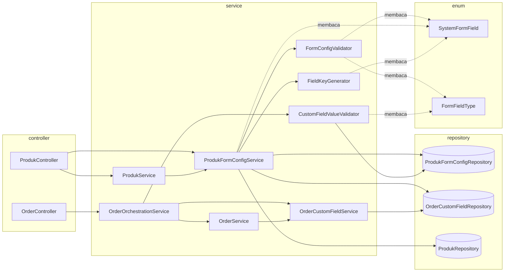

# TDD — Konfigurasi Form Produk (Backend)

| Field | Value |
|---|---|
| Feature name | Konfigurasi Form Produk (System Field + Custom Field) |
| Dokumen induk | [PRD — Konfigurasi Form Produk](../prd/produk-form-config.md) (Status: *Draft — Ready for Review*) |
| Component | Ekstensi `ProdukFormConfig` + modul baru `formconfig` (enum, util, validator, service) + entity `OrderCustomField` + integrasi `ProdukService`/`OrderService`/`OrderOrchestrationService` + `ProdukFormConfigSchemaInitializer` |
| Status | Draft — Ready for Implementation |
| Scope | Per-produk di dalam workspace; backend-only (frontend dibahas terpisah) |
| Last updated | 2026-07-28 |
| Target pembaca | Backend Developer (acuan implementasi langsung), Reviewer, QA, Frontend |

> TDD ini menerjemahkan PRD Konfigurasi Form Produk menjadi desain teknis konkret yang **selaras dengan konvensi codebase Saktiform**. Snippet kode bersifat **acuan desain** (skeleton), bukan kode final yang harus disalin verbatim.
>
> **Perbedaan mendasar dari fitur Label/Blast:** fitur ini **bukan modul greenfield**. Tabel `produk_form_config` dan entity-nya **sudah ada** dan sudah dipakai empat jalur kode existing (`saveProduct`, `getDetailProduk`, `getCheckoutProduk`, `copyProduk`). Karena itu bagian terbesar risiko teknis berada pada **modifikasi kode existing** (§12) dan **migrasi data legacy** (§4.4), bukan pada penulisan kode baru.

---

## Daftar Isi

1. [Tujuan & Ruang Lingkup Teknis](#1-tujuan--ruang-lingkup-teknis)
2. [Baseline Codebase (kondisi existing)](#2-baseline-codebase-kondisi-existing)
3. [Arsitektur Modul](#3-arsitektur-modul)
4. [Konvensi yang Diwarisi dari Codebase](#4-konvensi-yang-diwarisi-dari-codebase)
5. [Strategi Skema & Migrasi DB](#5-strategi-skema--migrasi-db)
6. [Enum & Util](#6-enum--util)
7. [Entity (JPA)](#7-entity-jpa)
8. [Repository](#8-repository)
9. [Model / DTO](#9-model--dto)
10. [Validator Layer](#10-validator-layer)
11. [Service Layer — ProdukFormConfigService](#11-service-layer--produkformconfigservice)
12. [Integrasi Order (validasi + snapshot)](#12-integrasi-order-validasi--snapshot)
13. [Modifikasi Kode Existing](#13-modifikasi-kode-existing)
14. [Controller & REST](#14-controller--rest)
15. [Security](#15-security)
16. [Konkurensi, Idempotency & Transaksi](#16-konkurensi-idempotency--transaksi)
17. [Error Handling](#17-error-handling)
18. [Performance](#18-performance)
19. [Testing Strategy](#19-testing-strategy)
20. [Rencana Implementasi Bertahap](#20-rencana-implementasi-bertahap)
21. [Appendix — Skeleton](#21-appendix--skeleton)

---

## 1. Tujuan & Ruang Lingkup Teknis

Mengimplementasikan fitur Konfigurasi Form Produk sesuai PRD: satu tabel konfigurasi berisi **System Field** (enam field bawaan, kontrak teknis terkunci) dan **Custom Field** (bebas per produk) → dibaca frontend checkout sebagai satu daftar terurut → nilai System Field tetap tersimpan pada kolom bertipe kuat di tabel `order`, nilai Custom Field tersimpan pada tabel baru `order_custom_field` beserta *snapshot* label.

**Prinsip desain teknis:**

- **Additive only pada skema.** Tujuh kolom baru pada `produk_form_config` + satu tabel baru. Tidak ada `DROP`, tidak ada `RENAME`, tidak ada perubahan tipe. Aman dengan `spring.jpa.hibernate.ddl-auto=update`.
- **Nama kolom fisik existing dipertahankan** (`orders`, `is_mandatory`, `tipe_field`), dipetakan ke atribut Java yang bersih (`sortOrder`, `isRequired`, `fieldType`) melalui `@Column(name=…)`. Alasan: `ddl-auto=update` tidak dapat me-*rename*.
- **Satu sumber kebenaran** untuk daftar System Field: enum `SystemFormField`. Seeding, validasi, pemetaan ke kolom `order`, dan *backfill* semuanya membacanya dari sana.
- **`field_key` sebagai kontrak**, bukan `id`. Tidak ada FK dari `order_custom_field` ke `produk_form_config.id` — keterhubungan bersifat logis via `(id_produk, field_key)` + *snapshot*.
- **Validasi selalu membaca konfigurasi dari DB**, tidak pernah mempercayai metadata yang dikirim klien (endpoint submit bersifat publik).
- **Self-healing**: System Field yang hilang dilengkapi otomatis saat konfigurasi dibaca, sehingga invarian "selalu ada enam System Field" tidak bergantung pada keberhasilan *backfill* massal.
- **Reuse konvensi existing**: entity Lombok, `RestResponse`, `MapperHelper.getErrors`, isolasi tenant via parameter `workspaceId`, pola controller `try/catch → badRequest`, *schema initializer* pola `LabelSchemaInitializer`.

Out of scope teknis (PRD §5): Custom Field pada `abandoned_order`, *conditional logic*, kolom dinamis pada Export Excel, *versioning* konfigurasi, i18n, dan perhitungan harga berbasis Custom Field.

---

## 2. Baseline Codebase (kondisi existing)

Bagian ini wajib dibaca sebelum menyentuh kode. Seluruh isinya adalah hasil pembacaan codebase, bukan asumsi.

### 2.1 Yang sudah ada

| Artefak | Kondisi |
|---|---|
| `entity/ProdukFormConfig.java` | Ada. 9 kolom: `id`, `id_produk`, `tipe_field`, `label`, `placeholder`, `orders`, `is_mandatory`, `created_at`, `updated_at`. Atribut Java `order` dan `isMandatory` **tanpa modifier `private`** (package-private) |
| `repository/ProdukFormConfigRepository.java` | Ada. Dua method: `deleteProdukFormConfigByIdProduk(UUID)`, `getProdukFormConfigsByIdProduk(UUID)` |
| `model/product/ProdukFormConfigDto.java` | Ada. `@Value` (immutable, all-args constructor): `tipeField`, `label`, `placeholder`, `order`, `isMandatory` |
| `model/product/AddProdukDto.java` | Ada. `List<ProdukFormConfigDto> formConfig` dengan `@NotNull(message = "Form Config Wajib Diisi.")` |
| `model/product/ProdukCheckoutDto.java`, `ProdukDetailDto.java` | Ada. Keduanya memuat `List<ProdukFormConfigDto> formConfig = new ArrayList<>()` |

### 2.2 Empat jalur kode yang menyentuh `produk_form_config`

| Lokasi | Perilaku saat ini |
|---|---|
| `ProdukService.saveProduct()` baris ~121 | `produkFormConfigRepository.deleteProdukFormConfigByIdProduk(produk.getId())` — dijalankan pada **setiap update produk** |
| `ProdukService.saveProduct()` baris ~234–243 | Loop insert; **hanya** mengisi `idProduk`, `label`, `placeholder`, `tipeField` |
| `ProdukService.getDetailProduk()` baris ~377 | Baca lalu map ke `ProdukFormConfigDto` (5 argumen) |
| `ProdukService.getCheckoutProduk()` baris ~485 | Idem |
| `ProdukService.copyProduk()` baris ~644 | Idem |

### 2.3 Tiga cacat yang wajib diperbaiki

| # | Cacat | Bukti | Dampak bila dibiarkan |
|---|---|---|---|
| B-1 | *Delete-and-reinsert* pada setiap update produk | `saveProduct()` baris ~121 | Konfigurasi (termasuk System Field) lenyap bila produk disimpan tanpa memuat `formConfig`. **Risiko kehilangan data paling kritis pada fitur ini** |
| B-2 | `orders`, `is_mandatory`, `created_at`, `updated_at` tidak pernah diisi saat simpan | `saveProduct()` baris ~234–243 | Nilai selalu `NULL`; urutan form tidak deterministik; `getOrder()` mengembalikan `null` ke DTO |
| B-3 | `ongkirRepository.findByIdOriginCityAndIdDistrict(...)` dipakai tanpa pemeriksaan `null` | `OrderService.createOrderInternal()` baris ~112–115 | `NullPointerException` (→ HTTP 400 dengan pesan `null`) bila kecamatan tidak memiliki data ongkir, alih-alih pesan yang informatif |

B-1 dan B-2 masuk ruang lingkup fitur ini (PRD FR-36, FR-37). B-3 berada di jalur yang sama dan diperbaiki sekalian (PRD §18.3, kode galat `SHIPPING_RATE_NOT_FOUND`).

### 2.4 Batasan infrastruktur yang memengaruhi desain

| Batasan | Konsekuensi desain |
|---|---|
| `ddl-auto=update` — tidak ada Flyway/Liquibase | Migrasi dijalankan `ProdukFormConfigSchemaInitializer` pada `ApplicationReadyEvent`, idempoten (§5) |
| `ErrorDto` hanya punya `field` + `message` | PRD menuntut `code` dan `meta`. Ditambahkan sebagai atribut baru (aditif, `@AllArgsConstructor` existing tetap dipertahankan — §9.6) |
| Tidak ada `@ControllerAdvice`; setiap controller `try/catch → e.getMessage()` | Diperlukan exception domain khusus yang membawa daftar `ErrorDto` (§17) |
| Belum ada infrastruktur test (`src/test` hanya berisi `ApiApplicationTests`) | Perlu setup dasar sebelum §19 dapat dijalankan |
| `POST /master/saktiform-media` mengembalikan URL statis (`masterService.saveSaktiformMedia` dikomentari) | Tipe field `FILE` tidak dapat berfungsi tanpa endpoint unggah baru → dipisah ke Fase 7 (§20) |
| `/produk/checkout/**` dan `/order/create/**` publik di `SecurityConfig` | Validasi server tidak boleh mempercayai input klien; endpoint unggah baru wajib ditambahkan ke daftar publik secara eksplisit (§15) |

---

## 3. Arsitektur Modul

### 3.1 Struktur Package

```
com.saktiform.api/
├── entity/
│   ├── ProdukFormConfig.java              [MODIFIKASI] +7 kolom, enum mapping
│   └── OrderCustomField.java              [BARU]
├── repository/
│   ├── ProdukFormConfigRepository.java    [MODIFIKASI] +query field_key & sort
│   └── OrderCustomFieldRepository.java    [BARU]
├── model/product/formconfig/
│   ├── FormFieldType.java                 [BARU] enum 13 tipe
│   ├── FieldCategory.java                 [BARU] enum SYSTEM|CUSTOM
│   ├── SystemFormField.java               [BARU] enum 6 field — SUMBER KEBENARAN TUNGGAL
│   ├── OptionDto.java                     [BARU]
│   ├── ValidationRuleDto.java             [BARU]
│   ├── FormFieldConfigDto.java            [BARU] response kaya (admin)
│   ├── FormFieldCheckoutDto.java          [BARU] response checkout (+alias legacy)
│   ├── FormConfigRequest.java             [BARU] request PUT
│   ├── FormFieldRequest.java              [BARU] item request
│   └── FormConfigResponse.java            [BARU] response PUT/GET
├── model/Order/
│   ├── CreateOrderDto.java                [MODIFIKASI] +customFields
│   ├── CustomFieldValueDto.java           [BARU] {fieldKey, value, meta}
│   ├── OrderCustomFieldDto.java           [BARU] response detail order
│   └── DetailOrderDto.java                [MODIFIKASI] +customFields
├── model/
│   └── ErrorDto.java                      [MODIFIKASI] +code, +meta
├── service/formconfig/
│   ├── ProdukFormConfigService.java       [BARU] CRUD konfigurasi, seeding, self-healing
│   ├── FormConfigValidator.java           [BARU] validasi konfigurasi (PUT)
│   ├── CustomFieldValueValidator.java     [BARU] validasi nilai (submit order)
│   ├── OrderCustomFieldService.java       [BARU] snapshot & pembacaan nilai
│   └── FieldKeyGenerator.java             [BARU] slugify + reserved word + collision
├── configuration/
│   └── ProdukFormConfigSchemaInitializer.java  [BARU] index, constraint, backfill
├── util/
│   └── ValidationException.java           [BARU] domain exception pembawa List<ErrorDto>
└── controller/
    ├── ProdukController.java              [MODIFIKASI] +3 endpoint
    └── OrderController.java               [tidak berubah — perubahan di service]
```

### 3.2 Alur Komponen

```
── Konfigurasi (dashboard, terautentikasi) ──────────────────────────────
ProdukController GET  /produk/{id}/form-config
  → ProdukFormConfigService.getFormConfig(idProduk, workspaceId)
      → guard workspace  → repo.findByIdProdukOrderBySortOrder
      → ensureSystemFields()          (self-healing, FR-4)
      → OrderCustomFieldRepository.countUsageByProduk()  (batch, 1 query)
      → map → FormConfigResponse (+editableAttributes, +deletable, +usageCount)

ProdukController PUT  /produk/{id}/form-config
  → ProdukFormConfigService.saveFormConfig(idProduk, workspaceId, request)
      → guard workspace
      → FormConfigValidator.validate(existing, incoming)     → List<ErrorDto>
      → FieldKeyGenerator.generate(label, usedKeys)          (field baru)
      → cek usageCount kandidat hapus                        (BR-23/BR-24)
      → upsert by field_key + delete + normalisasi sortOrder (1 transaksi)

── Checkout (publik) ────────────────────────────────────────────────────
ProdukController GET /produk/checkout?urlCheckout=
  → ProdukService.getCheckoutProduk()
      → ProdukFormConfigService.getActiveCheckoutConfig(idProduk)
          → repo.findByIdProdukAndIsActiveTrueOrderBySortOrder
          → map → FormFieldCheckoutDto (+alias tipeField/order/isMandatory)

── Submit order (publik) ────────────────────────────────────────────────
OrderController POST /order/create
  → OrderOrchestrationService.createOrder(dto, actor, ip)
      → CustomFieldValueValidator.validate(idProduk, customFields, source)
            ↑ DIDAHULUKAN sebelum penulisan apa pun (hindari nomor urut terbuang)
      → OrderService.createOrderInternal(...)      (System Field → kolom order)
      → OrderCustomFieldService.saveSnapshot(order, validatedValues)
      → eventPublisher.publishEvent(OrderCreatedEvent)

── Detail order (dashboard) ─────────────────────────────────────────────
OrderController GET /order/{id}
  → OrderService.getOrderDetail()
      → OrderCustomFieldService.findByOrder(idOrder)   → DetailOrderDto.customFields
```

### 3.3 Peta Ketergantungan Antar-Komponen



Perhatikan bahwa `SystemFormField` dibaca oleh empat komponen. Itulah sebabnya ia wajib menjadi **satu-satunya** tempat daftar System Field didefinisikan — menduplikasinya (misalnya sebagai konstanta string di validator) adalah sumber bug yang paling mudah diprediksi pada fitur ini.

---

## 4. Konvensi yang Diwarisi dari Codebase

Acuan: `Produk`, `ProdukFormConfig`, `Order`, `ProdukService`, `OrderService`, `ProdukController`, `ConversationLabelService`, `LabelSchemaInitializer`.

| Aspek | Konvensi codebase | Diterapkan di fitur ini |
|---|---|---|
| ID `Long` | `@GeneratedValue(strategy = GenerationType.IDENTITY)` | `produk_form_config`, `order_custom_field` |
| ID `UUID` | `@GeneratedValue(strategy = GenerationType.UUID)` | tidak dipakai (kedua tabel memakai `Long`) |
| Anotasi entity | `@Getter @Setter @Entity @Table(name="…")` (Lombok) | semua |
| Relasi | kolom skalar eksplisit + `@ManyToOne(fetch = LAZY, insertable=false, updatable=false)` opsional | `idProduk`, `idOrder` |
| Kolom teks bebas | `length = Integer.MAX_VALUE` | `label`, `placeholder`, `field_value` |
| Kolom JSON | `@JdbcTypeCode(SqlTypes.JSON)` (preseden: `Order.configPembayaran`, `ProdukPembayaran.config`) | `options`, `validationRule`, `fieldValueJson` |
| Audit | `Instant createdAt/updatedAt` **di-set manual di service** (bukan `@CreationTimestamp`) | semua |
| Isolasi tenant | parameter `workspaceId` diteruskan dari controller; tidak ada thread-local | guard di `ProdukFormConfigService` |
| Response | `RestResponse(success, message, data)` | semua endpoint |
| Validasi request | JSR-303 + `BindingResult` + `MapperHelper.getErrors()` | `FormConfigRequest`, `CreateOrderDto` |
| Controller | `try { … ok } catch { badRequest }` | endpoint baru |
| Post-startup DDL | `@EventListener(ApplicationReadyEvent.class)` + `JdbcTemplate` + `IF NOT EXISTS` | `ProdukFormConfigSchemaInitializer` |
| Timestamp DTO | `yyyy-MM-dd HH:mm`, zona `Asia/Jakarta` | bila diekspos |
| Pesan galat | Bahasa Indonesia, informatif | semua |
| Enum di DB | `@Enumerated(EnumType.STRING)` → kolom `varchar` | `fieldType`, `fieldCategory` |

**Penyimpangan yang disengaja dari konvensi**, beserta alasannya:

| Penyimpangan | Alasan |
|---|---|
| Memperkenalkan `ValidationException` pembawa `List<ErrorDto>` | Pola `catch (Exception e) → e.getMessage()` hanya dapat menyampaikan satu pesan. PRD menuntut seluruh galat dikembalikan sekaligus (US-15) dan tiap galat membawa `code` + `field` |
| `ErrorDto` ditambah `code` dan `meta` | Frontend tidak boleh mencocokkan teks pesan untuk menentukan penanganan (PRD §19.1) |
| Endpoint publik baru **tidak** mengembalikan `e.getMessage()` mentah | Kebocoran detail internal ke pemanggil anonim (PRD §23.8) |

---

## 5. Strategi Skema & Migrasi DB

### 5.1 Pembagian Tanggung Jawab

| Dihasilkan oleh | Objek |
|---|---|
| Hibernate `ddl-auto=update` (dari anotasi entity) | 7 kolom baru pada `produk_form_config`; tabel `order_custom_field`; index biasa via `@Table(indexes=…)`; unique constraint kolom-biasa via `@Table(uniqueConstraints=…)` |
| `ProdukFormConfigSchemaInitializer` (`ApplicationReadyEvent`) | Unique index **fungsional** `lower(field_key)`; `CHECK constraint`; normalisasi `NULL`; *backfill* `field_key`/`field_category`; seeding System Field |

Pembagian ini mengikuti persis pola `LabelSchemaInitializer`: Hibernate menangani yang bisa ia tangani; *initializer* menangani sisanya secara idempoten.

### 5.2 Urutan Eksekusi Initializer

Urutan **tidak boleh** ditukar — `CREATE UNIQUE INDEX` akan gagal bila masih ada `field_key` bernilai `NULL` atau ganda.

```
M-2  normalisasi NULL (orders, is_mandatory, tipe_field, is_active, label, created_at)
M-3  normalisasi tipe_field legacy → enum FormFieldType
M-4  backfill field_key + field_category (heuristik label)
M-5  seeding System Field yang belum ada (semua produk)
M-6  index + CHECK constraint
M-7  verifikasi + log ringkasan
```

### 5.3 Idempotensi dan Kegagalan

| Aspek | Ketentuan |
|---|---|
| Idempotensi | Setiap langkah memakai `IF NOT EXISTS`, `WHERE … IS NULL`, atau `WHERE NOT EXISTS`. Aman dijalankan pada setiap *startup* |
| Kegagalan `CREATE UNIQUE INDEX` | Catat `log.error` beserta daftar `(id_produk, field_key)` yang bertabrakan; **jangan** gagalkan *startup*. Keunikan tetap ditegakkan lapisan aplikasi |
| Kegagalan `ADD CONSTRAINT` | PostgreSQL tidak mendukung `ADD CONSTRAINT IF NOT EXISTS` → periksa `pg_constraint` lebih dahulu, atau tangkap `DuplicateObject` dan abaikan |
| Kegagalan langkah lain | `log.error` + lanjut ke langkah berikutnya; jangan gagalkan *startup* |
| Guard biaya | Langkah M-2..M-5 memeriksa lebih dahulu apakah masih ada pekerjaan (`SELECT count(*) … WHERE field_key IS NULL`); bila nol, langsung `return` tanpa menjalankan `UPDATE` apa pun. Menghindari beban tak perlu pada setiap restart |

### 5.4 Backfill `field_key` — Algoritma

Ini bagian paling rawan (PRD R-2). Dijalankan per produk, di dalam satu transaksi per produk sehingga kegagalan pada satu produk tidak membatalkan produk lain.

```
untuk setiap idProduk yang memiliki baris dengan field_key IS NULL:
  usedKeys = {}
  rows = SELECT * FROM produk_form_config
         WHERE id_produk = ? ORDER BY orders NULLS LAST, id
  untuk setiap row:
      norm = normalizeLabel(row.label)            // lowercase, buang tanda baca, trim
      sysKey = SystemFormField.matchByLabel(norm) // null bila tidak cocok
      jika sysKey != null DAN sysKey ∉ usedKeys:
          row.field_key      = sysKey
          row.field_category = 'SYSTEM'
          row.is_mandatory   = true
          row.is_active      = true
          row.tipe_field     = SystemFormField.valueOf(sysKey).getType()
      selain itu:
          row.field_category = 'CUSTOM'
          row.field_key      = FieldKeyGenerator.generate(row.label, usedKeys)
      usedKeys += row.field_key
  seedMissingSystemFields(idProduk, usedKeys)
  normalizeSortOrder(idProduk)                    // 1..N
```

Klausa `sysKey ∉ usedKeys` mencegah dua baris legacy dipetakan ke System Field yang sama (mis. produk dengan label "Nama" dan "Nama Lengkap"). Baris kedua jatuh ke cabang CUSTOM sebagai `nama_lengkap` — tidak ada data yang hilang (PRD EC-19).

Tabel heuristik pencocokan berada di `SystemFormField.matchByLabel()` (§6.3). **Urutan pemeriksaan penting**: `phone_number` sebelum `customer_name`, dan `city` sebelum `district`.

### 5.5 Cadangan dan Rollback

Wajib dilakukan **sebelum** deploy Fase 1:

```sql
CREATE TABLE produk_form_config_backup_20260728 AS SELECT * FROM produk_form_config;
```

M-2 dan M-3 tidak dapat dipulihkan tanpa tabel cadangan ini (nilai `NULL` yang telah dinormalkan hilang selamanya). Rincian rollback per tahap ada di PRD §22.4.

Properti penting yang wajib diverifikasi sebelum rilis: **aplikasi versi lama tetap berjalan di atas skema baru** (seluruh perubahan aditif). Ini memungkinkan rollback aplikasi tanpa rollback DB — jalur pemulihan tercepat.

---

## 6. Enum & Util

### 6.1 `FormFieldType`

```java
package com.saktiform.api.model.product.formconfig;

public enum FormFieldType {
    // tipe untuk Custom Field
    TEXT(false), TEXTAREA(false), NUMBER(false), EMAIL(false),
    SELECT(true), RADIO(true), CHECKBOX(true),
    DATE(false), FILE(false),
    // tipe khusus System Field — TIDAK boleh dipakai Custom Field (BR-27)
    PHONE(false, true), PROVINCE(false, true), CITY(false, true), DISTRICT(false, true);

    private final boolean requiresOptions;
    private final boolean systemOnly;

    FormFieldType(boolean requiresOptions) { this(requiresOptions, false); }
    FormFieldType(boolean requiresOptions, boolean systemOnly) {
        this.requiresOptions = requiresOptions;
        this.systemOnly = systemOnly;
    }

    public boolean requiresOptions() { return requiresOptions; }
    public boolean isSystemOnly()    { return systemOnly; }
    public boolean isMultiValue()    { return this == CHECKBOX; }

    /** Parsing toleran untuk nilai legacy (§5.2 M-3). Mengembalikan null bila tak dikenal. */
    public static FormFieldType parseLegacy(String raw) {
        if (raw == null) return null;
        return switch (raw.trim().toLowerCase()) {
            case "text", "string", "input", "char"          -> TEXT;
            case "textarea", "longtext", "multiline"        -> TEXTAREA;
            case "number", "numeric", "int", "integer"      -> NUMBER;
            case "email", "mail"                            -> EMAIL;
            case "select", "dropdown", "combobox"           -> SELECT;
            case "radio", "option"                          -> RADIO;
            case "checkbox", "check", "multiselect"         -> CHECKBOX;
            case "date", "tanggal", "datepicker"            -> DATE;
            case "file", "upload", "image", "foto"          -> FILE;
            case "phone", "telepon", "tel"                  -> PHONE;
            case "province", "provinsi"                     -> PROVINCE;
            case "city", "kota"                             -> CITY;
            case "district", "kecamatan"                    -> DISTRICT;
            default -> null;
        };
    }
}
```

`parseLegacy` mengembalikan `null` (bukan melempar) agar M-3 dapat memetakan nilai tak dikenal menjadi `TEXT` sambil mencatat `WARN`. Menggagalkan *startup* karena satu baris konfigurasi aneh jauh lebih merugikan daripada memakai tipe paling permisif.

### 6.2 `FieldCategory`

```java
public enum FieldCategory { SYSTEM, CUSTOM }
```

### 6.3 `SystemFormField` — Sumber Kebenaran Tunggal

```java
package com.saktiform.api.model.product.formconfig;

import java.util.*;

/**
 * Enam System Field. SATU-SATUNYA tempat daftar ini didefinisikan.
 * Dipakai oleh: seeding, self-healing, FormConfigValidator, CustomFieldValueValidator,
 * FieldKeyGenerator (reserved words), dan backfill pada SchemaInitializer.
 */
public enum SystemFormField {

    CUSTOMER_NAME("customer_name", FormFieldType.TEXT,     "Nama",           "Masukkan nama lengkap",     1,
                  List.of("nama", "nama lengkap", "nama penerima", "nama customer",
                          "nama konsumen", "nama pemesan", "full name", "name")),
    PHONE_NUMBER ("phone_number",  FormFieldType.PHONE,    "Nomor WhatsApp", "Contoh: 08123456789",       2,
                  List.of("whatsapp", "no wa", "nomor wa", "nomor whatsapp", "no hp",
                          "nomor hp", "telepon", "handphone", "phone")),
    ADDRESS      ("address",       FormFieldType.TEXTAREA, "Alamat",         "Masukkan alamat lengkap",   3,
                  List.of("alamat", "alamat lengkap", "alamat pengiriman", "address")),
    PROVINCE     ("province",      FormFieldType.PROVINCE, "Provinsi",       "Pilih provinsi",            4,
                  List.of("provinsi", "province")),
    CITY         ("city",          FormFieldType.CITY,     "Kota",           "Pilih kota",                5,
                  List.of("kota", "kabupaten", "kota kabupaten", "city")),
    DISTRICT     ("district",      FormFieldType.DISTRICT, "Kecamatan",      "Pilih kecamatan",           6,
                  List.of("kecamatan", "district", "kec"));

    private final String key;
    private final FormFieldType type;
    private final String defaultLabel;
    private final String defaultPlaceholder;
    private final int defaultSortOrder;
    private final List<String> labelAliases;

    SystemFormField(String key, FormFieldType type, String defaultLabel,
                    String defaultPlaceholder, int defaultSortOrder, List<String> labelAliases) {
        this.key = key; this.type = type; this.defaultLabel = defaultLabel;
        this.defaultPlaceholder = defaultPlaceholder; this.defaultSortOrder = defaultSortOrder;
        this.labelAliases = labelAliases;
    }

    public String getKey()                { return key; }
    public FormFieldType getType()        { return type; }
    public String getDefaultLabel()       { return defaultLabel; }
    public String getDefaultPlaceholder() { return defaultPlaceholder; }
    public int getDefaultSortOrder()      { return defaultSortOrder; }

    private static final Map<String, SystemFormField> BY_KEY = new HashMap<>();
    static { for (SystemFormField f : values()) BY_KEY.put(f.key, f); }

    public static Optional<SystemFormField> byKey(String key) {
        return key == null ? Optional.empty()
                           : Optional.ofNullable(BY_KEY.get(key.trim().toLowerCase()));
    }

    public static boolean isSystemKey(String key) { return byKey(key).isPresent(); }

    public static Set<String> allKeys() { return BY_KEY.keySet(); }

    /**
     * Heuristik backfill (§5.4). URUTAN PENTING: PHONE_NUMBER diperiksa sebelum
     * CUSTOMER_NAME (label "Nama & No WA" → phone); CITY sebelum DISTRICT.
     * @param normalizedLabel label yang sudah lowercase + tanpa tanda baca + trim
     */
    public static Optional<SystemFormField> matchByLabel(String normalizedLabel) {
        if (normalizedLabel == null || normalizedLabel.isBlank()) return Optional.empty();
        SystemFormField[] order = { PHONE_NUMBER, CUSTOMER_NAME, ADDRESS, PROVINCE, CITY, DISTRICT };
        for (SystemFormField f : order) {
            for (String alias : f.labelAliases) {
                if (normalizedLabel.equals(alias) || normalizedLabel.contains(alias)) {
                    return Optional.of(f);
                }
            }
        }
        return Optional.empty();
    }

    /** Kata terlarang untuk field_key Custom Field (PRD §11.5 langkah 7). */
    public static final Set<String> RESERVED_KEYS = Set.of(
            "customer_name", "phone_number", "address", "province", "city", "district",
            "nama", "nama_penerima", "nama_lengkap", "nomor_whatsapp", "no_wa",
            "alamat", "provinsi", "kota", "kecamatan"
    );
}
```

**Catatan penting mengenai `ADDRESS` vs `PROVINCE`:** alias `"alamat"` pada `ADDRESS` dicocokkan dengan `contains`, sedangkan label "Alamat Provinsi" (bila ada) juga memuat `"alamat"`. Karena `ADDRESS` diperiksa sebelum `PROVINCE` pada urutan di atas, label seperti itu akan salah dipetakan. Ini diterima sebagai keterbatasan heuristik — kueri distribusi pada M-7 dirancang justru untuk menangkap kasus semacam ini sebelum diterapkan ke produksi.

### 6.4 `FieldKeyGenerator`

```java
package com.saktiform.api.service.formconfig;

@Component
public class FieldKeyGenerator {

    private static final int MAX_BASE_LENGTH = 56;   // sisakan ruang untuk sufiks
    private static final String FALLBACK = "field";

    /** Normalisasi label untuk keperluan pencocokan heuristik backfill. */
    public String normalizeLabel(String label) {
        if (label == null) return "";
        String s = Normalizer.normalize(label, Normalizer.Form.NFD)
                             .replaceAll("\\p{M}", "")            // buang diakritik
                             .toLowerCase(Locale.ROOT)
                             .replaceAll("[^a-z0-9\\s]", " ")     // buang tanda baca
                             .replaceAll("\\s+", " ")
                             .trim();
        return s;
    }

    /** Slugify sesuai PRD §11.5. usedKeys = field_key yang sudah dipakai pada produk yang sama. */
    public String generate(String label, Set<String> usedKeys) {
        String base = Normalizer.normalize(label == null ? "" : label, Normalizer.Form.NFD)
                                .replaceAll("\\p{M}", "")
                                .toLowerCase(Locale.ROOT)
                                .replaceAll("[^a-z0-9]+", "_")
                                .replaceAll("^_+|_+$", "");

        if (base.length() > MAX_BASE_LENGTH) base = base.substring(0, MAX_BASE_LENGTH)
                                                        .replaceAll("_+$", "");
        if (base.isBlank())                 base = FALLBACK;
        if (!base.matches("^[a-z].*"))      base = FALLBACK + "_" + base;   // wajib diawali huruf
        if (SystemFormField.RESERVED_KEYS.contains(base)) base = "custom_" + base;

        String candidate = base;
        int suffix = 2;
        Set<String> lowered = usedKeys.stream().map(k -> k.toLowerCase(Locale.ROOT))
                                      .collect(Collectors.toSet());
        while (lowered.contains(candidate)) {
            candidate = base + "_" + suffix++;
        }
        return candidate;
    }
}
```

Kasus uji wajib (§19.1): `"Ukuran Baju"` → `ukuran_baju`; `"Warna"` duplikat → `warna_2`; `"Catatan Tambahan?"` → `catatan_tambahan`; `"Alamat"` → `custom_alamat`; `"🎉"` → `field`; `"123 Angka"` → `field_123_angka`; label 200 karakter → terpotong 56 tanpa `_` di ujung.

### 6.5 `ValidationException`

```java
package com.saktiform.api.util;

public class ValidationException extends RuntimeException {
    private final List<ErrorDto> errors;

    public ValidationException(List<ErrorDto> errors) {
        super(errors.isEmpty() ? "Validation failed" : errors.get(0).getMessage());
        this.errors = errors;
    }
    public ValidationException(ErrorDto error) { this(List.of(error)); }
    public ValidationException(String field, String code, String message) {
        this(new ErrorDto(field, message, code, null));
    }
    public List<ErrorDto> getErrors() { return errors; }
}
```

`super(...)` diisi pesan galat pertama agar controller existing yang memakai `catch (Exception e) → e.getMessage()` tetap menghasilkan pesan yang bermakna, meskipun tidak membaca daftar lengkapnya. Ini menjaga kompatibilitas dengan pola penanganan galat yang sudah ada.

---

## 7. Entity (JPA)

### 7.1 `ProdukFormConfig` (MODIFIKASI)

```java
@Getter @Setter @Entity
@Table(name = "produk_form_config",
       indexes = {
           @Index(name = "idx_pfc_produk_active_sort", columnList = "id_produk, is_active, orders"),
           @Index(name = "idx_pfc_category",           columnList = "field_category")
       })
public class ProdukFormConfig {

    @Id @GeneratedValue(strategy = GenerationType.IDENTITY)
    @Column(name = "id", nullable = false)
    private Long id;

    @ManyToOne(fetch = FetchType.LAZY)
    @JoinColumn(name = "id_produk", insertable = false, updatable = false)
    private Produk produk;

    @Column(name = "id_produk")
    private UUID idProduk;

    // ── BARU ────────────────────────────────────────────────────────────
    @Column(name = "field_key", length = 64)
    private String fieldKey;

    @Enumerated(EnumType.STRING)
    @Column(name = "field_category", length = 16)
    private FieldCategory fieldCategory;

    @Column(name = "help_text", length = 300)
    private String helpText;

    @Column(name = "is_active")
    private Boolean isActive;

    @JdbcTypeCode(SqlTypes.JSON)
    @Column(name = "options")
    private List<OptionDto> options;

    @Column(name = "default_value", length = 500)
    private String defaultValue;

    @JdbcTypeCode(SqlTypes.JSON)
    @Column(name = "validation_rule")
    private ValidationRuleDto validationRule;

    // ── EXISTING — nama kolom fisik DIPERTAHANKAN, atribut Java dirapikan ──
    @Enumerated(EnumType.STRING)
    @Column(name = "tipe_field", length = 32)
    private FormFieldType fieldType;          // dulu: String tipeField

    @Column(name = "label", length = Integer.MAX_VALUE)
    private String label;

    @Column(name = "placeholder", length = Integer.MAX_VALUE)
    private String placeholder;

    @Column(name = "orders")
    private Integer sortOrder;                // dulu: Integer order (package-private)

    @Column(name = "is_mandatory")
    private Boolean isRequired;               // dulu: Boolean isMandatory (package-private)

    @Column(name = "created_at") private Instant createdAt;
    @Column(name = "updated_at") private Instant updatedAt;
}
```

**Tiga hal yang wajib diperhatikan implementor:**

1. **`tipe_field` berubah dari `String` menjadi enum.** `@Enumerated(EnumType.STRING)` menyimpan nama enum (`"TEXT"`, `"SELECT"`) sebagai `varchar` — kompatibel dengan kolom existing. Namun bila DB masih memuat nilai legacy (`"text"` huruf kecil), Hibernate akan melempar `IllegalArgumentException` saat membaca. **Karena itu M-3 (normalisasi `tipe_field`) wajib selesai sebelum entity ini di-deploy.** Ini adalah ketergantungan urutan deploy yang tidak boleh dilanggar.

2. **Rename atribut Java memutus kode existing.** `getOrder()` → `getSortOrder()`, `getIsMandatory()` → `getIsRequired()`, `getTipeField()` → `getFieldType()`. Empat titik pemanggilan di `ProdukService` wajib disesuaikan (§13). Kompilator akan menangkap seluruhnya — tidak ada risiko kegagalan senyap.

3. **`options` dan `validationRule` dipetakan langsung ke DTO**, bukan ke `Map<String, Object>`. Ini adalah pengendalian keamanan (PRD §23.3): deserialisasi ke tipe kuat menolak struktur JSON sembarang. Kedua DTO wajib memiliki konstruktor tanpa argumen agar Jackson dapat mendeserialisasinya.

`ck_pfc_category` dan `ck_pfc_system_locked` **tidak** dideklarasikan di `@Table` (Hibernate tidak menghasilkan `CHECK` dari anotasi standar) — dibuat oleh *initializer* (§5).

Unique index `(id_produk, lower(field_key))` juga **tidak** di `@Table` karena bersifat fungsional — dibuat *initializer*, persis pola `LabelSchemaInitializer`.

### 7.2 `OrderCustomField` (BARU)

```java
@Getter @Setter @Entity
@Table(name = "order_custom_field",
       uniqueConstraints = @UniqueConstraint(name = "uq_ocf_order_field",
                                             columnNames = {"id_order", "field_key"}),
       indexes = {
           @Index(name = "idx_ocf_order",        columnList = "id_order, sort_order"),
           @Index(name = "idx_ocf_produk_field", columnList = "id_produk, field_key")
       })
public class OrderCustomField {

    @Id @GeneratedValue(strategy = GenerationType.IDENTITY)
    @Column(name = "id", nullable = false)
    private Long id;

    @Column(name = "id_order", nullable = false)
    private UUID idOrder;

    /** Denormalisasi: menjawab usageCount tanpa join ke tabel order (PRD §11.6). */
    @Column(name = "id_produk", nullable = false)
    private UUID idProduk;

    @Column(name = "field_key", length = 64, nullable = false)
    private String fieldKey;                  // snapshot

    @Column(name = "field_label", length = Integer.MAX_VALUE, nullable = false)
    private String fieldLabel;                // snapshot

    @Enumerated(EnumType.STRING)
    @Column(name = "field_type", length = 32, nullable = false)
    private FormFieldType fieldType;          // snapshot

    /** Representasi kanonik teks. CHECKBOX → nilai tergabung ", ". */
    @Column(name = "field_value", length = Integer.MAX_VALUE)
    private String fieldValue;

    /** Nilai terstruktur: larik untuk CHECKBOX, metadata untuk FILE. */
    @JdbcTypeCode(SqlTypes.JSON)
    @Column(name = "field_value_json")
    private Map<String, Object> fieldValueJson;

    @Column(name = "sort_order", nullable = false)
    private Integer sortOrder;                // snapshot

    @Column(name = "created_at", nullable = false)
    private Instant createdAt;
}
```

**Keputusan yang perlu dijelaskan:** `fieldValueJson` bertipe `Map<String, Object>` (mengikuti preseden `Order.configPembayaran`), **bukan** `List<String>`, meskipun kasus pemakaian utamanya adalah larik nilai `CHECKBOX`. Alasannya satu kolom melayani dua bentuk data: larik untuk `CHECKBOX` dan objek metadata untuk `FILE`. Konvensi isi yang ditetapkan:

```jsonc
// CHECKBOX
{ "values": ["Hitam", "Putih"] }
// FILE
{ "url": "https://…", "fileName": "desain.png", "sizeKb": 842, "contentType": "image/png" }
```

Membungkus larik ke dalam `{"values": [...]}` — alih-alih menyimpan larik telanjang — membuat satu kolom dapat melayani kedua bentuk tanpa pemeriksaan tipe di sisi pembaca.

Tidak ada FK ke `produk_form_config.id` (PRD §11.6). FK ke `order` dan `produk` dideklarasikan pada level DDL oleh *initializer*, bukan via `@ManyToOne`, konsisten dengan pola kolom skalar eksplisit pada codebase.

---

## 8. Repository

### 8.1 `ProdukFormConfigRepository` (MODIFIKASI)

```java
public interface ProdukFormConfigRepository extends JpaRepository<ProdukFormConfig, Long> {

    // ── existing — DIPERTAHANKAN untuk kompatibilitas, TIDAK dipakai lagi di saveProduct ──
    void deleteProdukFormConfigByIdProduk(UUID idProduk);
    List<ProdukFormConfig> getProdukFormConfigsByIdProduk(UUID idProduk);

    // ── baru ──
    List<ProdukFormConfig> findByIdProdukOrderBySortOrderAscIdAsc(UUID idProduk);

    List<ProdukFormConfig> findByIdProdukAndIsActiveTrueOrderBySortOrderAscIdAsc(UUID idProduk);

    Optional<ProdukFormConfig> findByIdProdukAndFieldKey(UUID idProduk, String fieldKey);

    boolean existsByIdProdukAndFieldCategory(UUID idProduk, FieldCategory category);

    long countByIdProdukAndFieldCategoryAndIsActiveTrue(UUID idProduk, FieldCategory category);

    void deleteByIdProdukAndFieldKeyIn(UUID idProduk, Collection<String> fieldKeys);
}
```

`deleteProdukFormConfigByIdProduk` sengaja **tidak dihapus** meski tidak lagi dipanggil dari `saveProduct()`. Ia tetap berguna untuk pembersihan administratif dan penghapusannya akan menambah *diff* tanpa manfaat. Beri komentar Javadoc yang menegaskan bahwa method ini **tidak boleh** dipanggil dari jalur simpan produk (B-1).

Perhatikan `OrderBySortOrderAscIdAsc` — penambahan `IdAsc` sebagai *tie-breaker* penting: setelah normalisasi `sortOrder` seharusnya unik, namun sebelum normalisasi selesai (atau pada data yang belum ter-*backfill*) nilai ganda mungkin ada, dan tanpa *tie-breaker* urutan hasilnya tidak deterministik antar-eksekusi.

### 8.2 `OrderCustomFieldRepository` (BARU)

```java
public interface OrderCustomFieldRepository extends JpaRepository<OrderCustomField, Long> {

    List<OrderCustomField> findByIdOrderOrderBySortOrderAscIdAsc(UUID idOrder);

    /** Batch fetch — anti N+1 (FR-34). */
    List<OrderCustomField> findByIdOrderInOrderBySortOrderAscIdAsc(Collection<UUID> idOrders);

    long countByIdProdukAndFieldKey(UUID idProduk, String fieldKey);

    /** usageCount seluruh field satu produk dalam SATU query (NFR-3). */
    @Query("""
        select f.fieldKey as fieldKey, count(f) as usageCount
        from OrderCustomField f
        where f.idProduk = :idProduk
        group by f.fieldKey
        """)
    List<FieldUsageProjection> countUsageByProduk(@Param("idProduk") UUID idProduk);

    /** usageCount terbatas pada kandidat hapus — dipakai saat PUT (BR-23/BR-24). */
    @Query("""
        select f.fieldKey as fieldKey, count(f) as usageCount
        from OrderCustomField f
        where f.idProduk = :idProduk and f.fieldKey in :fieldKeys
        group by f.fieldKey
        """)
    List<FieldUsageProjection> countUsageByProdukAndFieldKeys(@Param("idProduk") UUID idProduk,
                                                              @Param("fieldKeys") Collection<String> fieldKeys);

    interface FieldUsageProjection {
        String getFieldKey();
        Long getUsageCount();
    }
}
```

Kedua kueri agregat dilayani oleh index `idx_ocf_produk_field` — tanpa *join* ke tabel `order`, sesuai justifikasi denormalisasi `id_produk` (PRD §11.6).

---

## 9. Model / DTO

### 9.1 `OptionDto` dan `ValidationRuleDto`

Keduanya disimpan sebagai `jsonb` sehingga **wajib** memiliki konstruktor tanpa argumen (Jackson). Tidak boleh memakai `@Value`.

```java
@Getter @Setter @NoArgsConstructor @AllArgsConstructor
public class OptionDto implements Serializable {
    @NotBlank(message = "Label pilihan wajib diisi.")
    @Size(max = 100, message = "Label pilihan maksimum 100 karakter.")
    private String label;

    @NotBlank(message = "Nilai pilihan wajib diisi.")
    @Size(max = 100, message = "Nilai pilihan maksimum 100 karakter.")
    private String value;
}

@Getter @Setter @NoArgsConstructor @AllArgsConstructor
@JsonInclude(JsonInclude.Include.NON_NULL)
public class ValidationRuleDto implements Serializable {
    private Integer minLength;
    private Integer maxLength;
    private BigDecimal min;
    private BigDecimal max;
    private String  pattern;
    private String  minDate;        // yyyy-MM-dd
    private String  maxDate;        // yyyy-MM-dd
    private List<String> accept;    // MIME types (FILE)
    private Integer maxFileSizeKb;  // FILE
    private Integer minSelected;    // CHECKBOX
    private Integer maxSelected;    // CHECKBOX
}
```

`@JsonInclude(NON_NULL)` penting: tanpa itu, `validation_rule` untuk field `TEXT` sederhana akan tersimpan sebagai JSON berisi sebelas atribut `null`, memboroskan ruang dan mengaburkan pembacaan manual.

### 9.2 `FormFieldRequest` dan `FormConfigRequest`

```java
@Getter @Setter @NoArgsConstructor @AllArgsConstructor
public class FormFieldRequest {
    /** Kosong/null = field baru; sistem membangkitkan field_key. */
    @Size(max = 64) private String fieldKey;

    @NotNull(message = "Kategori field wajib diisi.")
    private FieldCategory fieldCategory;

    /** Wajib untuk CUSTOM; diabaikan untuk SYSTEM. */
    private FormFieldType fieldType;

    @NotBlank(message = "Label field wajib diisi.")
    @Size(max = 150, message = "Label maksimum 150 karakter.")
    private String label;

    @Size(max = 200, message = "Placeholder maksimum 200 karakter.")
    private String placeholder;

    @Size(max = 300, message = "Help text maksimum 300 karakter.")
    private String helpText;

    private Boolean isRequired;
    private Boolean isActive;

    @Size(max = 500) private String defaultValue;

    @Valid private List<OptionDto> options;
    @Valid private ValidationRuleDto validation;

    @Min(1) @Max(999) private Integer sortOrder;
}

@Getter @Setter @NoArgsConstructor @AllArgsConstructor
public class FormConfigRequest {
    @NotEmpty(message = "Daftar field tidak boleh kosong.")
    @Size(max = 56, message = "Jumlah field maksimum 56.")
    @Valid
    private List<FormFieldRequest> fields;
}
```

`defaultValue` bertipe `String` meskipun PRD menyebut `string | string[]`. Untuk `CHECKBOX`, klien mengirim larik yang di-*serialize* menjadi string JSON. Alternatifnya — `Object` dengan pemeriksaan tipe manual — melemahkan validasi JSR-303 dan membuka celah deserialisasi. Konversi dilakukan eksplisit di validator.

### 9.3 `FormFieldConfigDto` (response admin)

```java
@Getter @Setter @NoArgsConstructor @AllArgsConstructor @Builder
public class FormFieldConfigDto {
    private String fieldKey;
    private FieldCategory fieldCategory;
    private FormFieldType fieldType;
    private String label;
    private String placeholder;
    private String helpText;
    private Boolean isRequired;
    private Boolean isActive;
    private String defaultValue;
    private List<OptionDto> options;
    private Integer sortOrder;
    private ValidationRuleDto validation;
    private String dataSource;               // hanya PROVINCE/CITY/DISTRICT
    private Long usageCount;                 // null bila gagal dihitung (NFR-5)
    private List<String> editableAttributes; // izin eksplisit dari server (PRD §12.3)
    private Boolean deletable;
}
```

`editableAttributes` dan `deletable` adalah **kontrak izin**. Frontend dilarang menyimpulkan sendiri dari `fieldCategory` (PRD R-10). Nilainya dihitung di service:

```java
private static final List<String> SYSTEM_EDITABLE =
        List.of("label", "placeholder", "helpText", "sortOrder");
private static final List<String> CUSTOM_EDITABLE =
        List.of("label", "placeholder", "helpText", "sortOrder",
                "isRequired", "isActive", "defaultValue", "options", "validation", "fieldType");
```

Untuk Custom Field yang `usageCount > 0`, `fieldType` **dikeluarkan** dari `editableAttributes` — mengubah tipe field yang sudah punya data historis akan membuat nilai lama tidak dapat dirender dengan benar. Ini adalah aturan yang tidak disebut eksplisit di PRD namun merupakan konsekuensi logis dari BR-32; catat sebagai keputusan implementasi.

### 9.4 `FormFieldCheckoutDto` (response publik)

```java
@Getter @Setter @NoArgsConstructor @AllArgsConstructor
public class FormFieldCheckoutDto {
    private String fieldKey;
    private FieldCategory fieldCategory;
    private FormFieldType fieldType;
    private String label;
    private String placeholder;
    private String helpText;
    private Boolean isRequired;
    private String defaultValue;
    private List<OptionDto> options;
    private Integer sortOrder;
    private ValidationRuleDto validation;
    private String dataSource;

    // ── alias kompatibilitas klien lama (FR-23) — dihapus pada Fase 8 ──
    public String  getTipeField()   { return fieldType == null ? null : fieldType.name(); }
    public Integer getOrder()       { return sortOrder; }
    public Boolean getIsMandatory() { return isRequired; }
}
```

Alias diimplementasikan sebagai **getter turunan**, bukan sebagai atribut tersimpan. Jackson akan men-*serialize* `getTipeField()` menjadi atribut `tipeField` pada JSON secara otomatis, sehingga tidak ada duplikasi *state* yang bisa menjadi tidak sinkron.

DTO ini **sengaja tidak** memuat `id`, `usageCount`, `createdAt`, `updatedAt`, maupun `editableAttributes` (FR-21) — endpoint publik tidak boleh membocorkan metadata administratif.

### 9.5 DTO Order

```java
@Getter @Setter @NoArgsConstructor @AllArgsConstructor
public class CustomFieldValueDto {
    @NotBlank @Size(max = 64)
    private String fieldKey;

    /** String | Number | Boolean | List<String>. Divalidasi per tipe di validator. */
    private Object value;

    /** Metadata opsional untuk FILE. */
    private Map<String, Object> meta;
}

@Getter @Setter @NoArgsConstructor @AllArgsConstructor
public class OrderCustomFieldDto {
    private String fieldKey;
    private String fieldLabel;
    private FormFieldType fieldType;
    private Object value;            // String, atau List<String> untuk CHECKBOX
    private String displayValue;     // representasi teks siap tampil
    private Map<String, Object> meta;
    private Integer sortOrder;
}
```

`value` bertipe `Object` di kedua DTO. Ini disengaja dan aman karena: pada arah masuk, nilainya **selalu** divalidasi terhadap tipe field yang dibaca dari DB sebelum dipakai; pada arah keluar, nilainya dibentuk oleh server dari kolom bertipe kuat. Yang berbahaya adalah `Object` yang langsung dipetakan ke entity — itu tidak terjadi di sini.

### 9.6 `CreateOrderDto` (MODIFIKASI)

```java
@Getter @Setter @NoArgsConstructor @AllArgsConstructor
public class CreateOrderDto {
    // ── seluruh atribut existing TIDAK BERUBAH (D-12) ──
    @NotNull UUID idProduk;
    @NotNull UUID idAtributProduk;
    @NotBlank @NotNull String namaLengkap;
    @NotBlank @NotNull String nomorWhatsapp;
    @NotBlank @NotNull String alamat;
    @NotNull Integer idProvinsi;
    @NotNull Integer idKota;
    @NotNull Integer idKecamatan;
    @NotBlank @NotNull String metodePembayaran;
    @NotNull String source;

    // ── BARU ──
    @Valid @Size(max = 56, message = "Jumlah field tambahan maksimum 56.")
    List<CustomFieldValueDto> customFields;
}
```

**Peringatan implementasi:** `CreateOrderDto` memiliki `@AllArgsConstructor` dan dipanggil secara **positional** di `OrderOrchestrationService.createOrderOnChat()` dengan sepuluh argumen. Menambah atribut ke-sebelas akan **memutus kompilasi** di titik tersebut. Ini justru menguntungkan — kompilator memaksa kita menyentuh jalur chat dan memutuskan perlakuannya secara sadar (teruskan `null`, sesuai BR-39). Jangan menambahkan konstruktor sepuluh argumen tersendiri hanya untuk menghindari perubahan itu.

### 9.7 `ErrorDto` (MODIFIKASI)

```java
@Getter @Setter @NoArgsConstructor
@JsonInclude(JsonInclude.Include.NON_NULL)
public class ErrorDto {
    private String field;
    private String message;
    private String code;                 // BARU
    private Map<String, Object> meta;    // BARU

    /** Konstruktor existing — DIPERTAHANKAN agar MapperHelper.getErrors() tidak berubah. */
    public ErrorDto(String field, String message) {
        this.field = field; this.message = message;
    }
    public ErrorDto(String field, String message, String code, Map<String, Object> meta) {
        this(field, message);
        this.code = code; this.meta = meta;
    }
}
```

`@AllArgsConstructor` yang lama **wajib diganti** dengan dua konstruktor eksplisit di atas. Bila `@AllArgsConstructor` dipertahankan, penambahan atribut akan mengubah *signature*-nya menjadi empat argumen dan memutus `MapperHelper.getErrors()` yang memanggilnya dengan dua argumen. `@JsonInclude(NON_NULL)` menjaga respons galat existing tetap identik bit-per-bit bagi klien lama (tidak muncul `"code": null`).

---

## 10. Validator Layer

Dua validator terpisah dengan tanggung jawab berbeda. Keduanya **mengumpulkan** galat ke dalam `List<ErrorDto>` lalu melempar satu `ValidationException` di akhir — tidak pernah berhenti pada galat pertama (PRD §19.3, US-15).

### 10.1 `FormConfigValidator` — validasi konfigurasi (PUT)

```java
@Component
public class FormConfigValidator {

    public static final int MAX_ACTIVE_CUSTOM_FIELDS = 50;

    /**
     * @param existing konfigurasi saat ini dari DB, dipeta by fieldKey
     * @param incoming payload dari klien
     * @throws ValidationException bila ada pelanggaran (seluruh galat sekaligus)
     */
    public void validate(Map<String, ProdukFormConfig> existing, List<FormFieldRequest> incoming) {
        List<ErrorDto> errors = new ArrayList<>();

        validateSystemFieldsComplete(incoming, errors);   // BR-10 → SYSTEM_FIELD_NOT_DELETABLE
        validateNoDuplicateKeys(incoming, errors);        // BR-4  → DUPLICATE_FIELD_KEY

        for (int i = 0; i < incoming.size(); i++) {
            FormFieldRequest f = incoming.get(i);
            if (f.getFieldCategory() == FieldCategory.SYSTEM) {
                validateSystemField(f, existing.get(f.getFieldKey()), i, errors);
            } else {
                validateCustomField(f, i, errors);
            }
        }

        validateActiveCustomLimit(incoming, errors);      // BR-20 → CUSTOM_FIELD_LIMIT_EXCEEDED

        if (!errors.isEmpty()) throw new ValidationException(errors);
    }
    …
}
```

#### 10.1.1 Validasi System Field — pola "abaikan bila sama, tolak bila berbeda"

Ini keputusan desain yang penting (PRD §18.2.3). Frontend lazimnya mengirim kembali objek field secara utuh (*round-trip*), termasuk atribut terkunci. Bila validator menolak setiap kehadiran atribut terkunci, frontend terpaksa menyaring payload — beban yang tidak perlu dan mudah salah.

```java
private void validateSystemField(FormFieldRequest f, ProdukFormConfig current,
                                 int idx, List<ErrorDto> errors) {
    Optional<SystemFormField> sys = SystemFormField.byKey(f.getFieldKey());
    if (sys.isEmpty()) {
        errors.add(err("fields[" + idx + "].fieldKey", "UNKNOWN_SYSTEM_FIELD",
                "System Field '" + f.getFieldKey() + "' tidak dikenal."));
        return;
    }
    SystemFormField def = sys.get();

    // fieldType: null diterima (klien tidak mengirim); nilai berbeda ditolak
    rejectIfChanged(f.getFieldType(), def.getType(),      "fieldType",    f, idx, errors);
    rejectIfChanged(f.getIsRequired(), Boolean.TRUE,      "isRequired",   f, idx, errors);
    rejectIfChanged(f.getIsActive(),   Boolean.TRUE,      "isActive",     f, idx, errors);

    if (f.getOptions() != null && !f.getOptions().isEmpty())
        errors.add(immutable(idx, f.getFieldKey(), "options"));
    if (StringUtils.hasText(f.getDefaultValue()))
        errors.add(immutable(idx, f.getFieldKey(), "defaultValue"));

    // label/placeholder/helpText/sortOrder: bebas diubah — hanya validasi panjang (JSR-303)
}

private <T> void rejectIfChanged(T incoming, T locked, String attr,
                                 FormFieldRequest f, int idx, List<ErrorDto> errors) {
    if (incoming != null && !incoming.equals(locked)) {
        errors.add(immutable(idx, f.getFieldKey(), attr));
    }
}

private ErrorDto immutable(int idx, String key, String attr) {
    return new ErrorDto("fields[" + idx + "]." + attr,
            "Atribut '" + attr + "' pada System Field '" + key + "' tidak dapat diubah.",
            "SYSTEM_FIELD_IMMUTABLE_ATTRIBUTE", Map.of("fieldKey", key, "attribute", attr));
}
```

#### 10.1.2 Validasi Custom Field per tipe

```java
private void validateCustomField(FormFieldRequest f, int idx, List<ErrorDto> errors) {
    FormFieldType type = f.getFieldType();
    String p = "fields[" + idx + "]";

    if (type == null) {
        errors.add(err(p + ".fieldType", "INVALID_FIELD_TYPE", "Tipe field wajib diisi."));
        return;
    }
    if (type.isSystemOnly()) {
        errors.add(err(p + ".fieldType", "FIELD_TYPE_RESERVED_FOR_SYSTEM",
                "Tipe field '" + type + "' hanya dapat dipakai oleh System Field."));
        return;
    }

    // options
    boolean hasOptions = f.getOptions() != null && !f.getOptions().isEmpty();
    if (type.requiresOptions() && !hasOptions) {
        errors.add(err(p + ".options", "OPTIONS_REQUIRED_FOR_TYPE",
                "Tipe field '" + type + "' memerlukan minimal satu pilihan."));
    } else if (!type.requiresOptions() && hasOptions) {
        errors.add(err(p + ".options", "OPTIONS_NOT_ALLOWED_FOR_TYPE",
                "Tipe field '" + type + "' tidak menerima daftar pilihan."));
    } else if (hasOptions) {
        validateOptions(type, f.getOptions(), p, errors);   // batas jumlah + keunikan value
    }

    validateValidationRule(type, f.getValidation(), p, errors);
    validateDefaultValue(type, f, p, errors);
}
```

Batas jumlah `options` per tipe (PRD §18.2.4): `SELECT` 1–100, `RADIO` 1–20, `CHECKBOX` 1–50. Keunikan `option.value` dibandingkan **case-insensitive** (BR-29).

#### 10.1.3 Validasi `pattern` — pencegahan ReDoS

```java
private static final int MAX_PATTERN_LENGTH = 200;
private static final Pattern NESTED_QUANTIFIER =
        Pattern.compile("\\([^)]*[+*]\\)[+*]|\\[[^\\]]*\\][+*]\\{"); // heuristik

private void validatePattern(String pattern, String path, List<ErrorDto> errors) {
    if (!StringUtils.hasText(pattern)) return;
    if (pattern.length() > MAX_PATTERN_LENGTH) {
        errors.add(err(path, "INVALID_VALIDATION_RULE",
                "Pola validasi maksimum " + MAX_PATTERN_LENGTH + " karakter."));
        return;
    }
    if (NESTED_QUANTIFIER.matcher(pattern).find()) {
        errors.add(err(path, "INVALID_VALIDATION_RULE",
                "Pola validasi mengandung konstruksi yang berisiko lambat."));
        return;
    }
    try { Pattern.compile(pattern); }
    catch (PatternSyntaxException e) {
        errors.add(err(path, "INVALID_VALIDATION_RULE", "Pola validasi tidak valid."));
    }
}
```

Heuristik *nested quantifier* tidak sempurna dan tidak dimaksudkan sebagai jaminan. Pertahanan sesungguhnya adalah **batas waktu evaluasi** pada saat submit (§10.2.4) — heuristik ini hanya menyaring kasus yang jelas berbahaya pada saat konfigurasi disimpan.

### 10.2 `CustomFieldValueValidator` — validasi nilai (submit order)

```java
@Component
public class CustomFieldValueValidator {

    private final ProdukFormConfigRepository configRepository;
    private static final Set<String> SOURCES_SKIP_REQUIRED =
            Set.of("CST_CHAT", "ADM_ABANDONED");

    /**
     * @return nilai tervalidasi & ternormalisasi, siap di-snapshot. Kosong bila tak ada.
     * @throws ValidationException bila ada pelanggaran
     */
    public List<ValidatedFieldValue> validate(UUID idProduk,
                                              List<CustomFieldValueDto> payload,
                                              String source) {
        List<ErrorDto> errors = new ArrayList<>();
        List<ValidatedFieldValue> result = new ArrayList<>();

        // 1) Konfigurasi AKTIF dibaca dari DB — metadata klien diabaikan sepenuhnya (BR-36)
        List<ProdukFormConfig> activeConfigs =
                configRepository.findByIdProdukAndIsActiveTrueOrderBySortOrderAscIdAsc(idProduk);

        Map<String, Object> byKey = indexPayload(payload, errors);   // entri terakhir menang (EC-12)
        boolean enforceRequired = !SOURCES_SKIP_REQUIRED.contains(
                source == null ? "" : source.toUpperCase());          // BR-39

        // 2) Tolak keras fieldKey berkategori SYSTEM (BR-19)
        for (String k : byKey.keySet()) {
            if (SystemFormField.isSystemKey(k)) {
                errors.add(err(k, "SYSTEM_FIELD_IN_CUSTOM_PAYLOAD",
                        "Field '" + k + "' merupakan System Field dan tidak dapat dikirim "
                        + "melalui customFields."));
            }
        }

        // 3) Iterasi konfigurasi (bukan payload) — payload asing otomatis terabaikan
        for (ProdukFormConfig cfg : activeConfigs) {
            if (cfg.getFieldCategory() != FieldCategory.CUSTOM) continue;

            Object raw = byKey.remove(cfg.getFieldKey());
            if (isEmpty(raw)) {
                if (Boolean.TRUE.equals(cfg.getIsRequired()) && enforceRequired) {
                    errors.add(err(cfg.getFieldKey(), "REQUIRED_FIELD_MISSING",
                            cfg.getLabel() + " wajib diisi."));
                }
                continue;                                            // BR-33: tidak buat baris
            }
            try {
                result.add(normalizeAndValidate(cfg, raw, payloadMeta(payload, cfg.getFieldKey())));
            } catch (ValidationException e) {
                errors.addAll(e.getErrors());
            }
        }

        // 4) Sisa payload = fieldKey tak dikenal / nonaktif → lenient (D-8)
        byKey.keySet().stream()
             .filter(k -> !SystemFormField.isSystemKey(k))
             .forEach(k -> log.warn("Custom field tidak dikenal diabaikan. idProduk={} fieldKey={}",
                                    idProduk, k));

        if (!errors.isEmpty()) throw new ValidationException(errors);
        return result;
    }
}
```

Empat detail yang menentukan kebenaran implementasi:

**(a) Iterasi berbasis konfigurasi, bukan payload.** Loop berjalan atas `activeConfigs`, bukan atas `payload`. Konsekuensinya: field wajib yang **tidak dikirim sama sekali** tetap terdeteksi. Bila loop berbasis payload, field yang hilang tidak akan pernah diperiksa — bug yang mudah lolos dari uji manual karena hanya muncul ketika klien menghilangkan atribut.

**(b) `byKey.remove(...)`** di dalam loop menyisakan tepat entri-entri yang tidak dikenal, sehingga langkah 4 tidak perlu menghitung selisih himpunan.

**(c) Perlakuan "kosong" tidak boleh memakai *truthiness*.** PRD §18.4.3 menetapkan bahwa `0` dan `false` adalah nilai terisi:

```java
private boolean isEmpty(Object v) {
    if (v == null) return true;
    if (v instanceof String s) return s.trim().isEmpty();
    if (v instanceof Collection<?> c) return c.isEmpty();
    return false;                    // Number 0 dan Boolean false → TIDAK kosong
}
```

**(d) Validasi mendahului penulisan.** Pemanggilan validator terjadi **sebelum** `createOrderInternal()` (§12.1) sehingga kegagalan tidak membuang nomor urut order (PRD §21.5).

#### 10.2.4 Normalisasi per tipe

```java
private ValidatedFieldValue normalizeAndValidate(ProdukFormConfig cfg, Object raw,
                                                 Map<String, Object> meta) {
    FormFieldType type = cfg.getFieldType();
    return switch (type) {
        case TEXT, TEXTAREA -> {
            String s = sanitize(String.valueOf(raw).trim());
            checkLength(cfg, s);
            checkPatternWithTimeout(cfg, s);
            yield ValidatedFieldValue.ofText(cfg, s);
        }
        case NUMBER -> {
            BigDecimal n = parseNumber(cfg, raw);           // gagal → INVALID_VALUE_TYPE
            checkRange(cfg, n);
            yield ValidatedFieldValue.ofText(cfg, n.stripTrailingZeros().toPlainString());
        }
        case EMAIL -> {
            String s = String.valueOf(raw).trim().toLowerCase();
            if (!EMAIL_PATTERN.matcher(s).matches())
                throw single(cfg, "INVALID_VALUE_TYPE", cfg.getLabel() + " bukan email yang valid.");
            yield ValidatedFieldValue.ofText(cfg, s);
        }
        case SELECT, RADIO -> {
            String s = String.valueOf(raw);
            if (!allowedValues(cfg).contains(s))
                throw single(cfg, "VALUE_NOT_IN_OPTIONS",
                        "Nilai '" + s + "' tidak tersedia pada pilihan " + cfg.getLabel() + ".",
                        Map.of("allowedValues", allowedValues(cfg)));
            yield ValidatedFieldValue.ofText(cfg, s);
        }
        case CHECKBOX -> {
            List<String> values = toStringList(raw);        // string tunggal → List.of(s) (EC-13)
            validateEachInOptions(cfg, values);
            validateSelectionCount(cfg, values);
            List<String> ordered = reorderByOptions(cfg, values);
            yield ValidatedFieldValue.ofMulti(cfg, ordered);
        }
        case DATE -> {
            LocalDate d = parseIsoDate(cfg, raw);           // hanya yyyy-MM-dd (EC-15)
            checkDateRange(cfg, d);
            yield ValidatedFieldValue.ofText(cfg, d.toString());
        }
        case FILE -> {
            String url = String.valueOf(raw).trim();
            requireTrustedStorageUrl(cfg, url);             // FILE_URL_NOT_ALLOWED
            requireObjectExists(cfg, url);                  // FILE_NOT_FOUND
            yield ValidatedFieldValue.ofFile(cfg, url, meta);
        }
        default -> throw single(cfg, "INVALID_FIELD_TYPE",
                "Tipe field tidak didukung untuk field tambahan.");
    };
}
```

`checkPatternWithTimeout` menjalankan pencocokan regex pada thread terpisah dengan batas 100 ms; bila melampaui, nilai ditolak `VALUE_RULE_VIOLATION` dan dicatat `WARN`. Ini adalah pertahanan ReDoS yang sesungguhnya (§10.1.3).

`reorderByOptions` mengurutkan nilai `CHECKBOX` mengikuti urutan `options` agar `displayValue` konsisten antar-order — tanpa itu, "Hitam, Putih" dan "Putih, Hitam" akan tersimpan bergantung urutan klik pengguna.

### 10.3 `ValidatedFieldValue` (objek antara)

```java
@Getter
public class ValidatedFieldValue {
    private final String fieldKey, fieldLabel, textValue;
    private final FormFieldType fieldType;
    private final Integer sortOrder;
    private final Map<String, Object> jsonValue;   // null untuk nilai tunggal non-FILE

    public static ValidatedFieldValue ofText(ProdukFormConfig c, String v) { … }
    public static ValidatedFieldValue ofMulti(ProdukFormConfig c, List<String> v) {
        // textValue = String.join(", ", v);  jsonValue = Map.of("values", v)
    }
    public static ValidatedFieldValue ofFile(ProdukFormConfig c, String url,
                                             Map<String, Object> meta) {
        // textValue = url;  jsonValue = meta + {"url": url}
    }
}
```

Objek ini membawa *snapshot* (`fieldLabel`, `fieldType`, `sortOrder`) yang diambil dari konfigurasi **pada saat validasi**, bukan pada saat penyimpanan. Jarak waktu antara keduanya sangat kecil, namun mengambilnya sekali di titik validasi menjamin nilai yang tersimpan konsisten dengan nilai yang divalidasi — tidak ada celah di mana konfigurasi berubah di antara dua pembacaan.

---

## 11. Service Layer — ProdukFormConfigService

### 11.1 Tanggung Jawab

| Method | Ringkas |
|---|---|
| `seedSystemFields(idProduk)` | Membuat enam System Field untuk produk baru (FR-3) |
| `ensureSystemFields(idProduk, existing)` | Self-healing: melengkapi yang hilang (FR-4) |
| `getFormConfig(idProduk, workspaceId)` | Response admin lengkap + `usageCount` + izin |
| `saveFormConfig(idProduk, workspaceId, req)` | *Upsert by field_key*, atomik (FR-2, FR-17) |
| `getActiveCheckoutConfig(idProduk)` | Daftar field aktif untuk checkout publik (FR-19) |
| `copyFormConfig(sourceId, targetId)` | Salin seluruh konfigurasi (FR-39) |
| `upsertInlineFormConfig(idProduk, list)` | Jalur kompatibilitas dari `POST /produk` (FR-36) |

### 11.2 Seeding dan Self-Healing

```java
@Transactional
public void seedSystemFields(UUID idProduk) {
    Instant now = Instant.now();
    List<ProdukFormConfig> rows = Arrays.stream(SystemFormField.values())
            .map(sf -> newSystemRow(idProduk, sf, now))
            .toList();
    repository.saveAll(rows);
}

/** Idempoten. Dipanggil dari getFormConfig & getActiveCheckoutConfig. */
@Transactional
public List<ProdukFormConfig> ensureSystemFields(UUID idProduk, List<ProdukFormConfig> existing) {
    Set<String> present = existing.stream()
            .map(ProdukFormConfig::getFieldKey)
            .filter(Objects::nonNull)
            .map(k -> k.toLowerCase(Locale.ROOT))
            .collect(Collectors.toSet());

    List<ProdukFormConfig> missing = Arrays.stream(SystemFormField.values())
            .filter(sf -> !present.contains(sf.getKey()))
            .map(sf -> newSystemRow(idProduk, sf, Instant.now()))
            .toList();

    if (missing.isEmpty()) return existing;

    log.warn("Self-healing: menambahkan {} System Field yang hilang pada produk {}",
             missing.size(), idProduk);
    repository.saveAll(missing);

    List<ProdukFormConfig> merged = new ArrayList<>(existing);
    merged.addAll(missing);
    merged.sort(BY_SORT_ORDER_THEN_ID);
    return merged;
}
```

**Peringatan konkurensi:** `ensureSystemFields` dipanggil dari jalur baca, termasuk `getActiveCheckoutConfig` yang bersifat publik dan berpotensi ramai. Dua permintaan bersamaan untuk produk yang sama dapat sama-sama mendeteksi field yang hilang dan sama-sama menyisipkan. *Unique index* `(id_produk, lower(field_key))` menjadi *backstop*: `INSERT` kedua gagal `DataIntegrityViolationException`, yang **wajib ditangkap dan diperlakukan sebagai sukses** (field sudah ada — itu memang tujuannya). Lihat §16.

`sortOrder` untuk field hasil self-healing memakai `sf.getDefaultSortOrder()`, yang berpotensi bertabrakan dengan Custom Field existing. Tabrakan `sortOrder` tidak fatal (EC-27) dan akan dirapikan pada penyimpanan konfigurasi berikutnya.

### 11.3 `saveFormConfig` — Alur Lengkap

```java
@Transactional
public FormConfigResponse saveFormConfig(UUID idProduk, Long workspaceId, FormConfigRequest req) {

    Produk produk = requireProdukInWorkspace(idProduk, workspaceId);        // 404 bila bukan

    List<ProdukFormConfig> current = repository.findByIdProdukOrderBySortOrderAscIdAsc(idProduk);
    Map<String, ProdukFormConfig> byKey = current.stream()
            .filter(c -> c.getFieldKey() != null)
            .collect(Collectors.toMap(c -> c.getFieldKey().toLowerCase(Locale.ROOT), c -> c));

    // 1) Validasi struktural — melempar bila ada pelanggaran
    validator.validate(byKey, req.getFields());

    // 2) Bangkitkan field_key untuk entri baru
    Set<String> usedKeys = new HashSet<>(byKey.keySet());
    req.getFields().stream()
       .filter(f -> !StringUtils.hasText(f.getFieldKey()))
       .forEach(f -> {
           String key = keyGenerator.generate(f.getLabel(), usedKeys);
           f.setFieldKey(key);
           usedKeys.add(key);
       });

    // 3) Tentukan kandidat hapus & tegakkan BR-11/BR-23/BR-24
    Set<String> incomingKeys = req.getFields().stream()
            .map(f -> f.getFieldKey().toLowerCase(Locale.ROOT)).collect(Collectors.toSet());
    List<String> toDelete = byKey.keySet().stream()
            .filter(k -> !incomingKeys.contains(k)).toList();

    guardDeletable(idProduk, byKey, toDelete);      // SYSTEM → tolak; usageCount>0 → tolak

    // 4) Terapkan
    Instant now = Instant.now();
    List<ProdukFormConfig> toSave = new ArrayList<>();
    int order = 1;
    for (FormFieldRequest f : req.getFields()) {
        ProdukFormConfig row = byKey.get(f.getFieldKey().toLowerCase(Locale.ROOT));
        boolean isNew = (row == null);
        if (isNew) { row = new ProdukFormConfig(); row.setIdProduk(idProduk); row.setCreatedAt(now); }
        applyRequest(row, f, order++);              // hormati atribut terkunci SYSTEM
        row.setUpdatedAt(now);
        toSave.add(row);
    }
    repository.saveAll(toSave);
    if (!toDelete.isEmpty()) repository.deleteByIdProdukAndFieldKeyIn(idProduk, toDelete);

    return buildResponse(idProduk, toSave, created, updated, toDelete);
}
```

Perhatikan `int order = 1` yang bertambah pada setiap iterasi: **normalisasi `sortOrder` menjadi 1..N terjadi secara otomatis** dari urutan entri pada payload (FR-13). Atribut `sortOrder` yang dikirim klien hanya dipakai frontend untuk menyusun urutan larik sebelum mengirim; server tidak membacanya sebagai nilai final. Ini menghilangkan seluruh kelas galat "sortOrder ganda" dan "sortOrder berlubang" (EC-27, EC-28) tanpa logika tambahan.

`applyRequest` adalah titik penegakan atribut terkunci pada level penulisan:

```java
private void applyRequest(ProdukFormConfig row, FormFieldRequest f, int sortOrder) {
    row.setLabel(sanitize(f.getLabel().trim()));
    row.setPlaceholder(sanitizeNullable(f.getPlaceholder()));
    row.setHelpText(sanitizeNullable(f.getHelpText()));
    row.setSortOrder(sortOrder);

    if (f.getFieldCategory() == FieldCategory.SYSTEM) {
        SystemFormField def = SystemFormField.byKey(f.getFieldKey()).orElseThrow();
        row.setFieldKey(def.getKey());
        row.setFieldCategory(FieldCategory.SYSTEM);
        row.setFieldType(def.getType());        // dipaksa dari enum, BUKAN dari payload
        row.setIsRequired(true);                // dipaksa (BR-15)
        row.setIsActive(true);                  // dipaksa (BR-16)
        row.setOptions(null);
        row.setDefaultValue(null);
        row.setValidationRule(def.defaultValidationRule());
    } else {
        row.setFieldKey(f.getFieldKey());
        row.setFieldCategory(FieldCategory.CUSTOM);
        row.setFieldType(f.getFieldType());
        row.setIsRequired(Boolean.TRUE.equals(f.getIsRequired()));
        row.setIsActive(f.getIsActive() == null || f.getIsActive());   // default true
        row.setOptions(f.getFieldType().requiresOptions() ? f.getOptions() : null);
        row.setDefaultValue(f.getDefaultValue());
        row.setValidationRule(f.getValidation());
    }
}
```

Nilai System Field **dipaksa dari enum**, bukan disalin dari payload — bahkan setelah validator meloloskannya. Ini adalah pertahanan berlapis: seandainya ada celah pada validator, jalur penulisan tetap tidak dapat menghasilkan System Field yang menyimpang.

### 11.4 `guardDeletable`

```java
private void guardDeletable(UUID idProduk, Map<String, ProdukFormConfig> byKey,
                            List<String> toDelete) {
    if (toDelete.isEmpty()) return;
    List<ErrorDto> errors = new ArrayList<>();

    // SYSTEM tidak boleh hilang (BR-11) — umumnya sudah tertangkap validator, ini backstop
    toDelete.stream()
            .filter(SystemFormField::isSystemKey)
            .forEach(k -> errors.add(new ErrorDto("fields",
                    "System Field '" + k + "' tidak dapat dihapus.",
                    "SYSTEM_FIELD_NOT_DELETABLE", Map.of("fieldKey", k))));

    // CUSTOM yang sudah dipakai (BR-24)
    Map<String, Long> usage = orderCustomFieldRepository
            .countUsageByProdukAndFieldKeys(idProduk, toDelete).stream()
            .collect(Collectors.toMap(p -> p.getFieldKey(), p -> p.getUsageCount()));

    for (String k : toDelete) {
        Long used = usage.get(k);
        if (used != null && used > 0) {
            String label = byKey.get(k) != null ? byKey.get(k).getLabel() : k;
            errors.add(new ErrorDto(k,
                    "Field '" + label + "' sudah dipakai oleh " + used + " pesanan sehingga "
                    + "tidak dapat dihapus. Nonaktifkan field bila Anda tidak ingin "
                    + "menampilkannya lagi.",
                    "FIELD_IN_USE",
                    Map.of("usageCount", used, "suggestedAction", "DEACTIVATE")));
        }
    }
    if (!errors.isEmpty()) throw new ValidationException(errors);
}
```

Satu kueri agregat untuk seluruh kandidat hapus — bukan `countByIdProdukAndFieldKey` di dalam loop. Perbedaannya nyata ketika Admin menghapus sepuluh field sekaligus.

### 11.5 Guard Workspace

```java
private Produk requireProdukInWorkspace(UUID idProduk, Long workspaceId) {
    Produk p = produkRepository.findById(idProduk)
            .orElseThrow(() -> new NotFoundException("Produk tidak ditemukan."));
    if (!Objects.equals(p.getIdWorkspace(), workspaceId) || Boolean.TRUE.equals(p.getIsDeleted())) {
        throw new NotFoundException("Produk tidak ditemukan.");    // 404, BUKAN 403 (AC-23)
    }
    return p;
}
```

Pesan identik untuk "tidak ada" dan "milik tenant lain" — mencegah pengungkapan keberadaan sumber daya lintas tenant.

---

## 12. Integrasi Order (validasi + snapshot)

### 12.1 `OrderOrchestrationService.createOrder()` — Urutan Wajib

```java
@Transactional
public OrderCreatedResponse createOrder(CreateOrderDto data, String actor, String ip) {

    if (isAbandonedSource(data.getSource())) {
        orderService.saveAbandonedOrder(data);          // Custom Field tidak diproses (OOS-1)
        return null;
    }

    // (1) VALIDASI DULU — sebelum penulisan apa pun.
    //     Mencegah nomor urut order & orderCount terbuang oleh request tak valid (PRD §21.5).
    List<ValidatedFieldValue> validated =
            customFieldValueValidator.validate(data.getIdProduk(),
                                               data.getCustomFields(),
                                               data.getSource());

    // (2) Order (System Field → kolom bertipe kuat)
    Order order = orderService.createOrderInternal(data, actor, ip);

    // (3) Snapshot Custom Field — satu batch insert
    orderCustomFieldService.saveSnapshot(order.getId(), order.getIdProduk(), validated);

    // (4) Event (existing, tidak berubah)
    if (!order.getSource().equals("CST_CHAT")) { … }

    // (5) Response WA (existing, tidak berubah)
    …
}
```

Perubahan pada method ini **hanya** menambah langkah (1) dan (3). Langkah 2, 4, dan 5 tidak disentuh — penting untuk menjaga uji regresi RT-1 sampai RT-3 tetap hijau.

### 12.2 `createOrderOnChat()` — Penyesuaian Wajib

Method ini memanggil konstruktor `CreateOrderDto` secara positional dengan sepuluh argumen. Penambahan `customFields` memutus kompilasi. Perbaikan:

```java
CreateOrderDto newOrder = new CreateOrderDto(
        data.getIdProduk(), data.getIdAtributProduk(), data.getNamaLengkap(),
        data.getNomorWhatsapp(), data.getAlamat(), data.getIdProvinsi(),
        data.getIdKota(), data.getIdKecamatan(), data.getMetodePembayaran(),
        "CST_CHAT",
        null                      // customFields — jalur agen belum mengumpulkan (BR-39)
);
```

Jangan menambahkan konstruktor sepuluh argumen tersendiri untuk menghindari perubahan ini; kompilasi yang gagal adalah mekanisme yang memaksa keputusan sadar mengenai jalur chat.

### 12.3 `OrderCustomFieldService`

```java
@Service
public class OrderCustomFieldService {

    private final OrderCustomFieldRepository repository;

    @Transactional
    public void saveSnapshot(UUID idOrder, UUID idProduk, List<ValidatedFieldValue> values) {
        if (values == null || values.isEmpty()) return;      // BR-33
        Instant now = Instant.now();
        List<OrderCustomField> rows = values.stream().map(v -> {
            OrderCustomField r = new OrderCustomField();
            r.setIdOrder(idOrder);
            r.setIdProduk(idProduk);
            r.setFieldKey(v.getFieldKey());
            r.setFieldLabel(v.getFieldLabel());              // SNAPSHOT
            r.setFieldType(v.getFieldType());                // SNAPSHOT
            r.setFieldValue(v.getTextValue());
            r.setFieldValueJson(v.getJsonValue());
            r.setSortOrder(v.getSortOrder());                // SNAPSHOT
            r.setCreatedAt(now);
            return r;
        }).toList();
        repository.saveAll(rows);                            // satu batch
    }

    @Transactional(readOnly = true)
    public List<OrderCustomFieldDto> findByOrder(UUID idOrder) {
        return repository.findByIdOrderOrderBySortOrderAscIdAsc(idOrder).stream()
                .map(this::toDto).toList();
    }

    /** Batch fetch untuk daftar order (FR-34). */
    @Transactional(readOnly = true)
    public Map<UUID, List<OrderCustomFieldDto>> findByOrders(Collection<UUID> idOrders) {
        if (idOrders == null || idOrders.isEmpty()) return Map.of();
        return repository.findByIdOrderInOrderBySortOrderAscIdAsc(idOrders).stream()
                .collect(Collectors.groupingBy(OrderCustomField::getIdOrder,
                         Collectors.mapping(this::toDto, Collectors.toList())));
    }

    private OrderCustomFieldDto toDto(OrderCustomField e) {
        Object value = e.getFieldType().isMultiValue() && e.getFieldValueJson() != null
                ? e.getFieldValueJson().get("values")
                : e.getFieldValue();
        Map<String, Object> meta = e.getFieldType() == FormFieldType.FILE
                ? e.getFieldValueJson() : null;
        return new OrderCustomFieldDto(e.getFieldKey(), e.getFieldLabel(), e.getFieldType(),
                value, e.getFieldValue(), meta, e.getSortOrder());
    }
}
```

`toDto` mengembalikan `value` bertipe larik untuk `CHECKBOX` dan `displayValue` selalu berupa teks tergabung — memberi frontend kebebasan memilih bentuk yang sesuai konteks (chip untuk larik, teks polos untuk tabel).

`findByOrders` **belum dipakai** pada Fase 1–7 karena `customFields` hanya ditampilkan pada detail order, bukan pada daftar. Ia disiapkan sekarang agar penambahan kolom pada daftar order kelak tidak menggoda implementor untuk memanggil `findByOrder` di dalam loop.

### 12.4 `OrderService.getOrderDetail()`

Satu baris tambahan pada pemetaan `DetailOrderDto`:

```java
detail.setCustomFields(orderCustomFieldService.findByOrder(order.getId()));
```

`DetailOrderDto.customFields` diinisialisasi `new ArrayList<>()` pada deklarasinya sehingga order tanpa Custom Field mengembalikan larik kosong, bukan `null` (FR-35).

### 12.5 Perbaikan B-3 (ongkir null)

Berada di jalur yang sama dan diperbaiki sekalian:

```java
var ongkir = ongkirRepository.findByIdOriginCityAndIdDistrict(gudang.getIdKota(),
                                                              data.getIdKecamatan());
if (ongkir == null || ongkir.getOngkirValue() == null) {
    throw new ValidationException("district", "SHIPPING_RATE_NOT_FOUND",
            "Ongkos kirim untuk kecamatan yang dipilih belum tersedia. "
            + "Silakan hubungi penjual.");
}
order.setOngkosKirim(ongkir.getOngkirValue().longValue());
```

---

## 13. Modifikasi Kode Existing

Bagian ini adalah **daftar periksa perubahan pada file yang sudah ada**. Ini area risiko tertinggi fitur ini — bukan kode barunya.

### 13.1 `ProdukService.saveProduct()`

| # | Perubahan | Alasan |
|---|---|---|
| 1 | **Hapus** `produkFormConfigRepository.deleteProdukFormConfigByIdProduk(produk.getId())` dari blok update | B-1 / FR-36. Tanpa ini, konfigurasi lenyap setiap kali produk disimpan |
| 2 | Untuk produk **baru**: panggil `formConfigService.seedSystemFields(savedProduk.getId())` | FR-3 |
| 3 | Ganti loop insert dengan `formConfigService.upsertInlineFormConfig(savedProduk.getId(), data.getFormConfig())` | FR-36, FR-37 |
| 4 | Perlakukan `data.getFormConfig() == null` **dan** larik kosong sebagai "tidak ada perubahan" | FR-38 + pencegahan B-1 varian |

```java
// Sebelum
if (data.getId() != null){
    …
    produkFormConfigRepository.deleteProdukFormConfigByIdProduk(produk.getId());   // ← HAPUS
    …
}
…
for (var dataFormConfig : data.getFormConfig()){ … }                               // ← GANTI

// Sesudah
boolean isNewProduct = (data.getId() == null);
…
if (isNewProduct) {
    formConfigService.seedSystemFields(savedProduk.getId());
}
// null atau kosong = jangan sentuh konfigurasi.
// Penghapusan field HANYA lewat PUT /produk/{id}/form-config yang punya guard lengkap.
if (data.getFormConfig() != null && !data.getFormConfig().isEmpty()) {
    formConfigService.upsertInlineFormConfig(savedProduk.getId(), data.getFormConfig());
}
```

`upsertInlineFormConfig` **tidak pernah menghapus** baris apa pun, apa pun isi payload-nya. Hanya `saveFormConfig` (jalur `PUT`) yang boleh menghapus, dan hanya setelah melewati `guardDeletable`.

### 13.2 `ProdukService` — tiga jalur baca

`getDetailProduk()`, `getCheckoutProduk()`, dan `copyProduk()` semuanya memanggil konstruktor `ProdukFormConfigDto` dengan lima argumen positional:

```java
new ProdukFormConfigDto(data.getTipeField(), data.getLabel(), data.getPlaceholder(),
                        data.getOrder(), data.getIsMandatory())
```

Setelah rename atribut entity (§7.1), ketiganya gagal kompilasi. Penggantian:

| Method | Ganti dengan |
|---|---|
| `getDetailProduk()` | `produkDetail.setFormConfig(formConfigService.getAdminConfigList(idProduk))` |
| `getCheckoutProduk()` | `produkDetail.setFormConfig(formConfigService.getActiveCheckoutConfig(produk.getId()))` |
| `copyProduk()` | `formConfigService.copyFormConfig(idProduk, newProduk.getId())` |

Perhatikan bahwa `copyProduk()` saat ini menyalin konfigurasi ke **DTO** produk baru lalu menyimpannya lewat `saveProduct`. Setelah perubahan, penyalinan dilakukan langsung pada level entity oleh `copyFormConfig` — menjamin `field_key`, `options`, `is_active`, dan `validation_rule` ikut tersalin (FR-39, AC-25). Menyalin lewat DTO akan kehilangan atribut yang tidak ada pada `ProdukFormConfigDto`.

Tipe `formConfig` pada `ProdukCheckoutDto` berubah dari `List<ProdukFormConfigDto>` menjadi `List<FormFieldCheckoutDto>`; pada `ProdukDetailDto` menjadi `List<FormFieldConfigDto>`.

### 13.3 Nasib `ProdukFormConfigDto`

DTO existing ini tetap dipakai **hanya** sebagai tipe input inline pada `AddProdukDto.formConfig`. Karena `@Value` bersifat immutable dan konstruktornya positional, penambahan atribut akan memutus pemanggilan. Keputusan: **jangan tambah atribut apa pun** pada `ProdukFormConfigDto`. Jalur inline hanya perlu membawa `label`, `placeholder`, `tipeField`, `order`, `isMandatory` — cukup untuk memperbarui field yang sudah ada. Pembuatan Custom Field baru beserta `options` hanya melalui endpoint `PUT`.

Konsekuensi yang perlu dipahami: `upsertInlineFormConfig` **tidak dapat** membuat Custom Field bertipe `SELECT`/`RADIO`/`CHECKBOX` (karena `options` tidak terbawa). Bila payload inline memuat tipe tersebut untuk `field_key` yang belum ada, entri diabaikan beserta log `WARN`. Ini dapat diterima karena frontend dashboard akan memakai endpoint `PUT` setelah Fase 4.

### 13.4 `AddProdukDto`

```java
// Sebelum
@NotNull(message = "Form Config Wajib Diisi.")
List<ProdukFormConfigDto> formConfig;

// Sesudah
List<ProdukFormConfigDto> formConfig;    // opsional (FR-38)
```

Karena `AddProdukDto` adalah `@Value` tanpa penginisialisasi default pada atribut ini, nilainya dapat `null` — seluruh pembacaan wajib dilindungi (sudah tercakup §13.1 langkah 4).

### 13.5 Ringkasan Berkas Terdampak

| Berkas | Jenis | Risiko | Catatan |
|---|---|---|---|
| `entity/ProdukFormConfig.java` | Modifikasi | **Tinggi** | Rename atribut + enum mapping; butuh M-3 selesai lebih dahulu |
| `entity/OrderCustomField.java` | Baru | Rendah | — |
| `repository/ProdukFormConfigRepository.java` | Modifikasi | Rendah | Aditif |
| `repository/OrderCustomFieldRepository.java` | Baru | Rendah | — |
| `service/ProdukService.java` | Modifikasi | **Tinggi** | 4 titik; B-1 dan B-2 |
| `service/order/OrderOrchestrationService.java` | Modifikasi | Sedang | Urutan validasi wajib benar |
| `service/order/OrderService.java` | Modifikasi | Sedang | `getOrderDetail` + perbaikan B-3 |
| `model/Order/CreateOrderDto.java` | Modifikasi | Sedang | Memutus `createOrderOnChat` (disengaja) |
| `model/Order/DetailOrderDto.java` | Modifikasi | Rendah | Aditif |
| `model/product/AddProdukDto.java` | Modifikasi | Rendah | Longgarkan `@NotNull` |
| `model/product/ProdukCheckoutDto.java` | Modifikasi | Sedang | Tipe `formConfig` berubah |
| `model/product/ProdukDetailDto.java` | Modifikasi | Sedang | Idem |
| `model/ErrorDto.java` | Modifikasi | Sedang | `@AllArgsConstructor` wajib diganti manual |
| `controller/ProdukController.java` | Modifikasi | Rendah | +3 endpoint |
| `configuration/SecurityConfig.java` | Modifikasi | Sedang | +1 endpoint publik |
| 13 berkas baru pada `model/product/formconfig/`, `service/formconfig/` | Baru | Rendah | — |

---

## 14. Controller & REST

### 14.1 Endpoint Baru pada `ProdukController`

| Method & Path | Auth | Peran | Service |
|---|---|---|---|
| `GET /produk/{id}/form-config?workspaceId=` | JWT | SUPERADMIN, ADMIN, AGENT | `getFormConfig` |
| `PUT /produk/{id}/form-config?workspaceId=` | JWT | SUPERADMIN, ADMIN | `saveFormConfig` |
| `POST /produk/form-config/upload` | **Publik** | — | `uploadFormFile` (Fase 7) |

`workspaceId` sebagai `@RequestParam` mengikuti konvensi endpoint existing (`GET /produk?workspaceId=`, `GET /order?workspaceId=`). Lihat §15 mengenai kewajiban memverifikasinya terhadap token.

### 14.2 Skeleton

```java
@GetMapping("/{id}/form-config")
public ResponseEntity<?> getFormConfig(@PathVariable UUID id, @RequestParam Long workspaceId) {
    RestResponse rest = new RestResponse();
    try {
        rest.setSuccess(true);
        rest.setMessage("Success");
        rest.setData(produkFormConfigService.getFormConfig(id, workspaceId));
        return ResponseEntity.ok(rest);
    } catch (NotFoundException e) {
        rest.setSuccess(false); rest.setMessage(e.getMessage()); rest.setData(null);
        return ResponseEntity.status(HttpStatus.NOT_FOUND).body(rest);
    } catch (Exception e) {
        log.error("getFormConfig gagal. idProduk={}", id, e);
        rest.setSuccess(false); rest.setMessage("Gagal memuat konfigurasi form."); rest.setData(null);
        return ResponseEntity.badRequest().body(rest);
    }
}

@PutMapping("/{id}/form-config")
public ResponseEntity<?> saveFormConfig(@PathVariable UUID id,
                                        @RequestParam Long workspaceId,
                                        @Valid @RequestBody FormConfigRequest body,
                                        BindingResult bindingResult) {
    RestResponse rest = new RestResponse();

    // Galat JSR-303 — pola identik addProduk() existing
    if (bindingResult.hasErrors()) {
        var errors = MapperHelper.getErrors(bindingResult.getAllErrors());
        var msg = errors.stream().map(ErrorDto::getMessage)
                        .filter(StringUtils::hasText).collect(Collectors.joining(", "));
        rest.setSuccess(false);
        rest.setMessage(msg.isEmpty() ? "Invalid input" : msg);
        rest.setData(errors);
        return ResponseEntity.badRequest().body(rest);
    }

    try {
        rest.setSuccess(true);
        rest.setMessage("Konfigurasi form berhasil disimpan.");
        rest.setData(produkFormConfigService.saveFormConfig(id, workspaceId, body));
        return ResponseEntity.ok(rest);
    } catch (ValidationException e) {                 // galat domain — daftar lengkap
        rest.setSuccess(false);
        rest.setMessage("Validation failed");
        rest.setData(e.getErrors());
        return ResponseEntity.badRequest().body(rest);
    } catch (NotFoundException e) {
        rest.setSuccess(false); rest.setMessage(e.getMessage()); rest.setData(null);
        return ResponseEntity.status(HttpStatus.NOT_FOUND).body(rest);
    } catch (Exception e) {
        log.error("saveFormConfig gagal. idProduk={}", id, e);
        rest.setSuccess(false); rest.setMessage("Gagal menyimpan konfigurasi form."); rest.setData(null);
        return ResponseEntity.badRequest().body(rest);
    }
}
```

**Catatan mengenai bentuk respons galat.** PRD §12.2 menampilkan `{"success": false, "message": …, "errors": [...]}`, sedangkan `RestResponse` hanya memiliki `data`. Dua pilihan:

| Opsi | Konsekuensi |
|---|---|
| **A — pakai `data` untuk daftar galat** (dipilih) | Konsisten dengan `addProduk()` existing yang sudah menaruh `MapperHelper.getErrors(...)` di `data`. Tidak mengubah `RestResponse` |
| B — tambah atribut `errors` pada `RestResponse` | Mengubah kelas yang dipakai **seluruh** controller; setiap respons sukses akan memuat `"errors": null` kecuali ditambahkan `@JsonInclude` |

Opsi A dipilih. PRD §12.2 disesuaikan mengikuti implementasi ini pada revisi berikutnya — perbedaannya hanya nama atribut pembawa daftar galat.

### 14.3 Perubahan `POST /order/create`

Tidak ada perubahan pada `OrderController` selain penanganan `ValidationException`:

```java
} catch (ValidationException e) {
    rest.setSuccess(false);
    rest.setMessage("Validation failed");
    rest.setData(e.getErrors());
    return ResponseEntity.badRequest().body(rest);
} catch (Exception e) {
    log.error("createOrder gagal. idProduk={}", data.getIdProduk(), e);
    rest.setSuccess(false);
    rest.setMessage("Pesanan gagal diproses. Silakan coba lagi.");   // generik (publik!)
    rest.setData(null);
    return ResponseEntity.badRequest().body(rest);
}
```

Blok `catch (Exception)` **wajib** memakai pesan generik dan `log.error`, bukan `e.getMessage()` + `e.printStackTrace()` seperti pola existing — endpoint ini publik (PRD §23.8).

---

## 15. Security

### 15.1 Klasifikasi Endpoint

| Endpoint | Status di `SecurityConfig` | Tindakan |
|---|---|---|
| `GET /produk/{id}/form-config` | Terautentikasi (default `anyRequest().authenticated()`) | Tidak ada perubahan config |
| `PUT /produk/{id}/form-config` | Terautentikasi | Tidak ada perubahan config; **tambah pemeriksaan peran** |
| `GET /produk/checkout` | Sudah publik (`/produk/checkout/**`) | Tidak ada perubahan |
| `POST /order/create` | Sudah publik (`/order/create/**`) | Tidak ada perubahan |
| `POST /produk/form-config/upload` | **Belum ada** | **Wajib** ditambahkan ke `permitAll` |

```java
.requestMatchers(
        …existing…,
        "/produk/form-config/upload"      // ← tambahkan (Fase 7)
).permitAll()
```

Perlu diperhatikan: `/produk/{id}/form-config` **tidak** tertangkap oleh pola `/produk/checkout/**` sehingga otomatis terautentikasi. Verifikasi ini secara eksplisit dalam uji — kesalahan pola matcher adalah kelas bug yang senyap.

### 15.2 Otorisasi Peran

`PUT` dibatasi SUPERADMIN dan ADMIN (PRD OQ-2). Codebase belum memakai `@PreAuthorize` di mana pun, sehingga pemeriksaan dilakukan eksplisit di service, konsisten dengan gaya existing:

```java
private void requireAdminRole() {
    var auth = SecurityContextHolder.getContext().getAuthentication();
    boolean allowed = auth != null && auth.getAuthorities().stream()
            .map(GrantedAuthority::getAuthority)
            .anyMatch(r -> r.contains("SUPERADMIN") || r.contains("ADMIN"));
    if (!allowed) throw new ForbiddenException("Anda tidak berhak mengubah konfigurasi form.");
}
```

Perhatikan bahwa `"ADMIN"` juga cocok dengan `"SUPERADMIN"` melalui `contains` — perilaku yang dikehendaki di sini. Bila kelak muncul peran lain yang memuat substring tersebut, pemeriksaan wajib diperketat menjadi kesetaraan penuh terhadap daftar peran.

### 15.3 Isolasi Tenant

| Kontrol | Penerapan |
|---|---|
| Guard produk | `requireProdukInWorkspace(idProduk, workspaceId)` pada setiap operasi konfigurasi |
| 404, bukan 403 | Pesan identik untuk "tidak ada" dan "milik tenant lain" (§11.5) |
| **Verifikasi `workspaceId` terhadap token** | `workspaceId` datang dari `@RequestParam` — **wajib** diverifikasi bahwa akun pemanggil benar-benar berhak atasnya. Tanpa itu, siapa pun yang terautentikasi dapat menyisipkan `workspaceId` tenant lain |
| `order_custom_field` | Tidak memiliki endpoint tersendiri; hanya terbaca lewat `GET /order/{id}` yang sudah ber-guard |

Butir ketiga adalah temuan yang berlaku lebih luas dari fitur ini (PRD §23.2). Untuk fitur ini, verifikasi **wajib** ada; untuk endpoint existing, catat sebagai pekerjaan terpisah.

### 15.4 Sanitasi

```java
private String sanitize(String raw) {
    if (raw == null) return null;
    return Jsoup.clean(raw, Safelist.none()).trim();   // buang seluruh tag, sisakan teks
}
```

Diterapkan pada: `label`, `placeholder`, `helpText`, `option.label`, `option.value` (saat simpan konfigurasi), serta nilai `TEXT`/`TEXTAREA` (saat submit order). Bila Jsoup belum menjadi dependensi, alternatif tanpa pustaka baru adalah `HtmlUtils.htmlEscape()` dari Spring — namun perlu diperhatikan bahwa *escaping* mengubah karakter `&`, `<`, `>` menjadi entitas HTML yang akan terlihat oleh pengguna pada konteks non-HTML. Sanitasi (membuang tag) lebih tepat daripada *escaping* untuk data yang tersimpan.

Lapisan kedua — *escaping* saat render — tetap wajib di frontend (PRD §23.3). Sanitasi pada penyimpanan tidak melindungi data yang sudah tersimpan sebelum fitur ini dirilis.

### 15.5 Endpoint Unggah (Fase 7)

Daftar kontrol lengkap ada di PRD §23.5. Ringkas untuk implementor:

| Kontrol | Implementasi |
|---|---|
| Daftar putih MIME | Konstanta sistem: `image/png`, `image/jpeg`, `image/webp`, `application/pdf`. **`image/svg+xml` sengaja dikecualikan** (vektor XSS) |
| Verifikasi *magic bytes* | Periksa header berkas, bukan `Content-Type` maupun ekstensi |
| Batas ukuran | 5 MB sistem; `maxFileSizeKb` per field hanya boleh mempersempit |
| Nama objek | UUID + ekstensi tervalidasi; nama asli hanya sebagai metadata |
| Verifikasi `idProduk`+`fieldKey` | Wajib ada Custom Field aktif bertipe `FILE` dengan kunci tersebut; mencegah endpoint dipakai sebagai penyimpanan umum |
| Pembatasan laju | 10 unggahan / IP / 10 menit — perluas `BlockedIpFilter` yang sudah ada |
| Pembersihan objek yatim | `@Scheduled` menghapus objek > 60 menit yang tidak dirujuk order |
| Penyajian | `StorageService.getPresignedUrl()`; bukan *bucket* publik |

`POST /master/saktiform-media` **tidak boleh** dipakai — implementasinya masih mengembalikan URL statis (§2.4).

---

## 16. Konkurensi, Idempotency & Transaksi

| Skenario | Mekanisme | Perilaku |
|---|---|---|
| Dua Admin menyimpan konfigurasi produk sama | *Last-write-wins* | Diterima (PRD EC-3). *Optimistic locking* ditunda ke FE-9 |
| Self-healing bersamaan dari dua permintaan | Unique index `(id_produk, lower(field_key))` | `INSERT` kedua gagal → tangkap `DataIntegrityViolationException` → perlakukan **sukses** (field sudah ada) |
| `field_key` ganda dari race pada `PUT` | Unique index | Tangkap → `ValidationException(DUPLICATE_FIELD_KEY)` |
| Submit order ganda (double-click / retry) | Unique index `(id_order, field_key)` | Tidak menghasilkan baris duplikat. Perlu dicatat: `id_order` berbeda pada setiap submit sehingga ini melindungi dari *retry* internal, bukan dari order ganda — pencegahan order ganda berada di luar cakupan fitur ini |
| Entri `customFields` ganda dengan `fieldKey` sama | `indexPayload` memakai `Map.put` | Entri terakhir menang (EC-12) |
| Konfigurasi berubah saat pelanggan mengisi form | Validasi baca ulang dari DB | Konfigurasi terbaru menang (BR-36); field tak dikenal → *lenient* (D-8) |

**Batas transaksi:**

| Operasi | Anotasi | Cakupan |
|---|---|---|
| `saveFormConfig` | `@Transactional` | Validasi + upsert + delete + normalisasi — satu unit (FR-17) |
| `seedSystemFields` | `@Transactional` | Enam baris sekaligus |
| `ensureSystemFields` | `@Transactional` | Dipanggil dari method baca — **wajib** dapat menulis, jadi tidak boleh `readOnly` |
| `createOrder` | `@Transactional` (existing) | Validasi + order + snapshot — satu unit (FR-29, BR-38) |
| `getFormConfig` | `@Transactional` | Bukan `readOnly` karena memanggil `ensureSystemFields` |
| `getActiveCheckoutConfig` | `@Transactional` | Idem |
| `findByOrder`, `findByOrders` | `@Transactional(readOnly = true)` | Murni baca |

Butir `getFormConfig` layak diperhatikan: secara naluri method baca diberi `readOnly = true`, namun *self-healing* menulis. Menandainya `readOnly` akan menyebabkan `TransactionRequiredException` atau — lebih buruk — kegagalan senyap tergantung konfigurasi. Beri komentar eksplisit pada kedua method tersebut.

`OrderCreatedEvent` tetap diterbitkan **di dalam** transaksi dan diproses `AFTER_COMMIT` oleh `OrderEventListener` (perilaku existing, tidak berubah). Snapshot Custom Field karena itu dijamin sudah ter-*commit* sebelum pesan WhatsApp terkirim.

---

## 17. Error Handling

### 17.1 Pemetaan Exception → HTTP

| Exception | HTTP | Bentuk `data` |
|---|---|---|
| `ValidationException` | 400 | `List<ErrorDto>` lengkap |
| `NotFoundException` | 404 | `null` |
| `ForbiddenException` | 403 | `null` |
| `MethodArgumentNotValidException` / `BindingResult` | 400 | `MapperHelper.getErrors(...)` |
| `MaxUploadSizeExceededException` | 413 | `null` |
| `DataIntegrityViolationException` | 400 | dipetakan ke `ValidationException` yang sesuai |
| `Exception` lain | 400/500 | `null` + pesan **generik** pada endpoint publik |

`NotFoundException` dan `ForbiddenException` belum ada di codebase — dibuat sebagai `RuntimeException` sederhana pada package `util`.

### 17.2 Aturan Pesan

| Konteks | Aturan |
|---|---|
| `ErrorDto.message` | Bahasa Indonesia, memakai **label** field (bukan `field_key`) — pelanggan tidak mengenal kunci teknis |
| `ErrorDto.field` | Memakai **`field_key`** — agar frontend dapat memetakannya ke input secara terprogram |
| `ErrorDto.code` | Konstanta stabil, bagian dari kontrak API; jangan diubah tanpa versi baru |
| Endpoint publik | Blok `catch (Exception)` tidak boleh membocorkan `e.getMessage()` |
| Logging | `log.error(...)` dengan `idProduk`/`idOrder`; **bukan** `e.printStackTrace()` |
| Nilai pada log | Dipotong maksimum 32 karakter (NFR-12) |

Perbedaan `message` (memakai label) dan `field` (memakai kunci) disengaja dan mudah tertukar saat implementasi — masukkan ke daftar periksa *code review*.

### 17.3 Katalog Kode Galat

Lihat PRD §29.2 untuk daftar lengkap 51 kode. Implementasi wajib mendefinisikannya sebagai konstanta terpusat:

```java
public final class FormConfigErrorCode {
    public static final String SYSTEM_FIELD_NOT_DELETABLE       = "SYSTEM_FIELD_NOT_DELETABLE";
    public static final String SYSTEM_FIELD_IMMUTABLE_ATTRIBUTE = "SYSTEM_FIELD_IMMUTABLE_ATTRIBUTE";
    public static final String FIELD_IN_USE                     = "FIELD_IN_USE";
    …
    private FormConfigErrorCode() {}
}
```

Literal string yang tersebar di validator akan menyulitkan sinkronisasi dengan konstanta frontend.

---

## 18. Performance

| Jalur | Kueri | Target |
|---|---|---|
| `GET /produk/checkout` | +1 (`findByIdProdukAndIsActiveTrue…`) — menggantikan `getProdukFormConfigsByIdProduk` yang sudah ada, jadi **netto nol** | p95 < 400 ms (NFR-1) |
| `GET /produk/{id}/form-config` | 3 (produk, konfigurasi, agregat `usageCount`) | — |
| `PUT /produk/{id}/form-config` | 4 (produk, konfigurasi, agregat kandidat hapus, batch save) + 1 delete opsional | — |
| `POST /order/create` | +1 baca konfigurasi, +1 batch insert | +p95 ≤ 80 ms (NFR-2) |
| `GET /order/{id}` | +1 (`findByIdOrder…`) | — |

**Indeks yang melayani setiap kueri:**

| Kueri | Index |
|---|---|
| konfigurasi aktif terurut | `idx_pfc_produk_active_sort (id_produk, is_active, orders)` — *index-only scan*, tanpa sort tambahan |
| *upsert by field_key* | `uq_pfc_produk_field_key (id_produk, lower(field_key))` |
| `usageCount` per produk | `idx_ocf_produk_field (id_produk, field_key)` — tanpa join ke `order` |
| Custom Field satu order | `idx_ocf_order (id_order, sort_order)` |

**Anti-pola yang wajib dihindari:**

| Anti-pola | Pengganti |
|---|---|
| `countByIdProdukAndFieldKey` di dalam loop | `countUsageByProduk` / `countUsageByProdukAndFieldKeys` (satu kueri agregat) |
| `findByOrder` di dalam loop daftar order | `findByOrders` (batch, sudah disiapkan §12.3) |
| `repository.save()` per baris di dalam loop | `saveAll()` (batch) — pola loop-`save` inilah yang dipakai `saveProduct()` existing |
| Memuat `Produk` melalui relasi lazy `ProdukFormConfig.produk` | Pakai kolom skalar `idProduk` |

**Ukuran respons.** Untuk produk dengan 20 field, `GET /produk/checkout` bertambah sekitar 4–6 KB. Tidak signifikan, namun endpoint ini dipanggil pada setiap kunjungan halaman checkout — pantau setelah Fase 3. Bila perlu, langkah berikutnya adalah *cache* respons checkout per `urlCheckout` dengan invalidasi pada `saveFormConfig` dan `saveProduct`.

`@JsonInclude(NON_NULL)` pada `ValidationRuleDto` dan `ErrorDto` juga berkontribusi menekan ukuran respons.

---

## 19. Testing Strategy

**Prasyarat:** `src/test` saat ini hanya berisi `ApiApplicationTests`. Infrastruktur uji perlu disiapkan sebelum bagian ini dapat dijalankan — minimal `spring-boot-starter-test` (sudah tersedia via starter) dan Testcontainers PostgreSQL untuk uji repository (kolom `jsonb` dan index fungsional tidak dapat diuji dengan H2).

### 19.1 Unit — `FieldKeyGenerator`

| Kasus | Input | Ekspektasi |
|---|---|---|
| Slug dasar | `"Ukuran Baju"`, `{}` | `ukuran_baju` |
| Tabrakan | `"Warna"`, `{warna}` | `warna_2` |
| Tabrakan berulang | `"Warna"`, `{warna, warna_2}` | `warna_3` |
| Tanda baca | `"Catatan Tambahan?"` | `catatan_tambahan` |
| Diakritik | `"Ukurán"` | `ukuran` |
| Kata terlarang | `"Alamat"` | `custom_alamat` |
| Kata terlarang EN | `"Address"` | `custom_address` |
| Emoji saja | `"🎉"` | `field` |
| Diawali angka | `"123 Angka"` | `field_123_angka` |
| Label 200 karakter | — | ≤ 56 karakter, tidak berakhir `_` |
| `null` | `null` | `field` |

### 19.2 Unit — `FormConfigValidator`

| Kasus | Ekspektasi |
|---|---|
| System Field hilang satu | `SYSTEM_FIELD_NOT_DELETABLE`, `meta.missingSystemFields` |
| SYSTEM `isRequired = false` | `SYSTEM_FIELD_IMMUTABLE_ATTRIBUTE` |
| SYSTEM `isRequired = true` (sama dengan tersimpan) | **Lolos** — pola "abaikan bila sama" |
| SYSTEM `fieldType` = `null` | **Lolos** |
| SYSTEM `fieldType` berbeda | `SYSTEM_FIELD_IMMUTABLE_ATTRIBUTE` |
| SYSTEM membawa `options` | `SYSTEM_FIELD_IMMUTABLE_ATTRIBUTE` |
| CUSTOM `SELECT` tanpa options | `OPTIONS_REQUIRED_FOR_TYPE` |
| CUSTOM `TEXT` dengan options | `OPTIONS_NOT_ALLOWED_FOR_TYPE` |
| CUSTOM `fieldType = PROVINCE` | `FIELD_TYPE_RESERVED_FOR_SYSTEM` |
| `option.value` duplikat beda huruf (`"S"`, `"s"`) | `DUPLICATE_OPTION_VALUE` |
| `RADIO` dengan 21 options | `TOO_MANY_OPTIONS` |
| `defaultValue` di luar options | `INVALID_DEFAULT_VALUE` |
| `NUMBER` dengan `min > max` | `INVALID_RANGE` |
| `pattern` mengandung *nested quantifier* | `INVALID_VALIDATION_RULE` |
| 51 Custom Field aktif | `CUSTOM_FIELD_LIMIT_EXCEEDED` |
| 51 Custom Field, 20 di antaranya nonaktif | **Lolos** (EC-25) |
| Beberapa pelanggaran sekaligus | Seluruh galat dikembalikan, bukan hanya yang pertama |

### 19.3 Unit — `CustomFieldValueValidator`

| Kasus | Ekspektasi |
|---|---|
| Field wajib tidak dikirim | `REQUIRED_FIELD_MISSING` |
| Field wajib dikirim `""` | `REQUIRED_FIELD_MISSING` |
| Field wajib dikirim `[]` | `REQUIRED_FIELD_MISSING` |
| **Field wajib dikirim `0`** | **Lolos** — nilai terisi |
| **Field wajib dikirim `false`** | **Lolos** — nilai terisi |
| Field opsional kosong | Lolos, **tidak** menghasilkan baris |
| `SELECT` nilai di luar options | `VALUE_NOT_IN_OPTIONS` + `meta.allowedValues` |
| `CHECKBOX` string tunggal | Dibungkus jadi `List.of(s)` (EC-13) |
| `CHECKBOX` melebihi `maxSelected` | `VALUE_RULE_VIOLATION` |
| `CHECKBOX` urutan acak | Tersimpan mengikuti urutan `options` |
| `NUMBER` sebagai string `"12"` | Lolos, ternormalisasi `12` (EC-14) |
| `NUMBER` sebagai `"abc"` | `INVALID_VALUE_TYPE` |
| `DATE` format `dd/MM/yyyy` | `INVALID_VALUE_TYPE` (EC-15) |
| `DATE` `"2026-02-30"` | `INVALID_VALUE_TYPE` |
| `fieldKey` = `customer_name` | `SYSTEM_FIELD_IN_CUSTOM_PAYLOAD` |
| `fieldKey` tak dikenal | **Diabaikan**, log `WARN`, order tetap sukses |
| `fieldKey` field nonaktif wajib | Diabaikan, order sukses (AC-12) |
| `source = CST_CHAT`, field wajib kosong | **Lolos** (BR-39) |
| `source = CHECKOUT`, field wajib kosong | `REQUIRED_FIELD_MISSING` |
| `customFields = null` | Lolos bila tidak ada field wajib aktif (AC-22) |
| Entri ganda `fieldKey` sama | Entri terakhir menang, satu baris |
| `FILE` URL luar penyimpanan | `FILE_URL_NOT_ALLOWED` |

### 19.4 Unit — `SystemFormField.matchByLabel`

| Label ternormalkan | Ekspektasi |
|---|---|
| `"nama"` | `CUSTOMER_NAME` |
| `"nama penerima paket"` | `CUSTOMER_NAME` |
| `"no wa aktif"` | `PHONE_NUMBER` |
| `"nomor whatsapp"` | `PHONE_NUMBER` |
| `"alamat lengkap"` | `ADDRESS` |
| `"kota kabupaten"` | `CITY` |
| `"kecamatan"` | `DISTRICT` |
| `"ukuran baju"` | `Optional.empty()` |
| `""` / `null` | `Optional.empty()` |

### 19.5 Integration — Repository (Testcontainers PostgreSQL)

| Kasus | Verifikasi |
|---|---|
| `uq_pfc_produk_field_key` | `field_key` sama beda huruf pada produk sama → ditolak; pada produk berbeda → diterima |
| `ck_pfc_system_locked` | `INSERT` SYSTEM dengan `is_mandatory = false` → ditolak DB |
| `uq_ocf_order_field` | Dua baris `(id_order, field_key)` sama → ditolak |
| `options` `jsonb` | Round-trip `List<OptionDto>` → DB → objek identik |
| `fieldValueJson` `jsonb` | Round-trip `Map` termasuk larik bersarang |
| `countUsageByProduk` | Agregasi benar untuk banyak field & banyak order |
| `findByIdProdukAndIsActiveTrue…` | Field nonaktif tersaring; urutan sesuai `orders` lalu `id` |
| Enum mapping | `tipe_field` tersimpan sebagai `"SELECT"` (huruf besar) |

### 19.6 Integration — Schema Initializer

Dijalankan atas **salinan data produksi** (PRD §22.6 mendaftarkan delapan skenario data uji).

| Kasus | Verifikasi |
|---|---|
| Produk tanpa konfigurasi | M-5 membuat tepat 6 baris SYSTEM |
| Produk 6 baris legacy label baku | M-4 memetakan seluruhnya ke SYSTEM, tidak ada CUSTOM |
| Produk label tidak baku | Heuristik memetakan sesuai tabel; sisanya jadi CUSTOM |
| Produk dengan "Nama" dan "Nama Lengkap" | Yang pertama → `customer_name`; yang kedua → `nama_lengkap` (CUSTOM) |
| `tipe_field` tak dikenal | Menjadi `TEXT` + log `WARN` |
| `orders`/`is_mandatory` `NULL` | Menjadi `999` / `false` |
| Produk `is_deleted = true` | Tetap mendapat seeding |
| **Dijalankan dua kali** | Hasil identik; tidak ada baris ganda (idempotensi) |
| Duplikat `field_key` tersisa | `CREATE UNIQUE INDEX` gagal → `log.error` + **aplikasi tetap boot** |
| Seluruh kueri verifikasi M-7 | Nomor 1–6 mengembalikan nol / kosong |

Butir "dijalankan dua kali" adalah uji yang paling sering terlewat dan paling sering menimbulkan masalah — jalankan *initializer* dua kali dalam satu uji dan bandingkan *snapshot* tabel.

### 19.7 Integration — Service & Endpoint

| Kasus | Verifikasi |
|---|---|
| `GET form-config` produk tanpa System Field | Self-healing membuatnya sebelum respons (AC-2) |
| `GET form-config` produk workspace lain | 404, bukan 403 (AC-23) |
| `PUT` ubah label SYSTEM | Tersimpan; `field_key`, `fieldType`, `isRequired` tidak berubah (AC-3) |
| `PUT` hilangkan SYSTEM | 400; keenam baris tetap utuh di DB (AC-5) |
| `PUT` tambah CUSTOM baru | `field_key` terbangkitkan; muncul di checkout (AC-6) |
| `PUT` hapus CUSTOM `usageCount = 0` | Terhapus permanen (AC-19) |
| `PUT` hapus CUSTOM `usageCount > 0` | 400 `FIELD_IN_USE` + `meta.usageCount` (AC-20) |
| `PUT` susun ulang urutan | `sortOrder` ternormalkan 1..N; checkout mengikuti (AC-10) |
| `PUT` peran AGENT | 403 |
| Submit order dengan Custom Field | Baris `order_custom_field` beserta snapshot benar (AC-14) |
| Ubah label setelah order dibuat | `GET /order/{id}` tetap label lama (AC-15) |
| Submit gagal validasi | **Tidak ada** order tersimpan; `orderCount` produk tidak bertambah |
| Submit tanpa `customFields` untuk produk tanpa field wajib | Sukses (AC-22) |

### 19.8 Regresi (wajib hijau sebelum setiap fase)

Lima belas kasus RT-1 sampai RT-15 pada PRD §21.8. Yang paling kritis dan paling mudah rusak:

| # | Kasus | Mengapa rawan |
|---|---|---|
| RT-11 | `POST /produk` update tanpa `formConfig` → konfigurasi tetap utuh | Menguji perbaikan B-1 secara langsung |
| RT-1 | Ongkir terhitung benar | Menyentuh perbaikan B-3 |
| RT-15 | Checkout produk tanpa Custom Field identik dengan sebelum rilis | Menguji seluruh jalur *renderer* |
| RT-13 | `POST /chat/order` sukses untuk produk ber-Custom Field wajib | Menguji BR-39 dan perubahan konstruktor |
| RT-4, RT-7 | Export Excel & dashboard tidak berubah | Menguji bahwa System Field benar-benar tidak bergeser |

---

## 20. Rencana Implementasi Bertahap

Setiap fase additive dan dapat di-deploy independen. **Urutan tidak boleh ditukar** — Fase 1 wajib mendahului Fase 2 karena enum mapping `tipe_field` bergantung pada normalisasi M-3.

| Fase | Isi | Verifikasi | Status |
|---|---|---|---|
| **0** | Cadangkan `produk_form_config`; siapkan infrastruktur uji; jalankan *initializer* pada salinan data produksi di *staging* | Kueri verifikasi M-7 lolos; distribusi hasil *backfill* ditinjau PM+SA | ☐ |
| **1** | Enum (`FormFieldType`, `FieldCategory`, `SystemFormField`), `FieldKeyGenerator`, `ProdukFormConfigSchemaInitializer` (M-2..M-7). **Entity belum diubah** | App boot; kolom, index, constraint terbentuk; seluruh `field_key` terisi | ☐ |
| **2** | Entity `ProdukFormConfig` (7 kolom + enum mapping + rename atribut), `OrderCustomField`, kedua repository. Sesuaikan 4 titik pemanggilan di `ProdukService` agar kompilasi hijau | App boot; `GET /produk/{id}` dan `/produk/checkout` mengembalikan bentuk yang sama seperti sebelumnya | ☐ |
| **3** | DTO + `ValidationException` + `ErrorDto` (`code`, `meta`) + `FormConfigValidator` + `ProdukFormConfigService` (seeding, self-healing, `getFormConfig`) + `GET /produk/{id}/form-config` | AC-1, AC-2, AC-23; RT-10 | ☐ |
| **4** | `saveFormConfig` + `PUT /produk/{id}/form-config` + `guardDeletable` + perbaikan B-1/B-2 pada `saveProduct()` + `copyFormConfig` | AC-3 s.d. AC-10, AC-19 s.d. AC-21, AC-25; **RT-11 wajib hijau** | ☐ |
| **5** | `getActiveCheckoutConfig` + `FormFieldCheckoutDto` (dengan alias) → `GET /produk/checkout` | AC-11; RT-15 | ☐ |
| **6** | `CustomFieldValueValidator` + `OrderCustomFieldService` + integrasi `createOrder`/`createOrderOnChat` + `DetailOrderDto.customFields` + perbaikan B-3 | AC-12 s.d. AC-18, AC-22, AC-24; RT-1 s.d. RT-14 | ☐ |
| **7** | Tipe `FILE`: `POST /produk/form-config/upload`, daftar putih MIME, *magic bytes*, pembatasan laju, pembersihan objek yatim, validasi URL saat submit | Daftar periksa keamanan SC-10 s.d. SC-16 | ☐ |
| **8** | Hapus alias kompatibilitas (`tipeField`, `order`, `isMandatory`) dari `FormFieldCheckoutDto` | Tidak ada klien yang masih membacanya | ☐ |

**Pemisahan Fase 1 dan Fase 2 adalah inti dari strategi rilis ini.** Fase 1 hanya menormalkan data dan membuat objek skema — aplikasi masih membaca `tipe_field` sebagai `String`, sehingga tidak ada risiko `IllegalArgumentException` dari enum mapping. Fase 2 baru mengubah entity, setelah dipastikan seluruh nilai `tipe_field` di DB sudah berupa nama enum yang valid. Menggabungkan keduanya berarti mendeploy enum mapping ke DB yang mungkin masih memuat `"text"` huruf kecil — aplikasi akan gagal membaca konfigurasi produk mana pun.

Fitur belum terlihat pengguna sampai Fase 3 (endpoint baca) dan belum dapat diubah sampai Fase 4. Frontend dashboard dapat mulai bekerja setelah Fase 3 di *staging*.

---

## 21. Appendix — Skeleton

### 21.1 `ProdukFormConfigSchemaInitializer`

```java
@Component
public class ProdukFormConfigSchemaInitializer {

    private static final Logger log =
            LoggerFactory.getLogger(ProdukFormConfigSchemaInitializer.class);

    private final JdbcTemplate jdbc;
    private final FieldKeyGenerator keyGenerator;

    public ProdukFormConfigSchemaInitializer(JdbcTemplate jdbc, FieldKeyGenerator keyGenerator) {
        this.jdbc = jdbc; this.keyGenerator = keyGenerator;
    }

    @EventListener(ApplicationReadyEvent.class)
    public void migrate() {
        step("normalisasi NULL",        this::normalizeNulls);
        step("normalisasi tipe_field",  this::normalizeFieldTypes);
        step("backfill field_key",      this::backfillFieldKeys);
        step("seeding System Field",    this::seedSystemFields);
        step("index & constraint",      this::ensureIndexesAndConstraints);
        step("verifikasi",              this::verify);
    }

    /** Satu langkah gagal tidak boleh menggagalkan startup maupun langkah berikutnya. */
    private void step(String name, Runnable action) {
        try { action.run(); log.info("FormConfig migrasi: {} selesai", name); }
        catch (Exception e) { log.error("FormConfig migrasi: {} GAGAL", name, e); }
    }

    private void normalizeNulls() {
        jdbc.update("UPDATE produk_form_config SET orders = 999 WHERE orders IS NULL");
        jdbc.update("UPDATE produk_form_config SET is_mandatory = false WHERE is_mandatory IS NULL");
        jdbc.update("UPDATE produk_form_config SET is_active = true WHERE is_active IS NULL");
        jdbc.update("UPDATE produk_form_config SET created_at = now() WHERE created_at IS NULL");
        jdbc.update("UPDATE produk_form_config SET updated_at = now() WHERE updated_at IS NULL");
        jdbc.update("UPDATE produk_form_config SET label = 'Field' " +
                    "WHERE label IS NULL OR btrim(label) = ''");
    }

    private void normalizeFieldTypes() {
        List<Map<String, Object>> rows = jdbc.queryForList(
                "SELECT id, tipe_field FROM produk_form_config " +
                "WHERE tipe_field IS NULL OR tipe_field <> upper(tipe_field)");
        for (Map<String, Object> r : rows) {
            String raw = (String) r.get("tipe_field");
            FormFieldType t = FormFieldType.parseLegacy(raw);
            if (t == null) {
                log.warn("FormConfig migrasi: tipe_field '{}' tak dikenal pada id={} → TEXT",
                         raw, r.get("id"));
                t = FormFieldType.TEXT;
            }
            jdbc.update("UPDATE produk_form_config SET tipe_field = ? WHERE id = ?",
                        t.name(), r.get("id"));
        }
    }

    private void backfillFieldKeys() {
        Integer pending = jdbc.queryForObject(
                "SELECT count(*) FROM produk_form_config WHERE field_key IS NULL", Integer.class);
        if (pending == null || pending == 0) return;                // guard biaya (§5.3)

        List<UUID> produkIds = jdbc.queryForList(
                "SELECT DISTINCT id_produk FROM produk_form_config WHERE field_key IS NULL",
                UUID.class);
        for (UUID idProduk : produkIds) {
            try { backfillOneProduct(idProduk); }
            catch (Exception e) { log.error("Backfill gagal untuk produk {}", idProduk, e); }
        }
    }

    private void backfillOneProduct(UUID idProduk) {
        // implementasi algoritma §5.4
    }

    private void ensureIndexesAndConstraints() {
        jdbc.execute("""
            CREATE UNIQUE INDEX IF NOT EXISTS uq_pfc_produk_field_key
                ON produk_form_config (id_produk, lower(field_key))
            """);
        jdbc.execute("""
            CREATE INDEX IF NOT EXISTS idx_pfc_produk_active_sort
                ON produk_form_config (id_produk, is_active, orders)
            """);
        jdbc.execute("""
            CREATE INDEX IF NOT EXISTS idx_pfc_category
                ON produk_form_config (field_category)
            """);
        addConstraintIfAbsent("ck_pfc_category",
                "CHECK (field_category IN ('SYSTEM','CUSTOM'))");
        addConstraintIfAbsent("ck_pfc_system_locked",
                "CHECK (field_category <> 'SYSTEM' OR (is_mandatory = true AND is_active = true))");
    }

    /** PostgreSQL tidak punya ADD CONSTRAINT IF NOT EXISTS. */
    private void addConstraintIfAbsent(String name, String definition) {
        Integer exists = jdbc.queryForObject(
                "SELECT count(*) FROM pg_constraint WHERE conname = ?", Integer.class, name);
        if (exists != null && exists > 0) return;
        jdbc.execute("ALTER TABLE produk_form_config ADD CONSTRAINT " + name + " " + definition);
    }

    private void verify() {
        Integer nullKeys = jdbc.queryForObject(
                "SELECT count(*) FROM produk_form_config WHERE field_key IS NULL", Integer.class);
        Integer badProducts = jdbc.queryForObject("""
                SELECT count(*) FROM (
                    SELECT p.id FROM produk p
                    LEFT JOIN produk_form_config pfc
                           ON pfc.id_produk = p.id AND pfc.field_category = 'SYSTEM'
                    GROUP BY p.id HAVING count(pfc.id) <> 6
                ) t
                """, Integer.class);
        log.info("FormConfig migrasi: field_key NULL={}, produk tanpa 6 System Field={}",
                 nullKeys, badProducts);
        if ((nullKeys != null && nullKeys > 0) || (badProducts != null && badProducts > 0)) {
            log.error("FormConfig migrasi: verifikasi TIDAK bersih — periksa manual");
        }
    }
}
```

### 21.2 Baris System Field bawaan

```java
private ProdukFormConfig newSystemRow(UUID idProduk, SystemFormField sf, Instant now) {
    ProdukFormConfig r = new ProdukFormConfig();
    r.setIdProduk(idProduk);
    r.setFieldKey(sf.getKey());
    r.setFieldCategory(FieldCategory.SYSTEM);
    r.setFieldType(sf.getType());
    r.setLabel(sf.getDefaultLabel());
    r.setPlaceholder(sf.getDefaultPlaceholder());
    r.setHelpText(null);
    r.setIsRequired(true);
    r.setIsActive(true);
    r.setSortOrder(sf.getDefaultSortOrder());
    r.setOptions(null);
    r.setDefaultValue(null);
    r.setValidationRule(sf.defaultValidationRule());
    r.setCreatedAt(now);
    r.setUpdatedAt(now);
    return r;
}
```

### 21.3 `dataSource` untuk field lokasi

```java
private String dataSourceFor(FormFieldType type) {
    return switch (type) {
        case PROVINCE -> "/location/province";
        case CITY     -> "/location/city?idProvince={province}";
        case DISTRICT -> "/location/district?idCity={city}";
        default       -> null;
    };
}
```

Placeholder `{province}` dan `{city}` diisi frontend dengan nilai field bersangkutan saat memuat opsi berantai (*cascading*). Verifikasi nama parameter aktual terhadap `LocationController` sebelum implementasi — nilai di atas mengikuti pola yang lazim, bukan hasil pembacaan langsung atas kelas tersebut.

### 21.4 Contoh SQL verifikasi pasca-migrasi

```sql
-- Distribusi hasil backfill — WAJIB ditinjau manual sebelum penerapan ke produksi
SELECT field_category, count(*) FROM produk_form_config GROUP BY 1;

SELECT field_key, count(*) AS jumlah
FROM produk_form_config
WHERE field_category = 'CUSTOM'
GROUP BY 1 ORDER BY 2 DESC LIMIT 30;
```

Bila muncul `field_key` CUSTOM yang jelas seharusnya SYSTEM (mis. `nama_penerima_paket` dengan jumlah tinggi), tabel alias pada `SystemFormField` perlu diperluas dan *backfill* dijalankan ulang di *staging* sebelum produksi.

### 21.5 Daftar Periksa Code Review

| # | Butir |
|---|---|
| 1 | `deleteProdukFormConfigByIdProduk` **tidak** dipanggil dari `saveProduct()` |
| 2 | `formConfig` bernilai `null` maupun `[]` diperlakukan "tidak ada perubahan" |
| 3 | `sortOrder`, `isRequired`, `createdAt`, `updatedAt` selalu diisi saat simpan |
| 4 | Nilai System Field dipaksa dari `SystemFormField`, bukan disalin dari payload |
| 5 | Validasi Custom Field **mendahului** `createOrderInternal()` |
| 6 | `isEmpty()` tidak menganggap `0` dan `false` sebagai kosong |
| 7 | Loop validasi berbasis konfigurasi, bukan berbasis payload |
| 8 | Tidak ada `save()` maupun `count…()` di dalam loop — pakai `saveAll` / kueri agregat |
| 9 | `getFormConfig` dan `getActiveCheckoutConfig` **tidak** `readOnly = true` |
| 10 | `ErrorDto.field` memakai `field_key`; `ErrorDto.message` memakai label |
| 11 | Blok `catch (Exception)` pada endpoint publik memakai pesan generik + `log.error` |
| 12 | Tidak ada `e.printStackTrace()` pada kode baru |
| 13 | `DataIntegrityViolationException` dari self-healing diperlakukan sebagai sukses |
| 14 | Kode galat memakai konstanta `FormConfigErrorCode`, bukan literal string |
| 15 | Tidak ada daftar System Field yang diduplikasi di luar `SystemFormField` |
| 16 | `workspaceId` diverifikasi terhadap akun pemanggil |
| 17 | Sanitasi diterapkan pada `label`, `placeholder`, `helpText`, `option.label`, nilai `TEXT`/`TEXTAREA` |

### 21.6 Ketergantungan Antar Dokumen

| Dokumen | Hubungan |
|---|---|
| [PRD — Konfigurasi Form Produk](../prd/produk-form-config.md) | Dokumen induk. Business rule (BR-n), functional requirement (FR-n), acceptance criteria (AC-n), edge case (EC-n), keputusan desain (D-n), dan risiko (R-n) yang dirujuk TDD ini didefinisikan di sana |
| TDD Frontend (belum ada) | Perlu disusun untuk *renderer* dinamis checkout dan editor konfigurasi. Kontrak yang mengikat: `FormFieldCheckoutDto`, `FormFieldConfigDto` (khususnya `editableAttributes`/`deletable`), katalog kode galat, dan tabel pemetaan `field_key` → atribut payload submit |

### 21.7 Perbedaan TDD terhadap PRD

Tercatat agar revisi PRD berikutnya dapat menyelaraskannya.

| # | PRD | TDD | Alasan |
|---|---|---|---|
| 1 | Respons galat memakai atribut `errors` | Memakai `data` pada `RestResponse` | `RestResponse` tidak punya `errors`; menambahnya menyentuh seluruh controller (§14.2) |
| 2 | `defaultValue` bertipe `string \| string[]` | `String` tunggal; larik dikirim sebagai JSON string | Menjaga validasi JSR-303 tetap kuat (§9.2) |
| 3 | AC-6 menyebut `field_key = shirt_size` | `ukuran_baju` (hasil *slugify* label Indonesia) | *Slugify* bekerja atas label apa adanya; PRD §11.5 sudah konsisten dengan ini |
| 4 | `editableAttributes` Custom Field memuat `fieldType` | `fieldType` dikeluarkan bila `usageCount > 0` | Konsekuensi logis BR-32 (§9.3) |
| 5 | — | `upsertInlineFormConfig` tidak dapat membuat field bertipe `options` | `ProdukFormConfigDto` tidak membawa `options` dan tidak diperluas (§13.3) |

### 21.8 Riwayat Dokumen

| Versi | Tanggal | Perubahan | Penulis |
|---|---|---|---|
| 0.1 | 2026-07-28 | Draf awal. Mencakup baseline codebase beserta tiga cacat existing, strategi migrasi delapan fase, skeleton seluruh komponen, dan daftar periksa code review | System Analysis & Backend |
